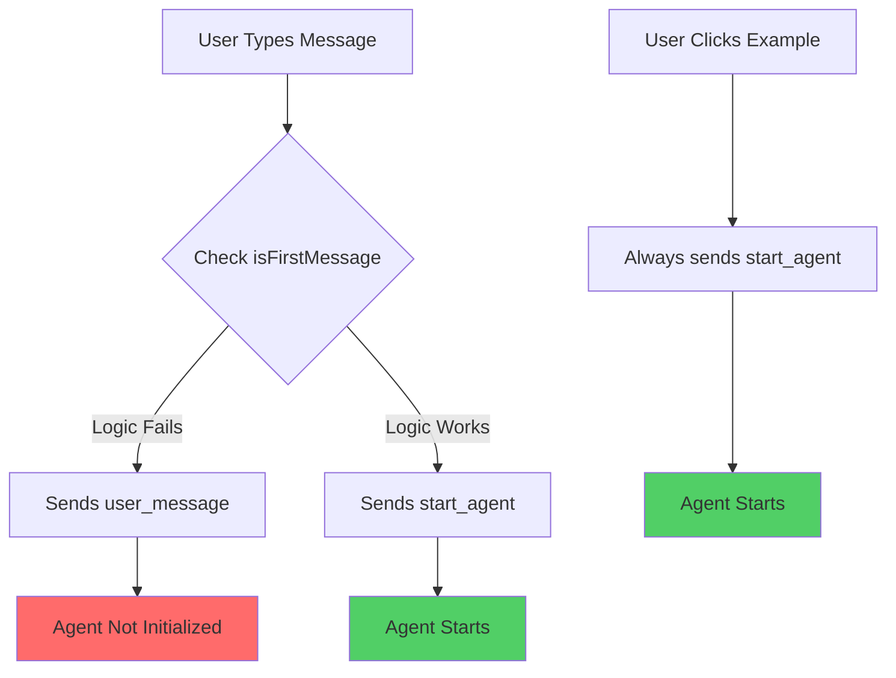
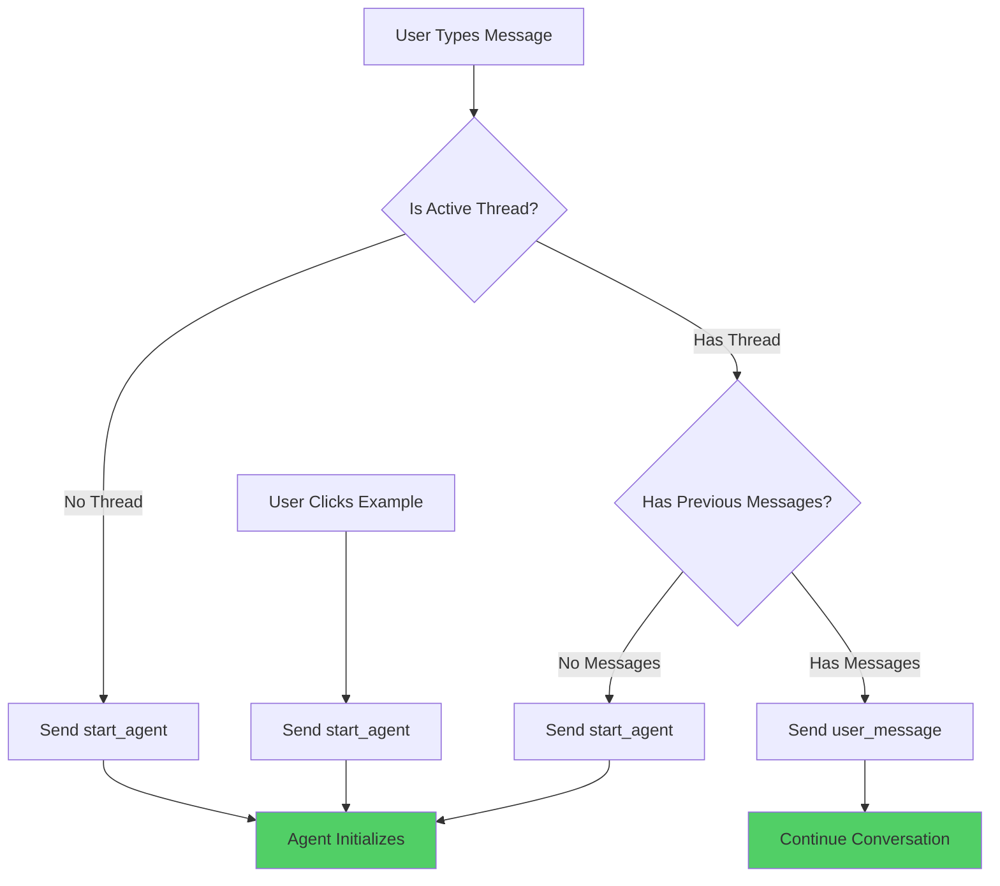

# Bug Fix Report: Frontend Message Input Not Starting Agent Properly

## Issue Summary
When users send messages via the input field, the agent does not start properly, while clicking example prompt buttons works correctly.

## Five Whys Analysis

### Why #1: Why doesn't the agent start when using the message input?
**Answer:** The message input uses a different WebSocket message type logic compared to example prompts.

**Evidence:** 
- ExamplePrompts.tsx (lines 39-48): Always sends `start_agent` message type
- useMessageSending.ts (lines 203-230): Conditionally uses `start_agent` for first message or `user_message` for subsequent

### Why #2: Why does the message input use conditional logic?
**Answer:** The code attempts to determine if it's the first message in a thread to decide between `start_agent` and `user_message`.

**Evidence:**
- Line 205: `const isFirstMessage = !threadId || checkIfFirstMessage(threadId);`
- Lines 125-131: `checkIfFirstMessage` filters messages by thread_id which may not be set correctly

### Why #3: Why might checkIfFirstMessage fail to detect the first message?
**Answer:** The function checks for existing user messages in the thread, but messages may not have the thread_id property set properly when filtered.

**Evidence:**
- Line 127-129: Filters `messages.filter(msg => msg.thread_id === threadId && msg.role === 'user')`
- The messages array structure may not have thread_id populated correctly for new conversations

### Why #4: Why would thread_id not be populated correctly?
**Answer:** New conversations may not have a thread_id immediately, or the thread creation happens asynchronously after the check.

**Evidence:**
- Lines 112-114: Thread creation is async: `return threadId || await createNewThread(message);`
- Line 205: Check happens before thread is fully established

### Why #5: Why does the example prompt work but not the input?
**Answer:** Example prompts ALWAYS use `start_agent` message type without any conditional logic, ensuring the agent properly initializes.

**Evidence:**
- ExamplePrompts.tsx lines 40-47: Direct `start_agent` call with `thread_id: null`
- No conditional checks or thread validation

## Root Cause
The root cause is inconsistent message type determination. The message input tries to be "smart" about whether to use `start_agent` or `user_message`, but the logic fails in edge cases, particularly for new conversations or when thread state is not fully synchronized.

## Current vs Ideal State Diagrams

### Current (Broken) State


### Ideal Working State


## Proposed Fix

### Option 1: Simplify Logic (Recommended)
Make the message input behavior consistent with example prompts when no active thread exists:

```typescript
// In useMessageSending.ts, modify sendWebSocketMessage function
const sendWebSocketMessage = (message: string, threadId: string): Promise<void> => {
  return new Promise(async (resolve, reject) => {
    // ... timeout setup ...
    
    try {
      // Simplified logic: if no threadId or messages array is empty for this thread
      // use start_agent, otherwise use user_message
      const threadMessages = messages.filter(msg => msg.thread_id === threadId);
      const shouldStartAgent = !threadId || threadMessages.length === 0;
      
      if (shouldStartAgent) {
        trackAgentActivated('supervisor_agent', threadId);
        sendMessage({ 
          type: 'start_agent', 
          payload: { 
            user_request: message,
            thread_id: threadId || null,
            context: { source: 'message_input' },
            settings: {}
          } 
        });
      } else {
        sendMessage({ 
          type: 'user_message', 
          payload: { 
            content: message, 
            references: [],
            thread_id: threadId 
          } 
        });
      }
      
      // ... rest of function ...
    }
  });
};
```

### Option 2: Fix checkIfFirstMessage
Ensure the function correctly identifies first messages:

```typescript
const checkIfFirstMessage = (threadId: string): boolean => {
  // Don't rely on thread_id in messages, check actual message count
  // or use a more reliable indicator
  if (!threadId) return true;
  
  const threadMessages = messages.filter(msg => {
    // Check both thread_id and if message belongs to current context
    return (msg.thread_id === threadId || !msg.thread_id) && msg.role === 'user';
  });
  
  return threadMessages.length === 0;
};
```

## Test Plan
1. ✅ Test sending first message via input field - should start agent
2. ✅ Test sending subsequent messages in same thread - should continue conversation  
3. ✅ Test clicking example prompt - should start new agent
4. ✅ Test switching threads and sending message - should handle correctly
5. ✅ Test with no authentication - should not send message
6. ✅ Test with network failures - should handle gracefully

## Impact Analysis
- **Breaking Changes:** None - maintains backward compatibility
- **Performance:** Minimal impact, reduces complexity
- **User Experience:** Fixes frustrating bug where chat appears unresponsive
- **Related Systems:** WebSocket handler must properly handle both message types

## Implementation Priority
**HIGH** - This is a critical user-facing bug that affects the primary chat interaction flow.

## Associated Files to Update
1. `/frontend/components/chat/hooks/useMessageSending.ts` - Main fix location
2. `/frontend/components/chat/ExamplePrompts.tsx` - Reference for working behavior
3. `/tests/e2e/test_chat_message_flow.py` - Add test cases for this scenario

## SSOT Compliance Update
To ensure Single Source of Truth compliance per `SPEC/type_safety.xml`:

### Changes Made for SSOT Compliance:
1. **Import WebSocketMessageType enum** from `@/types/shared/enums` in both files
2. **Replace string literals** with enum values:
   - `'start_agent'` → `WebSocketMessageType.START_AGENT`
   - `'user_message'` → `WebSocketMessageType.USER_MESSAGE`
3. **Files Updated**:
   - `/frontend/components/chat/hooks/useMessageSending.ts`
   - `/frontend/components/chat/ExamplePrompts.tsx`

This ensures all WebSocket message types come from a single canonical source, preventing typos and maintaining consistency across the codebase.

## Verification Steps
1. Run existing tests: `python tests/unified_test_runner.py --category e2e`
2. Test manually in development environment
3. Verify WebSocket events are properly sent using browser DevTools
4. Check that agent starts and responds correctly

## Lessons Learned
1. Consistency is key - similar actions (sending a message) should use similar code paths
2. Complex conditional logic for message types introduces fragility
3. Testing should cover both input methods (text field and buttons)
4. Thread state synchronization is critical for proper message routing