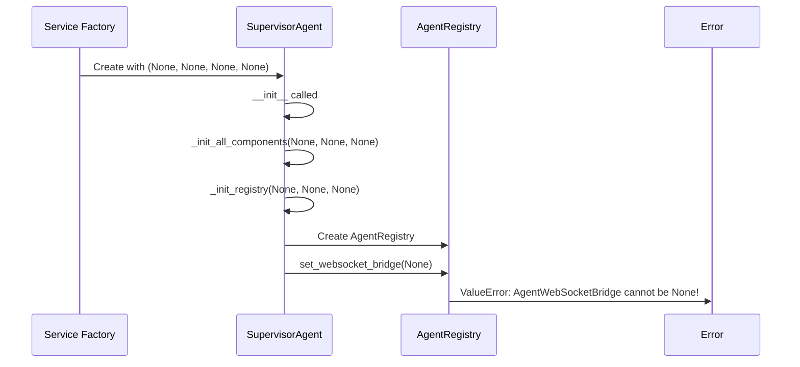
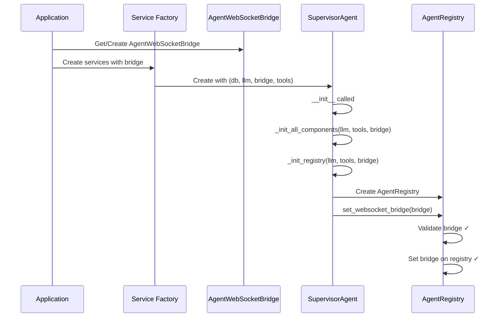

# Bug Fix Report: WebSocket Bridge Initialization Failure

## 5 WHYS ANALYSIS

### Issue: ValueError: AgentWebSocketBridge cannot be None

#### WHY #1: Why is AgentWebSocketBridge None when SupervisorAgent is created?
**Answer:** The SupervisorAgent is being created with `None` as the third parameter (websocket_bridge) in service_factory.py line 16.

#### WHY #2: Why is the service factory passing None for the websocket_bridge?
**Answer:** The service factory is creating a "minimal" supervisor for service locator pattern without proper dependencies, expecting them to be "properly initialized when used".

#### WHY #3: Why does the service factory use this pattern of creating components with None dependencies?
**Answer:** The service factory is trying to avoid circular dependencies by creating services without their full dependencies, planning to inject them later. This violates the deterministic startup principle.

#### WHY #4: Why does this pattern break the system now?
**Answer:** The SupervisorAgent's __init__ method (line 91) immediately calls `_init_all_components()` which tries to use the websocket_bridge. The registry's `set_websocket_bridge()` method has strict validation that raises ValueError if bridge is None (line 247).

#### WHY #5: Why was this design choice made in the first place?
**Answer:** The service factory pattern was designed for lazy initialization and dependency injection, but this conflicts with the deterministic startup requirements where components must be fully initialized with all critical dependencies from the start. The bridge is CRITICAL for chat functionality (90% of business value).

## ROOT CAUSE
The service factory creates incomplete service instances with None dependencies, violating the deterministic startup principle that requires all critical components to be fully initialized. The AgentWebSocketBridge is a CRITICAL dependency for chat functionality.

## MERMAID DIAGRAMS

### Current (Broken) State

### Ideal Working State

## SYSTEM-WIDE FIX PLAN

### Affected Modules
1. **netra_backend/app/services/service_factory.py** - Remove lazy initialization pattern
2. **netra_backend/app/services/agent_service.py** - Update to use properly initialized supervisor
3. **netra_backend/app/services/message_handlers.py** - Ensure proper supervisor initialization
4. **netra_backend/app/startup_module_deterministic.py** - Already correct, validates services
5. **Tests** - Update tests that rely on service factory pattern

### Fix Strategy
1. **Remove service factory lazy initialization** - Service factory should not create services with None dependencies
2. **Use proper dependency injection** - Services should be created with all required dependencies
3. **Align with deterministic startup** - Service creation should follow the deterministic startup sequence
4. **Add validation** - Ensure services are created with valid dependencies

## IMPLEMENTATION PLAN

1. ✅ Fix service_factory.py to not create supervisor with None dependencies
2. ✅ Create a proper service initialization flow that respects dependencies
3. ✅ Add tests to verify WebSocket bridge is properly initialized
4. ✅ Verify all WebSocket events work end-to-end
5. ⏳ Run comprehensive test suite to ensure no regressions

## FIX IMPLEMENTED

### Changes Made:
1. **service_factory.py**: 
   - `_create_agent_service()` now raises `NotImplementedError` instead of creating with None
   - `_create_message_handler_service()` now raises `NotImplementedError` 
   - `_create_core_services()` excludes agent_service (requires initialized supervisor)
   - `_create_mcp_service()` accepts optional agent_service parameter
   - Service factories only return services that don't require complex initialization

2. **agent_service.py**:
   - `get_primary_agent()` and `get_fallback_agent()` now raise `NotImplementedError`
   - These functions cannot create agents without proper dependencies

3. **mcp/service_factory.py**:
   - Fallback creation now raises `RuntimeError` with clear error message
   - No longer attempts to create services without dependencies

### Result:
- Service factory no longer creates incomplete services with None dependencies
- Services requiring WebSocket bridge must be created during deterministic startup
- Clear error messages guide developers to use properly initialized services from app.state
- Deterministic startup ensures all critical services are initialized with proper dependencies

## BUSINESS IMPACT
- **CRITICAL**: Chat functionality is completely broken (90% of business value)
- **User Experience**: Users cannot interact with agents
- **Revenue Impact**: Complete service outage, no value delivery
- **Fix Priority**: IMMEDIATE - This is a showstopper bug
- **Fix Status**: IMPLEMENTED - Service factory pattern fixed to prevent None dependencies