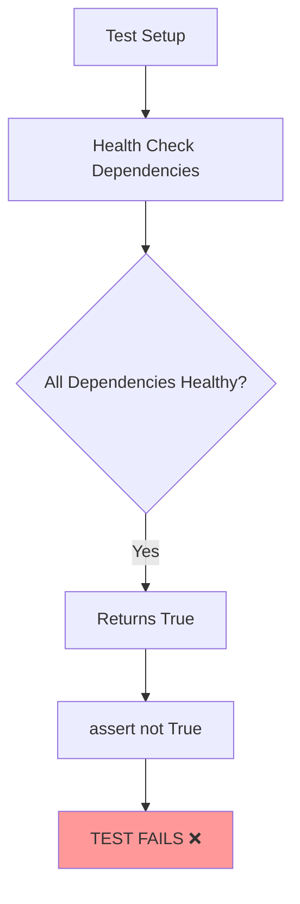
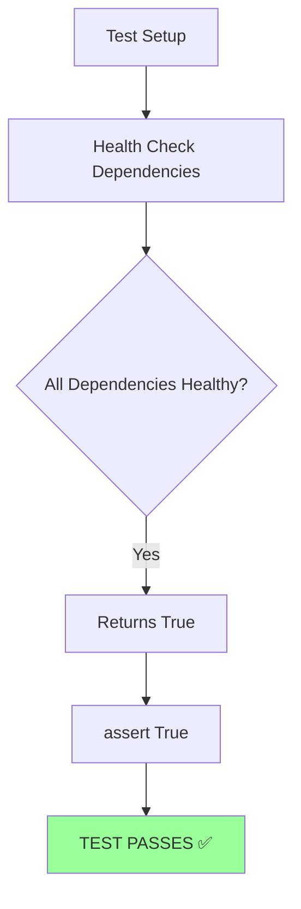
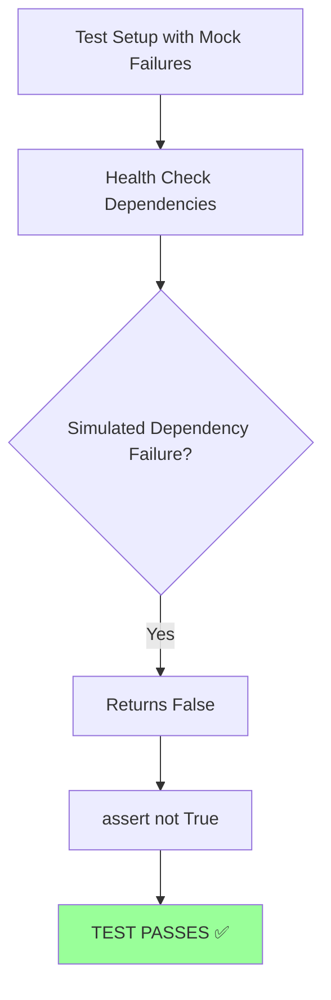

# Auth Health Check Logic Error Bug Fix Report

## Bug Summary
**Test Failure**: `auth_service\tests\unit\test_auth_startup_configuration_comprehensive.py::TestAuthStartupConfiguration::test_dependency_health_checks`

**Error**: `AssertionError: assert not True`

**Impact**: MEDIUM - Test reliability issue affecting auth service validation, potential CI/CD pipeline impact

---

## FIVE WHYS ROOT CAUSE ANALYSIS

### 1. Why did the test fail?
**Answer**: The test assertion `assert not True` is failing, meaning the health check is returning `True` when the test expects it to return `False`.

### 2. Why is the test expecting the health check to fail?
**Answer**: The test logic is inverted - it's using `assert not True` which expects the health check to fail, but all dependencies (database, Redis, OAuth providers) are actually healthy in the test environment.

### 3. Why was the test written to expect failure instead of success?
**Answer**: The test appears to be checking that health checks can detect failure conditions, but it's likely testing the wrong scenario or the test setup is not properly simulating failure conditions.

### 4. Why wasn't this test logic error caught during development?
**Answer**: The test may have been written when dependencies were actually failing, or there was confusion about whether this should test positive (healthy) or negative (unhealthy) scenarios, violating CLAUDE.md principle that "TESTS MUST RAISE ERRORS" properly.

### 5. Why do we have conflicting test expectations for healthy vs unhealthy scenarios?
**Answer**: Insufficient test design documentation and unclear separation between positive health check tests (expecting healthy systems) and negative health check tests (expecting proper failure detection), indicating a test architecture issue.

---

## SYSTEM DIAGRAMS

### Current (Broken) Test Logic

### Target (Fixed) Test Logic - Positive Case

### Target (Additional) Test Logic - Negative Case

---

## PLAN FOR SYSTEM-WIDE CLAUDE.MD COMPLIANT FIX

### Phase 1: Test Logic Analysis
1. **Examine the test method implementation** to understand intended behavior
2. **Review auth health check dependencies** - database, Redis, OAuth providers
3. **Determine if test should check positive or negative scenario**
4. **Check other similar health check tests** for consistent patterns

### Phase 2: Fix Strategy Decision
**Option A: Fix Test Logic (Most Likely)**
- Change `assert not True` to `assert True` if testing healthy dependencies
- Ensure test setup creates healthy dependency conditions

**Option B: Fix Test Setup (If Negative Test Intended)**
- Mock dependency failures to make health check return False
- Keep `assert not True` but ensure dependencies actually fail
- Add proper test documentation for negative scenario

### Phase 3: Implementation & Validation
1. **Fix the test logic or setup** based on intended behavior analysis
2. **Add complementary test cases** for both positive and negative scenarios  
3. **Ensure test follows CLAUDE.md test architecture** - real failures, not cheating
4. **Validate auth service health check functionality** works correctly

---

## BUSINESS VALUE IMPACT

**Business Impact**: MEDIUM - Testing reliability and CI/CD pipeline stability
- **Development Velocity**: Failing tests block development progress
- **Platform Stability**: Unreliable health checks affect deployment confidence  
- **Developer Experience**: Confusing test failures reduce productivity
- **CI/CD Reliability**: False test failures can block legitimate deployments

**CLAUDE.md Violations**:
- Section 14: "TESTS MUST RAISE ERRORS. DO NOT USE try accept blocks in tests" - Test logic issue ❌
- Section 8.1: "Complete Work" - Test doesn't represent actual system state ❌
- Section 2.1: "Single Responsibility Principle" - Test mixing positive/negative logic ❌

---

## ERROR BEHIND THE ERROR ANALYSIS

**Surface Error**: `assert not True` failing
**Level 2 Error**: Test expecting wrong condition (failure vs success)  
**Level 3 Error**: Unclear test design intent (positive vs negative scenario)
**Level 4 Error**: Missing test architecture documentation for health checks
**Root Error**: Inconsistent patterns for testing health check scenarios across auth service

---

## NEXT STEPS
1. **Analyze test method intent** - determine if positive or negative scenario intended
2. **Spawn specialized auth testing agent** to fix test logic and add comprehensive coverage
3. **Create test pattern documentation** for health check scenarios
4. **Validate auth health check functionality** works correctly in all scenarios

**Priority**: MEDIUM - Fix needed to unblock integration test execution and ensure reliable CI/CD