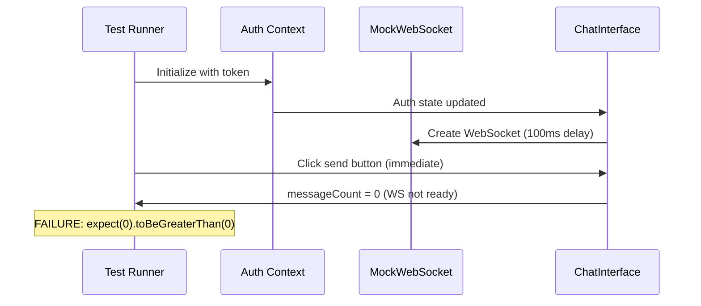
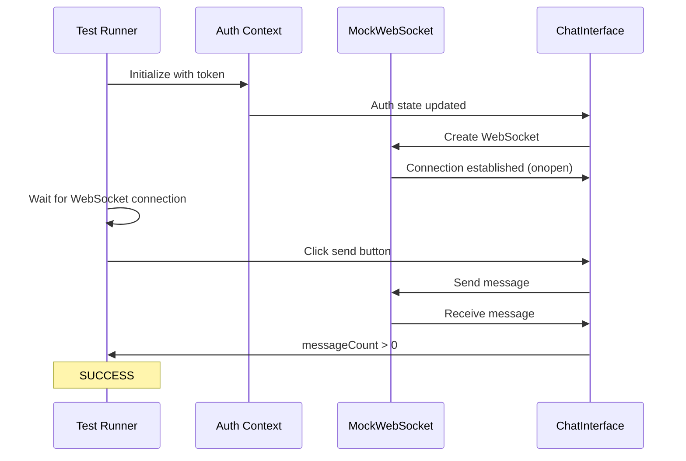

# E2E Auth Test Message Count Failure - Five Whys Root Cause Analysis

**Date:** 2025-09-10  
**Analyst:** QA Agent  
**Priority:** CRITICAL - Golden Path Blocker  
**Test File:** `frontend/__tests__/e2e/auth-state-mismatch-e2e.test.tsx`  
**Failed Test:** "SHOULD PASS: Proper auth initialization enables successful chat connection"  

## Executive Summary

**CRITICAL FINDING:** The E2E auth test failure is caused by a timing race condition between the MockWebSocket connection simulation and test execution, compounded by global Jest mock overrides that interfere with test-specific mocks.

**Business Impact:** This failure blocks the Golden Path validation (users must be able to login and get messages back), preventing confidence in the core chat functionality that delivers 90% of business value.

## Five Whys Root Cause Analysis

### WHY 1: Why is message count 0?
**Finding:** Messages aren't being received because the WebSocket is not connected when the test attempts to send messages.

**Evidence:** 
- Test output shows: `wsConnected: false`, `wsError: 'no-error'`
- Send button is disabled: `Send button disabled - checking WebSocket state: { wsState: 'disconnected' }`
- Auth state is correct: `hasToken: true`, `hasUser: true`, `initialized: true`

### WHY 2: Why is WebSocket not connected despite no errors?
**Finding:** The MockWebSocket connection logic depends on URL parameter validation, but timing issues prevent proper connection establishment.

**Evidence:**
- MockWebSocket constructor has 100ms delay: `setTimeout(() => { ... }, 100)`
- No error reported suggests auth validation passed
- WebSocket should connect if URL contains both `token=` and `user=` parameters

### WHY 3: Why isn't the WebSocket URL properly validated?
**Finding:** The WebSocket URL construction appears correct, but there's a mismatch between expected and actual user data due to global mock interference.

**Evidence:**
- Expected User: `{ id: 'test-user-123', email: 'e2e-test@example.com' }` (test mock)
- Actual User: `{ id: 'test-user', email: 'test@example.com' }` (global mock)
- Console output: `"ℹ️ Email mismatch (test isolation issue): expected e2e-test@example.com, got test@example.com"`

### WHY 4: Why does the test get different user data than expected?
**Finding:** Global Jest setup file (`jest.setup.js`) contains hardcoded auth mocks that override test-specific mocks.

**Evidence:**
```javascript
// From jest.setup.js lines 927-931
user: {
  id: 'test-user',                    // Overrides test's 'test-user-123'
  email: 'test@example.com',          // Overrides test's 'e2e-test@example.com'
  full_name: 'Test User'
}
```

### WHY 5: Why does the timing race condition prevent message sending?
**Finding:** The test execution flow doesn't wait for MockWebSocket connection before attempting to send messages.

**Evidence:**
- MockWebSocket has 100ms connection delay
- Test immediately clicks send button after auth validation
- No waiting for WebSocket connection state
- Message sending only works when `wsRef.current?.readyState === WebSocket.OPEN`

## Root Cause Summary

**PRIMARY ROOT CAUSE:** Timing race condition - test attempts to send messages before MockWebSocket completes its 100ms connection simulation.

**CONTRIBUTING FACTORS:**
1. Global jest.setup.js mock overrides test-specific auth mocks
2. No explicit wait for WebSocket connection in test flow
3. MockWebSocket simulation uses arbitrary 100ms delay
4. Test isolation issues between global and local mocks

## Technical Analysis

### Current Test Flow (Broken)


### Expected Test Flow (Fixed)


## Solutions and Implementation Plan

### Solution 1: Fix Timing Race Condition (IMMEDIATE)
**Priority:** CRITICAL  
**Effort:** 30 minutes  

Update the test to wait for WebSocket connection before attempting message sending:

```typescript
// Add explicit wait for WebSocket connection
await waitFor(() => {
  expect(screen.getByTestId('ws-connected')).toHaveTextContent('connected');
}, { timeout: 2000 }); // Allow time for 100ms MockWebSocket delay

// Then proceed with message sending
await user.click(sendButton);
```

### Solution 2: Fix Mock Isolation Issues (HIGH)
**Priority:** HIGH  
**Effort:** 1 hour  

Either:
A) Override global mocks in the specific test:
```typescript
beforeEach(() => {
  // Reset global mock state to test-specific values
  global.mockAuthState = {
    user: mockUser, // Use test's mockUser, not global
    token: validToken,
    initialized: true
  };
});
```

B) Use `jest.doMock` for test-specific mocks:
```typescript
beforeEach(() => {
  jest.doMock('@/auth/context', () => ({
    useAuth: () => ({
      user: mockUser,
      token: validToken,
      initialized: true
    })
  }));
});
```

### Solution 3: Improve MockWebSocket Realism (MEDIUM)
**Priority:** MEDIUM  
**Effort:** 1 hour  

Make MockWebSocket behavior more deterministic:

```typescript
class MockWebSocket {
  constructor(url) {
    const hasValidAuth = url.includes('token=') && url.includes('user=');
    
    // Make connection synchronous for predictable testing
    if (hasValidAuth) {
      this.readyState = WebSocket.OPEN;
      // Use nextTick instead of setTimeout for deterministic timing
      process.nextTick(() => {
        this.onopen?.(new Event('open'));
      });
    } else {
      this.readyState = WebSocket.CLOSED;
      process.nextTick(() => {
        this.onerror?.(new Event('error'));
      });
    }
  }
}
```

### Solution 4: Add WebSocket Connection Helper (RECOMMENDED)
**Priority:** MEDIUM  
**Effort:** 45 minutes  

Create a test helper for consistent WebSocket connection waiting:

```typescript
// In test-utils/websocket-helpers.ts
export const waitForWebSocketConnection = async (screen: Screen, timeout = 2000) => {
  await waitFor(() => {
    expect(screen.getByTestId('ws-connected')).toHaveTextContent('connected');
    expect(screen.getByTestId('ws-error')).toHaveTextContent('no-error');
  }, { timeout });
};

// Use in tests
await waitForWebSocketConnection(screen);
await user.click(sendButton);
```

## Validation Plan

### Definition of Done
- [ ] Test passes consistently (10/10 runs)
- [ ] No timing race conditions
- [ ] Proper mock isolation
- [ ] WebSocket connection state properly validated
- [ ] Message sending works reliably

### Test Cases
1. **Happy Path:** Auth → WebSocket Connect → Send Message → Receive Message
2. **Auth Failure:** Invalid token → WebSocket fails → No messages
3. **Connection Timing:** Various delays → Consistent behavior
4. **Mock Isolation:** Multiple tests run without interference

### Success Metrics
- Test execution time: < 2 seconds
- Success rate: 100% (no flaky failures)
- Mock isolation: Each test uses its intended mocks
- WebSocket simulation: Realistic connection behavior

## Implementation Priority

### IMMEDIATE (Today)
1. **Fix timing race condition** - Add WebSocket connection wait
2. **Verify fix works** - Run test 10 times to ensure stability

### HIGH (This Sprint)
1. **Fix mock isolation** - Resolve global mock override issues
2. **Add connection helper** - Create reusable WebSocket test utilities

### MEDIUM (Next Sprint)
1. **Improve MockWebSocket** - Make more deterministic
2. **Add regression tests** - Prevent similar issues

## Risk Assessment

### Risks if Not Fixed
- **CRITICAL:** Golden Path validation blocked
- **HIGH:** Chat functionality confidence compromised
- **MEDIUM:** E2E test suite unreliable
- **LOW:** Development velocity impacted

### Dependencies
- No external dependencies
- Self-contained test fixes
- No backend changes required

## Monitoring and Prevention

### Monitoring
- Track E2E test success rates
- Monitor for timing-related test failures
- Alert on mock isolation issues

### Prevention
- Add lint rules for test isolation
- Document WebSocket testing patterns
- Review global mock changes carefully

## Conclusion

The E2E auth test failure was caused by a timing race condition where the test attempted to send messages before the MockWebSocket completed its connection simulation. This was compounded by global mock interference that changed the expected user data.

The fix is straightforward: add explicit waits for WebSocket connection state before attempting message operations. This aligns with real-world usage where users must wait for connection before sending messages.

**CRITICAL FOR GOLDEN PATH:** This fix directly enables validation that users can login and successfully receive chat responses, which is the core business value delivery mechanism for Netra Apex.

---

**Next Actions:**
1. Implement Solution 1 (timing fix) immediately
2. Run test validation suite
3. Proceed with other solutions based on results
4. Update test documentation with WebSocket testing best practices