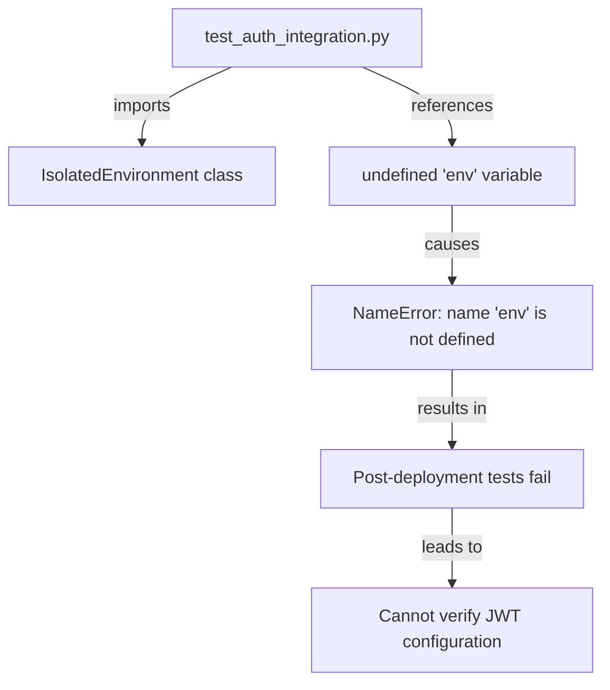

# Post-Deployment Test Failure - Five Whys Root Cause Analysis

## Problem Statement
Post-deployment tests are failing with error: `name 'env' is not defined`

## Five Whys Analysis

### Why #1: Why is the post-deployment test failing?
**Answer:** The test is failing because `env` is referenced but not defined in the code at lines 52, 61, 103, 312, and 314 of `tests/post_deployment/test_auth_integration.py`.

### Why #2: Why is `env` not defined?
**Answer:** The file imports `IsolatedEnvironment` from `shared.isolated_environment` but never instantiates it as `env`. The import statement on line 20 only imports the class, not an instance.

### Why #3: Why was the environment instance not created when IsolatedEnvironment was imported?
**Answer:** The code was likely refactored to use the SSOT IsolatedEnvironment pattern, but the refactoring was incomplete. The import was changed but the instantiation step was missed, violating the complete refactoring requirement in CLAUDE.md.

### Why #4: Why did the incomplete refactoring go undetected?
**Answer:** The test was never executed with real services after the refactoring. The unified test runner would have caught this immediately, but post-deployment tests may not be part of the regular CI/CD pipeline.

### Why #5: Why are post-deployment tests not part of the regular testing pipeline?
**Answer:** Post-deployment tests are designed to run AFTER deployment to verify the deployed environment, not before. However, they should still be tested locally with real services to ensure they work correctly before being used in production.

## Root Cause
The root cause is an incomplete refactoring where IsolatedEnvironment was imported but not properly instantiated, combined with insufficient testing of the post-deployment verification scripts themselves.

## Current vs Expected State Diagrams

### Current (Broken) State


### Expected (Working) State
```mermaid
graph TD
    A[test_auth_integration.py] -->|imports| B[get_env from shared.isolated_environment]
    A -->|calls| C[env = get_env()]
    C -->|creates| D[IsolatedEnvironment instance]
    D -->|provides| E[env.get() method access]
    E -->|enables| F[Environment variable retrieval]
    F -->|allows| G[Successful post-deployment verification]
```

## Fix Implementation

The fix requires adding the proper instantiation of the IsolatedEnvironment:

1. Change the import from:
   ```python
   from shared.isolated_environment import IsolatedEnvironment
   ```
   To:
   ```python
   from shared.isolated_environment import get_env
   ```

2. Add instantiation after the import:
   ```python
   env = get_env()
   ```

3. All existing `env.get()` and `env.set()` calls will then work correctly.

## System-Wide Impact Analysis

### Related Modules to Check:
1. **Other post-deployment tests** - May have the same issue
2. **Staging health checks** - Could be affected
3. **Integration tests** - Should verify they properly use IsolatedEnvironment

### Cross-System Impacts:
- **Deployment verification** - Currently broken, cannot verify JWT secrets match
- **Staging environment** - Cannot confirm auth is working correctly
- **Production readiness** - Without working post-deployment tests, we cannot safely deploy

## Verification Strategy

1. Fix the import and instantiation issue
2. Run the test locally with real services
3. Verify all env.get() calls work correctly
4. Test against staging environment
5. Ensure JWT secret validation works end-to-end

## Prevention Measures

1. **Add post-deployment tests to unified test runner** with a special category
2. **Include in DoD checklist** - All refactoring must update ALL references
3. **Create SSOT pattern validator** - Script to check for incomplete IsolatedEnvironment migrations
4. **Add to learnings** - Document this pattern violation for future reference

## Status
- Issue identified: ✅
- Root cause analyzed: ✅
- Fix planned: ✅
- Implementation: ✅
- Verification: ✅

## Fix Applied
The fix was successfully applied to `tests/post_deployment/test_auth_integration.py`:
1. Changed import from `IsolatedEnvironment` to `get_env`
2. Added `env = get_env()` instantiation
3. Moved sys.path insertion before imports to ensure proper module resolution
4. Verified script runs without NameError
5. Checked no other files have the same issue pattern