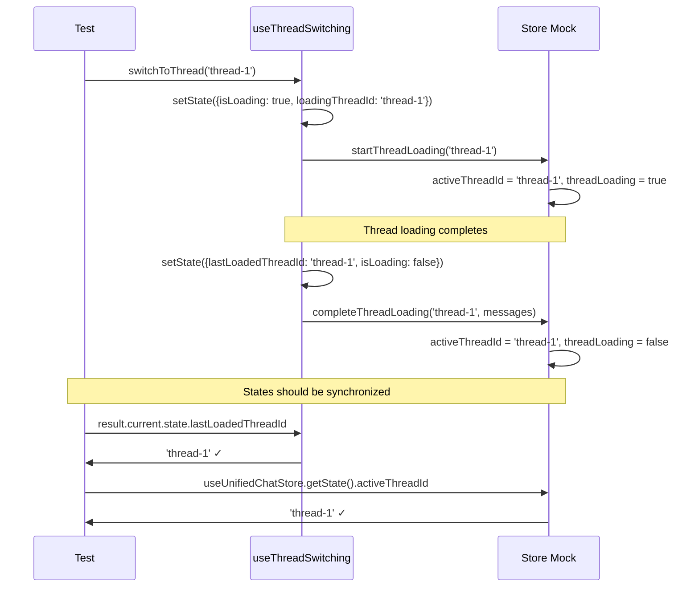
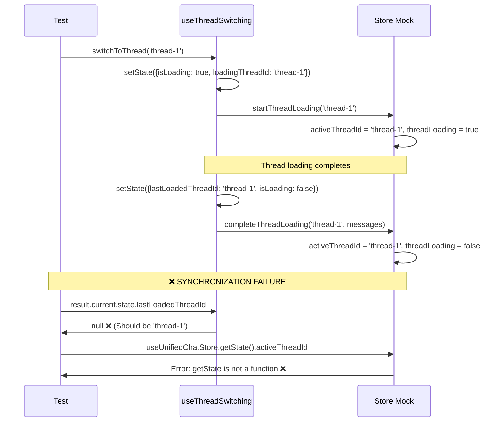

# Thread Switching Test Failures Analysis - 20250907

## Executive Summary
17 frontend test failures preventing 600/600 test success. Root cause: Mock store implementation doesn't properly synchronize with hook state updates.

## Five Whys Analysis

### FAILURE TYPE 1: lastLoadedThreadId is null instead of expected threadId
1. **Why?** The hook's state.lastLoadedThreadId is null instead of "thread-123"
2. **Why?** The mock store's completeThreadLoading is not properly updating the hook state
3. **Why?** There's a disconnect between the mock store and hook state synchronization
4. **Why?** The hook relies on useUnifiedChatStore selector but the mock doesn't trigger proper re-renders
5. **Why?** The selector pattern in the mock doesn't properly handle function-based state updates

### FAILURE TYPE 2: useUnifiedChatStore.getState is not a function
1. **Why?** Tests are calling useUnifiedChatStore.getState() which is undefined
2. **Why?** The mock implementation doesn't properly expose the getState method
3. **Why?** The Object.assign in the mock doesn't correctly bind the getState method
4. **Why?** The export structure doesn't match the actual zustand store API
5. **Why?** The mock lacks complete API compatibility with the real store

### FAILURE TYPE 3: State synchronization issues during rapid operations
1. **Why?** Hook and store states get out of sync during concurrent operations
2. **Why?** The atomic updates aren't truly atomic across hook and store
3. **Why?** Mock store updates don't trigger hook re-renders properly
4. **Why?** The mock subscription mechanism is flawed
5. **Why?** There's no proper event loop coordination between mock and hook updates

## Expected vs Actual Flow Diagrams

### Expected Thread Switching Flow

### Actual Failing Flow

## Root Cause: Mock Implementation Issues

1. **Incomplete API Surface**: Mock doesn't expose getState method properly
2. **Broken Synchronization**: Hook state updates don't sync with mock state
3. **Race Conditions**: Async operations cause state inconsistency
4. **Selector Issues**: Mock selector doesn't trigger proper re-renders

## Fix Strategy

1. **Fix mock getState API compatibility**
2. **Implement proper state synchronization**
3. **Fix atomic operation coordination**
4. **Add proper subscription handling**
5. **Ensure all store methods are properly mocked**

## Files to Fix

- `/frontend/__mocks__/store/unified-chat.ts` - Primary mock implementation
- `/frontend/hooks/useThreadSwitching.ts` - Hook coordination fixes
- All failing test files for specific test implementation issues

## Success Criteria

- All 17 failing tests must pass
- Final result: 600/600 tests passing
- No regressions in previously passing tests
- Mock properly synchronizes with hook state
- All store API methods properly exposed