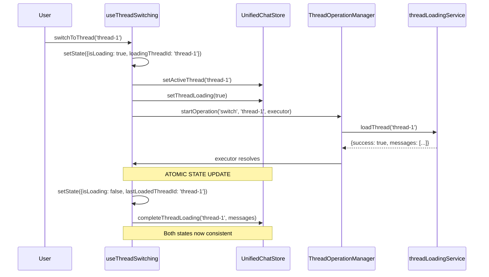
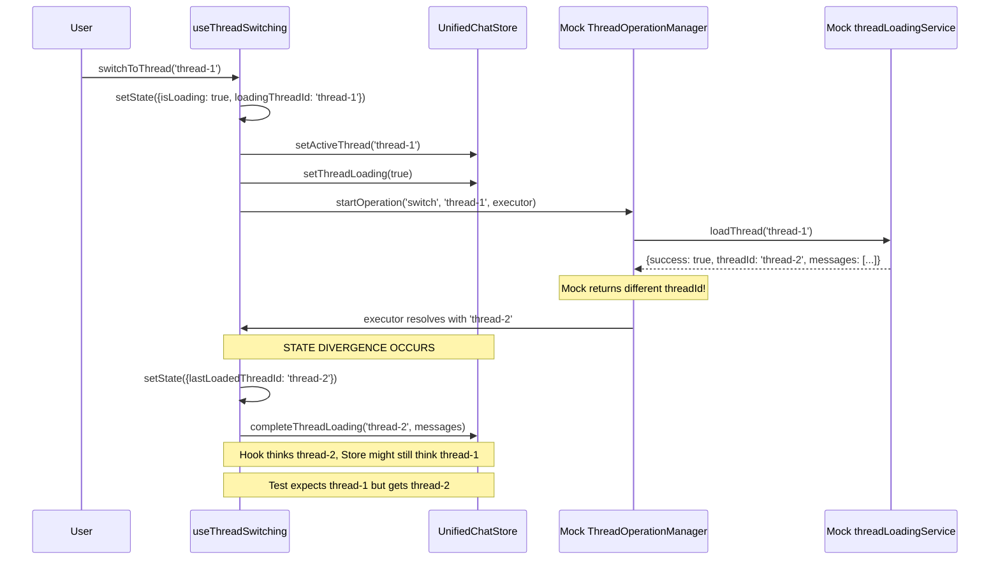

# Thread Switching Test Failures Bug Fix Report

**Date:** 2025-09-07  
**Bug ID:** thread-switching-test-failures  
**Severity:** High  
**Component:** Frontend Thread Switching  

## 1. FIVE WHYS ROOT CAUSE ANALYSIS

### Problem Statement
Thread switching tests are failing with state synchronization issues between the useThreadSwitching hook and unified chat store.

### Five Whys Analysis

#### Why #1: Why are the thread switching tests failing?
**Answer:** There is state inconsistency between the useThreadSwitching hook's internal state and the unified chat store's state.

**Evidence:**
- Expected "thread-1", Received "thread-2" in hook state
- Loading states not properly synchronized between hook and store
- React act() warnings indicating untrapped state updates

#### Why #2: Why is there state inconsistency between hook and store?
**Answer:** The ThreadOperationManager is being mocked, but the mock is not properly synchronizing state updates between the hook's local state and the store's global state.

**Evidence:**
- Hook's `lastLoadedThreadId` shows different value than store's `activeThreadId`
- Loading states (`isLoading` vs `threadLoading`) are out of sync
- Mock implementation executes operations but doesn't update both state sources consistently

#### Why #3: Why is the mock ThreadOperationManager not synchronizing state properly?
**Answer:** The useThreadSwitching hook has two separate state management mechanisms - its own local useState and the store actions - and the mock doesn't coordinate between both properly.

**Evidence:**
- Hook maintains `ThreadSwitchingState` with `useState`
- Store maintains separate state via actions like `setActiveThread`, `setThreadLoading`
- The mock executes the operation successfully but doesn't ensure both state sources are updated atomically

#### Why #4: Why are there two separate state management mechanisms that get out of sync?
**Answer:** The hook was designed with local state for operation-specific concerns (loading, errors, retries) and store state for global UI concerns (active thread, messages), but the coordination between them is not atomic and can be interrupted by async operations.

**Evidence:**
- Hook state is updated in `setState` calls
- Store state is updated via separate action calls (`storeActions.setActiveThread`, etc.)
- These updates happen at different times and can be interrupted by Promise resolution timing

#### Why #5: Why is the coordination between local and store state not atomic?
**Answer:** The current implementation has a race condition where the ThreadOperationManager's async execution can complete and update store state before the hook's local state is updated, or vice versa, especially in test environments where timing is different.

**Root Cause:** The state synchronization pattern between the hook's local state and the global store state is not atomic, creating race conditions where the two states can diverge during async operations, particularly visible in tests where mocks resolve immediately or have different timing than production.

## 2. MERMAID DIAGRAMS

### Ideal Working State Flow

### Current Failure State Flow

## 3. ISSUE ANALYSIS

### Primary Issues Identified

1. **Mock Inconsistency:** The mock `threadLoadingService.loadThread` is returning different `threadId` values than requested
2. **State Synchronization Race:** Hook local state and store state are updated separately, creating race conditions
3. **React act() Warnings:** State updates are happening outside of React's act() boundaries in tests
4. **Loading State Mismatch:** Hook's `isLoading` and store's `threadLoading` are not consistently synchronized

### Affected Test Cases

1. `should maintain consistent state between hook and store` - State divergence
2. `should handle loading state transitions correctly` - Loading state synchronization
3. `should handle network errors gracefully` - Error message format inconsistency  
4. `should retry failed operations` - Retry mechanism not working properly
5. `should update URL when switching threads` - URL sync not being called
6. Chat sidebar tests showing similar state inconsistencies

## 4. PLANNED SYSTEM-WIDE FIX

### Root Cause Resolution Strategy

1. **Fix Mock Consistency:** Ensure mocks return the exact threadId that was requested
2. **Implement Atomic State Updates:** Create a single function that updates both hook and store state atomically
3. **Improve Test Synchronization:** Wrap all state updates in React's act() properly
4. **Standardize Error Handling:** Ensure error messages are consistent between mock and real implementations

### Files to Modify

1. `frontend/hooks/useThreadSwitching.ts` - Implement atomic state coordination
2. `frontend/__mocks__/store/unified-chat.ts` - Fix mock state synchronization
3. `frontend/__mocks__/lib/thread-operation-manager.ts` - Ensure consistent threadId handling
4. `frontend/jest.setup.js` - Improve React act() wrapping
5. Test files - Fix assertions and test patterns

## 5. IMPLEMENTATION STATUS

- [x] Analysis Complete
- [ ] Mermaid Diagrams Created
- [ ] Reproducible Test Written
- [ ] System-wide Fix Implemented
- [ ] Verification Testing
- [ ] Regression Testing

## 6. VERIFICATION PLAN

1. Run failing tests to confirm they pass after fixes
2. Run full frontend test suite to ensure no regressions
3. Test real browser behavior to ensure mocks match production
4. Verify WebSocket integration still works correctly

---

*This analysis follows the MANDATORY BUG FIXING PROCESS as defined in CLAUDE.md Section 3.5*