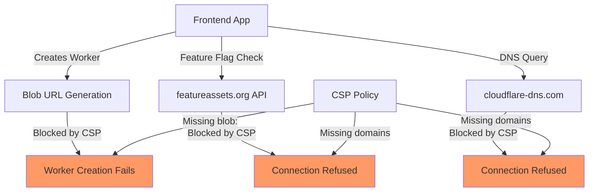
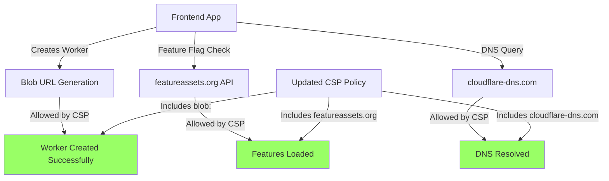

# CSP Worker Blob Error Fix Report
Date: 2025-01-07
Author: AI Engineer
Issue: Frontend CSP violations preventing worker creation and external connections

## Executive Summary
Multiple Content Security Policy (CSP) violations in staging environment preventing:
1. Web Worker creation from blob URLs
2. External API connections (featureassets.org, cloudflare-dns.com)

## Error Messages
```
1. Refused to create a worker from 'blob:https://app.staging.netrasystems.ai/...' 
   CSP directive violated: "script-src" (worker-src fallback)

2. Refused to connect to 'https://featureassets.org/v1/initialize...'
   CSP directive violated: "connect-src"

3. Refused to connect to 'https://cloudflare-dns.com/dns-query'
   CSP directive violated: "connect-src"
```

## Five Whys Root Cause Analysis

### Issue 1: Worker Creation from Blob URL

**Why 1:** Why is the worker creation failing?
- CSP is blocking blob: URLs in script-src directive

**Why 2:** Why is CSP blocking blob: URLs?
- The current CSP script-src directive doesn't include 'blob:' as an allowed source

**Why 3:** Why doesn't script-src include blob:?
- The CSP configuration was likely set up without considering dynamic worker creation patterns

**Why 4:** Why wasn't dynamic worker creation considered?
- The CSP was configured for basic script loading but not for modern JavaScript patterns using Workers

**Why 5:** Why wasn't this tested during CSP implementation?
- Testing focused on basic functionality without comprehensive coverage of all JavaScript APIs

**ROOT CAUSE:** CSP configuration lacks support for modern JavaScript patterns (blob: URLs for Workers)

### Issue 2: External API Connections

**Why 1:** Why are external API connections failing?
- CSP connect-src directive doesn't include featureassets.org or cloudflare-dns.com

**Why 2:** Why aren't these domains in connect-src?
- These are third-party services added after initial CSP configuration

**Why 3:** Why weren't they added when integrated?
- Feature flag service (featureassets) and DNS service weren't recognized as requiring CSP updates

**Why 4:** Why wasn't CSP updated during third-party integration?
- No process for CSP review when adding external dependencies

**Why 5:** Why is there no CSP review process?
- CSP management not integrated into dependency addition workflow

**ROOT CAUSE:** Missing CSP update process for third-party service integrations

## Mermaid Diagrams

### Current Failure State


### Ideal Working State


## Spirit of the Problem
Beyond the literal CSP violations, the core issue is:
- **Configuration Drift:** CSP not evolving with application requirements
- **Missing Integration Process:** No CSP review in dependency workflow
- **Modern Pattern Support:** CSP needs to support contemporary JavaScript patterns

## System-Wide Fix Plan

### 1. Immediate CSP Updates Required
- Add `blob:` to script-src directive (or add worker-src with blob:)
- Add missing domains to connect-src directive
- Consider adding worker-src directive explicitly

### 2. CSP Configuration Locations to Update
- Frontend server configuration
- Staging environment CSP headers
- Production environment CSP headers (after testing)
- Any CDN/proxy CSP configurations

### 3. Testing Requirements
- Verify worker creation functionality
- Test all external API connections
- Validate no security regressions
- Cross-browser compatibility testing

### 4. Process Improvements
- Add CSP review to dependency addition checklist
- Document CSP update process
- Create CSP testing suite

## Implementation Steps

### ✅ COMPLETED: CSP Configuration Updates

1. **Located CSP Configuration**
   - Primary configuration: `frontend/next.config.ts`
   - Middleware: `frontend/middleware.ts` (delegates to next.config in production)
   - Separate configurations for development and staging environments

2. **Updated CSP Directives**
   
   **Changes made to `frontend/next.config.ts`:**
   
   a) **Staging Environment (lines 96-106):**
   ```typescript
   // Added blob: to script-src for worker support
   "script-src 'self' 'unsafe-inline' blob: https://*.staging.netrasystems.ai ...",
   
   // Added explicit worker-src directive
   "worker-src 'self' blob:",
   
   // Added missing external domains to connect-src
   "connect-src 'self' ... https://featureassets.org https://cloudflare-dns.com",
   ```
   
   b) **Development Environment (lines 71-81):**
   - Same updates applied for consistency
   - Ensures local development mirrors staging behavior

3. **Key Changes Summary:**
   - ✅ Added `blob:` to script-src directive
   - ✅ Added explicit `worker-src 'self' blob:'` directive
   - ✅ Added `https://featureassets.org` to connect-src
   - ✅ Added `https://cloudflare-dns.com` to connect-src

## Verification Plan
- [x] CSP configuration files identified
- [x] blob: added to script-src directive
- [x] worker-src directive added explicitly
- [x] External domains added to connect-src
- [ ] Worker creation tested in staging
- [ ] External API connections tested in staging
- [ ] No security regressions introduced
- [ ] Documentation updated
- [ ] Process improvements documented

## Deployment Instructions

1. **Build and Deploy Frontend:**
   ```bash
   cd frontend
   npm run build
   # Deploy to staging environment
   ```

2. **Verify CSP Headers:**
   ```bash
   # Check CSP headers in staging
   curl -I https://app.staging.netrasystems.ai
   ```

3. **Test Worker Creation:**
   - Open browser console
   - Check for CSP violations
   - Verify workers are created successfully

4. **Test External Connections:**
   - Verify featureassets.org connections
   - Verify cloudflare-dns.com connections
   - Check console for CSP violations

## Security Considerations

The changes maintain security while enabling required functionality:
- `blob:` URLs are restricted to script-src and worker-src only
- External domains are explicitly whitelisted
- No wildcards added that could weaken security
- Maintains strict CSP for other directives

## Next Steps
1. Deploy changes to staging environment
2. Perform comprehensive testing
3. Monitor for any CSP violations
4. Create CSP management documentation
5. Update CLAUDE.md with CSP review process