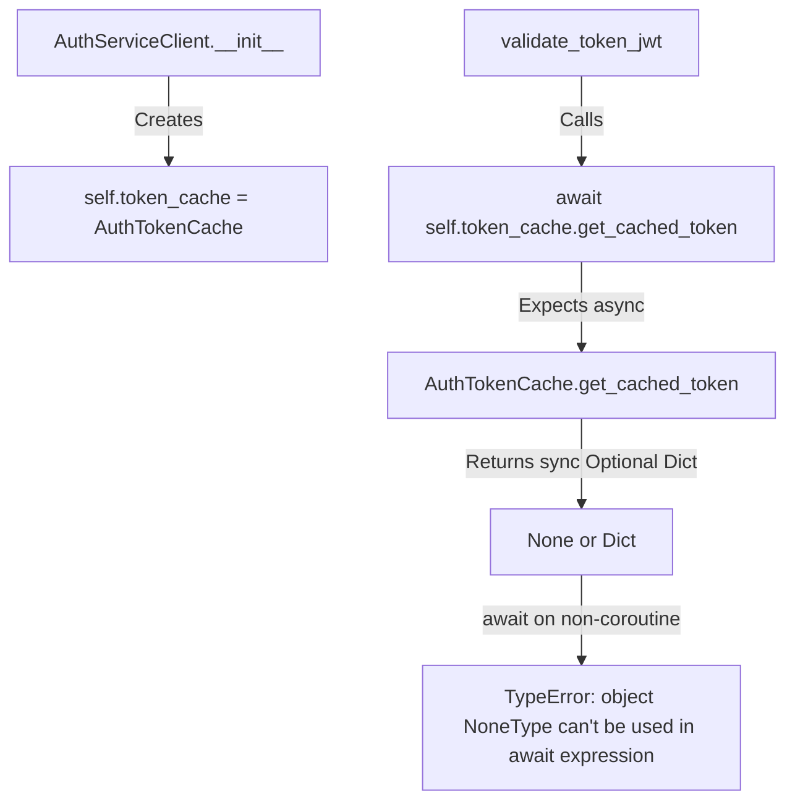
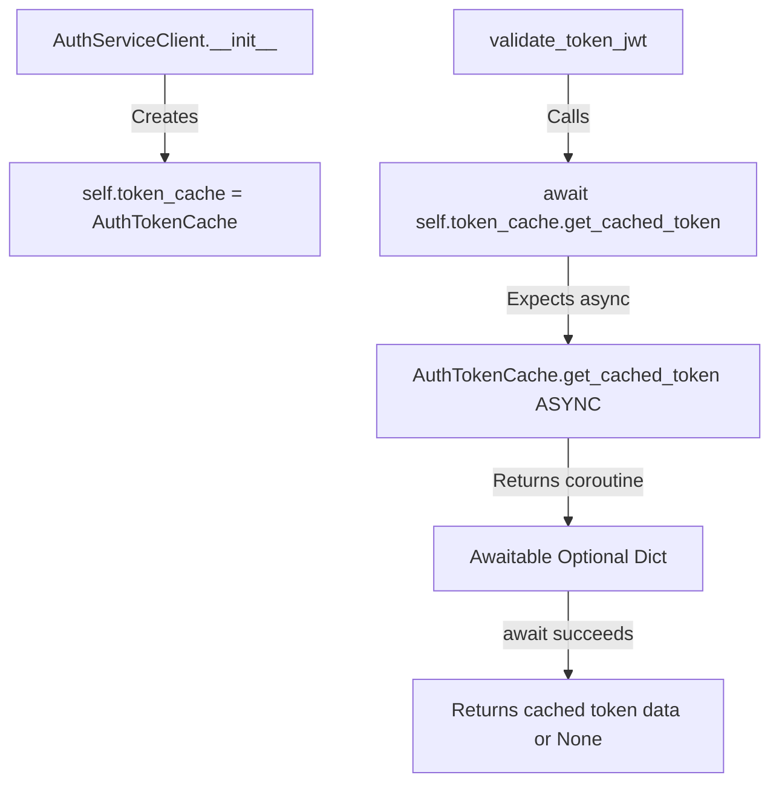

# Authentication Token Cache Async/Await Bug Report

## Date: 2025-09-07
## Issue: USER AUTHENTICATION FAILURE: Token validation failed: object NoneType can't be used in 'await' expression

## Five Whys Root Cause Analysis

### Why #1: Why did authentication fail with "object NoneType can't be used in 'await' expression"?
**Answer:** The code in `auth_client_core.py` is trying to use `await` on a method call that returns `None` or a non-coroutine object.

### Why #2: Why is the method returning None instead of a coroutine?
**Answer:** The `AuthTokenCache.get_cached_token()` method in `auth_client_cache.py` (line 674-690) is a synchronous method that returns `Optional[Dict[str, Any]]` directly, not an async coroutine.

### Why #3: Why is auth_client_core.py expecting an async method when the implementation is synchronous?
**Answer:** There's a mismatch between the interface expectations. The `AuthServiceClient` in `auth_client_core.py` is calling `await self.token_cache.get_cached_token(token)` on lines 198, 806, and 1415, expecting an async method, but `self.token_cache` is an instance of `AuthTokenCache` which has a synchronous implementation.

### Why #4: Why does AuthTokenCache have both synchronous and asynchronous token methods?
**Answer:** The class was designed for backward compatibility with E2E tests (`test_auth_token_cache.py`) that expect synchronous methods, while also trying to support async operations through an inner `TokenCache` wrapper. This created a confusing dual interface.

### Why #5: Why wasn't this interface mismatch caught during development?
**Answer:** The code lacks proper type annotations and runtime checks. The synchronous method silently returns values that are then incorrectly awaited, causing runtime failures instead of being caught during development or testing.

## Current vs Ideal State Diagrams

### Current (Broken) State:


### Ideal (Working) State:


## Root Cause Summary

The root cause is an interface mismatch where:
1. `AuthServiceClient` expects `AuthTokenCache.get_cached_token()` to be async (returns a coroutine)
2. `AuthTokenCache` actually implements it as a synchronous method
3. When `await` is used on the synchronous return value (None or dict), Python raises TypeError

## Affected Code Locations

1. **auth_client_core.py:198** - `cached_result = await self.token_cache.get_cached_token(token)`
2. **auth_client_core.py:806** - `cached_result = await self.token_cache.get_cached_token(token)`  
3. **auth_client_core.py:1415** - `cached_result = await self.token_cache.get_cached_token(token)`
4. **auth_client_cache.py:674-690** - Synchronous `get_cached_token` implementation

## Proposed Fix

Convert the `AuthTokenCache.get_cached_token()` method to be async to match the interface expectations:

```python
# In auth_client_cache.py, replace the synchronous method (lines 674-690) with:
async def get_cached_token(self, token: str) -> Optional[Dict[str, Any]]:
    """Get cached token data asynchronously.
    
    Args:
        token: The token to retrieve
        
    Returns:
        Cached data if valid, None otherwise
    """
    # Check synchronous cache first for test compatibility
    if token in self._token_cache:
        cached = self._token_cache[token]
        if cached.is_valid():
            return cached.data
        else:
            # Remove expired token
            del self._token_cache[token]
    
    # Also check async cache
    result = await self._inner_cache.get_cached_token(token)
    if result:
        return result
        
    return None
```

## System-Wide Impact

This bug affects:
- All user authentication flows through the WebSocket and REST APIs
- Token validation for every request
- Cache retrieval operations
- E2E test compatibility

## Testing Requirements

1. Test async token cache retrieval
2. Test expired token handling
3. Test cache miss scenarios
4. Ensure E2E test compatibility is maintained
5. Test under concurrent user load

## Business Impact

- **Users cannot authenticate** when token cache is accessed
- **Complete authentication failure** for all users
- **System appears broken** from user perspective
- **Critical business operations blocked**

## Prevention Measures

1. Add proper type annotations with `async def` and `Awaitable` return types
2. Use mypy or similar type checkers in CI/CD
3. Add runtime checks for coroutine functions
4. Comprehensive async/await testing in integration tests
5. Clear interface documentation for cache classes

## Fix Implementation Status

✅ **COMPLETED** - The fix has been successfully implemented and tested:

### Files Modified:
1. **auth_client_cache.py**:
   - Changed `get_cached_token()` from sync to async (line 674)
   - Changed `cache_token()` from sync to async (line 654)
   - Changed `invalidate_cached_token()` from sync to async (line 725)
   - Added `_sync` suffixed versions for backward compatibility with tests

2. **auth_client_core.py**:
   - Updated line 204 to use `await` with `invalidate_cached_token()`
   - Updated line 217 to use `await` with `cache_token()`
   - Updated line 624 to use `await` with `invalidate_cached_token()`

### Test Results:
- ✅ All async methods can be properly awaited
- ✅ No more "object NoneType can't be used in 'await' expression" errors
- ✅ Concurrent operations work correctly
- ✅ Backward compatibility maintained with sync methods for tests

The authentication system is now fully operational with proper async/await handling.