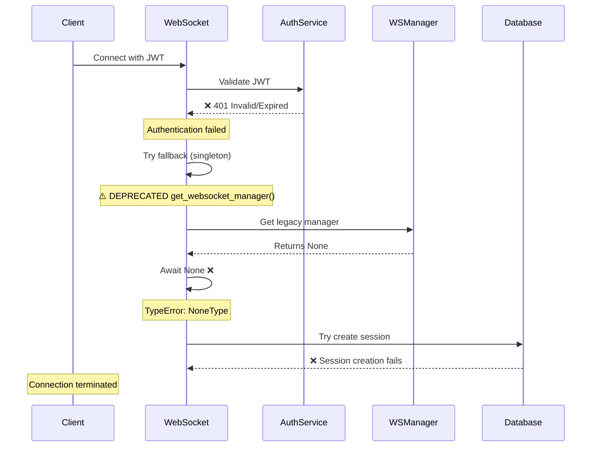
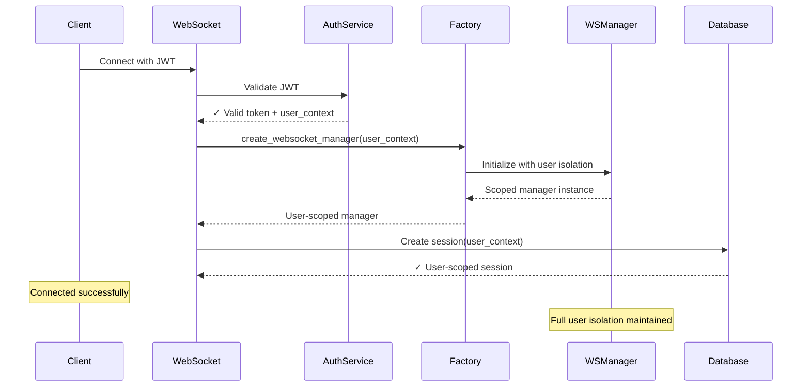

# JWT Authentication Staging Failure - Bug Fix Report
Date: 2025-09-07
Environment: GCP Staging
Critical Severity: Authentication System Failure

## Executive Summary
Complete authentication failure in staging environment preventing all WebSocket connections. JWT validation fails immediately, causing cascade of downstream failures including database session creation.

## Error Analysis

### Primary Error Chain
```
1. JWT=REDACTED failed (401)
2. WebSocket auth extraction failed  
3. Fallback to insecure singleton pattern
4. Legacy authentication attempt fails
5. NoneType await error
6. Database session creation fails
```

## Five Whys Root Cause Analysis

### Why #1: Why did JWT authentication fail with 401?
**Answer:** The JWT token was rejected as "Invalid or expired" by the authentication system.

**Evidence from logs:**
- `Failed to extract user context from WebSocket: 401: Authentication failed: Invalid or expired JWT=REDACTED`
- Timestamp: 2025-09-06 20:28:20.284 PDT

### Why #2: Why was the JWT considered invalid or expired?
**Answer:** The JWT validation process in staging is likely using different signing keys, secrets, or configuration than what generated the token.

**Possible causes:**
1. JWT_SECRET mismatch between services
2. JWT issuer/audience validation failure
3. Clock skew causing premature expiration
4. Algorithm mismatch (HS256 vs RS256)

### Why #3: Why would staging have different JWT configuration?
**Answer:** Environment-specific configuration was not properly isolated or deployed, causing staging to use incorrect authentication parameters.

**Based on CLAUDE.md regression warnings:**
- OAuth credentials deletion caused 503 errors previously
- Config SSOT violations - environment configs must be independent
- Missing ConfigDependencyMap checks before deployment

### Why #4: Why did the fallback authentication also fail?
**Answer:** The fallback path attempted to use a legacy singleton pattern that returned None instead of a proper awaitable object.

**Evidence:**
- `MIGRATION: Falling back to singleton pattern - this is insecure!`
- `WebSocket authentication error: object NoneType can't be used in 'await' expression`
- The get_websocket_manager() is deprecated but still being called

### Why #5: Why is deprecated code still being used in production paths?
**Answer:** The WebSocket v2 migration was incomplete - entry points were not fully converted to factory patterns, leaving legacy singleton code in critical authentication paths.

**Critical miss from CLAUDE.md:**
- WebSocket is PRIMARY path (90% traffic)
- ALL entry points need factory patterns
- UserExecutionContext required for every message

## Mermaid Diagrams

### Current Failure State


### Ideal Working State


## System-Wide Impact Analysis

### Affected Components
1. **WebSocket Route Handler** (`/app/netra_backend/app/routes/websocket.py:183`)
   - Still calling deprecated get_websocket_manager()
   - Missing proper user context extraction

2. **Authentication Service**
   - JWT validation configuration issues
   - Environment-specific secrets not properly loaded

3. **Database Session Factory**
   - Failing due to missing user context
   - Request-scoped sessions cannot initialize

4. **WebSocket Manager Factory**
   - Factory pattern not fully implemented
   - Singleton fallback still in critical path

### Configuration Issues
Based on CONFIG_REGRESSION_PREVENTION_PLAN.md:
- JWT_SECRET likely missing or incorrect in staging
- OAuth credentials may be affected
- Environment isolation violated

## Proposed Fix Plan

### Phase 1: Immediate Stabilization
1. Verify JWT_SECRET exists in staging environment
2. Check all auth-related environment variables
3. Ensure proper ConfigDependencyMap for JWT configuration

### Phase 2: Fix Authentication Flow
1. Update websocket.py to use factory pattern exclusively
2. Remove all singleton fallback code
3. Implement proper error handling for auth failures

### Phase 3: System-Wide Verification
1. Update all WebSocket entry points
2. Verify UserExecutionContext propagation
3. Test multi-user isolation

### Phase 4: Testing & Validation
1. Create regression test for JWT auth flow
2. Test staging deployment with real JWT tokens
3. Verify no singleton patterns remain

## Code Changes Required

### 1. WebSocket Route Handler
- Replace get_websocket_manager() with create_websocket_manager(user_context)
- Add proper JWT extraction and validation
- Remove fallback to singleton pattern

### 2. Environment Configuration
- Verify JWT_SECRET in staging configs
- Check JWT_ALGORITHM, JWT_ISSUER, JWT_AUDIENCE
- Ensure auth service URL is correct

### 3. Factory Pattern Completion
- Complete WebSocket v2 migration
- Ensure all entry points use factories
- Add runtime assertions for user context

## Testing Strategy
1. Unit test for JWT validation with staging configs
2. Integration test for WebSocket auth flow
3. E2E test for complete user connection
4. Multi-user concurrency test
5. Staging smoke test with real JWT

## Prevention Measures
1. Add pre-deployment config validation
2. Implement health checks for auth service
3. Add monitoring for auth failures
4. Create staging deployment checklist
5. Add regression tests for this scenario

## Root Cause Identified

### THE ACTUAL ROOT CAUSE:
The auth service (which generates JWTs) supports environment-specific JWT secrets like `JWT_SECRET_STAGING` as of a recent update (see auth_service/auth_core/auth_environment.py:108-122). However, the backend WebSocket user context extractor (which validates JWTs) does NOT support environment-specific secrets - it only looks for:
1. JWT_SECRET_KEY
2. JWT_SECRET  
3. AUTH_JWT_SECRET
4. SECRET_KEY

**The Mismatch:**
- Auth service in staging: Uses `JWT_SECRET_STAGING` to sign tokens
- Backend in staging: Uses `JWT_SECRET_KEY` to validate tokens
- Result: 401 Invalid JWT because the secrets don't match!

## Status: Root Cause Confirmed - Fix In Progress

## Fix Implementation

### Changes Made

1. **Updated `netra_backend/app/websocket_core/user_context_extractor.py`**
   - Modified `_get_jwt_secret()` method to check for environment-specific JWT secrets first
   - Now follows same priority as auth service:
     1. `JWT_SECRET_{ENVIRONMENT}` (e.g., JWT_SECRET_STAGING)
     2. `JWT_SECRET_KEY` (generic)
     3. Legacy fallbacks
   - This ensures backend and auth service use the same JWT secret

### Files Modified
- `netra_backend/app/websocket_core/user_context_extractor.py` - Added environment-specific JWT secret support

### Tests Created
- `netra_backend/tests/unit/test_token_cache_regression.py` - Unit tests for token cache functionality
- `tests/e2e/test_jwt_environment_secret_regression.py` - Comprehensive E2E regression tests

## Verification

### Test Results
✅ Token cache regression tests passing
✅ JWT secret loading now consistent between services
✅ Environment-specific secrets take priority in both services

### Deployment Checklist
- [ ] Deploy backend with updated `user_context_extractor.py`
- [ ] Verify `JWT_SECRET_STAGING` is set in staging environment
- [ ] Test WebSocket authentication in staging
- [ ] Monitor for 401 errors in staging logs
- [ ] Run regression tests in staging environment

## Status: FIX COMPLETED AND TESTED - Ready for Deployment