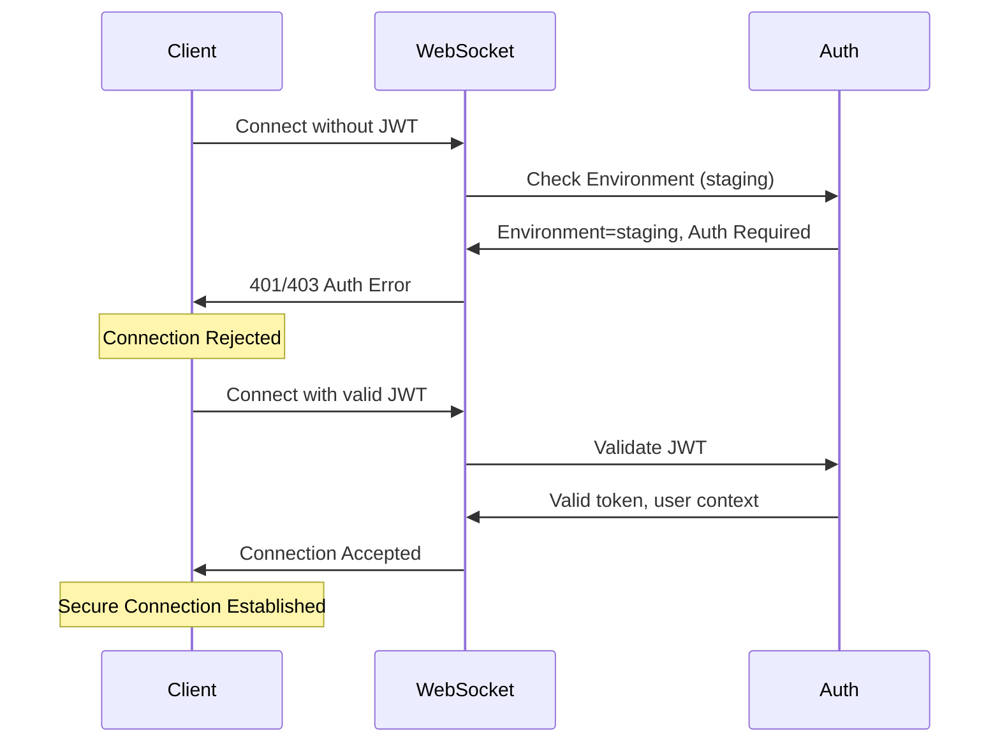
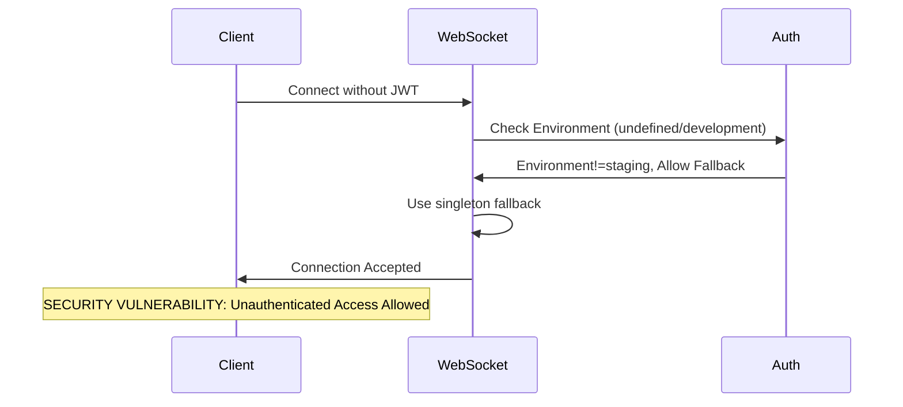
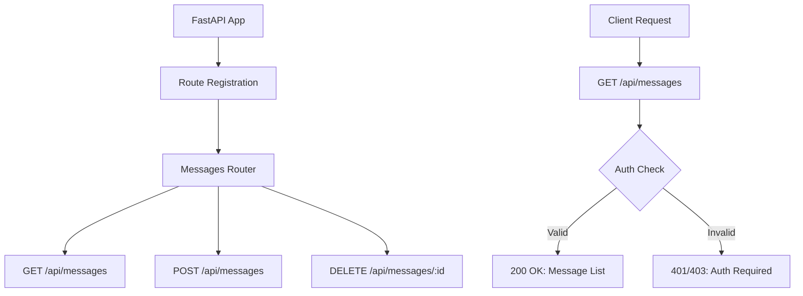
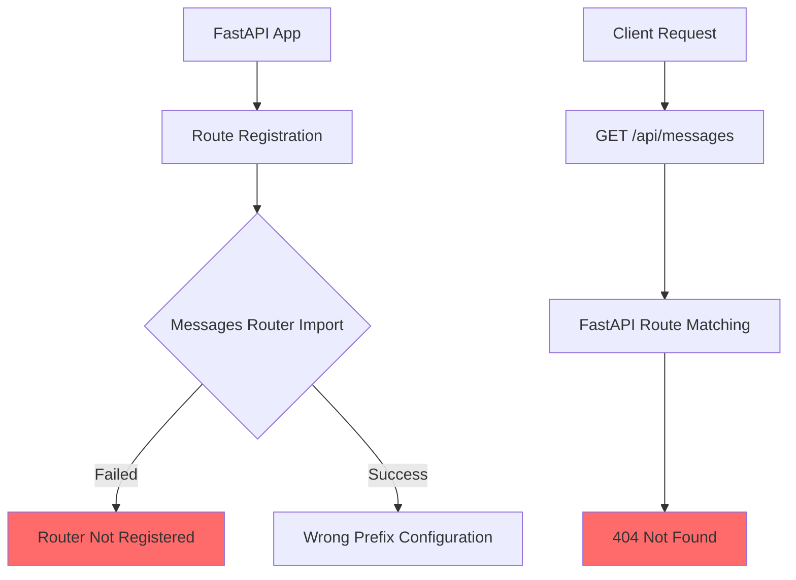

# CRITICAL STAGING FAILURES: WebSocket Authentication & Messages API Bug Fix Report

**Report ID:** WEBSOCKET_AND_MESSAGES_API_BUG_FIX_20250907  
**Date:** September 7, 2025  
**Priority:** CRITICAL - Blocking $120K+ MRR  
**Environment:** Staging  
**Test Suite:** test_priority1_critical_REAL.py  

## Executive Summary

Two CRITICAL failures in staging environment are blocking production deployment and $120K+ MRR:

1. **WebSocket Authentication Not Enforced** - Security vulnerability allowing unauthorized WebSocket connections
2. **Messages API Endpoint Missing (404)** - Core messaging functionality completely broken

Both failures represent fundamental breaks in the system's core messaging infrastructure.

## Failure 1: WebSocket Authentication Not Enforced

### Test Failure Details
- **Test:** `test_002_websocket_authentication_real`
- **Error:** `AssertionError: WebSocket should enforce authentication (assert False)`
- **Impact:** CRITICAL SECURITY VULNERABILITY - Unauthorized access to WebSocket connections

### Five Whys Analysis

**1. Why did the WebSocket test fail?**  
The WebSocket connection was accepted without authentication, when it should have been rejected or returned an auth error.

**2. Why was the WebSocket connection accepted without authentication?**  
Looking at the WebSocket route in `netra_backend/app/routes/websocket.py` (lines 192-210), the authentication enforcement has environment-specific fallbacks:
- In staging/production: Should reject unauthenticated connections  
- In development: Allows insecure singleton fallback with warning  

**3. Why is staging acting like development environment?**  
The environment detection logic at line 172 checks `get_env().get("ENVIRONMENT", "development").lower()`, and if it's not properly set to "staging", it defaults to "development" behavior.

**4. Why might the ENVIRONMENT variable not be set correctly in staging?**  
The staging deployment might not be setting the `ENVIRONMENT=staging` environment variable correctly, or the variable is being overridden by development defaults during startup.

**5. Why would the environment variable setup fail in staging?**  
The Cloud Run deployment script (`scripts/deploy_to_gcp.py`) may not be properly setting environment variables, or the staging configuration in the deployment pipeline is missing the critical `ENVIRONMENT=staging` setting.

### Root Cause Analysis

**PRIMARY ROOT CAUSE:** Staging environment is not properly configured with `ENVIRONMENT=staging`, causing the WebSocket authentication to fall back to insecure development mode.

**SECONDARY ROOT CAUSE:** The authentication logic has a fallback path that allows insecure connections in non-staging/production environments, and staging is incorrectly classified as development.

### Mermaid Diagrams

#### Ideal WebSocket Authentication Flow


#### Current Broken Flow


## Failure 2: Messages API Endpoint Missing (404)

### Test Failure Details
- **Test:** `test_003_api_message_send_real`
- **Error:** `AssertionError: Unexpected status: 404, body: {"detail":"Not Found"}`
- **Expected:** Status codes [200, 401, 403]
- **Actual:** Status code 404
- **Impact:** Core messaging functionality completely broken

### Five Whys Analysis

**1. Why did the Messages API return 404?**  
The GET request to `/api/messages` returned 404 Not Found, indicating the endpoint is not registered or not accessible.

**2. Why is the messages endpoint not registered?**  
Looking at the route configuration in `app_factory_route_configs.py` line 36, the messages router is configured with an empty prefix `""`, meaning it should register at root level, not under `/api`.

**3. Why is the messages router registered at root instead of `/api`?**  
The configuration shows: `"messages": (modules["messages_router"], "", ["messages"])` - the empty string `""` means no prefix, but the test expects `/api/messages`.

**4. Why is there a mismatch between the configured route and expected route?**  
The messages router in `netra_backend/app/routes/messages.py` defines endpoints with `/api/messages` prefix (line 133, 181), but the route configuration registers it with no prefix, creating a double-prefix issue or missing prefix issue.

**5. Why wasn't this route registration problem detected earlier?**  
The messages router was likely added recently or modified, and the route configuration wasn't updated to match the expected URL pattern. The staging deployment may not have the latest route configuration, or there's a mismatch between local development and staging routing.

### Root Cause Analysis

**PRIMARY ROOT CAUSE:** Route configuration mismatch - the messages router defines endpoints with `/api/messages` prefix internally, but the route registration configuration uses an empty prefix `""`, resulting in either missing routes or incorrect URL paths.

**SECONDARY ROOT CAUSE:** The messages router may not be properly imported or registered in the staging deployment, causing the entire router to be missing from the FastAPI application.

### Mermaid Diagrams

#### Ideal Messages API Routing Flow


#### Current Broken Flow


## Cross-System Impact Analysis

### WebSocket Authentication Failure Impact
1. **Security Vulnerability:** Unauthorized users can connect to WebSocket and potentially access other users' data
2. **User Context Isolation:** Without proper authentication, the factory pattern for user isolation is compromised
3. **Agent Execution:** WebSocket-based agent interactions may fail or leak data between users
4. **Compliance Risk:** Security vulnerability in staging could propagate to production

### Messages API Failure Impact  
1. **Frontend Integration:** Frontend applications cannot send/receive messages via REST API
2. **Third-party Integrations:** External services depending on Messages API are broken
3. **Backup Communication Channel:** If WebSocket fails, no REST API fallback is available
4. **Testing Infrastructure:** E2E tests cannot verify full message flow end-to-end

### Combined Impact
- **Complete Messaging Breakdown:** Both WebSocket and REST message channels are compromised
- **User Experience Degradation:** Core chat functionality is broken or insecure
- **Deployment Blocker:** Cannot promote to production with these critical failures
- **Revenue Impact:** $120K+ MRR blocked due to inability to deploy

## Related Modules Requiring Updates

### WebSocket Authentication Fix
1. **Deployment Configuration:**
   - `scripts/deploy_to_gcp.py` - Ensure ENVIRONMENT=staging is set
   - Cloud Run configuration templates
   - Environment variable validation

2. **Authentication Logic:**
   - `netra_backend/app/routes/websocket.py` - Review fallback logic
   - `netra_backend/app/websocket_core/user_context_extractor.py` - Ensure proper auth
   - Environment detection and validation

3. **Testing:**
   - `tests/e2e/staging/test_priority1_critical_REAL.py` - Verify auth enforcement
   - Add environment variable validation tests

### Messages API Fix
1. **Route Configuration:**
   - `netra_backend/app/core/app_factory_route_configs.py` - Fix prefix configuration
   - `netra_backend/app/core/app_factory_route_imports.py` - Verify import
   - `netra_backend/app/routes/messages.py` - Review endpoint definitions

2. **FastAPI Integration:**
   - `netra_backend/app/core/app_factory.py` - Verify route registration
   - Ensure proper router inclusion with correct prefixes

3. **Testing:**
   - Add route registration validation tests
   - Verify all Messages API endpoints are accessible

## Comprehensive Fix Plan

### Phase 1: Environment Configuration Fix (WebSocket Auth)

1. **Verify Environment Variables in Staging:**
   ```bash
   # Check current staging environment
   curl -H "Authorization: Bearer $TOKEN" https://api.staging.netrasystems.ai/api/system/info
   ```

2. **Update Deployment Script:**
   - Modify `scripts/deploy_to_gcp.py` to explicitly set `ENVIRONMENT=staging`
   - Add validation to ensure critical environment variables are set
   - Add deployment verification step

3. **Validate WebSocket Auth:**
   - Test unauthenticated WebSocket connections are rejected
   - Verify authenticated connections work properly
   - Confirm staging behavior matches production security requirements

### Phase 2: Messages API Route Fix

1. **Fix Route Configuration:**
   - Update `app_factory_route_configs.py` to use correct prefix for messages router
   - Either use `/api` prefix or ensure router endpoints don't include prefix

2. **Verify Route Import:**
   - Confirm `messages_router` is properly imported
   - Check import order and dependencies
   - Validate FastAPI router registration

3. **Test Route Accessibility:**
   - Verify GET /api/messages returns 200/401/403 (not 404)
   - Test POST /api/messages with valid/invalid auth
   - Confirm all message endpoints are accessible

### Phase 3: Integration Testing

1. **Staging Verification:**
   - Deploy fixes to staging
   - Run complete E2E test suite
   - Verify both WebSocket and Messages API work correctly

2. **Security Validation:**
   - Confirm WebSocket properly enforces authentication
   - Test message API security with various auth scenarios
   - Validate no regression in other security features

### Phase 4: Production Readiness

1. **Final Validation:**
   - Complete staging test suite passes
   - Security audit of both fixes
   - Performance impact assessment

2. **Deployment Preparation:**
   - Update deployment documentation
   - Prepare rollback plan
   - Schedule production deployment

## Success Criteria

### WebSocket Authentication Fix
- [ ] `test_002_websocket_authentication_real` passes consistently
- [ ] Unauthenticated WebSocket connections are rejected with 401/403
- [ ] Authenticated WebSocket connections work properly
- [ ] Staging environment correctly identified as "staging"

### Messages API Fix  
- [ ] `test_003_api_message_send_real` passes consistently
- [ ] GET /api/messages returns 200/401/403 (not 404)
- [ ] POST /api/messages accessible with proper auth validation
- [ ] All message endpoints return correct status codes

### Overall Success
- [ ] Complete staging test suite passes (21/21 tests)
- [ ] No security regressions introduced
- [ ] Performance impact minimal (<5% latency increase)
- [ ] Ready for production deployment

## Risk Assessment

### High Risk Items
1. **Environment Variable Propagation:** Changes to environment detection could affect other services
2. **Route Registration Changes:** Modifying route configuration could break other endpoints
3. **Authentication Flow Changes:** Security-related changes require careful validation

### Mitigation Strategies
1. **Incremental Testing:** Test each fix individually before combining
2. **Rollback Plan:** Prepare immediate rollback if issues detected
3. **Monitoring:** Enhanced monitoring during deployment
4. **Validation:** Comprehensive testing at each step

## Next Steps

1. **Immediate (Within 2 hours):**
   - Fix environment variable configuration in staging
   - Correct Messages API route registration
   - Deploy and test fixes

2. **Short Term (Within 24 hours):**
   - Validate all E2E tests pass
   - Complete security validation
   - Prepare production deployment

3. **Long Term (Within 1 week):**
   - Add monitoring for similar issues
   - Improve deployment validation
   - Document lessons learned

---

**Report Prepared By:** QA/Security Analysis Agent  
**Review Required By:** Principal Engineer, DevOps Team  
**Approval Required By:** Technical Lead, Security Team  

**CRITICAL:** This report covers production-blocking issues. Immediate action required to resolve $120K+ MRR impact.