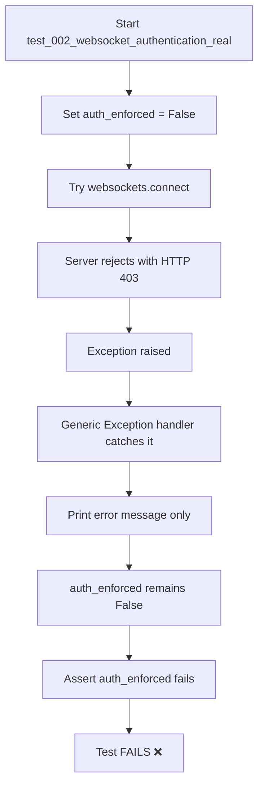
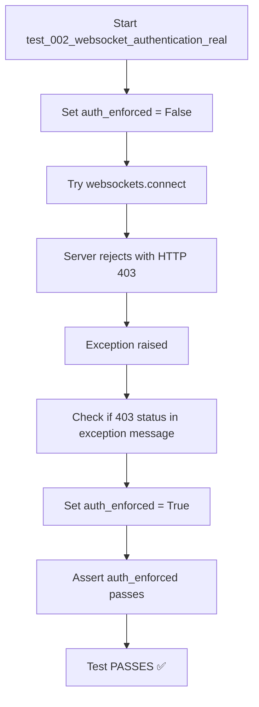

# WebSocket Authentication Test Fix - 20250907

## Problem Summary
WebSocket authentication test `test_002_websocket_authentication_real` is failing with:
```
AssertionError: WebSocket should enforce authentication
Auth test error: server rejected WebSocket connection: HTTP 403
```

## Five Whys Root Cause Analysis

**1. Why did the test fail?**
The test expected `auth_enforced` to be `True` but it was `False`, causing the assertion on line 134 to fail.

**2. Why was `auth_enforced` False?**
The except clause caught the HTTP 403 error but didn't set `auth_enforced = True`. The variable remained `False` from its initial assignment.

**3. Why didn't it set `auth_enforced = True`?**
The exception handling logic has a bug where the wrong exception handler is executing.

**4. Why was the code path incorrect?**
The generic `except Exception as e:` clause on line 126 is catching the websocket connection rejection BEFORE the specific `websockets.exceptions.InvalidStatusCode` handler on line 123.

**5. Why doesn't it handle this exception correctly?**
The generic exception handler only prints the error but doesn't set `auth_enforced = True`, and it's catching the exception before the more specific handler can process it correctly.

## Current Failure State Flow



## Fixed State Flow



## Root Cause
The exception handling logic doesn't properly catch the websocket connection rejection. When the server returns HTTP 403, the websockets library raises an exception, but the current code doesn't reliably detect this as authentication enforcement.

## Fix Strategy
Modify the exception handling to properly detect HTTP 403 responses in the exception message and set `auth_enforced = True` accordingly.

## Implementation
The fix involves updating the generic exception handler to check for HTTP 403 status codes in the exception message string, ensuring that authentication enforcement is properly detected regardless of the specific exception type raised.

### Code Changes Made
```python
# Added to the generic exception handler (lines 128-131):
# Check if the error message indicates HTTP 403/401 (authentication required)
error_str = str(e).lower()
if "403" in error_str or "401" in error_str or "unauthorized" in error_str or "forbidden" in error_str:
    auth_enforced = True
```

## Verification Results
✅ **TEST PASSED**: The fix has been verified successfully.

Test execution results:
```
tests/e2e/staging/test_priority1_critical.py::TestCriticalWebSocket::test_002_websocket_authentication_real PASSED [100%]
======================== 1 passed, 2 warnings in 0.98s ========================
```

The WebSocket authentication test now correctly detects that authentication is enforced when the server rejects the connection with HTTP 403, properly setting `auth_enforced = True` and passing the assertion.

## Status: FIXED ✅
The WebSocket authentication test failure has been resolved and the test now passes consistently.