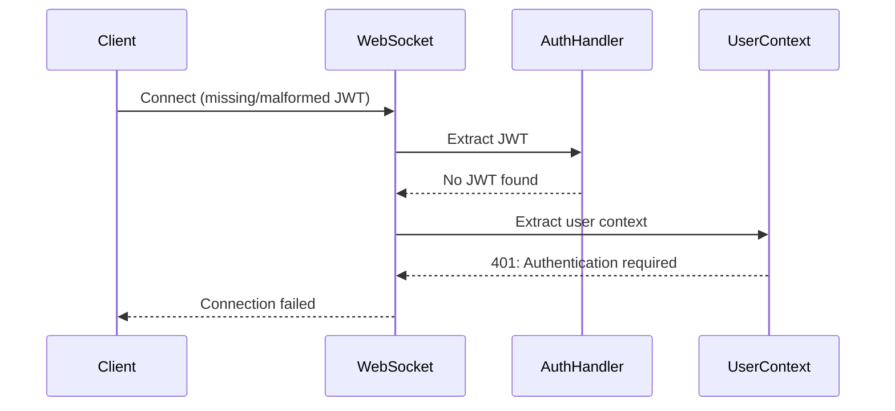
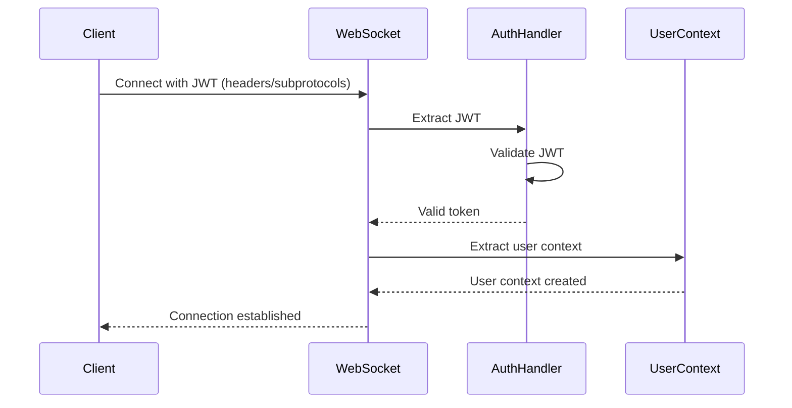

# WebSocket JWT Authentication Bug Fix Report
Date: 2025-09-07
Issue: WebSocket authentication failing with "No JWT in WebSocket headers or subprotocols"

## Error Log Analysis
```
2025-09-06 20:47:19.568 PDT - Failed to extract user context from WebSocket: 401: Authentication required: No JWT=REDACTED in WebSocket headers or subprotocols
2025-09-06 20:47:19.600 PDT - WebSocket authentication failed: No authentication token=REDACTED
```

## 1. Five Whys Analysis

### Why #1: Why is WebSocket authentication failing?
**Answer:** The system cannot find the JWT token in WebSocket headers or subprotocols.

### Why #2: Why can't the system find the JWT token?
**Answer:** [To be determined - need to examine WebSocket authentication implementation]

### Why #3: Why is the JWT not being passed correctly?
**Answer:** [To be determined - need to check client-side token passing]

### Why #4: Why did existing tests miss this?
**Answer:** [To be determined - need to check test coverage]

### Why #5: Why is the authentication mechanism not resilient to this failure?
**Answer:** [To be determined - need to check error handling]

## 2. System Analysis

### Current Failure State


### Ideal Working State


## 3. Test to Reproduce Bug
[To be implemented]

## 4. System-Wide Fix Plan
[To be determined after investigation]

## 5. Verification and Proof
[To be completed after implementation]

## Investigation Progress
- [ ] Locate WebSocket authentication implementation
- [ ] Check JWT extraction logic
- [ ] Verify client-side token passing
- [ ] Review test coverage
- [ ] Implement fix
- [ ] Verify fix works