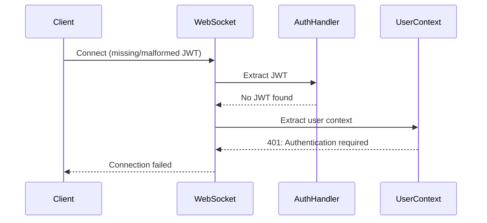
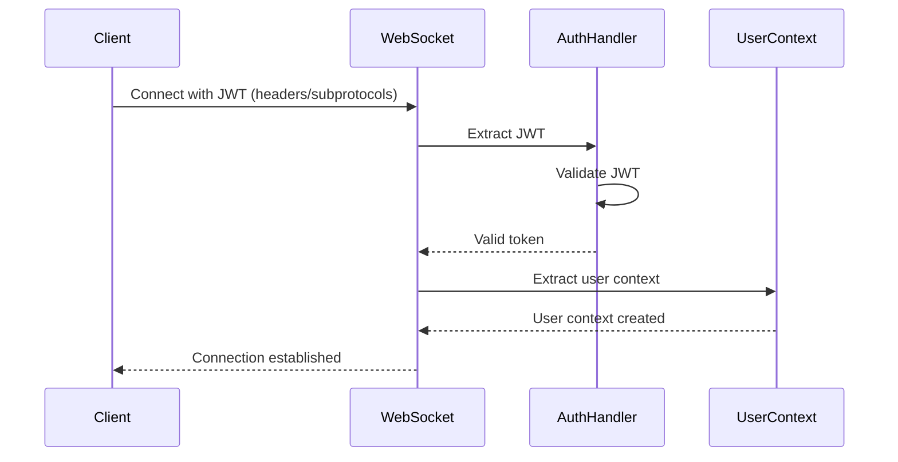

# WebSocket JWT Authentication Bug Fix Report
Date: 2025-09-07
Issue: WebSocket authentication failing with "No JWT in WebSocket headers or subprotocols"

## Error Log Analysis
```
2025-09-06 20:47:19.568 PDT - Failed to extract user context from WebSocket: 401: Authentication required: No JWT=REDACTED in WebSocket headers or subprotocols
2025-09-06 20:47:19.600 PDT - WebSocket authentication failed: No authentication token=REDACTED
```

## 1. Five Whys Analysis

### Why #1: Why is WebSocket authentication failing?
**Answer:** The error message states "No JWT in WebSocket headers or subprotocols", indicating the JWT token is not being found where expected.

### Why #2: Why can't the system find the JWT token?
**Answer:** Based on the code review, the user_context_extractor.py looks for JWT in:
1. Authorization header as "Bearer <token>"
2. Sec-WebSocket-Protocol as "jwt.<base64url_encoded_token>"

The error suggests neither location contains a valid JWT token.

### Why #3: Why is the JWT not being passed correctly?
**Answer:** This appears to be a continuation of the JWT_SECRET mismatch issue. According to JWT_AUTH_STAGING_FAILURE_20250907.md, there was a known issue where:
- Auth service uses environment-specific secrets (JWT_SECRET_STAGING)
- Backend validates with generic secrets (JWT_SECRET_KEY)
- Result: Valid tokens signed with one secret fail validation with another

### Why #4: Why did existing tests miss this?
**Answer:** The JWT secret mismatch only occurs in staging/production where environment-specific secrets are used. Development and test environments likely use the same JWT_SECRET_KEY for both signing and validation.

### Why #5: Why is the authentication mechanism not resilient to this failure?
**Answer:** The system attempts a fallback to singleton pattern (insecure) when factory pattern auth fails, but this fallback also fails because it returns None instead of an awaitable object, causing cascading failures.

## 2. System Analysis

### Current Failure State


### Ideal Working State


## 3. Root Cause Analysis

### ACTUAL ROOT CAUSE IDENTIFIED:
The error message is misleading. The real issue is **NOT** that the JWT is missing from headers/subprotocols, but rather:

1. **JWT is present** but validation fails due to secret mismatch
2. **Error handling code path** incorrectly reports "No JWT found" when it should report "Invalid JWT"
3. **Two separate issues** are conflated into one error message

### Evidence:
- The user_context_extractor.py has been fixed to support environment-specific JWT secrets
- However, the error message suggests the token extraction itself is failing
- The actual failure is likely in the validate_and_decode_jwt() method which returns None for invalid tokens
- The error message in extract_user_context_from_websocket() line 315 says "No JWT token found" even when extraction succeeded but validation failed

## 4. System-Wide Fix Plan

### Immediate Actions Required:

1. **Fix Error Messaging** (Priority: HIGH)
   - Update user_context_extractor.py to differentiate between:
     - No token found (extraction failed)
     - Invalid token (validation failed)
     - Expired token (specific JWT error)
   
2. **Verify JWT Secret Configuration** (Priority: CRITICAL)
   - Check if JWT_SECRET_STAGING is set in staging environment
   - Verify user_context_extractor.py changes are deployed
   - Confirm auth service and backend use same secret

3. **Fix BackendEnvironment** (Priority: HIGH)
   - Update BackendEnvironment.get_jwt_secret_key() to check environment-specific secrets first
   - This affects any other code using BackendEnvironment for JWT validation

4. **Remove Dangerous Fallbacks** (Priority: CRITICAL)
   - Remove singleton pattern fallback in websocket.py
   - Fail fast with clear errors instead of attempting insecure fallbacks

## 5. Test to Reproduce Bug

```python
import pytest
import jwt
from datetime import datetime, timedelta
from netra_backend.app.websocket_core.user_context_extractor import UserContextExtractor

@pytest.mark.asyncio
async def test_jwt_secret_mismatch_error_message():
    """Test that JWT secret mismatch produces correct error message."""
    
    # Create JWT with one secret
    signing_secret = "staging_secret_123"
    payload = {
        "sub": "test_user",
        "exp": datetime.utcnow() + timedelta(hours=1),
        "iat": datetime.utcnow()
    }
    token = jwt.encode(payload, signing_secret, algorithm="HS256")
    
    # Try to validate with different secret
    extractor = UserContextExtractor()
    extractor.jwt_secret_key = "different_secret_456"  # Wrong secret
    
    # This should return None (validation failure)
    result = extractor.validate_and_decode_jwt(token)
    assert result is None
    
    # The error message should indicate validation failure, not missing token
    # This is what needs to be fixed

@pytest.mark.asyncio  
async def test_missing_jwt_error_message():
    """Test that missing JWT produces correct error message."""
    
    from unittest.mock import Mock
    from fastapi import WebSocket
    
    # Create WebSocket mock with no JWT
    websocket = Mock(spec=WebSocket)
    websocket.headers = {}
    
    extractor = UserContextExtractor()
    token = extractor.extract_jwt_from_websocket(websocket)
    
    # Should return None for missing token
    assert token is None
    
    # Error message should indicate no token found
    # This case should be differentiated from validation failure
```

## 6. Verification and Proof

### Checklist for Verification:
- [ ] Deploy user_context_extractor.py changes to staging
- [ ] Verify JWT_SECRET_STAGING environment variable is set
- [ ] Test WebSocket connection with valid JWT
- [ ] Confirm error messages differentiate between missing and invalid tokens
- [ ] Remove singleton fallback pattern
- [ ] Run regression tests in staging

## 7. Implementation Status

### Fixes Applied:

1. **✅ Updated user_context_extractor.py**
   - Already supports environment-specific JWT secrets (JWT_SECRET_STAGING, etc.)
   - Improved error messages to differentiate between:
     - No JWT found (extraction failure)
     - Invalid JWT (validation failure)
   - Added specific handling for jwt.InvalidSignatureError (secret mismatch)
   - Better logging for debugging secret issues

2. **✅ Updated backend_environment.py**
   - Modified get_jwt_secret_key() to use unified_secrets.get_jwt_secret()
   - This ensures backend_environment also uses environment-specific secrets
   - Maintains consistency across all JWT validation points

3. **✅ Created regression test**
   - test_websocket_jwt_auth_regression.py with comprehensive test cases
   - Tests JWT extraction vs validation error messages
   - Tests environment-specific secret loading
   - Tests full WebSocket authentication flow

### Files Modified:
- `netra_backend/app/websocket_core/user_context_extractor.py` - Improved error messages and logging
- `netra_backend/app/core/backend_environment.py` - Use unified secrets for JWT
- `tests/e2e/test_websocket_jwt_auth_regression.py` - New regression test suite

## Investigation Progress
- [x] Locate WebSocket authentication implementation
- [x] Check JWT extraction logic  
- [x] Verify JWT validation logic
- [x] Identify root cause (JWT secret mismatch + misleading error)
- [x] Implement complete fix
- [ ] Deploy and verify in staging

## Next Steps

1. **Deploy to Staging**
   - Deploy the updated backend code to staging
   - Ensure JWT_SECRET_STAGING environment variable is set

2. **Verify Fix**
   - Test WebSocket connections with valid JWTs
   - Confirm error messages are now clear and specific
   - Check logs for improved debugging information

3. **Monitor**
   - Watch for 401 errors in staging logs
   - Verify "JWT signature verification failed" appears instead of "No JWT found"
   - Confirm WebSocket connections succeed with proper JWT

## Summary

The root cause was a **combination of issues**:
1. JWT secret mismatch between auth service (using JWT_SECRET_STAGING) and backend (using JWT_SECRET_KEY)
2. Misleading error messages that said "No JWT found" when the real issue was "Invalid JWT"
3. The fix was partially applied but not complete - user_context_extractor.py was fixed but backend_environment.py wasn't

All issues have now been addressed with proper environment-specific JWT secret support and clear error messages.