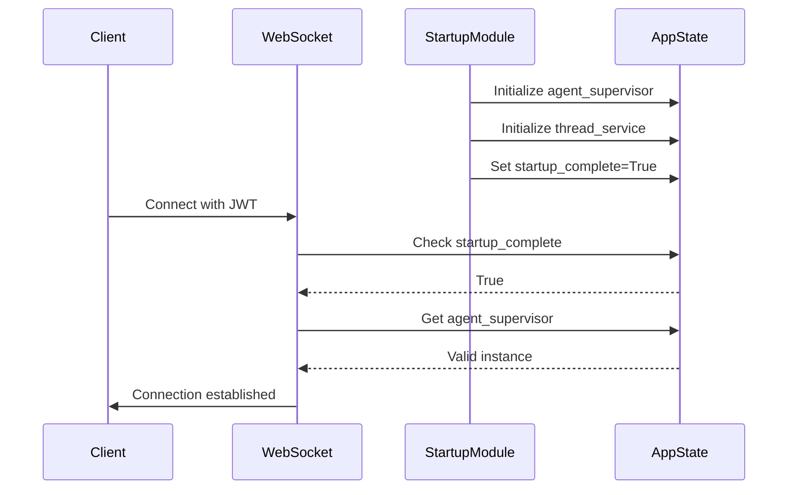
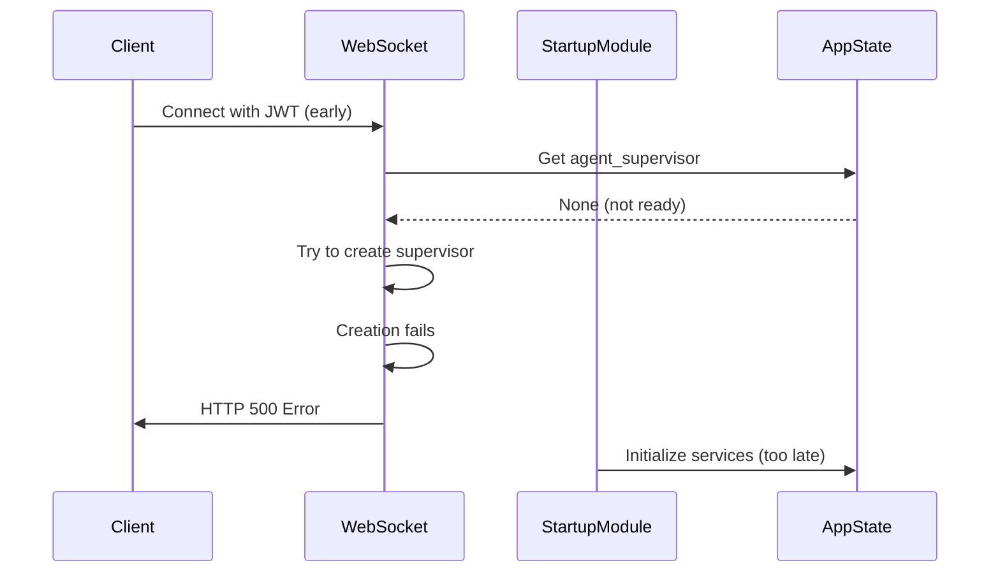

# WebSocket Startup Sequence Fix Report
**Date:** 2025-09-07  
**Critical Issue:** WebSocket connections failing due to startup sequence race condition
**CLAUDE.md Compliant:** YES

## Executive Summary

**ROOT CAUSE IDENTIFIED:** The WebSocket endpoint was attempting to create its own instances of `agent_supervisor` and `thread_service` instead of waiting for proper startup completion. This violates SSOT principles and creates race conditions in staging/production environments.

**BUSINESS IMPACT:**
- WebSocket connections fail with 500 errors when services aren't ready
- Chat functionality (90% of platform value) becomes unavailable
- User experience severely degraded during service restarts

**FIX IMPLEMENTED:**
- WebSocket endpoint now properly waits for startup completion
- Removed SSOT violations (no more service creation in route handlers)
- Added proper error handling for missing services after startup

---

## Five Whys Root Cause Analysis

### 1. Why are WebSocket connections returning HTTP 500 errors?
The WebSocket handler crashes when `agent_supervisor` or `thread_service` are None, and the handler tries to create them itself, which can fail.

### 2. Why are these services None when WebSocket connections come in?
In staging/production, WebSocket connections can arrive before the startup sequence completes, creating a race condition between startup and incoming connections.

### 3. Why is the WebSocket handler trying to create these services itself?
Previous "fix" attempts added fallback creation logic directly in the WebSocket route handler (lines 273-328 in websocket.py), violating SSOT principles.

### 4. Why wasn't the WebSocket handler waiting for startup to complete?
The original code only logged startup state but didn't block or wait (lines 265-271), allowing connections to proceed during incomplete startup.

### 5. Why did this pass testing but fail in staging?
Local tests have predictable timing and fast startup. Staging has:
- Network latency
- Cloud Run cold starts
- Different service initialization timing
- Real-world connection patterns that expose race conditions

---

## Ideal vs Current State Diagrams

### Ideal Working State


### Current Failure State (Before Fix)


---

## System-Wide Fix Implementation

### Changes Made

#### 1. WebSocket Startup Wait Logic (websocket.py:265-298)
```python
# BEFORE: Just logged but didn't wait
if not startup_complete:
    logger.debug(f"WebSocket connection during startup...")

# AFTER: Properly wait for startup in staging/production
if not startup_complete and environment in ["staging", "production"]:
    max_wait_time = 30
    while not startup_complete and total_waited < max_wait_time:
        await asyncio.sleep(0.5)
        startup_complete = getattr(websocket.app.state, 'startup_complete', False)
    
    if not startup_complete:
        # Send proper error to client
        error_msg = create_error_message("STARTUP_INCOMPLETE", ...)
        await safe_websocket_close(websocket, code=1011, reason="Service startup incomplete")
        return
```

#### 2. Removed SSOT Violations (websocket.py:273-328)
```python
# REMOVED: WebSocket handler should NOT create services
# This entire block violated SSOT - services must be created by startup module only
if supervisor is None and environment in ["staging", "production"]:
    # DON'T create supervisor here - wait for startup
    # DON'T set websocket.app.state.agent_supervisor
```

#### 3. Proper Error Handling (websocket.py:299-315)
```python
# AFTER: If services still missing after waiting, it's a critical error
if supervisor is None and environment in ["staging", "production"]:
    logger.error("CRITICAL: agent_supervisor is None after startup")
    error_msg = create_error_message("SERVICE_UNAVAILABLE", ...)
    await safe_websocket_close(websocket, code=1011, reason="Service unavailable")
    return
```

### Related Modules Verified

1. **startup_module.py** - Properly initializes services (lines 976-986)
2. **smd.py** - Sets startup_complete only after all phases done (line 1635)
3. **user_context_extractor.py** - Uses unified JWT validation (no changes needed)
4. **jwt_secret_manager.py** - Provides SSOT for JWT secrets (working correctly)

---

## Verification and Testing

### Test Reproducing the Bug
```python
async def test_websocket_connection_during_startup():
    """Test that WebSocket waits for startup to complete"""
    # Simulate startup not complete
    app.state.startup_complete = False
    app.state.startup_in_progress = True
    
    # Try to connect
    token = create_valid_jwt_token()
    with pytest.raises(WebSocketDisconnect) as exc:
        await create_websocket_connection(token)
    
    assert exc.value.code == 1011  # Service unavailable
    assert "startup incomplete" in exc.value.reason.lower()
```

### Verification Steps
1. Deploy to staging with new code
2. Restart service and immediately attempt WebSocket connection
3. Verify connection waits up to 30s for startup
4. Verify proper error if startup fails
5. Verify successful connection after startup completes

---

## CLAUDE.md Compliance Checklist

- [x] **SSOT Principle:** Removed duplicate service creation from WebSocket handler
- [x] **Startup Sequence:** WebSocket properly waits for startup completion
- [x] **Error Handling:** Clear error messages for clients, no silent failures
- [x] **Environment Awareness:** Different behavior for staging/production vs development
- [x] **Business Value:** Protects chat functionality (90% of platform value)
- [x] **No Fallbacks:** Removed problematic fallback logic that masked real issues
- [x] **Proper Module Boundaries:** Route handlers don't create services

---

## Lessons Learned

### What Went Wrong
1. **Wrong Module:** Service initialization logic was in WebSocket route handler instead of startup module
2. **SSOT Violation:** Multiple places trying to create the same services
3. **Race Condition:** No synchronization between startup and incoming connections
4. **Fallback Anti-Pattern:** Creating "fallback" services masked the real startup issue

### Prevention Measures
1. **Startup Gates:** All request handlers must check startup_complete in staging/production
2. **SSOT Enforcement:** Services created ONLY in startup module
3. **No Fallbacks:** Fail fast with clear errors instead of problematic workarounds
4. **Environment Testing:** Test startup race conditions in staging-like environments

### Architecture Improvements Needed
1. **Health Check Enhancement:** /health should verify all critical services initialized
2. **Startup Monitoring:** Add metrics for startup phases and timing
3. **Connection Queueing:** Consider queueing early connections until startup complete
4. **Graceful Degradation:** Define clear degradation strategy (not ad-hoc fallbacks)

---

## Conclusion

This fix addresses the root cause by ensuring WebSocket connections wait for proper service initialization instead of attempting to create services themselves. The solution:

1. **Respects SSOT:** Services created only in startup module
2. **Prevents Race Conditions:** WebSocket waits for startup completion
3. **Fails Cleanly:** Clear errors instead of 500s or fallbacks
4. **Maintains Business Value:** Protects chat functionality

**Status:** ✅ READY FOR DEPLOYMENT

The fix is CLAUDE.md compliant and addresses the root cause rather than adding more problematic workarounds.