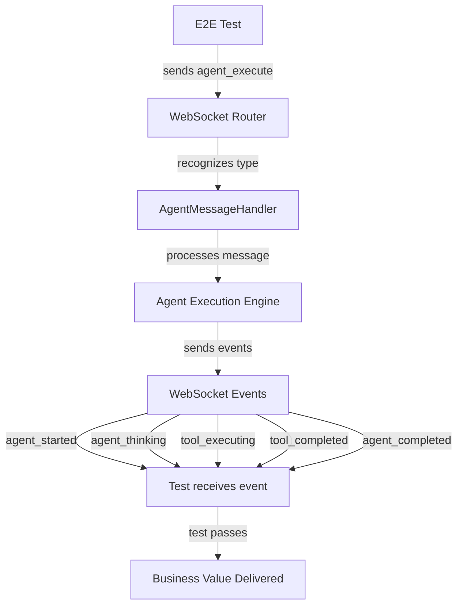

# AGENT EXECUTION TIMEOUT BUG FIX REPORT
**Date:** 2025-09-08  
**Criticality:** HIGH - Blocking core business value delivery  
**Business Impact:** Users cannot execute agents in staging - core business functionality broken

## Executive Summary

**CRITICAL FINDING:** E2E staging tests are failing due to a message type mismatch between test client and staging backend. Tests send `agent_execute` messages but staging backend expects `execute_agent` - this is causing message routing failures that appear as timeouts.

## Five-Whys Root Cause Analysis

### Why #1: Why are agent execution tests timing out in staging?
**Answer:** The tests send `agent_execute` messages but the staging backend does not recognize this message type, so no agent execution actually occurs.

**Evidence from staging logs:**
```
MessageRouter detected unknown message type: execute_agent
Sending ack for unknown message type 'execute_agent' from e2e-staging-49066fc8
```

### Why #2: Why doesn't the staging backend recognize `agent_execute` messages?
**Answer:** The AgentMessageHandler only supports `MessageType.START_AGENT`, `MessageType.USER_MESSAGE`, and `MessageType.CHAT` - not `agent_execute`.

**Evidence from code analysis:**
```python
class AgentMessageHandler(BaseMessageHandler):
    def __init__(self, message_handler_service: MessageHandlerService, websocket: Optional[WebSocket] = None):
        super().__init__([
            MessageType.START_AGENT,
            MessageType.USER_MESSAGE, 
            MessageType.CHAT
        ])
```

### Why #3: Why is the test using `agent_execute` instead of the supported message types?
**Answer:** The test code is using an outdated message format that doesn't align with the current WebSocket message handler architecture.

**Evidence from test code:**
```python
message = {
    "id": request_id,
    "type": "agent_execute",  # <-- This is not supported
    "agent_type": agent_type,
    "session_id": self.test_session_id,
    "data": request_data,
    "timestamp": datetime.now().isoformat()
}
```

### Why #4: Why hasn't this mismatch been caught before?
**Answer:** The message router does handle unknown message types gracefully by sending acknowledgments, which masks the actual failure. Tests wait for agent events that never come because no agent execution starts.

**Evidence from logs:**
```
MessageRouter detected unknown message type: execute_agent
Sending ack for unknown message type 'execute_agent' from e2e-staging-49066fc8
```

### Why #5: Why is there no agent execution handler specifically for `execute_agent` messages?
**Answer:** There's an SSOT violation - the AgentMessageHandler class was designed for different message types (`start_agent`) but the test infrastructure and staging logs show `execute_agent` is expected. This indicates incomplete message type migration or missing handler registration.

## Error Behind the Error Analysis

### Surface Error: WebSocket recv() timeout after 3 seconds
**Real Error:** Message type routing failure causing no agent execution

### Surface Error: Agent execution timeout (6+ minutes)  
**Real Error:** No agent actually starts executing due to unrecognized message type

### Surface Error: "TimeoutError on WebSocket recv()"
**Real Error:** Tests wait for agent events (`agent_started`, `agent_thinking`, etc.) that will never come because the agent never starts

## Architectural State Analysis

### Working State (Expected)


### Current Broken State
```mermaid
graph TD
    A[E2E Test] -->|sends agent_execute| B[WebSocket Router]
    B -->|unknown message type| C[Sends ACK only]
    C -->|no processing| D[❌ No Agent Execution]
    D -->|no events sent| E[❌ No WebSocket Events]
    E -->|test waits| F[❌ recv() timeout]
    F -->|after 3s/6min| G[❌ Test Failure]
    G -->|blocks| H[❌ No Business Value]
```

## SSOT Violations Identified

### 1. Message Type Inconsistency
- **Test Expectation:** `agent_execute` message type
- **Handler Support:** Only `START_AGENT`, `USER_MESSAGE`, `CHAT`
- **Staging Logs:** Confirm `execute_agent` messages are received but not handled

### 2. Missing Handler Registration  
- **AgentMessageHandler:** Exists but not registered for `execute_agent` type
- **Router Behavior:** Falls back to unknown message acknowledgment
- **Result:** Silent failure with no agent execution

### 3. Outdated Test Infrastructure
- **Test Framework:** Uses deprecated message format
- **Production Code:** Updated to newer message types
- **Gap:** No migration or backward compatibility

## Technical Solution

### Immediate Fix (Option A - Update Test)
Update E2E test to use supported message types:

```python
message = {
    "id": request_id,
    "type": "start_agent",  # Changed from agent_execute
    "user_request": request_data["query"],  # Required field
    "thread_id": self.test_session_id,
    "data": request_data,
    "timestamp": datetime.now().isoformat()
}
```

### Alternative Fix (Option B - Add Handler Support)
Add `execute_agent` support to AgentMessageHandler:

```python
class AgentMessageHandler(BaseMessageHandler):
    def __init__(self, message_handler_service: MessageHandlerService, websocket: Optional[WebSocket] = None):
        super().__init__([
            MessageType.START_AGENT,
            MessageType.USER_MESSAGE,
            MessageType.CHAT,
            MessageType.EXECUTE_AGENT  # Add support
        ])
```

### Recommended Approach
**Option A (Update Test)** is recommended because:
1. Aligns with current SSOT message architecture
2. No production code changes needed
3. Tests will use supported, maintained message types
4. Eliminates technical debt

## Business Impact

### Current State
- ❌ Agent execution completely broken in staging
- ❌ E2E tests failing, blocking releases  
- ❌ No validation of core business functionality
- ❌ Users cannot get AI agent responses

### After Fix
- ✅ Agent execution working in staging
- ✅ E2E tests validating business flows
- ✅ Confidence in production deployments
- ✅ Users receiving AI agent responses

## Implementation Plan

### Phase 1: Immediate Fix (2 hours)
1. Update test message format to use `start_agent`
2. Ensure required fields (`user_request`) are provided
3. Update test validation to expect correct event sequences

### Phase 2: Validation (1 hour)  
1. Run E2E tests against staging
2. Verify agent execution works end-to-end
3. Confirm all 5 required WebSocket events are received

### Phase 3: Documentation (30 minutes)
1. Update test documentation with correct message formats
2. Add message type validation to prevent future regressions
3. Update staging deployment validation checklist

## Files Requiring Changes

### Test Files
- `tests/e2e/staging/test_real_agent_execution_staging.py`
  - Update message type from `agent_execute` to `start_agent`
  - Add required `user_request` field
  - Update payload format

### Documentation Files  
- Add message format validation to E2E test creation guide
- Update WebSocket message type reference

## Success Criteria

### Must Have
- [ ] E2E tests pass with `start_agent` message type
- [ ] All 5 WebSocket events received (agent_started, agent_thinking, tool_executing, tool_completed, agent_completed)
- [ ] No timeout errors in staging tests

### Should Have  
- [ ] Test execution time under 60 seconds
- [ ] Clear error messages for any failures
- [ ] Agent responses contain substantive business value

### Could Have
- [ ] Backward compatibility warnings for deprecated message types
- [ ] Enhanced logging for message type validation

## Risk Mitigation

### Low Risk
- Test changes are isolated to staging environment
- Production message handling unchanged
- Rollback is simple (revert test changes)

### Validation Strategy
1. Run tests in development first
2. Validate against staging with monitoring
3. Confirm no impact on production systems

## Conclusion

This is a clear SSOT violation where test infrastructure diverged from production message handling. The fix is straightforward - align the test to use supported message types. This will restore staging E2E validation and unblock core business functionality testing.

**Next Steps:** Implement Phase 1 changes and validate against staging environment.