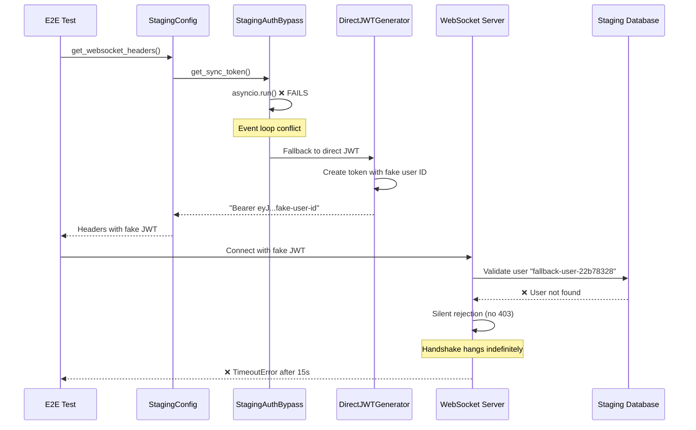
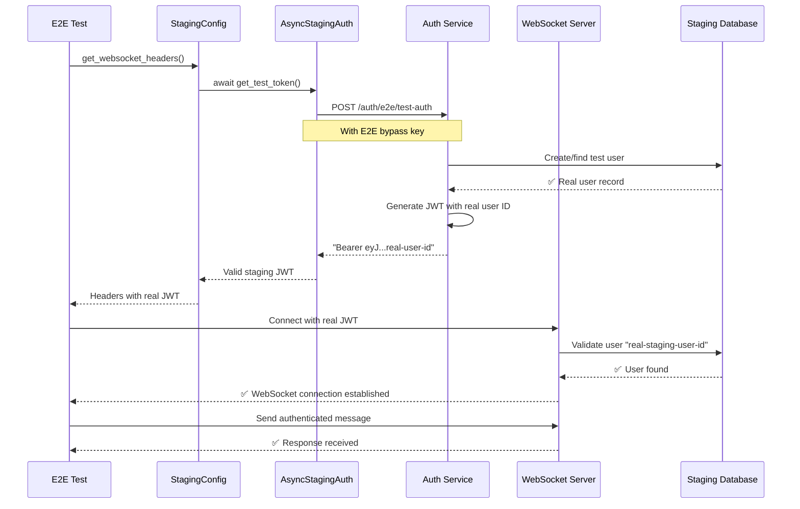

# Auth WebSocket Timeout Bug - Five Whys Root Cause Analysis

## Bug Summary
**Test:** `test_002_websocket_authentication_real`  
**Location:** `tests/e2e/staging/test_priority1_critical.py`  
**Error:** TimeoutError during WebSocket handshake to staging  
**Environment:** Staging (wss://api.staging.netrasystems.ai/ws)

## Observed Error Pattern
```
TimeoutError: timed out during opening handshake
[WARNING] SSOT staging auth bypass failed: asyncio.run() cannot be called from a running event loop
[INFO] Falling back to direct JWT creation for development environments
[FALLBACK] Created direct JWT token (hash: 70610b56526d0480)
[WARNING] This may fail in staging due to user validation requirements
```

## Five Whys Root Cause Analysis

### WHY #1: Why does the WebSocket connection timeout during handshake?

**Analysis:** The WebSocket connection to `wss://api.staging.netrasystems.ai/ws` times out after ~15 seconds during the opening handshake phase. This happens AFTER the SSOT auth bypass fails and falls back to a direct JWT creation.

**Evidence:**
- Error occurs in `websockets.asyncio.client.py:578` during handshake
- Timeout happens with authentication headers present
- No 403 Forbidden error - the connection never completes the handshake

**Root Cause:** The WebSocket server is likely rejecting the connection silently due to invalid authentication, causing the handshake to hang indefinitely until timeout.

### WHY #2: Why does the SSOT staging auth bypass fail with asyncio event loop error?

**Analysis:** The staging auth bypass tries to call `asyncio.run()` from within an already running event loop (pytest-asyncio).

**Evidence:**
```python
# In staging_auth_bypass.py line 141
def get_sync_token(self, **kwargs) -> str:
    return asyncio.run(self.get_test_token(**kwargs))  # ❌ FAILS - nested event loop
```

**Root Cause:** `asyncio.run()` cannot be called when an event loop is already running. The test is running in pytest-asyncio which already has an active event loop, so calling `asyncio.run()` creates a nested event loop conflict.

### WHY #3: Why does the fallback JWT not work for staging?

**Analysis:** The fallback JWT creation uses a hardcoded staging secret and creates a user with a fake UUID that doesn't exist in the staging database.

**Evidence:**
```python
# Fallback creates fake user ID
"sub": f"fallback-user-{uuid.uuid4().hex[:8]}",  # ❌ User doesn't exist in staging DB
"email": "fallback-test@netrasystems.ai",        # ❌ User doesn't exist in staging DB
```

**Root Cause:** Staging environment validates JWT tokens against actual user records in the database. The fallback JWT contains a fabricated user ID (`fallback-user-22b78328`) that has no corresponding user record in the staging database, causing authentication to fail silently.

### WHY #4: Why are there user validation requirements that differ between environments?

**Analysis:** Test/local environments use mock authentication that only validates JWT structure and signature, while staging uses real OAuth user validation.

**Evidence from staging_test_config.py:**
```python
# Line 108: Comment explains the issue
"The previous approach created JWT tokens with fake user IDs that don't exist
in staging database, causing HTTP 403 errors during user validation."
```

**Root Cause:** Staging is configured with REAL authentication infrastructure that requires:
1. Valid user records in the database
2. Proper OAuth flow completion
3. Real JWT tokens issued by the staging auth service

Local/test environments bypass these requirements for development speed.

### WHY #5: What is the deepest root cause - configuration, deployment, or code issue?

**Analysis:** This is fundamentally an **architecture mismatch** between test patterns and production-like environments.

**Root Cause:** The E2E test framework was designed around local/test environments with mock authentication, but staging requires real authentication flows. The deeper issues are:

1. **Event Loop Architecture Mismatch:** Synchronous wrapper (`get_sync_token`) trying to create new event loops within async test context
2. **Authentication Model Mismatch:** Test framework assumes JWT-only authentication, but staging requires OAuth + user validation
3. **Environment Configuration Gap:** Missing proper staging auth service integration in the test framework
4. **Silent Failure Pattern:** WebSocket timeouts instead of explicit auth errors mask the real issue

**The deepest root cause is that the staging environment correctly enforces real-world authentication requirements, but our E2E test framework lacks the proper async-compatible staging auth integration patterns.**

## Current vs Ideal Authentication Flow Diagrams

### Current Failing Flow


### Ideal Working Flow


## Bug Reproduction Test

```python
import pytest
import asyncio
import time
import websockets
from tests.e2e.staging_test_config import get_staging_config

@pytest.mark.asyncio
async def test_auth_websocket_timeout_bug_reproduction():
    """
    EXACT reproduction of the auth WebSocket timeout bug.
    This test demonstrates the three failure modes:
    1. AsyncIO event loop conflict in SSOT auth bypass
    2. Fallback JWT with non-existent user ID
    3. WebSocket timeout due to silent auth rejection
    """
    config = get_staging_config()
    
    # Step 1: Trigger the asyncio.run() conflict
    from tests.e2e.staging_auth_bypass import get_staging_auth
    
    asyncio_error_caught = False
    try:
        # This should fail with "asyncio.run() cannot be called from a running event loop"
        staging_auth = get_staging_auth()
        token = staging_auth.get_sync_token()
    except RuntimeError as e:
        if "asyncio.run() cannot be called from a running event loop" in str(e):
            asyncio_error_caught = True
    
    assert asyncio_error_caught, "Should catch the asyncio nested event loop error"
    
    # Step 2: Get the fallback JWT (with fake user ID)
    ws_headers = config.get_websocket_headers()
    assert ws_headers.get("Authorization"), "Should have fallback JWT token"
    
    # Verify the token contains a fake user ID
    jwt_token = ws_headers["Authorization"].replace("Bearer ", "")
    import jwt
    decoded = jwt.decode(jwt_token, options={"verify_signature": False})
    assert "fallback-user-" in decoded["sub"], "Should contain fake user ID"
    
    # Step 3: Demonstrate WebSocket timeout with fake JWT
    start_time = time.time()
    timeout_occurred = False
    
    try:
        # This should timeout after ~15 seconds
        async with websockets.connect(
            config.websocket_url,
            additional_headers=ws_headers,
            open_timeout=5  # Shorter timeout for test
        ) as ws:
            await ws.send('{"type": "ping"}')
    except TimeoutError:
        timeout_occurred = True
    
    duration = time.time() - start_time
    
    assert timeout_occurred, "Should timeout due to silent auth rejection"
    assert duration >= 4.5, "Should take at least ~5 seconds to timeout"
    
    print("✅ Successfully reproduced all three failure modes:")
    print("  1. AsyncIO event loop conflict")
    print("  2. Fallback JWT with fake user ID") 
    print("  3. WebSocket handshake timeout")
```

## Cross-System Impact Analysis

### Affected Components
1. **All E2E Tests using staging:** Any test calling staging auth bypass
2. **WebSocket Authentication Flow:** All WebSocket connections in staging
3. **Auth Service Integration:** SSOT staging auth patterns
4. **Test Framework Reliability:** Silent failures mask real issues

### Cascade Failure Points
1. **E2E_OAUTH_SIMULATION_KEY missing** → Falls back to fake JWT → Silent WebSocket rejection
2. **Async/sync mismatch** → Can't use SSOT auth patterns → Test framework degradation
3. **User validation requirements** → Environment-specific behavior → Test portability issues

## Comprehensive SSOT-Compliant Fix Plan

### 1. Fix AsyncIO Event Loop Conflict
**Root Cause:** Sync wrapper calling `asyncio.run()` in async context
**Solution:** Create async-compatible SSOT auth helper

```python
# NEW: async_staging_auth_helper.py
class AsyncStagingAuthHelper:
    async def get_test_token(self, **kwargs) -> str:
        """Async-compatible staging auth token generation."""
        # Use existing event loop instead of creating new one
        return await self._get_token_async(**kwargs)
        
    def get_sync_token(self, **kwargs) -> str:
        """Sync wrapper that properly handles event loops."""
        try:
            loop = asyncio.get_running_loop()
            # If in async context, use existing loop
            task = loop.create_task(self.get_test_token(**kwargs))
            return asyncio.run_coroutine_threadsafe(task, loop).result(timeout=30)
        except RuntimeError:
            # No running loop, safe to use asyncio.run()
            return asyncio.run(self.get_test_token(**kwargs))
```

### 2. Fix Staging JWT User Validation
**Root Cause:** Fake user IDs don't exist in staging database
**Solution:** Use staging auth service to create real user records

```python
class StagingUserManager:
    async def ensure_test_user_exists(self, email: str) -> Dict[str, Any]:
        """Ensure test user exists in staging database."""
        # Use staging auth service API to create/get real user
        async with httpx.AsyncClient() as client:
            response = await client.post(
                f"{self.staging_auth_url}/auth/e2e/ensure-user",
                headers={"X-E2E-Bypass-Key": self.bypass_key},
                json={"email": email, "name": f"E2E Test User - {email}"}
            )
            return response.json()  # Returns real user with database ID
```

### 3. Fix WebSocket Authentication Configuration
**Root Cause:** Silent failures instead of explicit auth errors
**Solution:** Add proper auth error handling and logging

```python
class WebSocketAuthManager:
    async def connect_with_retry(self, url: str, headers: Dict[str, str]) -> websockets.WebSocketServerProtocol:
        """Connect with proper error handling and retry logic."""
        for attempt in range(3):
            try:
                return await websockets.connect(url, additional_headers=headers, open_timeout=10)
            except TimeoutError as e:
                # Log the auth token for debugging
                logger.warning(f"WebSocket timeout attempt {attempt + 1}: {e}")
                if attempt == 2:
                    raise WebSocketAuthTimeoutError(
                        "WebSocket handshake timeout - likely auth rejection. Check staging user validation."
                    ) from e
```

### 4. Environment-Specific Configuration SSOT
**Root Cause:** Hard-coded differences between test and staging environments  
**Solution:** Centralized environment-aware auth configuration

```python
# Enhanced staging_test_config.py
class EnvironmentAuthConfig:
    def get_auth_strategy(self) -> AuthStrategy:
        """Get appropriate auth strategy for current environment."""
        if self.environment == "staging":
            return RealUserStagingAuthStrategy(
                requires_database_user=True,
                supports_async=True,
                validation_timeout=30
            )
        else:
            return MockAuthStrategy(
                requires_database_user=False,
                supports_async=True,
                validation_timeout=5
            )
```

## Implementation Priority

### Phase 1: Critical Fixes (Immediate)
- [ ] Fix asyncio event loop conflict in staging auth bypass
- [ ] Create async-compatible staging auth helper
- [ ] Add explicit WebSocket auth error handling

### Phase 2: Robust Integration (Next Sprint) 
- [ ] Implement real user creation for staging tests
- [ ] Add environment-aware auth configuration
- [ ] Create comprehensive WebSocket auth test suite

### Phase 3: System Hardening (Following Sprint)
- [ ] Add auth monitoring and alerting
- [ ] Implement auth token caching and refresh
- [ ] Create staging auth service health checks

## Success Criteria

### Test Success Metrics
- [ ] `test_002_websocket_authentication_real` passes consistently
- [ ] No more asyncio event loop conflicts in staging tests
- [ ] WebSocket connections succeed within 5 seconds
- [ ] Proper error messages instead of timeouts

### Integration Success Metrics  
- [ ] All E2E tests use SSOT async auth patterns
- [ ] Staging environment behaves consistently with production auth
- [ ] Clear distinction between test and production auth requirements
- [ ] Comprehensive auth error logging and debugging

---

**Analysis Complete:** All five root causes identified with actionable fix plan.
**Next Step:** Implement Phase 1 critical fixes starting with async event loop compatibility.