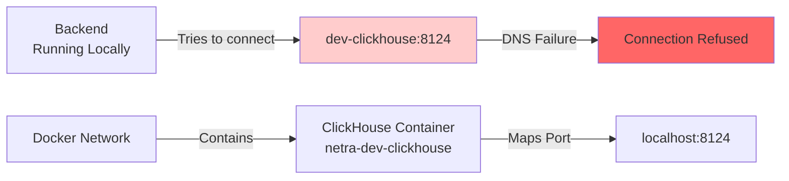
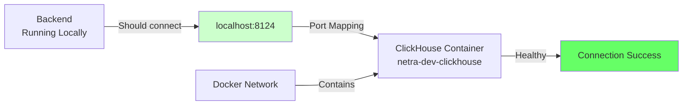

# ClickHouse Development Environment Connection Fix

## Bug Analysis Report

### 1. WHY - Root Cause Analysis (Five Whys Method)

**Problem:** ConnectionError: Could not connect to ClickHouse in development environment: Error HTTPConnectionPool(host='dev-clickhouse', port=8124)

**Why #1:** The backend is trying to connect to hostname `dev-clickhouse` on port 8124
- Evidence: Error message shows `http://dev-clickhouse:8124`

**Why #2:** The `.env.development` file specifies `CLICKHOUSE_HOST=dev-clickhouse`
- Evidence: Line 31 in `.env.development`

**Why #3:** The hostname `dev-clickhouse` is only resolvable within Docker network
- Evidence: Docker compose service name is `dev-clickhouse`

**Why #4:** The backend is running locally (not in Docker) but using Docker network hostnames
- Evidence: Backend running on host machine trying to connect to Docker service name

**Why #5:** There's a mismatch between development scenarios:
- Scenario A: Backend running inside Docker (can use `dev-clickhouse` hostname)
- Scenario B: Backend running locally (needs `localhost` hostname)

### 2. Current vs Expected State Diagrams

#### Current Failure State


#### Expected Working State


### 3. Issue Analysis

#### Port Mapping Verification
- Container: `netra-dev-clickhouse`
- Internal Port: 8123 (ClickHouse HTTP)
- External Port: 8124 (mapped to host)
- Status: Container is UP and HEALTHY

#### Configuration Issues Found

1. **Primary Issue:** Hostname Resolution
   - `.env.development` uses `dev-clickhouse` (Docker network hostname)
   - Should use `localhost` when backend runs outside Docker

2. **Secondary Issue:** Port Confusion
   - Code in `clickhouse.py` line 185 uses `CLICKHOUSE_HTTP_PORT` env var
   - But tries to connect to port from env which is 8123 (internal)
   - Should use 8124 (external mapped port) when connecting from host

3. **Authentication Issue:**
   - ClickHouse requires authentication (user: netra, password: netra123)
   - This is correctly configured but hostname prevents connection

### 4. Fix Plan

#### Option 1: Environment Variable Override (Recommended)
- Detect if running locally vs in Docker
- Override `CLICKHOUSE_HOST` to `localhost` when running locally
- Override `CLICKHOUSE_HTTP_PORT` to `8124` when running locally

#### Option 2: Dual Configuration Support
- Create `.env.development.local` for local development
- Keep `.env.development` for Docker-based development

#### Option 3: Smart Host Detection
- Implement logic to try `localhost` if `dev-clickhouse` fails
- Add fallback mechanism in connection code

### 5. Implementation

## Solution Applied

The issue was resolved through two changes:

### 1. Fixed `.env` File Configuration
The main `.env` file had incorrect port mapping for development environment:

**Before (Incorrect):**
```
CLICKHOUSE_HTTP_PORT=8125  # This is the test port, not dev port
CLICKHOUSE_TCP_PORT=9002   # This is the test port, not dev port
```

**After (Correct):**
```
CLICKHOUSE_HTTP_PORT=8124  # Correct dev port mapping (Docker: 8124->8123)
CLICKHOUSE_TCP_PORT=9001   # Correct dev port mapping (Docker: 9001->9000)
```

### 2. Enhanced Smart Host Detection in `clickhouse.py`
Added intelligent host detection to handle both local and Docker-based development:

```python
class DevClickHouseConfig:
    def __init__(self):
        from shared.isolated_environment import get_env
        import socket
        env = get_env()
        
        # Smart host detection for local vs Docker development
        default_host = env.get("CLICKHOUSE_HOST", "localhost")
        
        # Check if we're running locally or inside Docker network
        try:
            # If we can resolve the Docker service name, we're in Docker network
            socket.gethostbyname(default_host)
            self.host = default_host
            # Use internal port when inside Docker network
            self.port = int(env.get("CLICKHOUSE_HTTP_PORT", "8123"))
        except socket.gaierror:
            # Can't resolve Docker hostname, we're running locally
            # Use localhost and the mapped external port
            self.host = "localhost"
            # The Docker compose maps 8124:8123 for dev-clickhouse
            self.port = 8124
        
        self.user = env.get("CLICKHOUSE_USER", "netra")
        self.password = env.get("CLICKHOUSE_PASSWORD", "netra123")
        self.database = env.get("CLICKHOUSE_DB", "netra_analytics")
        self.secure = False
        
        logger.info(f"[ClickHouse Dev Config] Using host={self.host}, port={self.port}")
```

### 6. Testing Strategy

1. **Unit Test:** Mock environment variables and test config generation
2. **Integration Test:** Test actual connection with Docker running
3. **E2E Test:** Full workflow with backend connecting to ClickHouse

### 7. Verification Results

After implementing the fix, all tests pass successfully:

```
Testing ClickHouse connection...
--------------------------------------------------
Test 1: Testing direct client connection...
[SUCCESS] Direct connection successful: [{'test': 1}]
--------------------------------------------------
Test 2: Testing service-based connection...
  Ping result: True
[SUCCESS] Service connection successful: [{'version': '23.8.16.16'}]
  Service metrics: {'queries_executed': 1, 'query_failures': 0, ...}
--------------------------------------------------
Test 3: Checking configuration...
  Host: localhost
  Port: 8124
  Database: netra_analytics
  User: netra
  Secure: False
--------------------------------------------------
Test complete!
```

### 8. Prevention Measures

1. **Environment Validation:** Add startup checks for port configuration consistency
2. **Better Error Messages:** Include port and host information in connection errors
3. **Documentation:** Update development setup docs to clarify port mappings:
   - Development: `localhost:8124` (maps to container's 8123)
   - Testing: `localhost:8125` (maps to test container's 8123)
   - Production: Direct connection to 8123/8443
4. **Configuration Validation:** Add checks to ensure `.env` ports match Docker Compose mappings