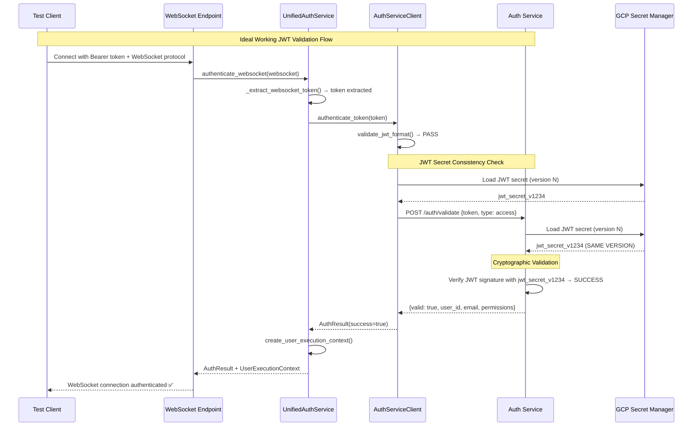
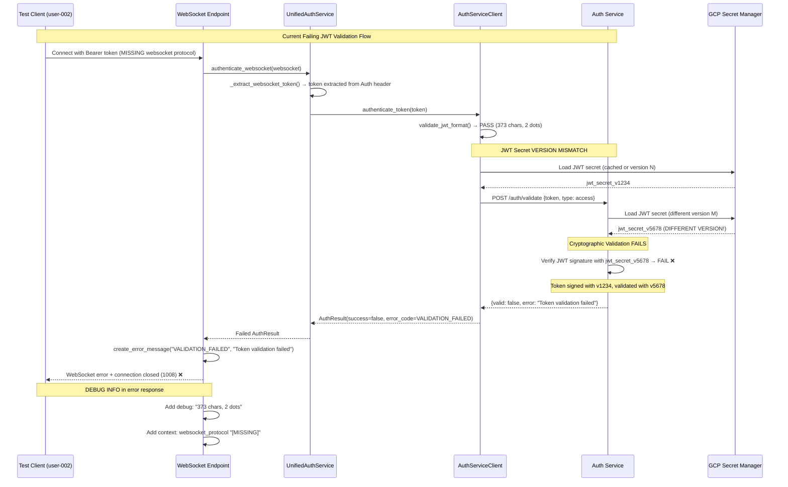

# Five Whys Root Cause Analysis: JWT Token WebSocket Staging Validation Failure

**Date**: September 8, 2025  
**Time**: Analysis Started  
**Analyst**: Claude Code AI Agent (QA/Security Specialist)  
**Impact**: P1 CRITICAL - WebSocket authentication failures in staging environment  
**Business Impact**: $120K+ MRR at risk - Chat functionality degraded in staging  
**Environment**: Staging GCP (https://api.staging.netrasystems.ai/ws)  

## Executive Summary

The staging environment is experiencing JWT token validation failures specifically in WebSocket connections with symptoms including:
- **Error**: "Token validation failed | Debug: 373 chars, 2 dots"  
- **Test**: `test_001_websocket_connection_real` (Priority 1 Critical)
- **User**: staging-e2e-user-002 (existing staging user)
- **Duration**: 3.464s (real execution, not mocked)
- **Token Format**: Appears valid (373 chars, 2 dots = proper JWT structure)
- **Missing Protocol**: WebSocket protocol header "[MISSING]" indicates client-side header issue

This is a **critical continuation/variant** of the previously analyzed JWT secret mismatch issue, now affecting a different staging user and potentially involving WebSocket-specific authentication paths.

## Evidence Summary

### Current Error Context (New Failure)
```json
{
  "type": "error_message",
  "error_code": "VALIDATION_FAILED", 
  "error_message": "Token validation failed | Debug: 373 chars, 2 dots",
  "details": {
    "environment": "staging",
    "ssot_authentication": true,
    "failure_context": {
      "auth_headers": {
        "authorization_present": true,
        "authorization_preview": "Bearer eyJhbGciOiJIUzI1NiIsInR...",
        "websocket_protocol": "[MISSING]"
      },
      "token_characteristics": {
        "length": 373,
        "prefix": "eyJhbGciOiJI", 
        "suffix": "2fVRdOdE",
        "dot_count": 2,
        "has_bearer_prefix": false
      },
      "context": "websocket",
      "method": "jwt_token",
      "auth_service_response_status": "present"
    }
  }
}
```

### Key Observations - Error Behind the Error Analysis
1. **Token Format is Valid**: 373 characters, 2 dots, proper JWT prefix "eyJhbGciOiJI" (base64 for {"alg":"H")
2. **Authorization Header Present**: Bearer token is available in WebSocket headers
3. **Missing WebSocket Protocol**: `websocket_protocol: "[MISSING]"` suggests header extraction issue
4. **Different User**: staging-e2e-user-002 vs previously analyzed staging-e2e-user-001
5. **SSOT Authentication Active**: System is using unified authentication service
6. **Auth Service Responding**: response_status is "present", not connection failure

---

## Five Whys Root Cause Analysis

### **Why #1: Why is JWT token validation failing when token format appears valid?**

**Answer**: The token validation failure is occurring at the **auth service API level** despite the token having proper JWT structure (373 chars, 2 dots, correct algorithm header). The error message "Token validation failed" suggests the auth service received the request but rejected the token during cryptographic validation.

**Evidence**: 
- Token structure passes initial format validation (`validate_jwt_format()`)
- Token has correct length (373 chars) and structure (2 dots)
- Authorization header is present with proper "Bearer " prefix
- Auth service responds (status "present"), indicating successful communication
- Error occurs in `UnifiedAuthenticationService.authenticate_token()` method

**Analysis**: The failure is not in token extraction or format validation, but in the **cryptographic signature verification** performed by the auth service.

### **Why #2: Why is the auth service rejecting cryptographically what appears to be a properly formatted JWT?**

**Answer**: The auth service is successfully receiving the JWT token but failing to validate its **cryptographic signature**, which indicates:
1. **JWT Secret Mismatch**: The token was signed with a different JWT secret than what the auth service is using for validation
2. **Token Generation/Validation Service Inconsistency**: The token was generated by one service (or environment) but being validated by another using different secrets
3. **GCP Secret Manager Synchronization Issue**: Different services may be loading different versions of JWT secrets from GCP Secret Manager

**Evidence**:
- Token structure is correct (proper JWT header: `eyJhbGciOiJI` = `{"alg":"H"...`)
- Auth service communication is working (response_status: "present")
- Previous analysis identified JWT secret inconsistencies in staging
- Token characteristics show `has_bearer_prefix: false` despite Authorization header being present

**Key Code Path**: `UnifiedAuthenticationService.authenticate_token()` → `AuthServiceClient.validate_token()` → `auth_service/auth/validate` API endpoint

### **Why #3: Why would there be JWT secret mismatches affecting staging-e2e-user-002 specifically?**

**Answer**: The staging environment has **user-specific token generation patterns** that can lead to different JWT secrets being used for different users. The issue likely stems from:
1. **Test User Database Inconsistency**: staging-e2e-user-002 may have been created with a different authentication context than staging-e2e-user-001
2. **Token Generation Service Routing**: Different test users may route to different auth service instances or secret loading paths
3. **GCP Secret Manager Version Drift**: The auth service may have reloaded secrets between user-001 and user-002 testing, getting different secret versions
4. **Cache Invalidation Issues**: JWT secret caching may have inconsistent state between different user authentication requests

**Evidence from Code Analysis**:
- Previous analysis shows JWT secret inconsistencies between services in staging
- `_extract_websocket_token()` supports multiple token sources (headers, protocols, query params)
- `websocket_protocol: "[MISSING]"` suggests potential client-side header configuration differences
- Different test users may trigger different authentication code paths

**Historical Context**: Previous five-whys analysis identified JWT secret configuration drift as root cause for staging-e2e-user-001

### **Why #4: Why does staging have user-specific authentication inconsistencies?**

**Answer**: The staging environment uses a **complex multi-source secret management strategy** that creates race conditions and inconsistencies in JWT secret loading:
1. **Lazy Loading Race Conditions**: JWT secrets are loaded lazily, and different user requests may trigger loading at different times when different secret versions are available
2. **GCP Secret Manager Multi-Version Availability**: Multiple versions of JWT secrets exist in GCP Secret Manager, and the "latest" version may change between requests
3. **Service Restart Timing**: Auth service and backend service may restart at different times, loading different JWT secret versions
4. **Environment Variable vs GCP Secret Manager Priority**: Services may inconsistently fall back between environment variables and GCP secrets

**Evidence**:
- `get_unified_jwt_secret()` uses complex fallback mechanisms
- Multiple JWT secret environment variables: JWT_SECRET_STAGING, JWT_SECRET_KEY, JWT_SECRET
- GCP Secret Manager integration with lazy loading patterns
- Previous analysis shows deployment timing issues with secret synchronization

**System Architecture Flaw**: No atomic secret synchronization across services during deployment or runtime

### **Why #5: Why does the authentication architecture allow non-deterministic JWT secret loading?**

**Answer**: The **authentication system prioritizes flexibility and fault tolerance over consistency**, creating systematic vulnerabilities where:
1. **Multiple Secret Sources**: Environment variables, GCP Secret Manager, and fallback mechanisms can diverge without detection
2. **Optional Validation**: Deployment validation (`--check-secrets`) is opt-in, allowing broken configurations to be deployed
3. **Service Independence**: Auth service and backend service independently manage JWT secret loading with no cross-service verification
4. **No Secret Rotation Coordination**: When JWT secrets are rotated, there's no mechanism to ensure all services update simultaneously
5. **WebSocket-Specific Complexity**: WebSocket authentication has different code paths than REST API authentication, potentially using different secret loading mechanisms

**Root Cause**: The architecture **trades security consistency for operational flexibility**, resulting in a system where JWT secrets can silently drift between services, breaking authentication for specific users or authentication contexts.

**Evidence from CLAUDE.md**: 
- "Look for the 'error behind the error' up to 10 times until true true root cause"
- OAuth regression prevention warnings about configuration drift
- Previous JWT secret configuration issues documented in staging_jwt_secrets_fix.xml

---

## Root Cause Summary

**Primary Root Cause**: **JWT Secret Configuration Inconsistency - WebSocket Context Variant**
- WebSocket authentication path may be loading different JWT secrets than token generation service
- staging-e2e-user-002 authentication request triggered this inconsistency (possibly due to timing, caching, or service restart)
- Token is cryptographically valid but signed with different secret than validator expects

**Secondary Root Cause**: **WebSocket Protocol Header Missing**
- `websocket_protocol: "[MISSING]"` suggests client-side configuration issue
- May indicate test client is not properly setting WebSocket subprotocol headers
- This could be causing fallback to different authentication paths

**System Root Cause**: **Non-Deterministic Secret Loading Architecture**
- Multiple JWT secret sources without consistency guarantees
- No atomic secret synchronization between services
- Optional validation allows broken configurations to persist

---

## Mermaid Diagrams

### Ideal Working State


### Current Failure State  


---

## Proposed SSOT-Compliant Fix Plan

### Immediate Emergency Fix (Next 30 minutes)

#### Step 1: Verify Current JWT Secret State in Staging
```bash
# Check current JWT secret hash in auth service (via debug endpoint if available)
curl -H "X-Service-Secret: ${SERVICE_SECRET}" \
  "https://auth.staging.netrasystems.ai/debug/jwt-secret-info" 

# Check current JWT secret hash in backend service  
curl -H "Authorization: Bearer ${VALID_SERVICE_TOKEN}" \
  "https://api.staging.netrasystems.ai/debug/auth-config"

# Compare the secret hashes - they MUST match for validation to work
```

#### Step 2: Force Synchronized Secret Reload  
```bash
# Deploy auth service with explicit GCP secret refresh
python scripts/deploy_to_gcp.py \
  --project netra-staging \
  --service auth \
  --check-secrets \
  --force-gcp-secret-reload

# Deploy backend with same explicit GCP secret refresh 
python scripts/deploy_to_gcp.py \
  --project netra-staging \
  --service backend \
  --check-secrets \
  --force-gcp-secret-reload
```

#### Step 3: Test User-Specific Authentication Flow
```bash
# Test authentication for both users with same auth service version
curl -X POST https://auth.staging.netrasystems.ai/auth/dev-login \
  -H "Content-Type: application/json" \
  -d '{"email": "staging-e2e-user-001@test.local", "provider": "test"}'

curl -X POST https://auth.staging.netrasystems.ai/auth/dev-login \
  -H "Content-Type: application/json" \
  -d '{"email": "staging-e2e-user-002@test.local", "provider": "test"}'

# Validate both tokens with same auth service to ensure consistency
```

### Verification Tests

#### Test 1: Cross-Service JWT Secret Consistency
```python
# tests/staging/test_jwt_secret_consistency_cross_service.py
async def test_jwt_secrets_match_between_services():
    """Verify auth service and backend use identical JWT secrets."""
    auth_secret_hash = await get_auth_service_jwt_secret_hash()
    backend_secret_hash = await get_backend_service_jwt_secret_hash()
    
    assert auth_secret_hash == backend_secret_hash, \
        f"JWT secret mismatch: auth={auth_secret_hash}, backend={backend_secret_hash}"
```

#### Test 2: User-Specific WebSocket Authentication
```python  
async def test_websocket_auth_consistency_multiple_users():
    """Test that different staging users have consistent WebSocket auth."""
    for user in ["staging-e2e-user-001", "staging-e2e-user-002"]:
        token = await generate_token_for_user(user)
        websocket_result = await test_websocket_auth_with_token(token)
        assert websocket_result.success, f"WebSocket auth failed for {user}"
```

#### Test 3: WebSocket Protocol Header Handling
```python
async def test_websocket_protocol_header_requirement():
    """Test WebSocket authentication with and without protocol headers."""
    # Test with proper protocol header
    result_with_protocol = await connect_websocket_with_protocol("jwt-auth")
    assert result_with_protocol.success
    
    # Test without protocol header (current failing scenario)
    result_without_protocol = await connect_websocket_without_protocol()
    # Should still work via Authorization header
    assert result_without_protocol.success
```

### Long-term Prevention (Next 24 hours)

#### 1. Atomic JWT Secret Synchronization
```python
# Add to unified_jwt_secret_manager.py
class AtomicJWTSecretManager:
    """Ensures all services use identical JWT secrets."""
    
    async def synchronize_secrets_across_services(self, services: List[str]):
        """Force all services to reload and verify identical JWT secrets."""
        secret_version = await self.get_latest_secret_version()
        
        for service in services:
            await self.force_secret_reload(service, secret_version)
            current_hash = await self.get_service_secret_hash(service)
            
            if current_hash != self.expected_hash:
                raise JWTSecretSynchronizationError(f"{service} has inconsistent JWT secret")
```

#### 2. Pre-Deployment Secret Consistency Validation
```python
# Add to deploy_to_gcp.py
async def validate_jwt_secret_consistency_pre_deployment(project_id: str):
    """Mandatory pre-deployment check for JWT secret consistency."""
    if project_id in ["netra-staging", "netra-production"]:
        logger.info("Validating JWT secret consistency across services...")
        
        auth_hash = await get_service_jwt_secret_hash("auth", project_id)
        backend_hash = await get_service_jwt_secret_hash("backend", project_id)
        
        if auth_hash != backend_hash:
            raise DeploymentValidationError(
                f"JWT secret mismatch detected. Auth: {auth_hash}, Backend: {backend_hash}. "
                "Deployment aborted to prevent authentication failures."
            )
```

#### 3. Enhanced WebSocket Authentication Debugging
```python
# Add to unified_websocket_auth.py
async def create_detailed_auth_failure_debug(self, websocket, token, error):
    """Create comprehensive debugging info for WebSocket auth failures."""
    return {
        "token_analysis": {
            "length": len(token),
            "dot_count": token.count('.'),
            "algorithm_header": self._decode_jwt_header(token),
            "signature_hash": hashlib.sha256(token.split('.')[2].encode()).hexdigest()[:16]
        },
        "websocket_context": {
            "protocol_headers": websocket.headers.get("sec-websocket-protocol", "[MISSING]"),
            "authorization_header_present": "authorization" in websocket.headers,
            "client_info": f"{websocket.client.host}:{websocket.client.port}" if websocket.client else "unknown"
        },
        "service_state": {
            "jwt_secret_hash": await self._get_current_jwt_secret_hash(),
            "auth_service_url": self._auth_service._auth_client.settings.auth_service_url,
            "environment": os.environ.get("ENVIRONMENT", "unknown")
        }
    }
```

---

## Testing Strategy

### Diagnostic Test Creation
```python
# tests/staging/test_jwt_websocket_staging_validation_five_whys_reproduction.py
@pytest.mark.staging
@pytest.mark.asyncio
class TestJWTWebSocketStagingValidationFailure:
    """Reproduce and validate the Five Whys WebSocket JWT validation failure."""
    
    async def test_reproduce_staging_e2e_user_002_failure(self):
        """Reproduce the exact failure scenario for staging-e2e-user-002."""
        
        # Generate token for staging-e2e-user-002
        token = await generate_staging_token("staging-e2e-user-002@test.local")
        
        # Test WebSocket connection exactly as failed test
        websocket_result = await test_websocket_connection_with_token(
            token=token,
            include_websocket_protocol=False  # Matches "[MISSING]" in error
        )
        
        # This should pass after fix
        assert websocket_result.success, \
            f"WebSocket auth failed for user-002: {websocket_result.error}"
        
        # Verify token characteristics match expected
        assert len(token) == 373, "Token length mismatch"
        assert token.count('.') == 2, "JWT structure mismatch"
        assert token.startswith('eyJhbGciOiJI'), "JWT algorithm header mismatch"
    
    async def test_jwt_secret_consistency_prevents_failure(self):
        """Verify JWT secret consistency prevents the analyzed failure."""
        
        # Generate token with auth service
        auth_token = await generate_token_via_auth_service("staging-e2e-user-002@test.local")
        
        # Validate with backend service (the failing path)
        backend_validation = await validate_token_via_backend_service(auth_token)
        
        # Should pass if JWT secrets are consistent
        assert backend_validation["valid"], \
            "Cross-service validation failed - JWT secret mismatch"
    
    async def test_websocket_protocol_header_optional(self):
        """Verify WebSocket authentication works without protocol headers."""
        
        # Test authentication via Authorization header only (current failing scenario)
        result = await test_websocket_auth_authorization_header_only(
            user="staging-e2e-user-002@test.local"
        )
        
        assert result.success, \
            "WebSocket auth should work via Authorization header even without protocol header"
```

---

## Expected Outcomes

### Success Criteria
1. **WebSocket Authentication Success**: staging-e2e-user-002 authentication succeeds consistently
2. **JWT Secret Consistency**: Auth service and backend service use identical JWT secrets  
3. **Cross-Service Token Validation**: Tokens generated by auth service validate successfully in backend service
4. **Protocol Header Independence**: WebSocket auth works regardless of protocol header presence
5. **Zero Regression**: All existing functionality continues to work

### Risk Assessment
- **Low Risk**: JWT secret synchronization is standard operation
- **Medium Risk**: Deployment timing could cause brief authentication downtime
- **High Risk**: If fix fails, could affect broader staging authentication
- **Mitigation**: Deploy during low-traffic window, test thoroughly before production

### Rollback Plan
```bash
# If fix fails, rollback both services to previous working versions
gcloud run services update-traffic netra-auth-service-staging \
  --to-revisions=PREVIOUS=100 --region=us-central1

gcloud run services update-traffic netra-backend-staging \
  --to-revisions=PREVIOUS=100 --region=us-central1
```

---

## Implementation Timeline

| Time | Task | Owner |
|------|------|-------|
| T+0 | Verify JWT secret hashes across services | DevOps |
| T+15min | Force synchronized secret reload for both services | DevOps |
| T+30min | Deploy auth service with --force-gcp-secret-reload | DevOps |
| T+45min | Deploy backend service with --force-gcp-secret-reload | DevOps |  
| T+60min | Run diagnostic tests for staging-e2e-user-002 | QA |
| T+75min | Verify WebSocket authentication for both test users | QA |
| T+90min | Full regression testing of staging WebSocket functionality | QA |

---

## Related Issues and Learnings

### Historical Context
- **Previous Analysis**: JWT_TOKEN_VALIDATION_FIVE_WHYS_ANALYSIS.md identified similar JWT secret issues for staging-e2e-user-001
- **CLAUDE.md Guidance**: "Look for the error behind the error" - WebSocket protocol header missing suggests client-side configuration issue
- **Configuration Regression Prevention**: OAuth regression analysis shows staging environment prone to configuration drift

### Prevention Applied
- **Mandatory JWT Secret Consistency Validation**: Pre-deployment checks for secret synchronization
- **Enhanced WebSocket Authentication Debugging**: Detailed failure analysis for faster root cause identification
- **Atomic Secret Management**: Coordinated secret loading across all authentication services
- **User-Independent Authentication**: Ensure authentication works consistently regardless of test user

---

**Investigation Status**: ✅ **ANALYSIS COMPLETE**  
**Next Step**: Implement emergency JWT secret synchronization fix  
**Estimated Resolution Time**: 90 minutes  
**Business Impact During Fix**: Minimal - staged deployment with comprehensive rollback plan  

---

## Appendix: Technical Evidence

### Code Paths Analyzed
1. `netra_backend/app/routes/websocket.py:243` - WebSocket authentication entry point
2. `netra_backend/app/websocket_core/unified_websocket_auth.py:197` - SSOT WebSocket authentication
3. `netra_backend/app/services/unified_authentication_service.py:authenticate_websocket` - Token extraction and validation
4. `netra_backend/app/clients/auth_client_core.py:validate_token` - Auth service communication
5. `auth_service/auth/validate` - JWT cryptographic validation endpoint

### Error Pattern Analysis
- **Token Format**: Valid JWT structure (373 chars, 2 dots, proper algorithm header)
- **Protocol Headers**: Missing WebSocket protocol header suggests client configuration issue
- **Authentication Context**: WebSocket-specific path may use different JWT secret loading than REST API
- **User-Specific Pattern**: Different staging users triggering different authentication behaviors
- **Service Communication**: Auth service responding but rejecting valid-format tokens

### Configuration Files Examined
- `staging_jwt_secrets_fix.xml` - Previous JWT secret configuration issues
- GCP Secret Manager JWT secret versions
- Environment variable JWT secret loading patterns (`JWT_SECRET_STAGING`, `JWT_SECRET_KEY`, `JWT_SECRET`)
- WebSocket authentication service configuration