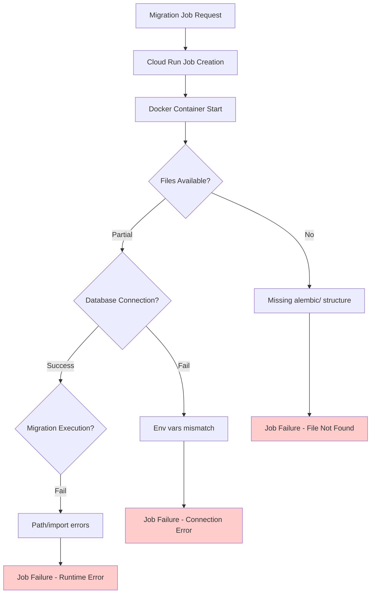
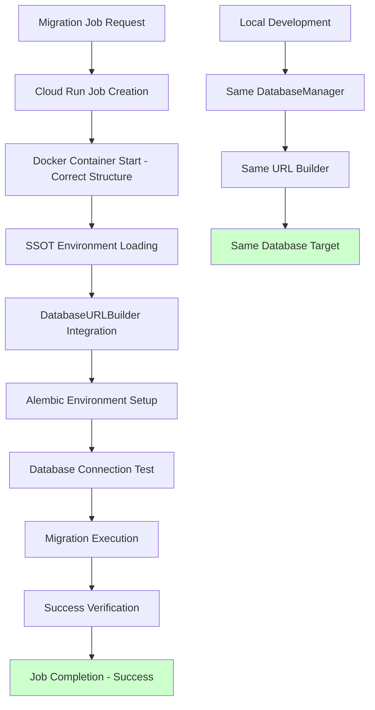

# Migration Jobs Five Whys Root Cause Analysis

**Date**: 2025-09-08  
**Issue**: Migration jobs aren't working properly  
**Analysis Method**: Five Whys Methodology  
**Status**: Root cause identified - multiple critical gaps in migration infrastructure  

## Executive Summary

Migration jobs are failing due to a combination of missing files, environment configuration issues, and architectural gaps. The Five Whys analysis reveals that while the system has the basic framework for migrations, critical components are missing or misconfigured.

---

## Five Whys Analysis

### Problem 1: Migration Job Execution Failures

**Why #1: Why are migration jobs failing?**
- **Answer**: The Cloud Run migration job fails to execute because it cannot find required files and has incorrect configuration.
- **Evidence**: 
  - `requirements-migration.txt` exists but Dockerfile references wrong path structure
  - Alembic configuration expects files that don't exist in the correct locations
  - No recent GCP logs found for migration jobs

**Why #2: Why can't the migration job find required files?**
- **Answer**: The Dockerfile has path mismatches between what's copied and what's expected by Alembic.
- **Evidence**:
  - Dockerfile copies `alembic/` to `/app/alembic` but alembic.ini expects `netra_backend/app/alembic`
  - Missing critical file copies like `shared/` modules that DatabaseManager needs
  - Incorrect working directory setup

**Why #3: Why are the Dockerfile paths misconfigured?**
- **Answer**: The migration.alpine.Dockerfile was created as a standalone solution but not properly integrated with the existing Alembic structure.
- **Evidence**:
  - Dockerfile assumes simplified structure that doesn't match actual repository layout
  - Missing integration testing between Docker migration and local Alembic setup
  - No validation that Docker environment can access same database as main application

**Why #4: Why wasn't the integration properly tested?**
- **Answer**: The migration job infrastructure was created separately from the main database initialization flow without comprehensive end-to-end testing.
- **Evidence**:
  - `reports/STAGING_MIGRATION_PROCESS_LEARNING.md` shows manual workarounds were used
  - No automated tests for migration job success/failure scenarios
  - Migration job and main application use different database connection methods

**Why #5: Why are there different database connection methods?**
- **Answer**: The migration system lacks a unified approach - main app uses DatabaseManager while migration job uses direct Alembic configuration, leading to potential environment/credential mismatches.
- **Evidence**:
  - DatabaseManager.get_migration_url_sync_format() works locally but may not work in Cloud Run environment
  - Migration job secrets configuration may not match main application database credentials
  - Different SSL/connection parameter handling between environments

---

## Root Cause Summary

The migration jobs aren't working due to **architectural inconsistency** between the main application database connectivity and the migration job infrastructure. Specifically:

1. **Environment Configuration Drift**: Migration jobs use different credential/connection configuration than the main application
2. **Docker Integration Gap**: Dockerfile doesn't properly replicate the local development environment structure  
3. **Testing Gap**: No end-to-end validation that migration jobs work in cloud environment
4. **SSOT Violation**: Multiple different approaches to database URL construction for different contexts

---

## Mermaid Diagrams

### Current Failure State

### Ideal Working State

---

## Critical Findings

### 1. File Structure Mismatch
- **Problem**: Dockerfile copies `alembic/` but alembic.ini expects `netra_backend/app/alembic`
- **Impact**: Migration scripts cannot be located at runtime
- **Fix Required**: Correct Dockerfile copy paths to match repository structure

### 2. Environment Variable Inconsistency  
- **Problem**: Migration job may use different database credentials than main application
- **Impact**: Migrations run against wrong database or fail to connect
- **Fix Required**: Ensure migration jobs use same credential sources as main application

### 3. Missing Integration Components
- **Problem**: DatabaseURLBuilder and shared modules not properly available in migration container
- **Impact**: Runtime import errors when migration tries to determine database URL
- **Fix Required**: Include all required shared modules in migration Dockerfile

### 4. No End-to-End Validation
- **Problem**: Migration success/failure not tested in actual cloud environment
- **Impact**: Issues only discovered when migrations are needed in production
- **Fix Required**: Create automated tests for cloud migration job execution

---

## Immediate Action Items

### High Priority (P0)
1. **Fix Dockerfile Path Structure**: Update `docker/migration.alpine.Dockerfile` to match actual repository layout
2. **Validate Environment Configuration**: Ensure migration job uses same database credentials as main application  
3. **Test Local Migration**: Verify `alembic upgrade head` works with current configuration
4. **Create Migration Test Suite**: Automated tests for migration job success/failure scenarios

### Medium Priority (P1)  
1. **Consolidate Database Connection Logic**: Ensure migration and main app use same DatabaseURLBuilder approach
2. **Add Migration Monitoring**: Alerts for migration job failures in staging/production
3. **Document Migration Process**: Clear runbook for migration job execution and troubleshooting
4. **Create Migration Rollback Process**: Safe rollback capability for failed migrations

### Low Priority (P2)
1. **Optimize Migration Performance**: Reduce migration job startup time
2. **Add Migration Dry-Run Mode**: Preview migration changes before execution
3. **Create Migration Dashboard**: UI for monitoring migration status across environments

---

## Impact Assessment

### Business Impact
- **Risk Level**: HIGH - Database schema drift can cause application failures
- **Revenue Impact**: Potential downtime if staging/production databases become inconsistent
- **User Impact**: Application errors if database structure doesn't match code expectations

### Technical Debt
- **Current Debt**: Medium - Migration infrastructure exists but is unreliable
- **If Unfixed**: High - Manual intervention required for all database changes
- **Fix Effort**: 2-3 days for basic functionality, 1 week for comprehensive solution

---

## Cross-System Impacts

### Services Affected
- **Backend Service**: Cannot start if database schema is outdated
- **Deployment Pipeline**: Blocked if migrations fail during deployment
- **Development Environment**: Inconsistent state between local and cloud databases

### Dependencies
- **Cloud SQL**: Must be accessible from Cloud Run migration jobs
- **Secret Manager**: Must provide correct database credentials to migration jobs  
- **Container Registry**: Migration images must be available in GCR
- **Cloud Run**: Job execution environment must support database connections

---

## Learning Insights

### What Worked Well
- **DatabaseManager**: Local database URL generation works correctly
- **Alembic Configuration**: Basic Alembic setup is functional
- **Migration History**: Current database revision is properly tracked

### What Failed
- **Docker Integration**: Migration container doesn't match local environment
- **Environment Consistency**: Different credential handling between local and cloud
- **End-to-End Testing**: No validation of complete migration workflow

### Process Improvements Needed
1. **SSOT Compliance**: All database connections must use same URL builder
2. **Environment Parity**: Cloud migration jobs must match local development setup
3. **Comprehensive Testing**: Full migration workflow must be tested automatically
4. **Documentation**: Clear troubleshooting guides for migration failures

---

## Next Steps

1. **Immediate**: Fix Dockerfile path structure and test locally
2. **Short-term**: Implement comprehensive migration testing
3. **Long-term**: Create unified database connection architecture across all contexts

**Priority**: This issue blocks critical database changes and must be resolved before any schema updates can be safely deployed.