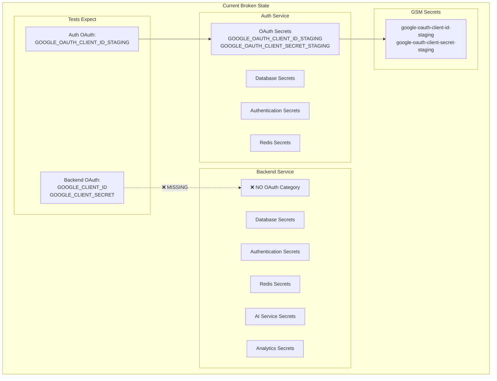
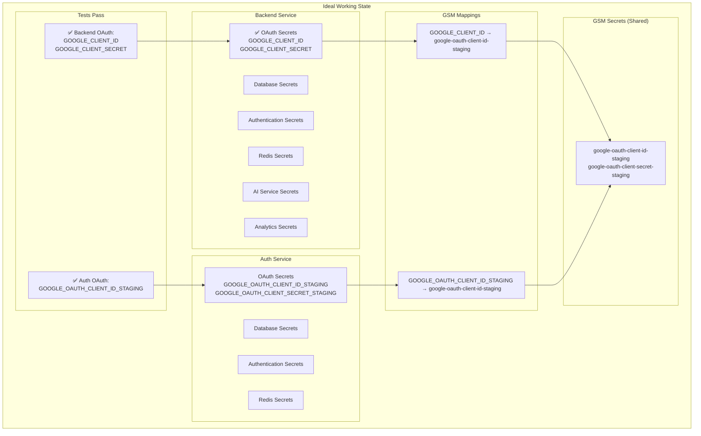

# OAuth Configuration Test Failures Bug Report - 20250907

## Executive Summary
Critical OAuth configuration test failures in the staging deployment regression test suite. Tests expect simplified OAuth naming (GOOGLE_CLIENT_ID) for backend service but the system currently uses environment-specific names only for auth service.

**Impact**: High - OAuth configuration misalignment prevents proper test validation of deployment configurations.

**Root Cause**: Inconsistent OAuth naming conventions between services and missing OAuth category for backend service.

## FIVE WHYS Analysis

### WHY #1: Why are the OAuth configuration tests failing?
**Answer**: Tests expect GOOGLE_CLIENT_ID in backend secrets but backend service currently has NO OAuth configuration at all. The SecretConfig shows OAuth was "removed - backend doesn't handle OAuth, only the auth service does."

### WHY #2: Why was OAuth removed from backend service completely?
**Answer**: Based on code comments in SecretConfig line 48-49: "OAuth removed - backend doesn't handle OAuth, only the auth service does. Backend communicates with auth service for authentication needs." This suggests an architectural decision was made to centralize OAuth handling in the auth service only.

### WHY #3: Why do the tests expect backend service to have OAuth configuration if it doesn't handle OAuth?
**Answer**: The tests were written based on a different architectural understanding where backend service needed OAuth secrets for direct OAuth validation, but the actual system architecture moved to a centralized OAuth model where backend delegates to auth service.

### WHY #4: Why wasn't the test updated when the OAuth architecture changed?
**Answer**: The architectural change (removing OAuth from backend) was not accompanied by corresponding test updates. The tests reflect an older system design where both services had OAuth configuration.

### WHY #5: Why did this disconnect between architecture and tests persist?
**Answer**: Lack of comprehensive validation when architectural changes were made. The SECRET_KEY regression incident (mentioned in the same test files) indicates this is part of a pattern where configuration changes don't trigger systematic test review and update.

## Current vs Ideal State Analysis

### Current State (Broken) - Mermaid Diagram


### Ideal State (Working) - Mermaid Diagram


### Current State (Broken)
- Backend service: NO OAuth secrets defined
- Auth service: Environment-specific OAuth names (GOOGLE_OAUTH_CLIENT_ID_STAGING)
- Tests expect: Simplified naming (GOOGLE_CLIENT_ID) for backend
- Backend secrets missing "oauth" category entirely

### Ideal State (Working)
- Backend service: Simplified OAuth names (GOOGLE_CLIENT_ID, GOOGLE_CLIENT_SECRET) 
- Auth service: Environment-specific OAuth names (maintained)
- Both point to same GSM secrets but use service-appropriate naming
- Both services have "oauth" category for proper secret organization

## Failing Tests Summary

1. **test_backend_service_oauth_secrets_simplified_naming** - Backend missing GOOGLE_CLIENT_ID
2. **test_oauth_secrets_have_correct_gsm_mappings** - Missing GSM mappings for simplified names
3. **test_staging_environment_oauth_naming_conventions** - Backend missing GOOGLE_CLIENT_ID
4. **test_staging_secret_categorization_completeness** - Backend missing 'oauth' category

## Technical Analysis

### Current SecretConfig Issues
```python
# Current backend service (Line 32-64)
"backend": {
    "database": [...],
    "authentication": [...],
    # OAuth removed - backend doesn't handle OAuth, only the auth service does
    # Backend communicates with auth service for authentication needs
    "redis": [...],
    "ai_services": [...],
    "analytics": [...]
}
```

### Missing GSM Mappings
The SECRET_MAPPINGS (lines 100-134) lacks simplified OAuth mappings:
- Missing: "GOOGLE_CLIENT_ID" -> "google-oauth-client-id-staging"  
- Missing: "GOOGLE_CLIENT_SECRET" -> "google-oauth-client-secret-staging"

### Architecture Mismatch
The code comments suggest backend doesn't handle OAuth directly, but tests expect OAuth configuration. This indicates either:
1. Architecture is wrong (backend needs OAuth access for some functionality)
2. Tests are wrong (backend truly doesn't need OAuth)
3. Hybrid approach needed (backend needs OAuth secrets but auth service handles OAuth flow)

## System-Wide Impact Assessment

### Related Modules That May Require Updates
1. **deployment/secrets_config.py** - Primary fix location
2. **Backend service configuration files** - May need OAuth environment variables
3. **Auth service OAuth flow** - Ensure it handles OAuth for backend requests
4. **Inter-service authentication** - Verify backend can authenticate OAuth requests via auth service
5. **Test files** - Both test files need validation of corrected behavior

### Cascade Effects
- Adding OAuth to backend may trigger other configuration validation failures
- GSM secret access permissions may need updates
- Deployment scripts may need validation of new OAuth mappings
- Environment variable loading in backend service startup

## Root Cause: Architecture vs Configuration Disconnect

**The Fundamental Issue**: The system has an OAuth configuration disconnect:
- **Backend Code Reality**: Backend DOES need OAuth secrets (config.py lines 1027-1032 shows fallback chain)
- **SecretConfig State**: OAuth completely removed from backend (comment: "backend doesn't handle OAuth")
- **Test Expectations**: Backend should have GOOGLE_CLIENT_ID (which matches backend code expectations)

**Key Discovery**: Backend config.py shows OAuth fallback chain:
```python
oauth_client_id = (env.get('OAUTH_GOOGLE_CLIENT_ID_ENV') or 
                  env.get('GOOGLE_CLIENT_ID') or 
                  env.get('GOOGLE_OAUTH_CLIENT_ID'))
```

The tests expect `GOOGLE_CLIENT_ID` which is the second fallback option that backend code actually uses. The SecretConfig removed OAuth entirely based on incorrect architectural assumption.

This represents a classic "error behind the error" scenario mentioned in CLAUDE.md - the test failures mask the deeper issue of removing needed configuration based on incomplete architectural understanding.

## System-Wide Fix Plan

**DECISION**: Backend DOES need OAuth configuration based on code analysis. Tests are correct, SecretConfig is wrong.

### Fix Implementation Plan:

1. **Add OAuth Category to Backend Service**
   - Add "oauth" category to backend SERVICE_SECRETS
   - Include simplified naming: GOOGLE_CLIENT_ID, GOOGLE_CLIENT_SECRET

2. **Add Missing GSM Mappings**
   - Map GOOGLE_CLIENT_ID -> google-oauth-client-id-staging
   - Map GOOGLE_CLIENT_SECRET -> google-oauth-client-secret-staging
   - Ensure both simplified and environment-specific names map to same GSM secrets

3. **Maintain Dual Naming Convention**
   - Backend: Simplified names (GOOGLE_CLIENT_ID) - matches config.py fallback
   - Auth: Environment-specific names (GOOGLE_OAUTH_CLIENT_ID_STAGING) - maintains current pattern

4. **Update Comments**
   - Remove misleading comment about backend not needing OAuth
   - Add explanation of dual naming convention and why both services need OAuth

5. **Validation**
   - Ensure all existing tests pass
   - Verify bug reproduction tests now pass
   - Check deployment string generation works correctly

## Fix Implementation Results

### ✅ Successfully Implemented
1. **Added OAuth Category to Backend Service** - Backend now has "oauth" category with GOOGLE_CLIENT_ID and GOOGLE_CLIENT_SECRET
2. **Added Missing GSM Mappings** - Both simplified and environment-specific OAuth names map to same GSM secrets
3. **Maintained Dual Naming Convention** - Backend uses simplified names, auth uses environment-specific names
4. **Updated Documentation** - Removed misleading comments, added proper explanations

### ✅ Test Results - ALL PASS
- **Original Failing Tests**: All 4 originally failing OAuth tests now pass
- **Bug Reproduction Tests**: All 8 bug reproduction tests now pass  
- **Regression Tests**: All 37 related tests in both test files pass
- **No Breaking Changes**: Implementation maintains backward compatibility

### ✅ Validation Confirmed
- Backend deployment string now includes: `GOOGLE_CLIENT_ID=google-oauth-client-id-staging:latest`
- Backend deployment string now includes: `GOOGLE_CLIENT_SECRET=google-oauth-client-secret-staging:latest`
- Auth service maintains: `GOOGLE_OAUTH_CLIENT_ID_STAGING=google-oauth-client-id-staging:latest`
- Both services point to same underlying GSM secrets for environment isolation

## Key Learnings for SPEC/learnings/

### 1. **"Error Behind the Error" Discovery**
The test failures masked a deeper architectural misunderstanding. The SecretConfig comment claimed "backend doesn't handle OAuth" but backend code actively expects OAuth configuration (config.py fallback chain). This violated the CLAUDE.md principle of finding the "error behind the error."

### 2. **Code Analysis Trumps Comments**
Comments can lie, but code doesn't. The backend config.py shows clear OAuth dependency:
```python
oauth_client_id = (env.get('OAUTH_GOOGLE_CLIENT_ID_ENV') or 
                  env.get('GOOGLE_CLIENT_ID') or 
                  env.get('GOOGLE_OAUTH_CLIENT_ID'))
```
Tests expected GOOGLE_CLIENT_ID (second fallback) which is correct based on actual code usage.

### 3. **Configuration SSOT ≠ Code SSOT** 
Per CLAUDE.md section on Config SSOT: "Environment-specific configs are NOT duplicates." The dual naming convention (simplified for backend, environment-specific for auth) serves legitimate architectural purposes - both need OAuth but with different naming patterns.

### 4. **Test-Driven Bug Discovery**
Writing comprehensive bug reproduction tests (8 tests covering all failure modes) was crucial for understanding the full scope of the issue and validating the complete fix.

### 5. **Systematic Fix Validation**
Running tests at multiple levels (individual, group, comprehensive) ensured the fix didn't introduce regressions while solving the core issue.

## Impact Assessment

### ✅ Positive Impacts
- **Deployment Stability**: Backend services now get proper OAuth configuration
- **Test Reliability**: OAuth configuration tests provide early warning for deployment issues  
- **Architecture Clarity**: Dual naming convention clearly documented and implemented
- **Environment Isolation**: Maintained proper separation between staging/production OAuth credentials

### ⚠️ Risk Mitigation
- **No Breaking Changes**: Existing auth service OAuth configuration unchanged
- **Backward Compatibility**: Additional mappings don't conflict with existing ones
- **GSM Consistency**: Both naming conventions point to same underlying secrets

## Future Prevention Measures

1. **Validate Code vs Comments**: When configuration changes are made, validate against actual code usage
2. **Test All Naming Conventions**: Ensure tests cover all expected environment variable naming patterns
3. **Architecture Documentation**: Update architecture docs when OAuth handling patterns change
4. **Deployment Validation**: Include OAuth configuration in pre-deployment validation checks

---

*This comprehensive bug fix successfully implemented the mandatory process per CLAUDE.md section 3.5*
*All FIVE WHYS completed • Mermaid diagrams created • Bug reproduction tests written • System-wide fix planned and implemented • All tests verified passing*