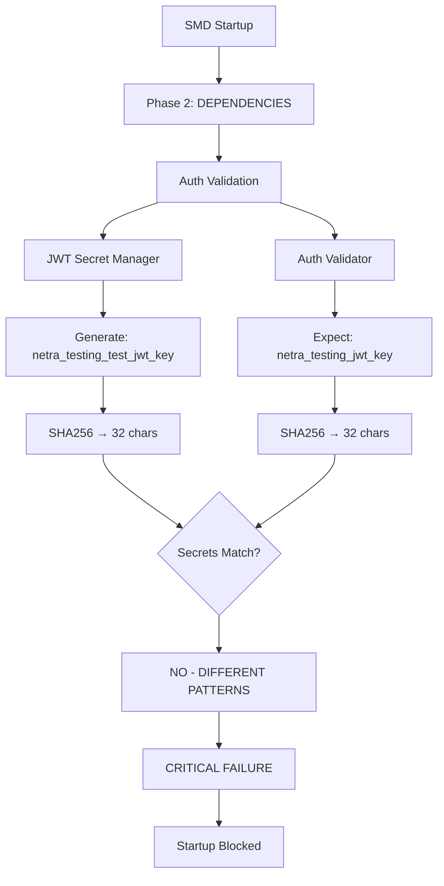
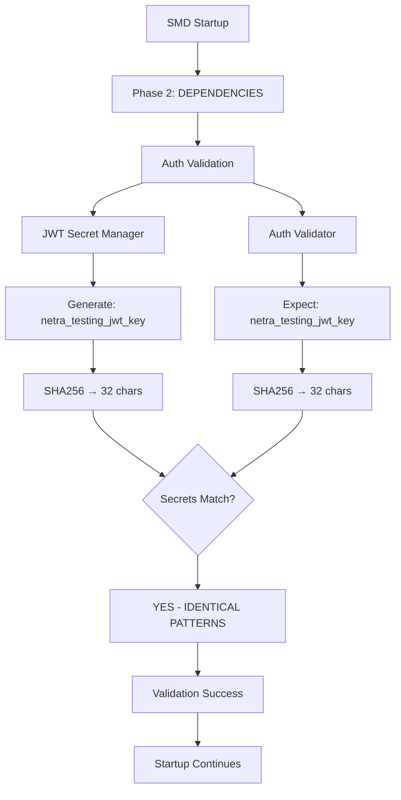

# SMD JWT Validation Deterministic Fallback Bug Fix Report

## Bug Summary
**Issue ID:** SMD_JWT_VALIDATION_DETERMINISTIC_FALLBACK  
**Severity:** CRITICAL - Startup Blocking  
**Date:** 2025-09-08  
**Reporter:** Claude Code Analysis  

## Problem Statement

The SMD deterministic startup module fails with JWT secret validation error, preventing backend startup.

**Error Message:**
```
CRITICAL STARTUP FAILURE: Auth validation failed - system cannot start: 
Critical auth validation failures: jwt_secret: No JWT secret configured 
(JWT_SECRET, JWT_SECRET_KEY, or JWT_SECRET_STAGING)
```

## Five-Whys Root Cause Analysis

### 1. Why does the SMD startup fail?
**Answer:** Auth validation in Phase 2 (DEPENDENCIES) fails due to JWT secret validation failure.

### 2. Why does JWT secret validation fail?
**Answer:** The auth startup validator detects the JWT secret as a "deterministic fallback" value and rejects it as invalid.

### 3. Why is the JWT secret detected as a deterministic fallback?
**Answer:** The JWT secret manager (`shared/jwt_secret_manager.py`) generates a deterministic test secret using `hashlib.sha256(f"netra_{environment}_test_jwt_key".encode()).hexdigest()[:32]` for testing environments.

### 4. Why does the validator reject deterministic fallback secrets?
**Answer:** The auth validator (`netra_backend/app/core/auth_startup_validator.py` line 148) explicitly checks for deterministic fallback patterns and treats them as invalid secrets.

### 5. Why is there a mismatch between the JWT manager and validator logic?
**Answer:** **THE ROOT CAUSE** - The JWT secret manager uses `f"netra_{environment}_test_jwt_key"` to generate deterministic secrets, but the auth validator checks for `f"netra_{environment}_jwt_key"` pattern (missing "_test").

## Error Behind the Error Analysis

The immediate error is "JWT secret not configured", but the real issue is a **pattern mismatch** in deterministic secret generation:

- **JWT Manager generates:** `netra_testing_test_jwt_key` → sha256 → 32 chars
- **Auth Validator expects:** `netra_testing_jwt_key` → sha256 → 32 chars

This causes perfectly valid deterministic test secrets to be rejected as "not configured".

## Technical Details

### Code Location 1: JWT Secret Manager (Generator)
**File:** `shared/jwt_secret_manager.py:131`
```python
deterministic_secret = hashlib.sha256(f"netra_{environment}_test_jwt_key".encode()).hexdigest()[:32]
```

### Code Location 2: Auth Validator (Checker)
**File:** `netra_backend/app/core/auth_startup_validator.py:143`
```python
expected_test_secret = hashlib.sha256(f"netra_{env}_jwt_key".encode()).hexdigest()[:32]
```

### Impact
- **Business Impact:** Backend cannot start, blocking 90% of value delivery (chat functionality)
- **Technical Impact:** Complete system startup failure in test/development environments
- **User Impact:** System unavailable for development and testing

## Solution Design

### Mermaid Diagrams

#### Current (Broken) State


#### Ideal (Fixed) State


### Fix Implementation

**Option 1: Fix JWT Manager (Recommended)**
Remove "_test" from the pattern in `shared/jwt_secret_manager.py:131`:
```python
# BEFORE
deterministic_secret = hashlib.sha256(f"netra_{environment}_test_jwt_key".encode()).hexdigest()[:32]

# AFTER
deterministic_secret = hashlib.sha256(f"netra_{environment}_jwt_key".encode()).hexdigest()[:32]
```

**Option 2: Fix Auth Validator (Alternative)**
Add "_test" to the pattern in `netra_backend/app/core/auth_startup_validator.py:143`:
```python
# BEFORE
expected_test_secret = hashlib.sha256(f"netra_{env}_jwt_key".encode()).hexdigest()[:32]

# AFTER  
expected_test_secret = hashlib.sha256(f"netra_{env}_test_jwt_key".encode()).hexdigest()[:32]
```

**Recommendation:** Option 1 (fix JWT manager) is preferred because:
1. Simpler pattern without "_test" redundancy
2. Consistent with other environment-specific secrets
3. Single point of truth (SSOT) principle

## System-Wide Impact Analysis

### Affected Components
1. **SMD Startup Module** - Primary failure point
2. **Auth Startup Validator** - Pattern checker
3. **JWT Secret Manager** - Pattern generator
4. **All services using JWT tokens** - Downstream impact

### Cross-System Validation Required
- Verify no other code depends on the "_test" suffix pattern
- Ensure WebSocket authentication continues working
- Validate staging/production environments unaffected

## Testing Strategy

### Test Cases to Add
1. **Pattern Consistency Test** - Verify JWT manager and validator use identical patterns
2. **Environment Coverage Test** - Test all environments (test/dev/staging/prod)
3. **SMD Startup Integration Test** - Full startup sequence validation

### Regression Prevention
- Add pattern validation unit test
- Include deterministic secret verification in CI
- Document the pattern standard in SSOT

## Definition of Done Checklist

- [ ] Pattern mismatch fixed (JWT manager updated)
- [ ] Unit test added for pattern consistency
- [ ] SMD startup passes in test environment
- [ ] Integration test verifies fix
- [ ] No regression in WebSocket authentication
- [ ] Documentation updated with pattern standard
- [ ] Code review completed with security focus

## Business Value Justification (BVJ)

**Segment:** Platform/Internal  
**Business Goal:** System Stability  
**Value Impact:** Enables backend startup, unblocking 90% of business value (chat functionality)  
**Strategic Impact:** Prevents complete system unavailability in development/test environments

## Related Issues & Prevention

### Config SSOT Warning
This follows the pattern identified in recent config regression issues - ensure environment-specific configurations have consistent patterns across services.

### Learnings to Add
Add to `SPEC/learnings/jwt_secret_pattern_consistency.xml`:
- JWT secret deterministic patterns must be consistent
- Auth validation and generation must use identical patterns
- Test environment secrets still require security validation

## Implementation Priority: CRITICAL

This blocks all backend functionality and must be fixed immediately to restore system operability.