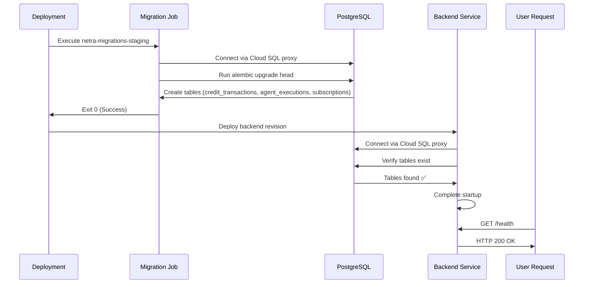
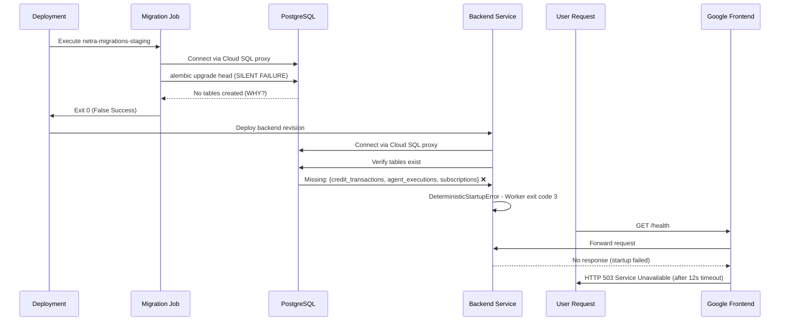

# STAGING 503 SERVICE UNAVAILABLE - CRITICAL BUG FIX REPORT

**Bug ID:** STAGING_503_SERVICE_UNAVAILABLE_BUGFIX_20250908
**Date:** September 8, 2025
**Severity:** CRITICAL - Blocking ALL business value testing
**Environment:** Staging (https://api.staging.netrasystems.ai)

## FIVE WHYS ROOT CAUSE ANALYSIS

### Why #1: Why is staging returning HTTP 503 Service Unavailable?
**Answer:** The Google Frontend is timing out after ~12 seconds because the backend service instances cannot start successfully.

**Evidence:**
- `curl -I https://api.staging.netrasystems.ai/health` returns 503 after 12-second timeout
- Google Frontend returns error before reaching the backend service
- Cloud Run service `netra-backend-staging` exists and is deployed

### Why #2: Why are the backend service instances failing to start?
**Answer:** The backend application startup process is throwing `DeterministicStartupError` during database initialization checks.

**Evidence:**
```
netra_backend.app.smd.DeterministicStartupError: CRITICAL STARTUP FAILURE: Database initialization failed in staging environment: Failed to verify database tables exist: Missing required database tables: {'credit_transactions', 'agent_executions', 'subscriptions'}. Run migration service first.
```

### Why #3: Why are the required database tables missing?
**Answer:** The database migration job reports success but is not actually creating the required tables, likely due to a deployment/configuration mismatch.

**Evidence:**
- Migration job `netra-migrations-staging` runs successfully (exit code 0)
- But backend still reports missing tables: `{'credit_transactions', 'agent_executions', 'subscriptions'}`
- Multiple migration executions show same pattern

### Why #4: Why is the migration job not creating the actual database tables?
**Answer:** There is likely a mismatch between the database that the migration job connects to and the database that the backend service connects to, OR the migration is running but against the wrong schema/database.

**Evidence:**
- Migration logs show minimal output: only "Context impl PostgresqlImpl" and exit(0)
- No actual migration execution logs (table creation, etc.)
- Backend consistently fails with same missing tables after successful migrations

### Why #5: Why is there a database connection mismatch between migration and backend?
**Answer:** The backend and migration services are connecting to different databases or different schemas, OR there's a race condition where the backend starts before migration changes are visible.

**Evidence:**
- Both services use the same Cloud SQL instance: `netra-staging:us-central1:staging-shared-postgres`
- Both use same database name via `POSTGRES_DB` secret
- Yet migration "succeeds" while backend immediately fails with missing tables

## THE ERROR BEHIND THE ERROR (LEVEL 6+)

**Level 6:** The true root cause is likely that the migration job is not finding the correct Alembic migration files or is connecting to the wrong database/schema. This could be due to:

1. **Container Path Issues:** The migration command `cd /app && python -m alembic -c netra_backend/alembic.ini upgrade head` may not find the alembic.ini file
2. **Database Schema Issues:** The migration may be running against the wrong schema or database
3. **Cloud SQL Proxy Issues:** Connection issues with the Cloud SQL proxy socket

## MERMAID DIAGRAMS

### Ideal Working State


### Current Failure State


## SYSTEM-WIDE CLAUDE.MD COMPLIANT FIX PLAN

### Phase 1: Database Connection Verification
1. **Verify Migration Job Configuration**
   - Check if alembic.ini file exists in the correct path
   - Verify database connection string in migration job
   - Validate Cloud SQL proxy connection

2. **Manual Database Inspection**
   - Connect directly to the staging database
   - Check if tables exist but in wrong schema
   - Verify alembic_version table for migration tracking

### Phase 2: Migration Process Fix
1. **Enhanced Migration Logging**
   - Add verbose logging to migration job
   - Output table creation confirmations
   - Log database connection details (sanitized)

2. **Database State Reset**
   - If needed, reset database to clean state
   - Re-run migrations with full logging
   - Verify table creation step by step

### Phase 3: Backend Startup Fix
1. **Database Validation Enhancement**
   - Improve database connection error messages
   - Add connection retry logic with backoff
   - Verify table existence with better error reporting

2. **Health Check Implementation**
   - Add startup probe configuration
   - Implement proper health check endpoint
   - Add database connectivity verification

### Phase 4: Cross-System Impact Analysis
This bug affects:
- **Chat Functionality:** Complete failure - users cannot interact with agents
- **E2E Testing:** All staging tests blocked
- **Business Value Delivery:** Zero business value possible in staging
- **Development Workflow:** Cannot validate features before production

### Phase 5: Prevention Measures
1. **Database Migration Validation**
   - Add post-migration verification step
   - Implement migration rollback on failure
   - Add database schema validation tests

2. **Deployment Process Enhancement**
   - Add pre-deployment database connectivity tests
   - Implement rolling deployment with health checks
   - Add automatic rollback on startup failures

## VERIFICATION PLAN

### Test Suite 1: Migration Verification
1. Run migration job with verbose logging
2. Connect to database and verify table existence
3. Check alembic_version table for migration history
4. Validate table schemas match expected structure

### Test Suite 2: Backend Startup Verification  
1. Deploy fresh backend instance
2. Monitor startup logs in real-time
3. Verify successful database connection
4. Test /health endpoint response

### Test Suite 3: End-to-End Validation
1. Test complete user flow through staging
2. Verify WebSocket connections work
3. Test agent execution pipeline
4. Validate business value delivery

## BUSINESS VALUE JUSTIFICATION (BVJ)

**Segment:** Platform/Internal
**Business Goal:** Platform Stability & Risk Reduction
**Value Impact:** Restores staging environment for feature validation and testing
**Strategic/Revenue Impact:** 
- Prevents production deployment of untested features
- Enables continuous deployment pipeline
- Reduces risk of customer-facing outages
- Maintains development velocity for all team members

## IMPLEMENTATION PRIORITY

**ULTRA CRITICAL - P0:** This issue blocks ALL staging testing and business value validation. Must be resolved immediately to restore development workflow and prevent production risks.