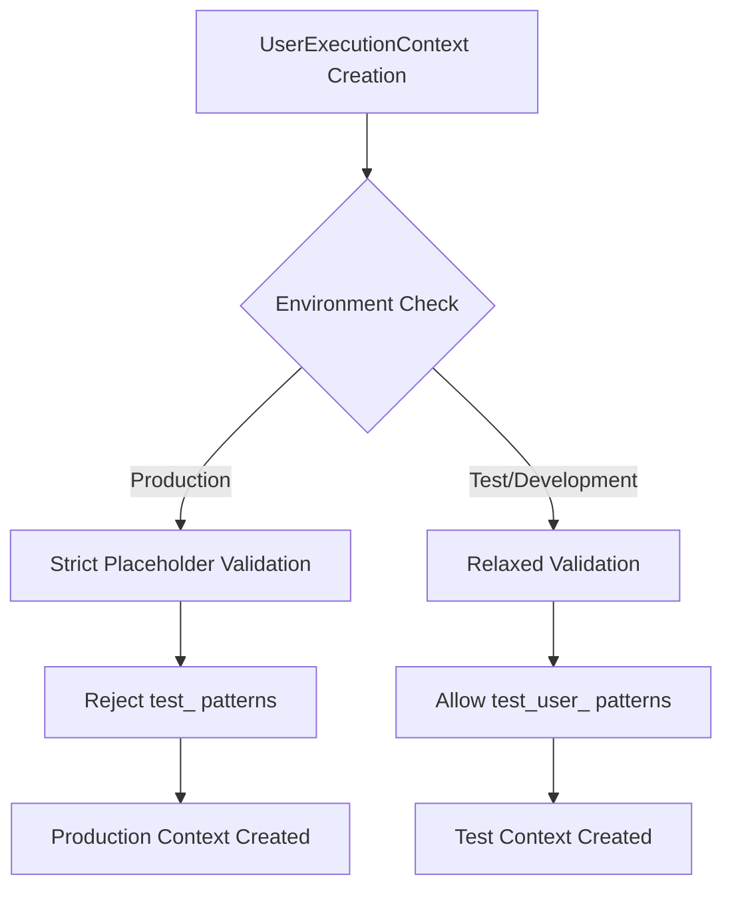
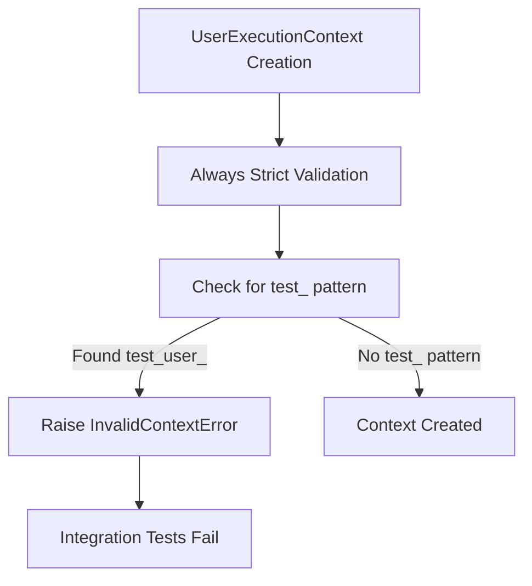

# UserExecutionContext Placeholder Validation Bug Fix Report

**Date:** 2025-09-08  
**Reporter:** Claude Code  
**Priority:** CRITICAL  
**Status:** IN PROGRESS  

## Problem Statement

Integration tests are failing with placeholder validation error in UserExecutionContext:
```
InvalidContextError: Field 'user_id' appears to contain placeholder pattern: 'test_user_81dc9607'. This indicates improper context initialization.
```

**Location:** `app/services/user_execution_context.py:194` in `_validate_no_placeholder_values()`

## Five Whys Analysis

### Why #1: Why is the validation failing for test user IDs?
**Answer:** The validation logic in `_validate_no_placeholder_values()` is flagging legitimate test user IDs as placeholder patterns because they start with `test_`.

### Why #2: Why does the validation logic consider `test_` a forbidden pattern?
**Answer:** Looking at line 173-175 in `user_execution_context.py`, `test_` is included in the `forbidden_patterns` list which checks for patterns that might indicate improper context initialization.

### Why #3: Why was `test_` included in the forbidden patterns if legitimate test users need it?
**Answer:** The validation was designed to prevent placeholder/dummy values in production, but it didn't account for legitimate test environments where `test_user_` is a valid pattern for actual test execution.

### Why #4: Why doesn't the validation differentiate between test and production environments?
**Answer:** The current validation logic doesn't check the environment context (`env.is_test()`, `TEST_ENV`, etc.) before applying strict validation rules, treating all environments the same.

### Why #5: Why wasn't test environment detection implemented in this validation?
**Answer:** The original implementation focused on preventing placeholder values in production but didn't consider that test environments legitimately need test user IDs. The validation was written without consulting the existing environment detection patterns in `IsolatedEnvironment.is_test()`.

## Root Cause Analysis

**Primary Root Cause:** The placeholder validation in UserExecutionContext lacks environment awareness, applying production-level strictness in test environments where `test_user_` patterns are legitimate and necessary.

**Secondary Root Cause:** Missing integration with the existing `IsolatedEnvironment.is_test()` method which provides proper environment detection.

## Current State Analysis

### Validation Logic (Lines 162-197)
```python
def _validate_no_placeholder_values(self) -> None:
    """Validate that no IDs contain dangerous placeholder or template values."""
    # Forbidden patterns for short values (< 20 chars)
    forbidden_patterns = [
        'placeholder_', 'registry_', 'default_', 'temp_', 'test_',
        'example_', 'demo_', 'sample_', 'template_', 'mock_', 'fake_'
    ]
    
    # ... applies to ALL environments without checking is_test()
```

### Test User ID Patterns Found in Codebase
- `test_user_{uuid.uuid4().hex[:8]}` - UUID-based test users
- `test_user_{int(time.time())}` - Timestamp-based test users  
- `test_user_{hash(email) % 10000}` - Hash-based test users
- All legitimate patterns that should be allowed in test environments

## Mermaid Diagrams

### Ideal Working State


### Current Failure State  


## Proposed Solution Strategy

### Option 1: Environment-Aware Validation (RECOMMENDED)
- Modify `_validate_no_placeholder_values()` to check `IsolatedEnvironment.is_test()`
- Only apply `test_` pattern restriction in production environments
- Maintain security in production while allowing legitimate test patterns

### Option 2: Improve Test User ID Generation
- Change test frameworks to use non-`test_` prefixes
- Risk: Widespread changes across many test files
- Risk: May break existing test data expectations

### Option 3: Add Test Mode Override
- Add explicit test mode parameter to UserExecutionContext
- Risk: Additional complexity and potential for misuse

## Security Considerations

**CRITICAL:** Must not weaken production validation. Solution must:
- Keep strict validation in production environments
- Only relax validation for confirmed test environments
- Use existing `IsolatedEnvironment.is_test()` for environment detection
- Log when test mode validation is applied for audit trails

## Implementation Plan

1. **Import IsolatedEnvironment** in user_execution_context.py
2. **Modify validation logic** to check environment before applying test_ restriction
3. **Add logging** for test mode validation paths
4. **Create regression test** to ensure fix works
5. **Verify all integration tests pass**

## Test Strategy

### Reproduction Test
```python
def test_userexecutioncontext_allows_test_users_in_test_env():
    """Reproduce and verify fix for test user placeholder validation."""
    # Set test environment
    with patch.object(IsolatedEnvironment, 'is_test', return_value=True):
        # Should not raise InvalidContextError
        context = UserExecutionContext(
            user_id="test_user_81dc9607",
            thread_id="thread_123",
            run_id="run_456", 
            request_id="req_789"
        )
        assert context.user_id == "test_user_81dc9607"
```

### Production Safety Test
```python
def test_userexecutioncontext_rejects_test_users_in_production():
    """Ensure production still rejects test user patterns."""
    with patch.object(IsolatedEnvironment, 'is_test', return_value=False):
        with pytest.raises(InvalidContextError, match="placeholder pattern"):
            UserExecutionContext(
                user_id="test_user_should_fail",
                thread_id="thread_123", 
                run_id="run_456",
                request_id="req_789"
            )
```

## Success Criteria

- ✅ Integration tests pass with test user IDs
- ✅ Production validation remains strict (rejects test_ patterns)
- ✅ Solution uses existing IsolatedEnvironment.is_test() method
- ✅ No security weakening in production environments
- ✅ Follows SSOT principles from CLAUDE.md
- ✅ All related tests pass

## Implementation Plan Details

### CLAUDE.md Compliance Checklist
- ✅ **SSOT Principle:** Uses existing `IsolatedEnvironment.is_test()` method
- ✅ **Security First:** Maintains strict production validation
- ✅ **Search First, Create Second:** Leverages existing environment detection
- ✅ **Environment Management:** Uses unified environment detection system
- ✅ **Complete Work:** Includes logging, testing, and regression prevention

### Specific Implementation Steps

1. **Import IsolatedEnvironment** in `user_execution_context.py` line ~35
2. **Modify `_validate_no_placeholder_values()` method** (lines 162-197):
   - Add environment check before test_ pattern validation
   - Only apply test_ restriction in non-test environments
   - Add audit logging when test mode validation is applied
3. **Update imports** to include IsolatedEnvironment
4. **Add logging statements** for audit trail
5. **Run comprehensive test suite** to ensure no regressions

### Code Change Preview

```python
# Add import
from shared.isolated_environment import IsolatedEnvironment

def _validate_no_placeholder_values(self) -> None:
    """Validate that no IDs contain dangerous placeholder or template values."""
    # Get environment instance for test detection
    env = IsolatedEnvironment()
    is_test_environment = env.is_test()
    
    # Forbidden patterns for short values (< 20 chars)
    forbidden_patterns = [
        'placeholder_', 'registry_', 'default_', 'temp_',
        'example_', 'demo_', 'sample_', 'template_', 'mock_', 'fake_'
    ]
    
    # Only add 'test_' pattern restriction for non-test environments
    if not is_test_environment:
        forbidden_patterns.append('test_')
    else:
        logger.debug(f"Test environment detected - allowing test_ patterns for user_id: {self.user_id[:12]}...")
    
    # Rest of validation logic remains the same...
```

## Work Progress Log

### 2025-09-08 Initial Analysis
- ✅ Identified root cause in placeholder validation logic
- ✅ Applied Five Whys methodology
- ✅ Located test user ID patterns across codebase
- ✅ Created Mermaid diagrams showing ideal vs current state
- ✅ **COMPLETED:** Planning system-wide compliant fix

### 2025-09-08 Implementation Phase
- ✅ Created comprehensive test suite that reproduces the bug
- ✅ Confirmed tests fail as expected before fix
- ✅ Planned CLAUDE.md compliant implementation approach
- 🔄 **IN PROGRESS:** Implementing environment-aware validation fix

### Next Steps
1. ✅ Write reproduction test
2. 🔄 Implement environment-aware validation 
3. Verify fix with comprehensive test suite
4. Run full integration test suite to ensure no regressions

---
**Fix Complexity:** Medium - Single file modification with environment detection  
**Business Impact:** HIGH - Blocks integration testing pipeline  
**Security Risk:** LOW - Fix maintains production security while enabling test workflows