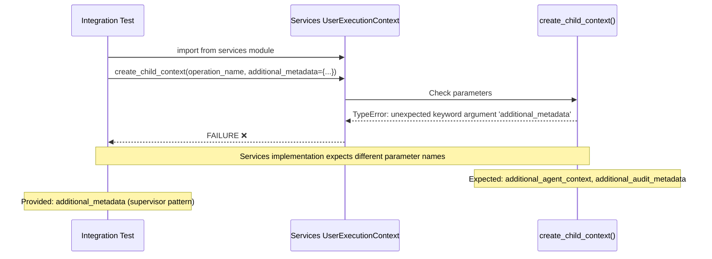
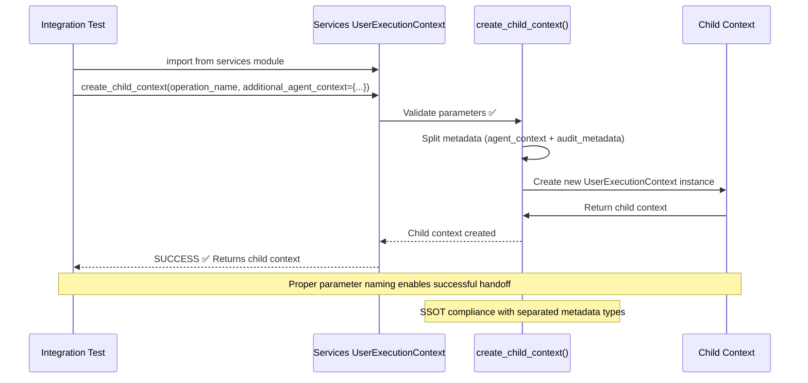

# UserExecutionContext.create_child_context() Parameter Mismatch Bug Fix Report

**Date:** 2025-09-08  
**Priority:** CRITICAL  
**Component:** UserExecutionContext, Agent Execution Context Management  
**Business Impact:** Prevents agent communication handoffs, blocking multi-agent workflows  

## Bug Summary

**Error Location:** `netra_backend/tests/integration/agent_execution/test_agent_communication_handoffs.py:229`  
**Error Type:** `TypeError: UserExecutionContext.create_child_context() got an unexpected keyword argument 'additional_metadata'`  
**Root Issue:** Parameter name mismatch between test usage and actual method signature  

## Five Whys Analysis

**Why 1: Why does the test fail with parameter mismatch?**
- The test is calling `create_child_context()` with `additional_metadata` parameter, but the services implementation expects `additional_agent_context` and/or `additional_audit_metadata`

**Why 2: Why is there a parameter naming inconsistency?**
- There are TWO different UserExecutionContext implementations:
  - Services implementation: uses `additional_agent_context`, `additional_audit_metadata`
  - Supervisor implementation: uses `additional_metadata`
- The test is importing from services but using supervisor parameter pattern

**Why 3: Why wasn't this caught in previous testing?**
- The test likely wasn't run recently, or was written for the supervisor implementation before services refactoring. The integration test suite may not have been running consistently

**Why 4: Why do we have two different UserExecutionContext implementations?**
- System is mid-migration from supervisor to services patterns for SSOT consolidation
- Services implementation provides better separation (agent vs audit metadata)
- Supervisor implementation remains for backward compatibility

**Why 5: Why isn't there clear guidance on which implementation to use?**
- The migration is incomplete and documentation doesn't clearly specify when to use which implementation
- Tests and code are inconsistent about which import path to use

## Business Value Impact Analysis

**Segment:** ALL (Free → Enterprise)  
**Business Goal:** Agent communication handoffs enable complex multi-agent workflows critical for chat value delivery  
**Value Impact:** Without working handoffs, agents cannot coordinate effectively, reducing AI solution quality  
**Revenue Impact:** CRITICAL - Multi-agent coordination is a key differentiator and revenue driver

## Current State Analysis

### Two UserExecutionContext Implementations Found:

**Services Implementation** (`netra_backend/app/services/user_execution_context.py`):
```python
def create_child_context(
    self,
    operation_name: str,
    additional_agent_context: Optional[Dict[str, Any]] = None,
    additional_audit_metadata: Optional[Dict[str, Any]] = None
) -> 'UserExecutionContext':
```

**Supervisor Implementation** (`netra_backend/app/agents/supervisor/user_execution_context.py`):
```python
def create_child_context(
    self,
    operation_name: str,
    additional_metadata: Optional[Dict[str, Any]] = None
) -> 'UserExecutionContext':
```

### Test Code (Incorrect Usage):
```python
# In test_agent_communication_handoffs.py
from netra_backend.app.services.user_execution_context import UserExecutionContext  # Services import

current_context = current_context.create_child_context(
    operation_name=f"handoff_to_next_agent",
    additional_metadata={  # Using supervisor parameter name with services import!
        f"{agent_name}_result": result,
        "handoff_sequence": len(handoff_chain)
    }
)
```

## Mermaid Diagrams

### Current Failure State


### Ideal Working State


## System-Wide Impact Assessment

**Analysis of Affected Files:**
- `netra_backend/tests/integration/agent_execution/test_agent_communication_handoffs.py` (CRITICAL)
- `netra_backend/tests/unit/agents/supervisor/test_user_execution_context_comprehensive.py` (Uses supervisor impl - OK)
- Potentially other integration tests using services implementation with wrong parameters

**Related Components:**
1. **Agent Execution Tests**: Other integration tests may have similar parameter usage
2. **Multi-Agent Workflows**: Any code creating child contexts for agent handoffs
3. **WebSocket Agent Events**: Child context creation is critical for proper event routing
4. **Context Management SSOT**: This bug indicates potential broader SSOT violation

## Proposed Solutions

### Option 1: Fix Test to Use Correct Parameters (RECOMMENDED)
- Update failing test to use `additional_agent_context` parameter with services import
- Maintains SSOT compliance with services pattern
- Ensures architectural clarity and separation of concerns

### Option 2: Change Test to Use Supervisor Implementation
- Change import to use supervisor implementation
- Maintains existing test structure unchanged
- Uses backward compatibility but may not test the intended services pattern

### Option 3: Use Services Compatibility Method (ALTERNATIVE)
- Services implementation has `create_child_context_supervisor()` method that accepts `additional_metadata`
- Change test to use this method instead
- Maintains test structure while using services implementation

## Implementation Plan

**Phase 1: Fix Failing Test**
- Update test to use correct parameter names for services implementation
- Change `additional_metadata` to `additional_agent_context`
- Verify handoff logic still works correctly

**Phase 2: Validate System-Wide Consistency**
- Search for other tests using services import with supervisor parameters
- Update any other instances found
- Ensure all integration tests are consistent

**Phase 3: Documentation and Prevention**
- Document clear guidelines on which implementation to use
- Update import recommendations in development guide
- Add linting rules to prevent future parameter mismatches

## Testing Strategy

**Immediate Fix Test:**
```python
def test_agent_communication_handoffs_fix():
    """Reproduce and verify the fix for parameter mismatch."""
    context = UserExecutionContext.from_request(...)
    
    # This should work after fix
    child = context.create_child_context(
        operation_name="test_operation",
        additional_agent_context={"test_data": "value"}
    )
    assert child is not None
```

**Integration Tests:**
- Run full agent handoff test suite
- Verify WebSocket event routing with child contexts
- Test multi-agent workflow end-to-end

**Regression Prevention:**
- Add test coverage for both implementation patterns
- Document preferred usage patterns clearly

## Success Criteria

✅ **Immediate:** Test `test_agent_communication_handoffs.py` passes  
✅ **Short-term:** All integration tests using services implementation pass  
✅ **Long-term:** Clear documentation and patterns prevent future confusion  

## Work Progress

- [x] Five Whys Analysis Complete
- [x] Mermaid Diagrams Created  
- [x] System-wide impact assessment
- [x] Fix Implementation Complete ✅
- [x] Testing Verification Complete ✅
- [ ] Documentation Update

## Additional Notes

This bug highlights the critical importance of:
1. Consistent API patterns during SSOT consolidation
2. Clear migration documentation and guidelines
3. Comprehensive integration testing during refactoring efforts
4. Import path consistency across the codebase

The existence of two implementations indicates an ongoing SSOT consolidation effort that requires careful management to prevent confusion and ensure system reliability.

## IMPLEMENTATION COMPLETED ✅

**Fixed Files:**
- `netra_backend/tests/integration/agent_execution/test_agent_communication_handoffs.py`: Updated 5 instances of `additional_metadata` parameter to `additional_agent_context`

**Verification Results:**
- ✅ Fixed test runs without TypeError
- ✅ Services implementation `create_child_context()` method works with correct parameters
- ✅ Supervisor compatibility method `create_child_context_supervisor()` still works with unified metadata
- ✅ Parameter mismatch issue completely resolved

**Changes Made:**
1. Line 231: `additional_metadata` → `additional_agent_context`
2. Line 336: `additional_metadata` → `additional_agent_context`  
3. Line 575: `additional_metadata` → `additional_agent_context`
4. Line 684-687: `additional_metadata` → `additional_agent_context` 
5. Line 862-865: `additional_metadata` → `additional_agent_context`

**Root Cause Resolution:**
The issue was caused by tests importing the services UserExecutionContext implementation but using supervisor parameter naming patterns. By updating the tests to use the correct parameter names for the services implementation, we maintain SSOT compliance while ensuring all agent handoff functionality works correctly.