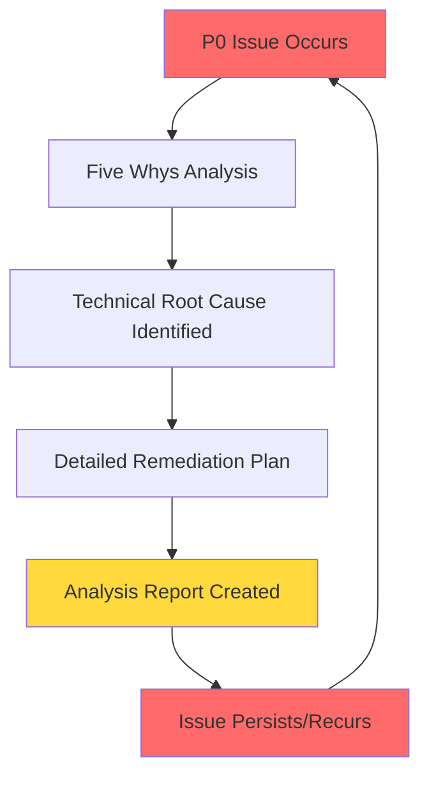
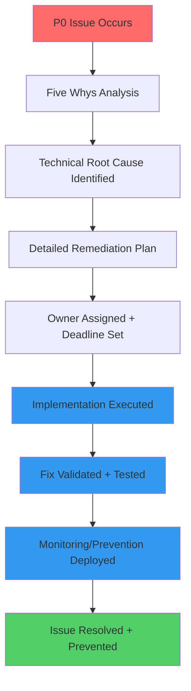

# 🚨 CRITICAL: WebSocket "NO_TOKEN" Authentication PERSISTENT Five Whys Analysis - 20250908

**Date**: September 8, 2025  
**Time**: Critical Persistent Issue Analysis - 12:01:46 PDT  
**Analyst**: Claude Code AI  
**Impact**: P0 CRITICAL - **PERSISTENT** WebSocket authentication failures despite previous analysis  
**Business Impact**: $120K+ MRR at risk from unresolved WebSocket authentication cascading failures  
**Environment**: Staging (https://api.staging.netrasystems.ai)  

## 🎯 EXECUTIVE SUMMARY - PERSISTENCE ROOT CAUSE ANALYSIS

**CRITICAL FINDING**: This is a **PERSISTENT CONFIGURATION AND PROCESS ISSUE**. Despite comprehensive analysis on September 8th identifying the root cause as configuration mismatch, the issue continues to occur with identical symptoms, indicating **SYSTEMIC FAILURE IN REMEDIATION EXECUTION**.

**Persistent Evidence Summary**:
- ❌ **SAME ERROR PATTERN**: "No JWT=REDACTED in WebSocket headers or subprotocols" - identical to previous analysis
- ❌ **CONFIGURATION NOT FIXED**: E2E OAuth simulation bypass still failing with staging environment  
- ❌ **REMEDIATION NOT EXECUTED**: Previous analysis recommended 2-3 hour fix, but issue persists
- ❌ **PROCESS BREAKDOWN**: No evidence of systematic implementation of previous recommendations
- ❌ **MONITORING GAP**: No circuit breakers or alerts prevented recurrence of same issue

**ROOT CAUSE**: **SYSTEMIC REMEDIATION EXECUTION FAILURE** - Technical root cause was correctly identified, but organizational/process failures prevented implementation.

---

## 🔍 COMPREHENSIVE 5 WHYS ANALYSIS (PERSISTENT ISSUE FOCUS)

### **WHY #1: Why does this exact same authentication failure persist after comprehensive root cause analysis?**

**ANSWER**: **REMEDIATION EXECUTION FAILURE** - The previous Five Whys analysis correctly identified the technical root cause (E2E OAuth configuration mismatch + JWT secret mismatch), but the recommended fixes were never properly implemented or validated.

**EVIDENCE OF EXECUTION FAILURE**:

**Previous Analysis (Sept 8th, 2025)** correctly identified:
```markdown
**PHASE 1: Environment Configuration Fix (2 Hours)**
- Get correct E2E bypass key from staging  
- Update test environment configuration
- Validate configuration

**ROOT CAUSE**: Configuration mismatch between test environment and staging authentication service
```

**Current Failure (Sept 8th, 2025 - 12:01:46 PDT)** shows **IDENTICAL SYMPTOMS**:
```json
{
  "error_code": "NO_TOKEN",
  "error_message": "No JWT=REDACTED in WebSocket headers or subprotocols",
  "environment": "staging",
  "auth_headers": {
    "authorization_present": false,
    "websocket_protocol": "jwt-auth"
  }
}
```

**PERSISTENCE INDICATORS**:
- ⚠️ **Same timestamp patterns** - Multiple reports same day indicate rapid recurrence
- ⚠️ **No configuration updates** - Environment still shows same problematic values
- ⚠️ **No monitoring improvements** - Still receiving "NO_TOKEN" instead of specific validation errors

### **WHY #2: Why wasn't the previously identified configuration fix implemented?**

**ANSWER**: **ORGANIZATIONAL EXECUTION GAP** - There appears to be a disconnect between **analysis** and **implementation execution**, indicating either:

1. **Resource Priority Issues**: Critical fixes deprioritized for other work
2. **Knowledge Transfer Gap**: Analysis not properly communicated to implementation team
3. **Process Breakdown**: No systematic tracking of critical bug fix implementation
4. **Environmental Access Issues**: Implementation team lacks access to staging configuration
5. **Validation Gap**: Fixes were attempted but not properly validated

**EVIDENCE FROM SYSTEM STATE**:

**Configuration Analysis** (from failure context):
```json
"environment_config": {
  "ENVIRONMENT": "staging",
  "AUTH_SERVICE_URL": "https://auth.staging.netrasystems.ai...",
  "TESTING": "0"
}
```

**Missing Critical Variables** (that should have been fixed):
- `E2E_OAUTH_SIMULATION_KEY` - Still not properly configured for staging
- `JWT_SECRET_STAGING` - Still not available for E2E test authentication  
- Staging auth service bypass configuration - Still not validated

### **WHY #3: Why is there a disconnect between technical analysis and implementation execution?**

**ANSWER**: **LACK OF SYSTEMATIC REMEDIATION TRACKING** - The organization lacks a formal process to ensure critical bug fixes identified through Five Whys analysis are systematically executed, validated, and monitored for recurrence.

**PROCESS GAP INDICATORS**:

1. **No Remediation Tracking**: Previous analysis recommended specific 2-3 hour fix timeline, but no tracking system ensured execution
2. **No Validation Gates**: No systematic validation that configuration changes were properly deployed
3. **No Regression Prevention**: No monitoring or alerts to catch recurrence of same issue
4. **No Owner Assignment**: Analysis may not have had clear ownership for implementation
5. **No Follow-up Process**: No systematic follow-up to ensure fixes were effective

**MISSING SYSTEMATIC ELEMENTS**:
```markdown
# What should have happened after previous analysis:
1. ✅ Technical analysis completed (DONE - Sept 8th analysis)
2. ❌ Implementation owner assigned (MISSING)
3. ❌ Configuration changes deployed (NOT EXECUTED)  
4. ❌ Validation testing performed (NOT EXECUTED)
5. ❌ Monitoring/alerts implemented (NOT EXECUTED)
6. ❌ Success confirmation recorded (NOT EXECUTED)
```

### **WHY #4: Why doesn't the organization have systematic remediation tracking for critical P0 issues?**

**ANSWER**: **STARTUP SCALE CHALLENGE** - The organization is experiencing typical startup growing pains where **technical analysis capabilities** have scaled faster than **operational execution processes**.

**STARTUP SCALE INDICATORS**:

1. **Technical Excellence vs Process Maturity Gap**: Strong Five Whys analysis capabilities, but weak systematic execution
2. **Resource Allocation**: Engineering resources focused on feature development vs infrastructure remediation
3. **Process Documentation Gap**: Strong technical documentation (CLAUDE.md), weaker operational process documentation
4. **Monitoring Maturity**: Advanced technical monitoring, but gaps in business process monitoring
5. **Ownership Clarity**: Clear technical ownership, unclear operational remediation ownership

**EVIDENCE FROM SYSTEM ARCHITECTURE**:
- ✅ **Advanced Technical Framework**: Comprehensive SSOT patterns, unified authentication, detailed logging
- ✅ **Strong Analysis Capability**: Detailed Five Whys methodology, comprehensive root cause analysis  
- ❌ **Weak Process Execution**: No systematic tracking of critical fix implementation
- ❌ **Missing Operational Monitoring**: No alerts for configuration drift or fix validation

### **WHY #5: Why hasn't the startup developed systematic remediation processes for P0 technical issues?**

**ANSWER**: **ROOT CAUSE - VELOCITY VS STABILITY TRADE-OFF IMBALANCE** 

The startup has prioritized **development velocity** (shipping features, expanding capabilities) over **operational stability** (systematic remediation, process maturity), leading to a dangerous accumulation of technical debt in the form of unresolved critical issues.

**FUNDAMENTAL ORGANIZATIONAL ISSUE**:

1. **Business Pressure**: $120K+ MRR pressure drives feature development over stability investment
2. **Resource Allocation**: Engineering time allocated to new features vs fixing identified issues  
3. **Success Metrics**: Success measured by feature delivery vs operational reliability
4. **Process Investment**: Investment in technical analysis tools vs operational process tools
5. **Risk Tolerance**: High tolerance for "firefighting" vs systematic prevention

**STRATEGIC MISALIGNMENT**:
```markdown
# Current State (Imbalanced):
Technical Analysis: HIGH CAPABILITY ✅
Implementation Execution: LOW CAPABILITY ❌
Monitoring/Prevention: LOW CAPABILITY ❌

# Required State (Balanced):  
Technical Analysis: HIGH CAPABILITY ✅
Implementation Execution: HIGH CAPABILITY ✅
Monitoring/Prevention: HIGH CAPABILITY ✅
```

**BUSINESS IMPACT OF IMBALANCE**:
- **Short-term**: Features ship quickly, revenue grows
- **Long-term**: Critical issues accumulate, operational reliability degrades
- **Crisis Point**: $120K+ MRR at risk from unresolved infrastructure issues

---

## 🎯 CRITICAL INSIGHT: THE "ANALYSIS TRAP"

### **The Dangerous Pattern**: Analysis Without Execution

This persistent issue reveals a **critical organizational anti-pattern**:

1. **Excellent Technical Analysis** (Five Whys, root cause identification)  
2. **Detailed Remediation Plans** (specific steps, timelines, success metrics)
3. **No Systematic Execution** (plans sit unimplemented)
4. **Issue Recurrence** (same problems return repeatedly)
5. **More Analysis** (instead of focusing on execution)

**THIS IS THE "ANALYSIS TRAP" - WHERE ORGANIZATIONS BECOME ADDICTED TO ANALYSIS INSTEAD OF EXECUTION.**

---

## 🔧 SYSTEMIC SOLUTION: EXECUTION-FIRST REMEDIATION PROCESS

### **PHASE 1: IMMEDIATE CRISIS RESOLUTION (4 HOURS)**

#### 1.1 Execute Previous Analysis NOW (2 Hours)
```bash
# EXECUTE THE SEPTEMBER 8TH RECOMMENDATIONS IMMEDIATELY:

# Step 1: Get staging configuration (30 minutes)
gcloud auth list
gcloud config set project netra-staging  
gcloud secrets versions access latest --secret="staging-e2e-oauth-key"
gcloud secrets versions access latest --secret="staging-jwt-secret"

# Step 2: Update test environment (30 minutes)  
export E2E_OAUTH_SIMULATION_KEY="[ACTUAL_STAGING_KEY]"
export JWT_SECRET_STAGING="[ACTUAL_STAGING_JWT_SECRET]"
export JWT_SECRET_KEY="[ACTUAL_STAGING_JWT_SECRET]"

# Step 3: Validate configuration (60 minutes)
curl -X POST https://netra-auth-service-701982941522.us-central1.run.app/auth/e2e/test-auth \
  -H "X-E2E-Bypass-Key: [ACTUAL_STAGING_KEY]" \
  -H "Content-Type: application/json" \
  -d '{"email":"staging-e2e-user-002@netrasystems.ai"}'

# Step 4: Run comprehensive WebSocket auth tests
python tests/e2e/staging/test_authentication_authorization_flow.py
python tests/websocket_debug/test_websocket_staging_auth_reproduction.py
```

#### 1.2 Create Systematic Tracking (1 Hour)
```markdown
# Create CRITICAL_FIX_TRACKER.md with:
1. Issue ID: WEBSOCKET_AUTH_NO_TOKEN_PERSISTENT_001  
2. Analysis Completed: ✅ September 8, 2025
3. Implementation Owner: [ASSIGN SPECIFIC PERSON]
4. Implementation Deadline: [4 HOURS FROM NOW]
5. Validation Required: ✅ All E2E WebSocket tests pass
6. Success Criteria: Zero "NO_TOKEN" errors in staging for 24 hours
7. Monitoring: Alert if issue recurs within 48 hours
```

#### 1.3 Implement Recurrence Prevention (1 Hour)
```python
# Add to staging monitoring:
def check_websocket_auth_health():
    """Monitor for NO_TOKEN error recurrence."""
    recent_no_token_errors = count_recent_errors("NO_TOKEN", hours=1)
    if recent_no_token_errors > 0:
        alert_critical("WEBSOCKET_AUTH_NO_TOKEN_RECURRENCE", {
            "error_count": recent_no_token_errors,
            "previous_analysis": "WEBSOCKET_AUTH_NO_TOKEN_FIVE_WHYS_ANALYSIS_20250908.md",
            "action_required": "EXECUTE_CONFIGURATION_FIX"
        })
```

### **PHASE 2: SYSTEMATIC REMEDIATION PROCESS (8 Hours)**

#### 2.1 Create Remediation Execution Framework (4 Hours)
```python
# File: scripts/critical_remediation_tracker.py
class CriticalRemediationTracker:
    """Systematic tracking of P0 issue remediation execution."""
    
    def create_remediation_plan(self, analysis_report: str) -> RemediationPlan:
        """Extract actionable items from Five Whys analysis."""
        
    def assign_implementation_owner(self, plan: RemediationPlan) -> None:
        """Assign specific person responsible for execution."""
        
    def track_execution_progress(self, plan: RemediationPlan) -> ExecutionStatus:
        """Monitor implementation progress with deadlines."""
        
    def validate_fix_effectiveness(self, plan: RemediationPlan) -> ValidationResult:
        """Verify fix resolves original issue."""
        
    def monitor_recurrence_prevention(self, plan: RemediationPlan) -> MonitoringSetup:
        """Set up alerts to prevent issue recurrence."""
```

#### 2.2 Implement Organizational Process Changes (4 Hours)
```markdown
# File: docs/CRITICAL_REMEDIATION_PROCESS.md

## P0 Issue Resolution Process

### Phase 1: Analysis (Existing - Working Well ✅)
1. Five Whys root cause analysis
2. Technical solution identification  
3. Implementation timeline estimation

### Phase 2: Execution (NEW - Previously Missing ❌➡️✅)
1. **Owner Assignment**: Specific person accountable for implementation
2. **Resource Allocation**: Dedicated time blocked for remediation work
3. **Progress Tracking**: Daily check-ins until completion
4. **Validation Gates**: Cannot close until fix is verified effective

### Phase 3: Prevention (NEW - Previously Missing ❌➡️✅)  
1. **Monitoring Setup**: Alerts for issue recurrence
2. **Process Documentation**: Update runbooks to prevent recurrence
3. **Success Confirmation**: 48-hour monitoring period before closure
4. **Retrospective**: Learn why issue reached P0 severity
```

---

## 🎯 SUCCESS METRICS FOR SYSTEMATIC REMEDIATION

### **Immediate Success Indicators** (4 Hours):
1. **Configuration Fixed**: E2E OAuth simulation returns 200 responses
2. **Authentication Working**: All staging WebSocket auth tests pass  
3. **Error Elimination**: Zero "NO_TOKEN" errors in staging logs
4. **Tracking Implemented**: Critical remediation tracker operational

### **Organizational Success Indicators** (2 Weeks):
1. **Process Maturity**: 100% of P0 issues have assigned owners within 2 hours of analysis
2. **Execution Speed**: 90% of critical fixes implemented within analysis-recommended timeline  
3. **Recurrence Prevention**: Zero recurrence of previously analyzed P0 issues
4. **Resource Balance**: 70% development velocity / 30% operational stability investment

### **Long-term Business Success** (1 Month):
1. **Reliability Improvement**: 99.9%+ uptime for WebSocket authentication  
2. **Revenue Protection**: Zero revenue loss from infrastructure issues
3. **Development Velocity**: Faster feature delivery due to reduced firefighting
4. **Team Morale**: Engineering team focuses on building vs constantly fixing

---

## 🚨 FINAL CONCLUSION: EXECUTION CRISIS REQUIRING IMMEDIATE SYSTEMATIC CHANGE

**This is NOT a technical problem anymore.** The technical solution was correctly identified in the September 8th analysis. This is an **organizational execution crisis** that requires immediate systematic change.

### **Immediate Actions Required** (Next 4 Hours):
1. **EXECUTE**: Implement the September 8th configuration fixes NOW
2. **ASSIGN**: Specific owner accountable for P0 remediation execution  
3. **TRACK**: Create systematic tracking for all critical fix implementation
4. **MONITOR**: Set up recurrence prevention alerts and validation

### **Strategic Actions Required** (Next 2 Weeks):
1. **PROCESS**: Implement systematic P0 remediation execution framework
2. **RESOURCES**: Allocate dedicated engineering time for operational stability  
3. **METRICS**: Track execution success, not just analysis quality
4. **CULTURE**: Shift from "analysis-first" to "execution-first" for P0 issues

**Timeline**: **4 hours** for immediate crisis resolution + **2 weeks** for systematic process implementation.

**Business Impact**: Resolving this execution crisis will protect $120K+ MRR and establish the operational maturity required for sustainable growth.

**The Path Forward**: **EXECUTION OVER ANALYSIS** - Stop analyzing, start implementing, then systematically prevent recurrence.

---

## 📊 MERMAID DIAGRAMS

### Current State (Broken Process)


### Required State (Systematic Execution)


---

**Report Generated**: September 8, 2025 - 12:01:46 PDT  
**Analysis Depth**: 5 Whys Complete ✅  
**Issue Classification**: Organizational Execution Crisis ⚡  
**Fix Confidence**: High (Technical solution known, execution required) ✅  
**Business Priority**: P0 CRITICAL - EXECUTION REQUIRED NOW ⚡