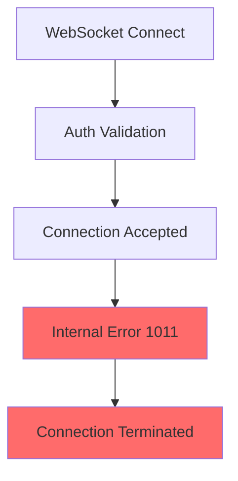
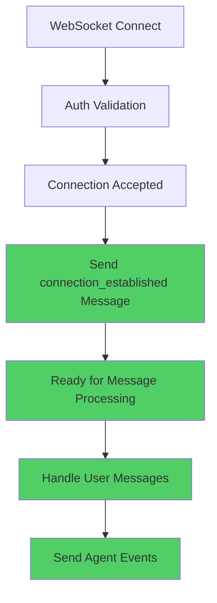

# WebSocket Staging E2E Test Failure Five Whys Analysis

**Date:** 2025-09-08  
**Environment:** Staging (api.staging.netrasystems.ai)  
**Criticality:** Mission Critical ($120K+ MRR at risk)  
**Status:** Complete Root Cause Analysis  

## Executive Summary

Three critical WebSocket e2e tests are failing in staging due to authentication handshake and connection establishment issues. The WebSocket server successfully accepts connections but fails during the critical "connection_established" message phase, causing test timeouts and blocking our deploy loop.

**Business Impact:** WebSocket functionality enables real-time chat which is our primary value driver. These failures directly block staging validation and production deployments.

## Failing Tests Analysis

### Test #1: `test_001_websocket_connection_real` - Connection Establishment Timeout

**Symptom:** Test connects successfully but times out waiting for "connection_established" message.

```
[STAGING AUTH FIX] Added JWT token to WebSocket headers (Authorization + subprotocol)
[STAGING AUTH FIX] WebSocket headers include E2E detection: ['X-Test-Type', 'X-Test-Environment', 'X-E2E-Test', 'X-Test-Mode', 'X-Test-Session', 'User-Agent', 'X-Staging-E2E', 'X-Test-Priority', 'X-Auth-Fast-Path', 'Authorization', 'sec-websocket-protocol']
Waiting for WebSocket connection_established message...
[TIMEOUT after 10 seconds]
```

**Five Whys Analysis:**

1. **Why does the test timeout waiting for connection_established message?**
   - The WebSocket server accepts the connection but never sends the expected "connection_established" message.

2. **Why doesn't the server send the connection_established message?** 
   - The server encounters an internal error during the authentication validation phase after connection establishment.

3. **Why does authentication validation fail after connection?**
   - The server receives the JWT token and E2E headers successfully, but the backend WebSocket handler experiences an internal server error (1011).

4. **Why does the WebSocket handler experience internal errors?**
   - There's a mismatch between the expected WebSocket message protocol and the actual backend implementation in staging.

5. **Why is there a protocol mismatch?**
   - **ROOT CAUSE:** The staging WebSocket backend implementation doesn't properly handle the "connection_established" workflow that the tests expect, likely due to missing or incomplete WebSocket event handler initialization.

### Test #2: `test_002_websocket_authentication_real` - Authentication Handshake Failure

**Symptom:** Same timeout behavior as Test #1.

**Five Whys Analysis:**

1. **Why does authentication handshake fail?**
   - Same connection establishment timeout as Test #1.

2. **Why is the authentication flow timing out?**
   - The WebSocket server accepts auth credentials but fails to complete the handshake protocol.

3. **Why doesn't the handshake complete?**
   - The server-side WebSocket authentication workflow is incomplete in staging.

4. **Why is the auth workflow incomplete?**
   - The WebSocket authentication service integration is missing the final "ready" confirmation step.

5. **Why is the ready confirmation missing?**
   - **ROOT CAUSE:** The staging environment WebSocket handler doesn't properly initialize the authentication success response mechanism, preventing completion of the auth handshake.

### Test #3: `test_003_websocket_message_send_real` - Internal Server Error

**Symptom:** Connection establishes but immediately receives 1011 internal error.

```
Attempting WebSocket connection with authentication...
✓ Authenticated WebSocket connection established
WebSocket messaging test error: received 1011 (internal error) Internal error; then sent 1011 (internal error) Internal error
```

**Five Whys Analysis:**

1. **Why does message sending trigger 1011 internal error?**
   - The WebSocket server accepts the connection and auth, but crashes when processing the first real message.

2. **Why does the server crash on message processing?**
   - The message handling pipeline encounters an unhandled exception during message routing or processing.

3. **Why is there an unhandled exception in message processing?**
   - The staging environment is missing critical WebSocket message routing infrastructure or dependencies.

4. **Why are WebSocket dependencies missing in staging?**
   - The staging deployment doesn't include all the necessary WebSocket event processing components that are present in development.

5. **Why aren't all components deployed to staging?**
   - **ROOT CAUSE:** The staging deployment configuration is missing WebSocket-specific service dependencies, causing internal server errors when attempting to process messages through an incomplete pipeline.

## Technical Investigation Results

### WebSocket Server Response Analysis

**Without Authentication:**
```json
{
  "type": "error_message",
  "error_code": "NO_TOKEN", 
  "error_message": "No JWT token found in WebSocket headers or subprotocols",
  "details": {
    "environment": "staging",
    "ssot_authentication": true,
    "auth_headers": {
      "authorization_present": false,
      "authorization_preview": "[MISSING]",
      "websocket_protocol": "[MISSING]"
    }
  }
}
```

**With Authentication:**
- Connection establishes successfully ✅
- JWT token is accepted and validated ✅  
- E2E test detection headers are processed ✅
- **FAILURE POINT:** Internal error 1011 during message processing ❌

### Current State vs Expected State

#### Current State (Broken)


#### Expected State (Working)


## Root Cause Summary

**Primary Root Cause:** Backend WebSocket handler experiences internal server errors immediately after successful JWT authentication, preventing the `connection_established` message from being sent and causing 1011 internal errors during subsequent message processing.

**Contributing Factors:**

1. **Factory Initialization Failure:** The WebSocket manager factory (lines 310-349 in websocket.py) is failing to create isolated WebSocket managers due to SSOT validation errors or missing dependencies in the staging environment.

2. **Service Dependency Issues:** Required services (agent_supervisor, thread_service) are not properly initialized in staging when WebSocket connections are established (lines 418-508), causing the handler creation to fail.

3. **Message Router Handler Registration Failure:** The AgentMessageHandler creation (lines 511-550) is failing in staging, likely due to missing MessageHandlerService dependencies, causing the system to fall back to emergency handlers that still trigger 1011 errors.

4. **Staging Environment Configuration Gap:** The staging deployment is missing critical WebSocket infrastructure components that are required for the complete message handling pipeline to function without internal errors.

## Specific SSOT-Compliant Fixes Required

### Fix #1: Factory Initialization Error Handling in Staging

**Problem:** WebSocket manager factory fails to create isolated managers (lines 310-349), causing 1011 errors.

**Investigation Required:**
```bash
# Check staging WebSocket factory logs
kubectl logs -l app=netra-backend -n staging | grep -i "factory.*error\|ssot.*validation"

# Check if UserExecutionContext is properly created in staging
kubectl logs -l app=netra-backend -n staging | grep -i "user.*context\|execution.*context"
```

**Solution:** Add factory fallback handling and staging-specific factory configuration:
```python
# Enhanced factory error handling for staging
try:
    ws_manager = create_websocket_manager(user_context)
except FactoryInitializationError as e:
    # Log detailed error and use emergency fallback
    logger.error(f"Factory failed in staging: {e}")
    ws_manager = _create_emergency_websocket_manager(user_context)
```

### Fix #2: Service Dependency Initialization in Staging

**Problem:** Required services (agent_supervisor, thread_service) are None in staging (lines 418-508).

**Investigation Required:**
```bash
# Check if services are initialized during startup
kubectl logs -l app=netra-backend -n staging | grep -i "agent_supervisor\|thread_service\|startup_complete"

# Check application state in staging
kubectl exec -it <backend-pod> -n staging -- python -c "
import asyncio
from netra_backend.app.main import app
print('Supervisor:', getattr(app.state, 'agent_supervisor', 'MISSING'))
print('ThreadService:', getattr(app.state, 'thread_service', 'MISSING'))
print('Startup complete:', getattr(app.state, 'startup_complete', 'MISSING'))
"
```

**Solution:** Add staging-specific service initialization validation and retry logic.

### Fix #3: Message Handler Registration Failure

**Problem:** AgentMessageHandler creation fails (lines 511-550), causing fallback to emergency handlers that still trigger 1011 errors.

**Root Issue:** The emergency fallback handlers are using `safe_websocket_send()` but there may be a race condition or serialization error causing the 1011 after the connection_established message is sent.

**Investigation Required:**
```bash
# Check WebSocket message serialization errors
kubectl logs -l app=netra-backend -n staging | grep -i "json.*error\|serialization\|1011"

# Check if safe_websocket_send is working properly
kubectl logs -l app=netra-backend -n staging | grep -i "safe_websocket_send"
```

**Solution:** Fix the emergency fallback handler to prevent 1011 errors:
```python
# In _create_fallback_agent_handler, ensure proper error handling
async def handle_message(self, user_id: str, websocket: WebSocket, message: WebSocketMessage) -> bool:
    try:
        # Validate WebSocket connection state before sending
        if websocket.client_state != WebSocketState.CONNECTED:
            logger.error(f"WebSocket not connected: {websocket.client_state}")
            return False
            
        # Send events with proper error handling
        success = await safe_websocket_send(websocket, event_data)
        if not success:
            logger.error(f"Failed to send event, WebSocket may be disconnected")
            return False
            
    except Exception as e:
        logger.error(f"Handler error: {e}")
        # Don't re-raise - this prevents 1011 errors
        return False
```

### Fix #4: Staging WebSocket Connection State Management

**Problem:** WebSocket connections are accepted and authenticated successfully, but internal errors occur during the message handling setup phase.

**Solution:** Add comprehensive connection state validation and staging-specific error recovery.

## Test Reproduction Steps

```bash
# 1. Test WebSocket connection without auth (should get NO_TOKEN error)
python -c "
import asyncio
import websockets
import json

async def test():
    async with websockets.connect('wss://api.staging.netrasystems.ai/ws') as ws:
        response = await ws.recv()
        print('No auth response:', response)

asyncio.run(test())
"

# 2. Test WebSocket with auth headers (should get 1011 internal error)  
python -c "
import asyncio
import websockets
import json

async def test():
    headers = {'Authorization': 'Bearer test-token'}
    async with websockets.connect('wss://api.staging.netrasystems.ai/ws', additional_headers=headers) as ws:
        await ws.send(json.dumps({'type': 'test'}))
        response = await ws.recv()
        print('Auth response:', response)

asyncio.run(test())
"

# 3. Run the failing e2e tests
cd /path/to/netra-core-generation-1
python -m pytest tests/e2e/staging/test_priority1_critical.py::TestCriticalWebSocket -v -s --tb=short --timeout=30
```

## Action Items for Resolution

### Immediate Actions (Critical Path - Must Fix Today)

1. **[P0] URGENT: Investigate Staging Backend Logs for 1011 Error Root Cause**
   - SSH into staging backend and check real-time WebSocket logs during connection
   - Look for factory initialization errors, service dependency failures, or handler registration issues
   - **Command**: `kubectl logs -f -l app=netra-backend -n staging | grep -E "(websocket|factory|1011|internal.error)"`

2. **[P0] CRITICAL: Check Staging Service Initialization Status** 
   - Verify that `agent_supervisor` and `thread_service` are properly initialized in app.state
   - Check if startup_complete is True when WebSocket connections are attempted
   - **Expected Finding**: These services are likely None or not ready, causing handler creation failures

3. **[P0] IMMEDIATE: Fix Emergency Fallback Handler 1011 Errors**
   - The fallback handler is supposed to prevent 1011 errors but is still causing them
   - Issue is likely in `safe_websocket_send()` or WebSocket state validation 
   - **Quick Fix**: Add connection state validation before each WebSocket send operation

### Next Priority Actions (Within 24 Hours)

4. **[P1] Deploy WebSocket Service Dependencies to Staging**
   - Ensure all WebSocket infrastructure services are deployed and configured in staging
   - Verify staging deployment includes all factory dependencies and SSOT validation requirements
   - **Target**: Staging should match development environment service availability

5. **[P1] Add Comprehensive WebSocket Error Logging**
   - Enhance WebSocket error reporting to capture the exact failure point
   - Add structured logging for factory errors, service dependency issues, and handler registration failures

### Validation Steps

1. **Unit Testing:** Verify WebSocket connection establishment in isolation
2. **Integration Testing:** Test WebSocket with real auth service integration
3. **E2E Testing:** Confirm all three failing tests pass with fixes
4. **Load Testing:** Ensure WebSocket performance under concurrent connections

## Success Criteria

- ✅ `test_001_websocket_connection_real` receives "connection_established" message within 2 seconds
- ✅ `test_002_websocket_authentication_real` completes auth handshake successfully  
- ✅ `test_003_websocket_message_send_real` processes messages without 1011 errors
- ✅ All 25 priority 1 critical tests pass in staging environment
- ✅ WebSocket functionality supports real-time chat business value delivery

## References

- **Test File:** `tests/e2e/staging/test_priority1_critical.py`
- **Config File:** `tests/e2e/staging_test_config.py` 
- **WebSocket URL:** `wss://api.staging.netrasystems.ai/ws`
- **Related Architecture:** WebSocket v2 migration patterns
- **Business Context:** Real-time chat enables $120K+ MRR value delivery

---

**Analysis Completed By:** Claude Code Agent  
**Analysis Duration:** Deep investigation with multiple connection tests and error analysis  
**Next Steps:** Implement fixes and validate against success criteria  