# Auth Import Error - Critical SSOT Consolidation Bug Report

**Date**: 2025-09-09  
**Severity**: CRITICAL  
**Impact**: Blocks test execution, indicates incomplete SSOT consolidation  
**Assignee**: QA/Security Agent following CLAUDE.md Section 3.5  

## Critical Error Summary

**File**: `/Users/anthony/Desktop/netra-apex/netra_backend/tests/unit/test_auth_validation.py:30`  
**Error Type**: `ImportError`  
**Error Message**: `cannot import name 'AuthenticationResult' from 'netra_backend.app.services.unified_authentication_service'`  

**Failing Import Statement**:
```python
from netra_backend.app.services.unified_authentication_service import (
    UnifiedAuthenticationService,
    AuthenticationResult,  # ❌ DOES NOT EXIST - should be AuthResult
    AuthenticationError    # ❌ WRONG MODULE - exists in core.exceptions_auth
)
```

## Five Whys Root Cause Analysis

### Why #1: Why is AuthenticationResult being imported when AuthResult exists?
**Answer**: Legacy naming inconsistency from incomplete SSOT consolidation. The `unified_authentication_service.py` exports `AuthResult` (line 52), but test expects `AuthenticationResult`.

### Why #2: Why does the test expect AuthenticationResult instead of AuthResult?
**Answer**: The auth package's `__init__.py` file (lines 22-24) attempts to import `AuthenticationResult` from `unified_authentication_service`, creating a false expectation that this class exists there. The test was likely written against this incorrect interface specification.

### Why #3: Why wasn't this caught by other tests?
**Answer**: Import-time errors only surface when the specific failing module is loaded. Other tests either:
- Don't import these specific classes
- Import from different modules (like `core.exceptions_auth`)
- Use the auth package fallback implementations

### Why #4: Why was AuthenticationError imported from wrong module?
**Answer**: `AuthenticationError` is correctly defined in `netra_backend.app.core.exceptions_auth.py` (lines 7-17), not in `unified_authentication_service`. The import statement references the wrong source module.

### Why #5: Why is there a naming inconsistency in the codebase?
**Answer**: **INCOMPLETE SSOT CONSOLIDATION VIOLATION**: The `UnifiedAuthenticationService` was created as SSOT but failed to align with existing naming conventions. This represents a classic SSOT consolidation failure where:
- New SSOT service uses `AuthResult` 
- Legacy systems expect `AuthenticationResult`
- No migration path was implemented
- Cross-system compatibility was not validated

**ROOT CAUSE**: Incomplete SSOT consolidation that violates CLAUDE.md Section 2.1 - "Search First, Create Second" and Section 2.1 SSOT principle.

## System-Wide Impact Analysis

### Affected Files Analysis
```bash
# Files importing AuthenticationResult (3 total)
✅ /Users/anthony/Desktop/netra-apex/netra_backend/app/auth/__init__.py (fallback exists)
❌ /Users/anthony/Desktop/netra-apex/netra_backend/tests/unit/test_auth_validation.py (FAILING)
📄 /Users/anthony/Desktop/netra-apex/reports/staging/E2E_OAUTH_SIMULATION_KEY_FIVE_WHYS_ANALYSIS_20250908.md (documentation)

# Files importing AuthenticationError (47 total - CRITICAL SCOPE)
✅ /Users/anthony/Desktop/netra-apex/netra_backend/app/middleware/auth_middleware.py (CORRECT - imports from core.exceptions_auth)
❌ /Users/anthony/Desktop/netra-apex/netra_backend/app/core/tools/unified_tool_dispatcher.py (SSOT VIOLATION - defines own AuthenticationError class)
```

**CRITICAL FINDINGS**: 
1. 47 files reference `AuthenticationError` - massive scope for potential cascading failures
2. **SSOT VIOLATION DETECTED**: `unified_tool_dispatcher.py` defines its own `AuthenticationError` class instead of using the SSOT version from `core.exceptions_auth`
3. **Mixed Import Patterns**: Some files correctly import from `core.exceptions_auth`, others violate SSOT by creating duplicate classes

### Class Inventory Analysis
| Class Name | Correct Location | Used By | Status |
|------------|------------------|---------|--------|
| `AuthResult` | `unified_authentication_service.py:52` | ✅ SSOT Service | CORRECT |
| `AuthenticationResult` | `auth/__init__.py:31` (fallback) | ❌ Legacy tests | LEGACY |
| `AuthenticationError` | `core.exceptions_auth.py:7` | ✅ 47 files | CORRECT |

### Business Impact
- **Test Coverage Gap**: Auth validation tests cannot execute
- **CI/CD Pipeline**: Potentially blocked if tests are required
- **Security Risk**: Auth functionality not properly tested
- **SSOT Violation**: Multiple incompatible auth interfaces exist

## Current State vs Ideal State Analysis

### Mermaid Diagram: Current Failure State


### Mermaid Diagram: Ideal Working State

```mermaid
graph TD
    A[test_auth_validation.py] -->|imports| B[unified_authentication_service]
    A -->|uses| C[AuthResult ✅]
    A -->|imports| D[core.exceptions_auth]
    
    B -->|exports| C
    D -->|exports| E[AuthenticationError ✅]
    
    F[Consolidated SSOT] -->|single source| B
    F -->|single source| D
    
    style A fill:#ccffcc
    style B fill:#ccffcc
    style C fill:#ccffcc
    style D fill:#ccffcc
    style E fill:#ccffcc
    style F fill:#99ff99
```


## CLAUDE.md Compliant Fix Plan

### Phase 1: SSOT Naming Consolidation
**Business Justification**: Eliminate naming inconsistency that blocks critical auth testing

1. **Standardize on AuthResult** (aligns with existing SSOT service)
2. **Fix import statements** in all consuming files
3. **Remove fallback AuthenticationResult** from auth/__init__.py
4. **Update AuthenticationError imports** to use correct source

### Phase 2: System-Wide Validation
1. **Test all 47 files** importing AuthenticationError
2. **Validate auth package compatibility**
3. **Run comprehensive auth test suite**
4. **Staging environment validation**

### Phase 3: SSOT Enforcement
1. **Remove duplicate interfaces**
2. **Update documentation**
3. **Add import validation**
4. **Prevent future SSOT violations**

## Immediate Fix Implementation

### Step 1: Fix test_auth_validation.py imports
```python
# BEFORE (BROKEN):
from netra_backend.app.services.unified_authentication_service import (
    UnifiedAuthenticationService,
    AuthenticationResult,  # ❌ Does not exist
    AuthenticationError    # ❌ Wrong module
)

# AFTER (FIXED):
from netra_backend.app.services.unified_authentication_service import (
    UnifiedAuthenticationService,
    AuthResult  # ✅ Correct class name
)
from netra_backend.app.core.exceptions_auth import AuthenticationError  # ✅ Correct module
```

### Step 2: Update test code usage
```python
# Update any usage of AuthenticationResult to AuthResult
# Verify all test assertions work with AuthResult interface
```

### Step 3: Clean up auth/__init__.py
```python
# Remove incorrect import attempt
# Keep fallback compatibility if needed
# Document SSOT consolidation completion
```

## Risk Assessment

### High Risk
- **Breaking Changes**: 47 files import AuthenticationError - all must be validated
- **Auth System Stability**: Changes to core auth interfaces
- **Test Coverage**: Must not reduce auth test coverage

### Medium Risk  
- **Legacy Compatibility**: Some systems may depend on AuthenticationResult
- **Documentation**: Multiple files reference incorrect class names

### Low Risk
- **Performance**: Minimal performance impact from naming changes

## Validation Checklist

### Must Pass Before Deployment
- [ ] All 47 AuthenticationError imports validated
- [ ] test_auth_validation.py passes completely  
- [ ] All other auth tests pass
- [ ] Staging auth flows work end-to-end
- [ ] No circular imports introduced
- [ ] SSOT principles maintained

### Success Criteria
- [ ] Zero ImportError exceptions
- [ ] Single source of truth for auth classes maintained
- [ ] All auth functionality preserved
- [ ] Test coverage maintained or improved
- [ ] Documentation updated

## Prevention Measures

### Code Review Requirements
1. **SSOT Validation**: All auth-related changes must validate SSOT compliance
2. **Import Validation**: New imports must verify class existence
3. **Naming Consistency**: Enforce consistent naming across modules

### Testing Requirements
1. **Import Tests**: Add tests that validate all imports work
2. **SSOT Tests**: Add tests that verify single source of truth
3. **Cross-Module Tests**: Test interactions between auth modules

## Learning & SSOT Compliance

### Key Lesson
**Incomplete SSOT consolidation creates cascading import failures**. When creating SSOT services, ALL consuming code must be updated simultaneously to prevent this class of error.

### SSOT Compliance Score: ❌ CRITICAL FAILURE
- Multiple auth result class names exist (`AuthResult` vs `AuthenticationResult`)
- Import statements reference non-existent classes  
- Legacy fallbacks mask SSOT violations
- **DUPLICATE CLASS DEFINITIONS**: Multiple files define their own `AuthenticationError` instead of using SSOT from `core.exceptions_auth`
- **47 files** at risk of inconsistent exception handling behavior

### Recommended SSOT Actions
1. Complete the unified_authentication_service consolidation
2. Eliminate all duplicate auth interfaces
3. Validate all consumer imports
4. Add SSOT compliance testing

---

**Status**: Analysis Complete - Ready for Implementation  
**Next Step**: Implement immediate fix and validate system-wide impact  
**Escalation Path**: If fix introduces breaking changes, escalate to Principal Engineer