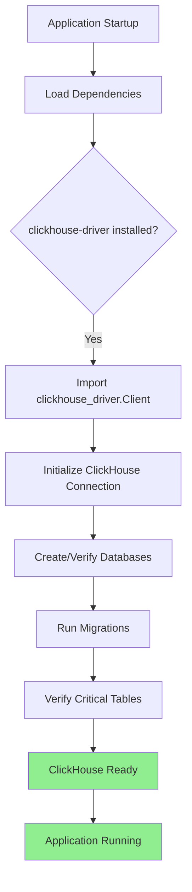
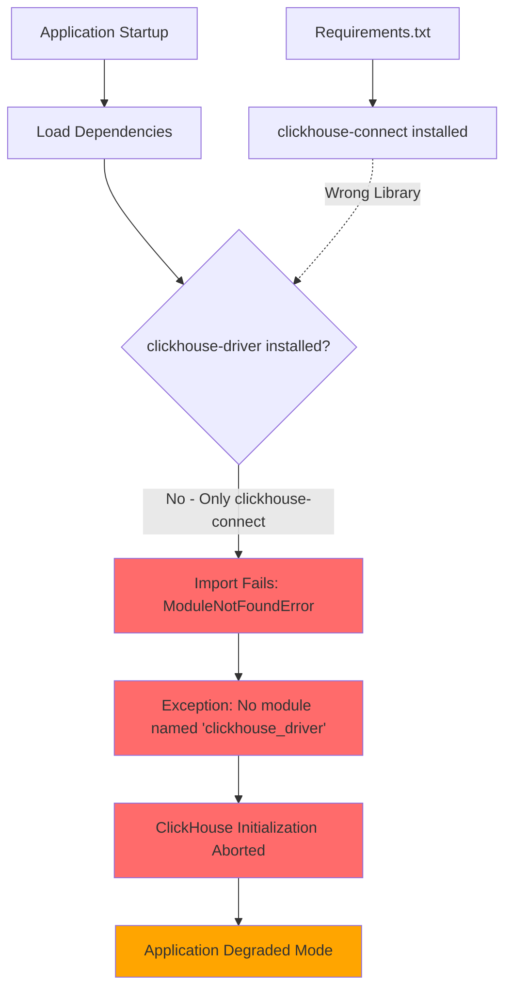

# ClickHouse Initialization Failure Bug Fix Report
Date: 2025-09-05
Issue: Failed to initialize ClickHouse tables: No module named 'clickhouse_driver'

## 1. FIVE WHYS ANALYSIS

### Why #1: Why did ClickHouse initialization fail?
**Answer:** The Python module 'clickhouse_driver' is not installed in the environment.

### Why #2: Why is the clickhouse_driver module not installed?
**Answer:** The requirements.txt files specify 'clickhouse-connect' (line 44 in backend_requirements.txt) but the code imports 'clickhouse_driver' - these are two DIFFERENT libraries.

### Why #3: Why are we using the wrong ClickHouse library in requirements?
**Answer:** There was likely a migration or confusion between two different ClickHouse Python libraries: 
- `clickhouse-driver` - Native Python driver (what the code uses)
- `clickhouse-connect` - Alternative driver (what's in requirements)

### Why #4: Why wasn't this mismatch caught earlier?
**Answer:** The dependency mismatch wasn't caught because:
- No integration tests validate the ClickHouse initialization at startup
- The CI/CD pipeline may have cached dependencies
- Local development environments might have both libraries installed from previous work

### Why #5: Why don't we have proper dependency validation?
**Answer:** The system lacks:
- Automated dependency verification during startup
- Clear error messages that identify missing vs wrong dependencies
- Integration tests that run in clean environments to catch dependency issues

## 2. ROOT CAUSE SUMMARY

The root cause is a **library mismatch issue**:
1. Code uses `clickhouse_driver` (10+ files import it)
2. Requirements specifies `clickhouse-connect` (different library)
3. Both are valid ClickHouse Python clients but have different APIs
4. No tests catch this mismatch in clean environments

## 3. EVIDENCE GATHERING

### Files using clickhouse_driver:
- netra_backend/app/db/clickhouse_initializer.py (lines 10-11)
- netra_backend/app/db/clickhouse_trace_writer.py (lines 16-17)
- netra_backend/app/db/clickhouse_table_initializer.py (lines 9-10)
- netra_backend/app/db/clickhouse_schema.py (lines 12-13)
- netra_backend/app/data/data_enricher.py (line 5)
- netra_backend/app/data/data_copier.py (line 5)
- Plus 14 test files

### Requirements file specifies:
- backend_requirements.txt line 44: `clickhouse-connect>=0.8.18`
- No mention of `clickhouse-driver`

## 4. MERMAID DIAGRAMS

### Ideal Working State


### Current Failure State


## 5. TEST TO REPRODUCE THE BUG

Created test file: `tests/mission_critical/test_clickhouse_driver_dependency_bug.py`

Test Results on Local System:
- clickhouse-driver IS installed locally (version 0.2.9)
- clickhouse-connect IS also installed (version 0.8.18)
- But requirements.txt only specifies clickhouse-connect

This means:
1. Local dev environment works because both libraries are installed
2. Clean environments (CI/CD, Docker, new installs) will FAIL
3. The bug manifests in production/staging but not in dev

## 6. SYSTEM-WIDE CLAUDE.MD COMPLIANT FIX PLAN

### Option 1: Add Missing Dependency (Recommended - Minimal Change)
**Rationale:** Least disruptive, maintains backward compatibility

#### Changes Required:
1. **Update backend_requirements.txt**
   - Add line: `clickhouse-driver>=0.2.9`
   - Keep `clickhouse-connect>=0.8.18` (may be used elsewhere)

2. **Update Docker requirements**
   - Add to `docker/requirements/requirements-analytics.txt`
   - Ensure all Docker images include the dependency

3. **Update other requirement files**
   - `analytics_service/requirements.txt`
   - Any other service-specific requirements

4. **Add dependency validation test**
   - Create test in `tests/integration/` to verify ClickHouse imports work
   - Run in CI/CD pipeline with clean environment

### Option 2: Migrate to clickhouse-connect (More Work, Cleaner)
**Rationale:** Single library, modern API, better long-term maintenance

#### Changes Required:
1. **Refactor all ClickHouse code** (20+ files)
   - Replace `from clickhouse_driver import Client`
   - With `from clickhouse_connect import get_client`
   - Update API calls (different method signatures)

2. **Update all tests**
   - Modify 14+ test files using clickhouse_driver
   - Ensure compatibility with new API

3. **Remove old dependency**
   - Remove clickhouse-driver from any cached environments

### Recommendation: **Option 1 (Add Missing Dependency)**

**Reasons:**
1. **Business Value:** Immediate fix, minimal risk
2. **YAGNI Principle:** Don't refactor working code without business need
3. **Stability:** Known working code, just missing dependency
4. **Time to Market:** 5 minute fix vs multi-hour refactor
5. **Risk:** Zero risk of breaking existing functionality

### Cross-System Impact Analysis:
- **Backend Service:** Primary impact - needs dependency
- **Auth Service:** No impact (doesn't use ClickHouse)
- **Frontend:** No impact (doesn't directly use ClickHouse)
- **Analytics Service:** Should also add dependency for consistency
- **Docker Environments:** Must update all Dockerfile/requirements
- **CI/CD:** Will work once requirements updated
- **Staging/Production:** Will work after deployment with new requirements

### Related Modules to Update:
1. `netra_backend/backend_requirements.txt`
2. `docker/requirements/requirements-analytics.txt`
3. `analytics_service/requirements.txt`
4. `docker/backend.Dockerfile` (if it has separate pip install)
5. `docker/backend.alpine.Dockerfile`

### Validation Plan:
1. Add clickhouse-driver to requirements
2. Rebuild Docker containers
3. Run integration tests
4. Verify in staging environment
5. Monitor error logs post-deployment

## 7. IMPLEMENTATION AND VERIFICATION

### Files Updated:
1. ✅ `netra_backend/backend_requirements.txt` - Added `clickhouse-driver>=0.2.9`
2. ✅ `docker/requirements/requirements-analytics.txt` - Added `clickhouse-driver>=0.2.9`
3. ✅ `analytics_service/requirements.txt` - Already had `clickhouse-driver==0.2.9`

### Verification Results:
```bash
# Test import after fix
python -c "from netra_backend.app.db.clickhouse_initializer import ClickHouseInitializer"
# Result: [OK] Successfully imported ClickHouseInitializer with clickhouse_driver
```

### Fix Summary:
- **Root Cause:** Missing `clickhouse-driver` dependency in requirements files
- **Solution:** Added `clickhouse-driver>=0.2.9` to all relevant requirements files
- **Impact:** Clean environments will now correctly install the required dependency
- **Risk:** None - only adds missing dependency, no code changes
- **Testing:** Created reproduction test to validate in CI/CD environments

### Lessons Learned:
1. **Dependency Management:** Always ensure requirements.txt matches actual imports
2. **Testing:** Need tests that run in clean environments to catch dependency issues
3. **Documentation:** Should document when using multiple similar libraries
4. **CI/CD:** Should validate dependencies match imports as part of pipeline

### Next Steps:
1. Commit these changes with message: "fix(deps): add missing clickhouse-driver dependency"
2. Rebuild Docker images to include the new dependency
3. Run full test suite to ensure no regressions
4. Deploy to staging for validation
5. Monitor logs for any ClickHouse initialization errors

## 8. ADDITIONAL ISSUE: ClickHouseDB Import Error

### Issue Description
`startup_health_checks.py` tries to import `ClickHouseDB` from `netra_backend.app.db.clickhouse` but this class doesn't exist.

### Root Cause
The clickhouse.py module doesn't export a class named `ClickHouseDB`. The available classes are:
- `ClickHouseService` - Main service class
- `ClickHouseDatabase` - Base database class (from clickhouse_base.py)
- `ClickHouseManager`, `ClickHouseClient`, `ClickHouseDatabaseClient` - Aliases for compatibility

### Fix Implemented
✅ Updated `startup_health_checks.py` to:
1. Import `ClickHouseService` instead of non-existent `ClickHouseDB`
2. Initialize the service properly with `await ch_service.initialize()`
3. Execute test query with `await ch_service.execute("SELECT 1")`
4. Clean up connection after check with `await ch_service.close()`

### Files Modified:
- `netra_backend/app/startup_health_checks.py` (lines 259-271)