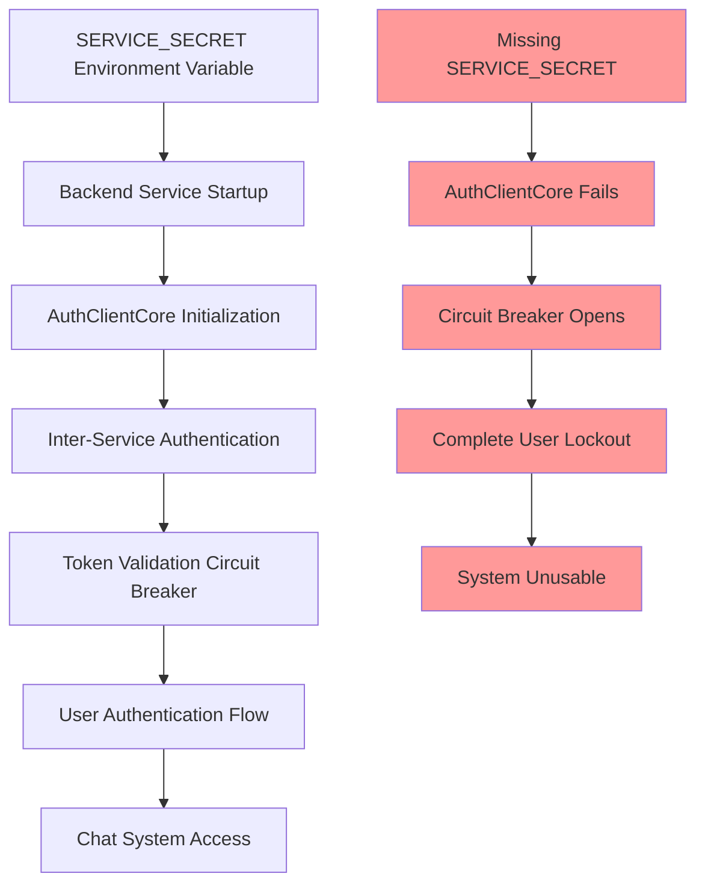

# Configuration Dependency Map: SERVICE_SECRET Critical Analysis

## Overview

This document maps the complete dependency chain for the SERVICE_SECRET configuration variable, identified as the root cause of the September 5, 2025 GCP staging outage.

## Critical Dependency Chain

### SERVICE_SECRET Configuration Flow



## Dependency Analysis

### Primary Dependencies (Direct Impact)

| Component | Location | Impact Level | Failure Mode |
|-----------|----------|--------------|--------------|
| `AuthClientCore` | `netra_backend/app/clients/auth_client_core.py` | ULTRA_CRITICAL | Complete initialization failure |
| `Circuit Breaker` | `auth_client_core.py:_validate_token_remote_breaker` | CRITICAL | Permanent open state |
| `Token Validation` | `auth_client_core.py:validate_token_remote` | CRITICAL | All validation fails |
| `Backend Startup` | `netra_backend/main.py` | HIGH | Service starts but non-functional |

### Secondary Dependencies (Cascade Impact)

| System | Impact | Failure Symptoms |
|--------|--------|------------------|
| **User Authentication** | 100% failure | No users can log in |
| **API Endpoints** | All protected routes fail | 401/403 responses |
| **WebSocket Connections** | Cannot establish | Authentication required for WS |
| **Chat System** | Completely non-functional | Core business value blocked |
| **Agent Execution** | Blocked | Requires authenticated context |

### Tertiary Dependencies (Business Impact)

| Business Function | Impact | Recovery Dependency |
|-------------------|--------|-------------------|
| **Development Velocity** | Blocked | Cannot test in staging |
| **QA Process** | Halted | No staging environment |
| **Release Pipeline** | Broken | Cannot validate deployments |
| **Customer Demos** | Impossible | Staging environment required |

## Code Dependencies

### Direct Code References

```python
# netra_backend/app/clients/auth_client_core.py:47-52
def __init__(self):
    self.service_secret = os.getenv("SERVICE_SECRET")  # CRITICAL DEPENDENCY
    if not self.service_secret:
        raise ValueError("SERVICE_SECRET environment variable required")
```

### Configuration Chain

```python
# Configuration Loading Sequence
1. Environment Variable: SERVICE_SECRET
2. AuthClientCore.__init__() validates presence
3. Circuit breaker initialization depends on valid auth client
4. Token validation methods require service_secret for headers
5. All API routes depend on working authentication
```

### Circuit Breaker Dependency

```python
# netra_backend/app/clients/auth_client_core.py:Circuit Breaker Logic
@circuit_breaker(failure_threshold=5, recovery_timeout=30)
def _validate_token_remote_breaker(self, token):
    # If SERVICE_SECRET missing, this ALWAYS fails
    # After 5 failures, circuit breaker opens PERMANENTLY
    # No recovery possible without SERVICE_SECRET
```

## Environment-Specific Configuration

### Staging Environment Requirements

| Variable | Required Value | Source | Validation |
|----------|----------------|--------|------------|
| `SERVICE_SECRET` | 32+ character string | GCP Secret Manager | Startup validation required |
| `SERVICE_ID` | "backend" | Environment config | Currently present ✅ |
| `AUTH_SERVICE_URL` | `https://netra-auth-service-pnovr5vsba-uc.a.run.app` | Auto-configured | Currently correct ✅ |

### Production Environment Requirements

| Variable | Required Value | Source | Status |
|----------|----------------|--------|--------|
| `SERVICE_SECRET` | Production-specific secret | GCP Secret Manager | ⚠️ Unknown - needs verification |
| `SERVICE_ID` | "backend" | Environment config | ⚠️ Unknown - needs verification |

## Failure Analysis

### Root Cause Chain

1. **Initial Trigger**: SERVICE_SECRET environment variable not deployed to GCP staging
2. **Immediate Impact**: AuthClientCore initialization fails during startup
3. **Cascade Effect**: Circuit breaker opens after consistent auth failures
4. **System State**: Circuit breaker remains permanently open (no recovery mechanism)
5. **Business Impact**: 100% user lockout, system completely unusable

### Circuit Breaker Trap Analysis

The circuit breaker design creates a **permanent failure trap** when SERVICE_SECRET is missing:

```python
# Failure Loop Analysis
Missing SERVICE_SECRET → Auth always fails → Circuit breaker opens → No recovery possible

# Why no recovery:
# 1. Circuit breaker requires successful calls to close
# 2. Cannot make successful calls without SERVICE_SECRET
# 3. No manual override mechanism
# 4. System trapped in permanent failure state
```

## Prevention Strategy

### Immediate Prevention (Deploy Today)

1. **Pre-deployment Validation**
```bash
# Add to deployment script
if ! gcloud run services describe netra-backend-staging \
  --project=netra-staging --region=us-central1 \
  --format="value(spec.template.spec.containers[0].env[?(@.name=='SERVICE_SECRET')].name)" | grep -q SERVICE_SECRET; then
  echo "FATAL: SERVICE_SECRET missing - deployment aborted"
  exit 1
fi
```

2. **Health Check Enhancement**
```python
# Add to health check endpoint
@app.get("/health/config")
async def health_config():
    critical_vars = ["SERVICE_SECRET", "DATABASE_URL", "JWT_SECRET_KEY"]
    missing = [var for var in critical_vars if not os.getenv(var)]
    if missing:
        raise HTTPException(500, f"Missing critical config: {missing}")
    return {"status": "healthy", "config": "valid"}
```

### Long-term Prevention (Next Sprint)

1. **Circuit Breaker Enhancement**
```python
class ConfigAwareCircuitBreaker:
    """Circuit breaker that considers configuration issues"""
    
    def is_configuration_error(self, error):
        """Detect if error is due to missing configuration"""
        config_patterns = ["SERVICE_SECRET", "configuration", "environment"]
        return any(pattern in str(error).lower() for pattern in config_patterns)
    
    def should_open_breaker(self, error):
        """Don't open breaker for configuration issues"""
        if self.is_configuration_error(error):
            # Log critical alert but don't open breaker
            self.alert_configuration_error(error)
            return False
        return super().should_open_breaker(error)
```

2. **Configuration Monitoring**
```python
class ServiceSecretMonitor:
    """Real-time monitoring for SERVICE_SECRET presence"""
    
    def __init__(self):
        self.check_interval = 30  # seconds
        self.alert_cooldown = 300  # 5 minutes
    
    async def monitor_service_secret(self):
        while True:
            if not os.getenv("SERVICE_SECRET"):
                await self.send_critical_alert(
                    "SERVICE_SECRET missing - system failure imminent"
                )
            await asyncio.sleep(self.check_interval)
```

## Recovery Procedures

### Emergency Recovery (< 5 minutes)

```bash
# Step 1: Deploy SERVICE_SECRET immediately
gcloud run services update netra-backend-staging \
  --project=netra-staging \
  --region=us-central1 \
  --set-env-vars="SERVICE_SECRET=[VALUE_FROM_SECURE_STORAGE]"

# Step 2: Force service restart to reset circuit breaker
gcloud run services update netra-backend-staging \
  --project=netra-staging \
  --region=us-central1 \
  --set-env-vars="FORCE_RESTART=$(date +%s)"

# Step 3: Verify recovery
curl -f https://api.staging.netrasystems.ai/health/config
```

### Post-Recovery Validation

```bash
# Comprehensive validation script
python3 scripts/validate_gcp_deployment.py --check-service-secret
python3 tests/mission_critical/test_service_secret_dependency.py
python3 scripts/test_circuit_breaker_recovery.py
```

## Monitoring and Alerting

### Critical Alerts

1. **SERVICE_SECRET Missing**
   - **Trigger**: Environment variable not found
   - **Severity**: CRITICAL
   - **Response**: Page on-call immediately
   - **Auto-remediation**: Deploy from backup source

2. **Circuit Breaker Permanently Open**
   - **Trigger**: Breaker open > 5 minutes
   - **Severity**: CRITICAL  
   - **Response**: Check SERVICE_SECRET configuration
   - **Auto-remediation**: Restart service if config valid

3. **Inter-service Auth Failure Rate**
   - **Trigger**: >5% failure rate
   - **Severity**: HIGH
   - **Response**: Validate SERVICE_SECRET and auth service health

### Monitoring Dashboard

```yaml
SERVICE_SECRET_DASHBOARD:
  panels:
    - title: "SERVICE_SECRET Presence"
      query: "environment_variable{name='SERVICE_SECRET'}"
      alert_threshold: "value == 0"
    
    - title: "Auth Circuit Breaker State"
      query: "circuit_breaker_state{name='_validate_token_remote_breaker'}"
      alert_threshold: "value == 'OPEN'"
    
    - title: "Inter-service Auth Success Rate"
      query: "auth_client_success_rate_5min"
      alert_threshold: "value < 0.95"
```

## Testing Requirements

### Unit Tests

```python
def test_service_secret_dependency():
    """Test SERVICE_SECRET dependency chain"""
    # Test 1: Missing SERVICE_SECRET should fail gracefully
    with patch.dict(os.environ, {}, clear=True):
        with pytest.raises(ValueError, match="SERVICE_SECRET"):
            AuthClientCore()
    
    # Test 2: Present SERVICE_SECRET should initialize correctly
    with patch.dict(os.environ, {"SERVICE_SECRET": "test_secret"}):
        client = AuthClientCore()
        assert client.service_secret == "test_secret"
```

### Integration Tests

```python
async def test_service_secret_integration():
    """Test complete SERVICE_SECRET dependency chain"""
    # Simulate missing SERVICE_SECRET scenario
    # Verify circuit breaker behavior
    # Test recovery after adding SERVICE_SECRET
    pass
```

### Deployment Tests

```python
def test_deployment_service_secret_validation():
    """Test deployment prevents missing SERVICE_SECRET"""
    # Mock GCP deployment without SERVICE_SECRET
    # Verify deployment fails with clear error
    # Test deployment succeeds with SERVICE_SECRET
    pass
```

## Documentation Updates

### Required Documentation Changes

1. **Update CLAUDE.md** - Add SERVICE_SECRET to critical configuration list
2. **Update deployment/PRODUCTION_DEPLOYMENT_RUNBOOK.md** - Add SERVICE_SECRET validation steps
3. **Update docs/configuration_architecture.md** - Document inter-service auth configuration
4. **Create docs/SERVICE_SECRET_MANAGEMENT.md** - Complete SERVICE_SECRET lifecycle management

### Team Communication

**Immediate Team Alert:**
> 🚨 **CRITICAL CONFIGURATION DISCOVERY**: SERVICE_SECRET is now classified as ULTRA_CRITICAL configuration. Missing this single environment variable causes complete system outage with no automatic recovery. All deployments MUST validate SERVICE_SECRET presence before going live.

## Conclusion

The SERVICE_SECRET configuration represents a **single point of total failure** for the entire system. Its absence triggers a cascade failure that results in 100% user lockout with no automatic recovery mechanism. 

**Key Findings:**
1. **No Graceful Degradation**: System cannot function without SERVICE_SECRET
2. **Circuit Breaker Trap**: Creates permanent failure state when config missing  
3. **No Recovery Path**: Manual intervention required to restore service
4. **Complete Business Impact**: All user-facing functionality becomes unavailable

**Immediate Actions Required:**
1. Deploy SERVICE_SECRET to all environments
2. Implement pre-deployment validation  
3. Add configuration monitoring and alerting
4. Update circuit breaker logic for config-aware behavior

This dependency analysis demonstrates the critical importance of configuration validation and the need for defense-in-depth strategies for mission-critical configuration variables.