# CORS Middleware AsyncGeneratorContextManager Bug Fix Report

**Date:** 2025-09-03
**Error:** `'_AsyncGeneratorContextManager' object has no attribute 'execute'`
**Location:** `netra_backend.app.middleware.cors_fix_middleware`

## Five Whys Analysis

### Why #1: Why did the error occur?
The error occurred because `call_next` is returning an `_AsyncGeneratorContextManager` object instead of being directly callable.

### Why #2: Why is `call_next` returning a context manager?
Looking at the transaction middleware pattern (line 60), it appears that somewhere in the middleware chain, a context manager is being incorrectly passed or wrapped around the `call_next` function.

### Why #3: Why is the context manager being passed incorrectly?
The error happens at line 67 where we try to `await call_next(request)`. The issue is likely that `call_next` itself has been wrapped in a context manager somewhere in the middleware stack setup, possibly during the middleware registration process.

### Why #4: Why would the middleware registration wrap call_next incorrectly?
This could happen if there's a mismatch between how BaseHTTPMiddleware expects to receive and use `call_next` versus how it's being provided. The BaseHTTPMiddleware dispatch method signature expects a Callable, but something in the chain is providing a context manager instead.

### Why #5: Why is there a mismatch in the middleware chain?
The root cause appears to be that somewhere in the middleware initialization or chaining process, an async context manager (likely from database transaction handling or similar) is being incorrectly passed as the `call_next` parameter, or the `call_next` function itself has been wrapped in a way that returns a context manager instead of being directly callable.

## Current State (Failing)

```mermaid
graph TD
    A[Request arrives] --> B[CORSFixMiddleware.dispatch]
    B --> C[Try to call: await call_next&#40;request&#41;]
    C --> D[call_next is _AsyncGeneratorContextManager]
    D --> E[Error: no attribute 'execute']
    E --> F[500 Internal Server Error]
```

## Expected State (Working)

```mermaid
graph TD
    A[Request arrives] --> B[CORSFixMiddleware.dispatch]
    B --> C[await call_next&#40;request&#41;]
    C --> D[Next middleware processes]
    D --> E[Response returned]
    E --> F[CORS headers added]
    F --> G[Response sent to client]
```

## Root Cause Analysis

The issue is that `call_next` parameter in the dispatch method is not a simple callable but has been wrapped or replaced with an `_AsyncGeneratorContextManager`. This typically happens when:

1. There's incorrect usage of async context managers in the middleware chain
2. A middleware is incorrectly wrapping the `call_next` function
3. The middleware registration order or initialization is incorrect

## Proposed Fix

The fix requires ensuring that `call_next` is properly invoked. Since we're seeing an `_AsyncGeneratorContextManager`, we need to handle it appropriately:

1. Check if `call_next` is a context manager and handle it accordingly
2. Or fix the middleware registration to ensure `call_next` is passed correctly

## System-Wide Impact

This bug affects:
- All HTTP requests going through the CORS middleware
- Frontend-backend communication
- API availability
- User experience (all requests fail with 500 errors)

## Related Modules to Check

1. `app_factory.py` - middleware registration order
2. Other middleware using BaseHTTPMiddleware pattern
3. Transaction middleware (uses async context managers correctly)
4. Any recent changes to middleware initialization

## Fix Implementation Plan

1. First, verify if `call_next` is indeed a context manager
2. If it is, properly handle it by entering the context
3. If not, investigate why it's being wrapped incorrectly
4. Test with all middleware enabled
5. Ensure CORS headers are properly added after fix