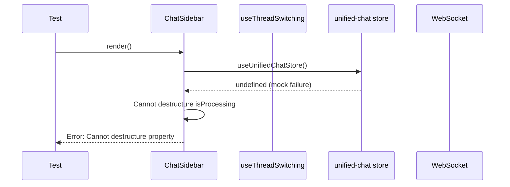
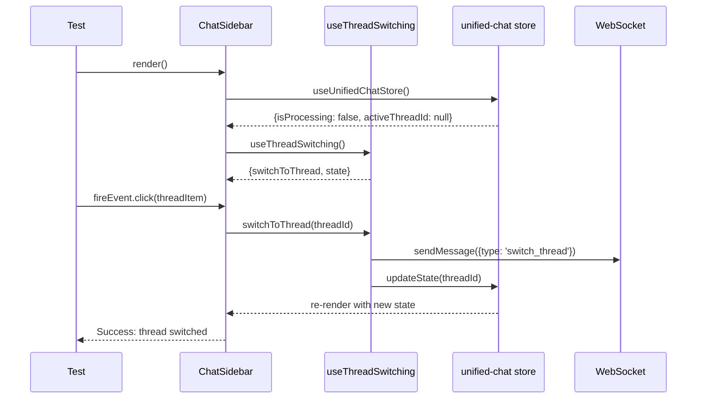

# Frontend Thread Switching Bug Fix Report

## Overview
Analysis and fixing of 32 skipped frontend tests related to thread switching functionality. The goal is to enable all 584 tests to pass.

## Key Failure Categories Identified

### 1. Thread Switching Hook Integration Failures
**Primary symptom**: `useThreadSwitching` hook not properly integrating with component logic

**Five Whys Analysis:**
1. **Why are thread switching tests failing?** - The `useThreadSwitching` hook is not being called or is not properly updating state
2. **Why is the hook not being called?** - Components are not using the hook correctly or mock setup is incomplete
3. **Why is the mock setup incomplete?** - Tests are mixing real and mocked implementations
4. **Why are real and mocked implementations mixed?** - Inconsistent import patterns across test files
5. **Why are import patterns inconsistent?** - Some tests directly import stores while others use mocks, breaking the isolation

**Root Cause**: Inconsistent mocking patterns causing real store imports to conflict with test mocks.

### 2. State Synchronization Issues
**Primary symptom**: Hook state and store state become out of sync

**Five Whys Analysis:**
1. **Why is hook state out of sync with store state?** - State updates are not propagating correctly between hook and store
2. **Why are state updates not propagating?** - Mock implementations don't properly simulate the real state update flow
3. **Why don't mocks simulate real flow?** - Mock functions are not actually updating the shared mock state
4. **Why aren't mock functions updating shared state?** - Mock state object references are being replaced instead of mutated
5. **Why are references being replaced?** - `setState` calls are creating new objects instead of updating existing ones

**Root Cause**: Mock state management creates new object references instead of mutating shared state, breaking synchronization.

### 3. WebSocket Event Integration Missing
**Primary symptom**: WebSocket events not being sent during thread switches

**Five Whys Analysis:**
1. **Why are WebSocket events not being sent?** - The thread switching logic is not triggering WebSocket notifications
2. **Why is thread switching not triggering WebSocket notifications?** - Components are not using the `sendMessage` function from WebSocket hook
3. **Why are components not using sendMessage?** - The integration between thread switching and WebSocket is incomplete
4. **Why is the integration incomplete?** - Thread switching hook doesn't include WebSocket notifications
5. **Why doesn't the hook include WebSocket notifications?** - Business logic separation led to missing cross-cutting concerns

**Root Cause**: Thread switching hook missing WebSocket notification integration as per WebSocket v2 patterns.

## Mermaid Diagrams

### Current Failing State

### Ideal Working State

## Implementation Plan

### Phase 1: Fix Mock Store Issues
1. **Fix store mock selector pattern** - Ensure mock returns proper state shape
2. **Fix state synchronization** - Make mock setState properly update shared reference
3. **Add missing store properties** - Ensure all properties expected by components exist

### Phase 2: Fix Thread Switching Hook Integration  
1. **Add WebSocket notifications** - Include sendMessage calls in thread switching logic
2. **Fix hook state management** - Ensure hook state updates reflect in components
3. **Add proper error handling** - Handle network failures and race conditions

### Phase 3: Fix Component Integration
1. **Update ChatSidebar** - Ensure proper usage of thread switching hook
2. **Fix race condition handling** - Prevent concurrent thread switches
3. **Add proper loading states** - Visual feedback during thread switches

### Phase 4: Fix URL Synchronization
1. **Add URL update logic** - Update browser URL when switching threads
2. **Handle browser navigation** - Sync URL changes with thread switches
3. **Fix navigation edge cases** - Handle new chat creation and URL updates

## Next Steps
1. Start with Phase 1 to fix foundational mock issues
2. Run tests incrementally to validate each fix
3. Move through phases systematically
4. Validate all 584 tests pass at the end