# Frontend Test Failures Five Whys Analysis Report
**Date:** September 7, 2025  
**Analyst:** Bug Fix Analysis Team  
**Total Failures:** 35 out of 659 tests (5.3% failure rate)  
**Critical Business Impact:** Potential revenue loss from unstable WebSocket chat interactions

## Executive Summary

Following the MANDATORY BUG FIXING PROCESS from claude.md, this report analyzes 35 frontend test failures across 6 failed test suites using systematic Five Whys methodology to identify root causes and the "error behind the error."

**Key Findings:**
- **Primary Root Cause**: WebSocket event delivery and state synchronization systemic failures affecting multi-user chat business value
- **Secondary Issue**: Authentication flow isolation problems preventing proper user session testing
- **Tertiary Issue**: Import path resolution failures creating service integration gaps

**Business Impact**: These failures directly threaten the **"Chat is King"** mandate from claude.md by undermining real-time AI-powered interactions that deliver 90% of our business value.

## Failure Category Analysis

### Category A: WebSocket Connection Mock Issues (14 failures)
**Affected Tests**: WebSocket timing, connection recovery, agent event delivery
**Business Impact**: CRITICAL - Directly affects chat functionality and revenue

### Category B: Authentication Flow Issues (8 failures) 
**Affected Tests**: Auto-login, JWT management, multi-user isolation
**Business Impact**: HIGH - Prevents proper testing of user session isolation

### Category C: Agent Interaction Failures (7 failures)
**Affected Tests**: Error handling, WebSocket events, business value validation
**Business Impact**: CRITICAL - Tests core AI value delivery mechanisms

### Category D: Analytics Service Import Issues (3 failures)
**Affected Tests**: Module resolution and service integration
**Business Impact**: MEDIUM - Affects operational visibility

### Category E: Validation Test Failures (3 failures)
**Affected Tests**: Race condition handling, timing issues
**Business Impact**: HIGH - System stability concerns

## Five Whys Analysis by Category

### Category A: WebSocket Connection Mock Issues

#### WHY 1: Why do WebSocket connection mocks fail with timeouts?
**Surface Level**: Tests expect `onopen` events but receive empty arrays, WebSocket mock events not firing properly.

#### WHY 2: Why aren't WebSocket mock events firing properly?
**Deeper**: Mock WebSocket implementation in `jest.setup.js` doesn't properly simulate event timing and state transitions that match real WebSocket behavior.

#### WHY 3: Why doesn't the mock match real WebSocket behavior?
**Root Cause Area**: The mock was designed for simple connection testing but doesn't handle the complex event sequences required for agent interactions (agent_started, agent_thinking, tool_executing, tool_completed, agent_completed).

#### WHY 4: Why wasn't this caught earlier in development?
**Process Gap**: WebSocket agent event testing was not part of the continuous integration validation. The WebSocket v2 migration (per `SPEC/learnings/websocket_v2_migration_critical_miss_20250905.xml`) didn't include comprehensive mock updates.

#### WHY 5: Why does this pattern of incomplete mock evolution exist?
**Systemic Issue**: **VIOLATION OF CLAUDE.MD PRINCIPLE**: "WebSocket events enable substantive chat interactions - they serve the business goal of delivering AI value to users." The mock infrastructure wasn't evolved with business requirements prioritizing chat business value.

### Category B: Authentication Flow Issues

#### WHY 1: Why do authentication flow tests fail?
**Surface Level**: JWT token validation failures, auto-login not triggering, multi-user isolation tests failing.

#### WHY 2: Why is JWT token validation failing?
**Deeper**: Test environment auth configuration inconsistencies with staging/production OAuth credentials and JWT secret management.

#### WHY 3: Why are there auth configuration inconsistencies?
**Root Cause Area**: **CRITICAL CONFIG REGRESSION**: Echoes the OAuth Regression Analysis from claude.md - missing environment-specific auth credentials causing 503 errors and silent failures.

#### WHY 4: Why weren't auth config regressions caught earlier?
**Process Gap**: Test suite doesn't validate auth configuration compatibility across environments. The **E2E AUTH MANDATE** from claude.md states "ALL e2e tests MUST use authentication" but frontend tests are bypassing this requirement.

#### WHY 5: Why does the auth testing bypass pattern exist?
**Systemic Issue**: **CHEATING ON TESTS = ABOMINATION**: Frontend tests were using mock auth instead of real authentication flows, violating claude.md principle that "Every E2E test MUST authenticate properly with the system."

### Category C: Agent Interaction Failures

#### WHY 1: Why do agent interaction tests fail?
**Surface Level**: Expected 5 agent events but received 0, error handling not triggering properly, business value validation not completing.

#### WHY 2: Why aren't agent events being received?
**Deeper**: WebSocket agent event delivery chain is broken - the integration between `AgentRegistry.set_websocket_manager()`, `ExecutionEngine`, and `EnhancedToolExecutionEngine` is not working in test environment.

#### WHY 3: Why is the WebSocket agent event delivery chain broken?
**Root Cause Area**: **MISSION CRITICAL VIOLATION**: The `SPEC/learnings/websocket_agent_integration_critical.xml` requirements are not being met. Tests aren't validating the 5 required WebSocket events (agent_started, agent_thinking, tool_executing, tool_completed, agent_completed).

#### WHY 4: Why weren't mission critical WebSocket events tested earlier?
**Process Gap**: No dedicated test suite for `python tests/mission_critical/test_websocket_agent_events_suite.py` equivalent in frontend testing. The MANDATORY validation step from claude.md section 6.2 is missing.

#### WHY 5: Why does this critical business value testing gap exist?
**Systemic Issue**: **FUNDAMENTAL BUSINESS VALUE DISCONNECT**: Tests are focused on technical correctness rather than business value delivery. Claude.md states "Chat is King - SUBSTANTIVE VALUE" but tests don't validate the complete AI problem-solving value chain.

### Category D: Analytics Service Import Issues

#### WHY 1: Why do analytics service imports fail?
**Surface Level**: `TypeError: Cannot find module 'analytics'` in test environment.

#### WHY 2: Why can't the analytics module be found?
**Deeper**: Import path resolution differences between development and test environments, missing module aliases in Jest configuration.

#### WHY 3: Why are there import path resolution differences?
**Root Cause Area**: **SSOT VIOLATION**: The service is not following the absolute import rules from `SPEC/import_management_architecture.xml`. Relative imports being used instead of absolute paths.

#### WHY 4: Why wasn't the import architecture enforced earlier?
**Process Gap**: No automated validation of import architecture compliance. The `python scripts/check_architecture_compliance.py` equivalent is missing for frontend.

#### WHY 5: Why does this import architecture violation pattern exist?
**Systemic Issue**: **ARCHITECTURAL DEGRADATION**: Over time, expedient relative imports were added without enforcing the SSOT principles, creating technical debt that manifests as test failures.

### Category E: Validation Test Failures (Race Conditions)

#### WHY 1: Why do validation tests fail with race conditions?
**Surface Level**: WebSocket race condition tests expect proper timing but events arrive out of order or not at all.

#### WHY 2: Why are WebSocket events arriving out of order?
**Deeper**: Test environment doesn't properly simulate the operation sequence tracking and atomic state updates that were implemented in the bug fixes.

#### WHY 3: Why doesn't the test environment simulate proper operation sequencing?
**Root Cause Area**: The race condition fixes documented in `reports/bug_fixes/all_frontend_tests_passing_20250907.md` (operation sequence tracking with `operationSequence++` and `lastValidOperationSequence`) aren't applied to the mock WebSocket implementation.

#### WHY 4: Why weren't the race condition fixes applied to mocks?
**Process Gap**: Bug fixes are applied to production code but not systematically applied to test mocks, creating a disconnect between what's being tested and what's deployed.

#### WHY 5: Why does this fix propagation gap exist?
**Systemic Issue**: **INCOMPLETE ATOMIC SCOPE**: Claude.md requires "Edits must be complete, functional updates" but the race condition fixes weren't atomically applied across both production and test codebases.

## Mermaid Flow Diagrams

### Ideal Working State: WebSocket Agent Events

```mermaid
sequenceDiagram
    participant U as User
    participant F as Frontend
    participant W as WebSocket
    participant A as Agent
    participant B as Backend
    
    Note over U,B: ✅ IDEAL: Complete Business Value Delivery
    
    U->>F: Send chat message
    F->>W: Connect with JWT auth
    W->>B: Authenticated connection established
    B->>A: Initialize agent execution
    
    Note over A,B: Mission Critical Events (claude.md 6.1)
    
    A->>W: agent_started (User sees AI working)
    W->>F: Display "AI is analyzing..."
    F->>U: ✅ Real-time feedback
    
    A->>W: agent_thinking (Show reasoning)
    W->>F: Display thought process
    F->>U: ✅ Transparency in AI reasoning
    
    A->>W: tool_executing (Show problem solving)
    W->>F: Display tool usage
    F->>U: ✅ Problem-solving visibility
    
    A->>W: tool_completed (Show results)
    W->>F: Display actionable insights
    F->>U: ✅ Valuable results delivered
    
    A->>W: agent_completed (Final response)
    W->>F: Complete response ready
    F->>U: ✅ BUSINESS VALUE ACHIEVED
```

### Current Failure State: Broken Event Chain

```mermaid
sequenceDiagram
    participant U as User
    participant F as Frontend
    participant W as WebSocket Mock
    participant A as Agent Mock
    participant B as Backend Mock
    
    Note over U,B: ❌ CURRENT: Business Value Blocked
    
    U->>F: Send chat message
    F->>W: Connect with mock auth
    W--xB: ❌ Mock connection inconsistent
    B--xA: ❌ Agent execution not properly mocked
    
    Note over A,B: Mission Critical Events MISSING
    
    A--xW: ❌ agent_started not sent
    W--xF: ❌ Empty event array []
    F--xU: ❌ No feedback - user confused
    
    A--xW: ❌ agent_thinking not sent
    W--xF: ❌ No reasoning shown
    F--xU: ❌ No transparency - trust eroded
    
    A--xW: ❌ tool_executing not sent
    W--xF: ❌ No problem-solving visible
    F--xU: ❌ No value demonstration
    
    A--xW: ❌ tool_completed not sent
    W--xF: ❌ No results displayed
    F--xU: ❌ No actionable insights
    
    A--xW: ❌ agent_completed not sent
    W--xF: ❌ Status remains "connected" instead of "completed"
    F--xU: ❌ BUSINESS VALUE LOST
```

### Authentication Flow: Ideal vs Current

```mermaid
graph TD
    subgraph "✅ IDEAL: Multi-User Auth Isolation"
        A1[Test User 1] --> B1[Real JWT Token]
        A2[Test User 2] --> B2[Real JWT Token]
        B1 --> C1[WebSocket Auth Context]
        B2 --> C2[WebSocket Auth Context]
        C1 --> D1[User 1 Agent Session]
        C2 --> D2[User 2 Agent Session]
        D1 --> E1[User 1 Results]
        D2 --> E2[User 2 Results]
    end
    
    subgraph "❌ CURRENT: Broken Auth Testing"
        F1[Test User 1] --> G1[Mock Auth Bypass]
        F2[Test User 2] --> G1
        G1 --> H1[❌ Shared Session]
        H1 --> I1[❌ Auth Config Missing]
        I1 --> J1[❌ Test Failures]
    end
```

## System-Wide Fix Plan (Claude.md Compliant)

### Phase 1: WebSocket Agent Event Infrastructure (Immediate - Week 1)

#### Fix 1.1: Implement Mission Critical WebSocket Events
- **SSOT Method**: Update `frontend/jest.setup.js` WebSocket mock to support all 5 required events
- **Business Value**: Enable substantive chat interaction testing
- **Files to Update**:
  - `frontend/jest.setup.js` - Add agent event simulation
  - `frontend/__mocks__/services/websocket.ts` - Complete event delivery chain
  - Create `frontend/tests/mission_critical/test_websocket_agent_events.test.tsx`

#### Fix 1.2: Operation Sequence Tracking
- **SSOT Method**: Apply operation sequence tracking from bug fix reports to mock implementations
- **Business Value**: Prevent race conditions that break user experience
- **Files to Update**:
  - `frontend/jest.setup.js` - Add `operationSequence++` and `lastValidOperationSequence`
  - All WebSocket test mocks - Implement atomic state updates

### Phase 2: E2E Auth Mandate Compliance (Week 2)

#### Fix 2.1: Implement Real Auth in Frontend Tests
- **SSOT Method**: Use `test_framework/ssot/e2e_auth_helper.py` patterns for frontend
- **Business Value**: Ensure multi-user isolation works as designed
- **Files to Update**:
  - Create `frontend/test-utils/e2e-auth-helper.ts`
  - Update all E2E tests to use real JWT authentication
  - `frontend/jest.setup.js` - Remove auth bypassing

#### Fix 2.2: Environment-Specific Auth Configuration
- **SSOT Method**: Follow `reports/config/CONFIG_REGRESSION_PREVENTION_PLAN.md`
- **Business Value**: Prevent OAuth credential cascade failures
- **Files to Update**:
  - `frontend/.env.test` - Separate test OAuth credentials
  - `frontend/config/auth-config.ts` - Environment-specific auth setup

### Phase 3: Import Architecture Compliance (Week 3)

#### Fix 3.1: Absolute Import Enforcement
- **SSOT Method**: Follow `SPEC/import_management_architecture.xml`
- **Business Value**: Eliminate service integration gaps
- **Files to Update**:
  - All frontend test files - Convert relative to absolute imports
  - `frontend/jest.config.unified.cjs` - Fix module resolution
  - Create `frontend/scripts/check_import_compliance.js`

#### Fix 3.2: Service Integration Consistency
- **SSOT Method**: Unified service mock pattern
- **Business Value**: Reliable service integration testing
- **Files to Update**:
  - `frontend/__mocks__/services/` - Complete mock service suite
  - `frontend/jest.setup.js` - Unified service mock initialization

### Phase 4: Atomic Scope Completion (Week 4)

#### Fix 4.1: Mock-Production Parity
- **SSOT Method**: Ensure all production fixes are reflected in mocks
- **Business Value**: Test environment accurately reflects production behavior
- **Validation**: Compare all race condition fixes with mock implementations

#### Fix 4.2: Test Infrastructure Standardization
- **SSOT Method**: Create comprehensive test patterns
- **Business Value**: Consistent, reliable test execution
- **Files to Create**:
  - `frontend/test-framework/patterns/websocket-testing.ts`
  - `frontend/test-framework/patterns/auth-testing.ts`
  - `frontend/test-framework/patterns/agent-testing.ts`

## Verification Strategy

### Stage 1: Unit Test Validation
1. Run `npm test` in frontend directory
2. Verify 0/659 failures achieved
3. Validate all 5 WebSocket agent events are properly mocked and tested

### Stage 2: Integration Test Validation
1. Run E2E tests with real authentication: `python tests/unified_test_runner.py --category e2e --real-services`
2. Verify WebSocket agent event delivery works end-to-end
3. Confirm multi-user isolation functions properly

### Stage 3: Business Value Validation
1. Manual testing of chat interface with WebSocket events
2. Verify users see real-time AI reasoning and tool usage
3. Confirm completion of full agent execution cycles

### Stage 4: Regression Prevention
1. Add WebSocket agent event testing to CI/CD pipeline
2. Implement automatic import architecture validation
3. Create auth configuration dependency checking

## Root Cause Summary: The "Error Behind the Error"

Following claude.md's emphasis on finding the "error behind the error," the fundamental issue is not technical but architectural:

**PRIMARY ROOT CAUSE**: The test suite was designed around technical correctness rather than business value delivery, violating claude.md's "Chat is King" principle.

**SECONDARY ROOT CAUSE**: WebSocket v2 migration was technically successful but didn't include comprehensive test infrastructure updates, creating a validation gap for mission-critical functionality.

**TERTIARY ROOT CAUSE**: The E2E AUTH MANDATE was not enforced in frontend testing, allowing auth bypassing that masked multi-user isolation problems.

## Business Impact Assessment

### Revenue Risk (Current State)
- **HIGH**: 35 test failures indicate potential instability in chat functionality
- **CRITICAL**: WebSocket agent events not properly tested means core AI value delivery is unvalidated
- **MEDIUM**: Auth isolation issues could lead to user data mixing

### Revenue Protection (After Fixes)
- **PROTECTED**: $500K+ MRR from reliable real-time AI interactions
- **ENHANCED**: User trust through transparent AI reasoning display
- **SECURED**: Multi-user isolation ensuring data privacy compliance

## Conclusion

This Five Whys analysis reveals that frontend test failures are symptoms of deeper architectural alignment issues with claude.md principles. The systematic fixes outlined will not only resolve the 35 current failures but establish a robust testing foundation that serves business value delivery rather than just technical validation.

**Key Success Metrics**:
- ✅ 659/659 frontend tests passing (0% failure rate)
- ✅ All 5 WebSocket agent events validated
- ✅ E2E auth mandate fully complied with
- ✅ Chat business value completely tested and protected

The fixes prioritize the "greater good of the overall system" as mandated by claude.md, ensuring that test infrastructure serves the ultimate business goal of delivering substantive AI value through reliable chat interactions.

---
**Report Generated**: September 7, 2025  
**Methodology**: MANDATORY BUG FIXING PROCESS (claude.md Section 3.5)  
**Next Steps**: Implement Phase 1 fixes immediately to restore business value testing capabilities  

🚀 **Generated with [Claude Code](https://claude.ai/code)**

Co-Authored-By: Claude <noreply@anthropic.com>