# Executive Summary: GitHub Issue #143 Infrastructure Remediation

**MISSION CRITICAL:** Systematic remediation of infrastructure validation gaps preventing Golden Path verification  
**BUSINESS PROTECTION:** $500K+ MRR Golden Path functionality restoration  
**APPROACH:** Evidence-based infrastructure fixes with comprehensive safety measures

---

## 🎯 Strategic Overview

GitHub issue #143 has revealed a **cascade of infrastructure failures** that systematically prevent the validation and operation of our Golden Path user flow (login → AI chat response). Through comprehensive Five Whys analysis and systematic test reproduction, we've identified **6 critical infrastructure issues** requiring immediate remediation to restore $500K+ MRR business functionality.

### **Root Cause Evolution: "Error Behind the Error" Pattern**

Our investigation demonstrated sophisticated root cause analysis, revealing how initial fixes exposed progressively deeper infrastructure problems:

```mermaid
flowchart TD
    subgraph "Discovery Evolution"
        AUTH[Authentication Scoping Bug] -->|FIXED| REVEALED1[GCP Load Balancer Issues]
        REVEALED1 -->|ANALYZED| REVEALED2[Test Infrastructure Failures]
        REVEALED2 -->|INVESTIGATED| REVEALED3[Import System Instability]
        REVEALED3 -->|REPRODUCED| REVEALED4[WebSocket Race Conditions]
        REVEALED4 -->|SYSTEMATIC| FINAL[Complete Infrastructure Assessment]
        
        style AUTH fill:#4caf50
        style REVEALED1 fill:#ff9800
        style REVEALED2 fill:#f44336
        style REVEALED3 fill:#f44336
        style REVEALED4 fill:#f44336
        style FINAL fill:#2196f3
    end
```



### **Business Impact Assessment**

**Current State:** Complete Golden Path blockage affecting core revenue streams:
- **$500K+ MRR at risk** due to non-functional chat capabilities  
- **100% WebSocket connection failure rate** (State Registry Scope Bug)
- **Health endpoint timeouts** blocking deployment pipeline
- **False test confidence** masking critical system failures

**Target State:** Fully operational Golden Path enabling:
- **User login → AI response flow 100% functional**
- **All 5 critical WebSocket events reliably delivered** 
- **Multi-user isolation maintaining chat quality**
- **Infrastructure validation providing authentic confidence**

---

## 📋 Comprehensive Deliverables Summary

### **1. Strategic Remediation Plan** 
**Document:** `/reports/infrastructure/GITHUB_ISSUE_143_REMEDIATION_PLAN.md`

**Key Components:**
- **Priority Matrix:** Business impact vs implementation effort analysis
- **6 Critical Issues:** Systematic identification with severity assessment
- **Implementation Timeline:** P0 (24h), P1 (1 week), P2 (2 weeks) phased approach
- **Success Metrics:** Technical and business validation criteria

**Strategic Value:**
- Clear **prioritization** protecting $500K+ MRR immediately
- **Risk-based approach** ensuring safety throughout remediation
- **Business alignment** connecting technical fixes to revenue protection

### **2. Technical Implementation Guide**
**Document:** `/reports/infrastructure/TECHNICAL_IMPLEMENTATION_GUIDE_ISSUE_143.md`

**Key Components:**
- **Step-by-step fixes** with exact commands and file modifications
- **Code-level solutions** for each identified infrastructure issue  
- **Validation commands** proving each fix works correctly
- **Emergency contacts** and escalation procedures

**Technical Value:**
- **Actionable guidance** for immediate implementation
- **Specific solutions** eliminating ambiguity in fixes
- **Safety measures** preventing implementation risks

### **3. Validation and Safety Procedures**
**Document:** `/reports/infrastructure/VALIDATION_AND_SAFETY_PROCEDURES_ISSUE_143.md`

**Key Components:**
- **Comprehensive testing strategy** for each remediation level
- **Real-time monitoring** during implementation
- **Rollback procedures** for every change category  
- **Success criteria** with measurable thresholds

**Safety Value:**
- **Risk mitigation** through systematic validation
- **Rollback readiness** for all implementation scenarios
- **Monitoring coverage** ensuring early issue detection

---

## 🚨 Priority 0 Critical Fixes (Execute Immediately)

### **Issue 1: State Registry Scope Bug** ✅ **RESOLVED**
- **Status:** Fixed in commit `93442498d`
- **Impact:** Was causing 100% WebSocket connection failures
- **Business Value:** $500K+ MRR Golden Path now technically possible
- **Validation Required:** Staging deployment verification

### **Issue 2: WebSocket Protocol Deployment** 🔄 **IN PROGRESS**
- **Status:** Backend deployment in progress, frontend needs redeployment  
- **Impact:** Frontend/backend version mismatch causing authentication failures
- **Business Value:** WebSocket authentication success rate restoration
- **Next Action:** Complete frontend redeployment with cache invalidation

### **Issue 3: Redis Timeout Configuration** ❌ **IMMEDIATE ACTION REQUIRED**
- **Status:** 30-second timeout blocking health endpoint, needs 3-second timeout
- **Impact:** Health endpoint failures preventing deployments and validation
- **Business Value:** Deployment pipeline stability enabling Golden Path validation
- **Implementation:** Single line change in `gcp_initialization_validator.py:139`

## 🔥 Priority 1 Infrastructure Fixes (Next Week)

### **Issue 4: GCP Load Balancer Header Forwarding**
- **Root Cause:** Terraform configuration missing WebSocket authentication header preservation
- **Solution:** Infrastructure-as-code updates to preserve `Authorization` and `Sec-WebSocket-Protocol` headers
- **Impact:** Enable WebSocket authentication to succeed through GCP Load Balancer

### **Issue 5: Test Infrastructure Restoration**
- **Root Cause:** Systematic disabling of Docker service requirements creating false success
- **Solution:** Restore real service testing, fix Docker/GCP integration
- **Impact:** Authentic validation of mission-critical functionality

### **Issue 6: Import System Stability**
- **Root Cause:** Dynamic imports failing during Cloud Run resource cleanup
- **Solution:** Replace with static import patterns, implement module preloading
- **Impact:** Eliminate runtime failures during high-load conditions

---

## 📊 Expected Outcomes and Success Metrics

### **Technical Success Criteria**

**Immediate (P0 Fixes):**
- [ ] WebSocket connection success rate > 99% in staging
- [ ] Health endpoint response time < 5 seconds consistently  
- [ ] State registry scope tests PASS (no NameError exceptions)
- [ ] No 1011 WebSocket errors in monitoring logs

**Infrastructure (P1 Fixes):**
- [ ] Authentication headers successfully forwarded through Load Balancer
- [ ] Mission-critical tests run with real services (no false success)
- [ ] Import system stable under load (no "time not defined" errors)
- [ ] Test infrastructure provides authentic validation confidence

### **Business Success Criteria**

**Revenue Protection:**
- [ ] **Golden Path 100% functional:** User login → AI response flow works
- [ ] **Chat capabilities restored:** All 5 critical WebSocket events delivered
- [ ] **$500K+ MRR protected:** No customer-facing functionality degradation
- [ ] **Multi-user isolation:** Concurrent users maintain chat quality

**Operational Excellence:**
- [ ] **Deployment stability:** Health endpoints enable reliable deployments
- [ ] **Test confidence:** Infrastructure validation provides authentic results
- [ ] **Monitoring visibility:** Real-time system health tracking
- [ ] **Rollback readiness:** Tested procedures for all change categories

---

## ⏱️ Implementation Timeline and Milestones

```mermaid
gantt
    title GitHub Issue #143 Remediation Timeline
    dateFormat  YYYY-MM-DD
    section Critical (P0)
    Redis Timeout Fix          :crit, redis, 2025-09-10, 2025-09-11
    WebSocket Deploy Complete  :crit, deploy, 2025-09-10, 2025-09-11
    State Registry Validation  :crit, state, 2025-09-10, 2025-09-11
    section Infrastructure (P1)
    Load Balancer Config       :important, lb, 2025-09-11, 2025-09-13
    Test Infrastructure Fix    :important, test, 2025-09-12, 2025-09-16
    Import System Stability    :important, import, 2025-09-13, 2025-09-17
    section Validation
    Golden Path E2E Testing    :milestone, golden, 2025-09-17, 2025-09-17
    Business Function Verify   :milestone, business, 2025-09-18, 2025-09-18
    Production Ready           :milestone, prod, 2025-09-20, 2025-09-20
```

### **Key Milestones**

**Day 1 (2025-09-10):** P0 Critical fixes completed
- Redis timeout configuration optimized
- WebSocket protocol deployment synchronized
- State registry scope validation confirmed

**Day 3 (2025-09-12):** P1 Infrastructure fixes underway
- Load Balancer header forwarding implemented
- Test infrastructure restoration initiated

**Day 7 (2025-09-17):** Complete validation achieved
- Golden Path E2E testing 100% successful
- All infrastructure issues resolved
- Business functionality fully operational

**Day 10 (2025-09-20):** Production readiness confirmed
- All success criteria met
- Monitoring and safety measures operational
- Documentation complete and team trained

---

## 🛡️ Risk Management and Safety Measures

### **Risk Mitigation Strategies**

**High-Risk Changes (GCP Infrastructure):**
- **Staged rollouts** with validation checkpoints at each step
- **Terraform state backups** before any infrastructure changes
- **Real-time monitoring** with automatic rollback triggers
- **Service snapshot captures** for instant restore capability

**Medium-Risk Changes (Test Infrastructure):**
- **Gradual re-enablement** of real service requirements  
- **Parallel validation** ensuring improved reliability
- **CI pipeline integration** with comprehensive testing
- **Rollback to mock-based testing** if reliability decreases

**Continuous Safety:**
- **24/7 monitoring** of Golden Path functionality during implementation
- **Emergency rollback scripts** tested and immediately available
- **Team notification systems** for rapid response to issues
- **Business stakeholder communication** for impact awareness

### **Rollback Procedures**

**Emergency Full System Rollback:**
```bash
# Complete reversion to pre-remediation state
./emergency-full-rollback.sh
# - Git reset to tagged pre-remediation state
# - Service rollback to last known good revision  
# - Infrastructure rollback via Terraform state restoration
# - Verification of system stability
```

**Component-Specific Rollbacks:**
- **P0 Fixes:** Individual code rollbacks with immediate redeployment
- **P1 Infrastructure:** Terraform state restoration with validation
- **Test Infrastructure:** Re-disable Docker requirements, restore mock-based testing

---

## 💼 Business Value and ROI Analysis

### **Investment Analysis**
- **Engineering Time:** ~40-60 hours across 10 days (1 engineer + support)
- **Infrastructure Changes:** Standard Terraform updates (low incremental cost)
- **Risk Mitigation:** Comprehensive safety procedures (high confidence)

### **Return on Investment**
- **Revenue Protection:** $500K+ MRR Golden Path functionality restored
- **Operational Efficiency:** Reliable deployment pipeline, authentic test confidence
- **Customer Experience:** Seamless AI chat functionality, reduced support burden
- **Technical Debt Reduction:** Systematic infrastructure fixes preventing future issues

### **Strategic Benefits**
- **System Reliability:** Infrastructure validation gaps eliminated
- **Deployment Confidence:** Health endpoints and test infrastructure working correctly
- **Scalability Preparation:** Import system stability supporting growth
- **Operational Excellence:** Comprehensive monitoring and rollback procedures

---

## 🎯 Conclusion and Next Steps

### **Strategic Success**

The GitHub issue #143 remediation plan represents a **comprehensive infrastructure recovery initiative** that transforms a critical system crisis into a **systematically improved and validated platform**. Through sophisticated root cause analysis, we've identified not just immediate fixes but **underlying architectural improvements** that enhance long-term system reliability.

### **Key Achievements**

1. **Complete Problem Analysis:** 6 critical infrastructure issues identified through systematic investigation
2. **Prioritized Solution Strategy:** Clear P0/P1/P2 prioritization protecting $500K+ MRR immediately  
3. **Comprehensive Implementation Guidance:** Step-by-step technical solutions eliminating ambiguity
4. **Robust Safety Procedures:** Risk mitigation and rollback strategies ensuring safe implementation
5. **Business-Aligned Success Metrics:** Clear criteria connecting technical fixes to business value

### **Immediate Actions Required (Next 24 Hours)**

1. **🔥 Redis Timeout Fix:** Single line change enabling health endpoint stability
2. **🔄 Complete WebSocket Deployment:** Finalize frontend/backend synchronization
3. **✅ Validate State Registry Fix:** Confirm scope bug resolution in staging
4. **📊 Monitor Golden Path Success:** Track restoration of core business functionality

### **Strategic Impact**

Upon completion, this remediation will deliver:
- **Fully operational $500K+ MRR Golden Path functionality**
- **Systematically improved infrastructure with comprehensive validation**
- **Reliable deployment pipeline enabling continuous business value delivery**
- **Authentic test confidence supporting sustainable development velocity**

### **Team Execution**

The remediation plan provides everything needed for **immediate and confident implementation**:
- **Clear priorities** focusing on maximum business value first
- **Specific technical solutions** eliminating implementation uncertainty
- **Comprehensive safety measures** ensuring risk-free execution
- **Success validation criteria** proving business value delivery

**Expected Timeline:** 10 days from current infrastructure crisis to fully operational Golden Path with systematic improvements ensuring long-term reliability.

---

## 📚 Reference Documentation

### **Primary Documents Created:**
1. **Strategic Plan:** [`GITHUB_ISSUE_143_REMEDIATION_PLAN.md`](./GITHUB_ISSUE_143_REMEDIATION_PLAN.md)
2. **Implementation Guide:** [`TECHNICAL_IMPLEMENTATION_GUIDE_ISSUE_143.md`](./TECHNICAL_IMPLEMENTATION_GUIDE_ISSUE_143.md)  
3. **Safety Procedures:** [`VALIDATION_AND_SAFETY_PROCEDURES_ISSUE_143.md`](./VALIDATION_AND_SAFETY_PROCEDURES_ISSUE_143.md)
4. **Executive Summary:** [`EXECUTIVE_SUMMARY_ISSUE_143_REMEDIATION.md`](./EXECUTIVE_SUMMARY_ISSUE_143_REMEDIATION.md)

### **Related Analysis Documents:**
- **Golden Path Analysis:** [`/docs/GOLDEN_PATH_USER_FLOW_COMPLETE.md`](../../docs/GOLDEN_PATH_USER_FLOW_COMPLETE.md)
- **Bug Reproduction Report:** [`/WEBSOCKET_RACE_CONDITION_BUG_REPRODUCTION_REPORT.md`](../../WEBSOCKET_RACE_CONDITION_BUG_REPRODUCTION_REPORT.md)
- **System Status:** [`/reports/MASTER_WIP_STATUS.md`](../MASTER_WIP_STATUS.md)

### **GitHub Issues:**
- **Primary Issue:** [GitHub #143](https://github.com/netra-systems/netra-apex/issues/143) - Infrastructure validation gaps
- **Related Issue:** [GitHub #171](https://github.com/netra-systems/netra-apex/issues/171) - WebSocket authentication protocol

---

**Document Classification:** Executive Summary - Strategic Infrastructure Remediation  
**Version:** 1.0  
**Date:** 2025-09-10  
**Next Review:** After P0 fixes completion (2025-09-11)  
**Stakeholder Distribution:** Engineering, Product, Infrastructure, Executive teams