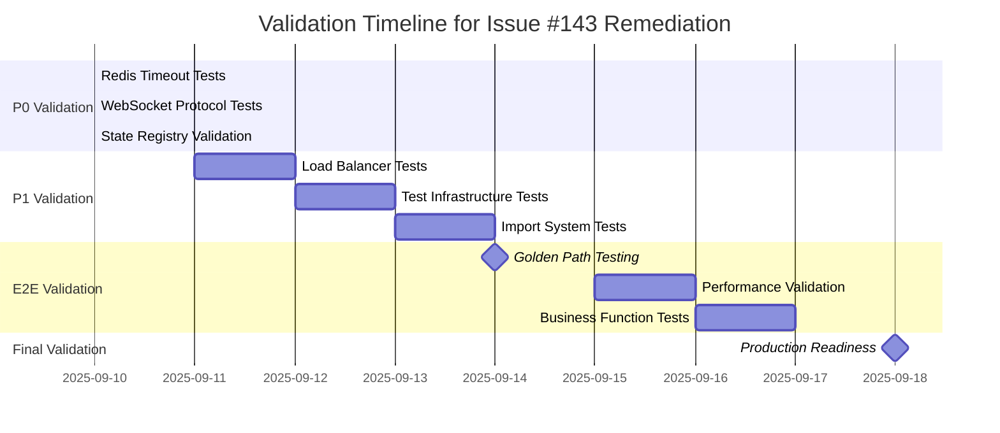

# Validation and Safety Procedures: GitHub Issue #143 Remediation

**PURPOSE:** Comprehensive validation strategy and rollback procedures for infrastructure remediation  
**SCOPE:** All P0, P1, and P2 fixes with safety measures and monitoring  
**CRITICAL REQUIREMENT:** Ensure $500K+ MRR Golden Path functionality is protected throughout remediation

## 🛡️ Pre-Implementation Safety Checklist

**MANDATORY BEFORE STARTING ANY FIX:**

### System Baseline Assessment
```bash
# 1. Capture current system state
python scripts/system_baseline_capture.py --environment staging --output baseline-pre-remediation.json

# 2. Document current error rates
python scripts/error_rate_baseline.py --duration 300s --output current-error-rates.json

# 3. Capture current WebSocket success rates
python scripts/websocket_success_rate_monitor.py --duration 180s --baseline-capture

# 4. Health endpoint performance baseline
for i in {1..10}; do
  curl -w "%{time_total}\n" -s https://your-staging-url/health/ready >> health-baseline.txt
done

# 5. Current Golden Path functionality test
python -m pytest tests/e2e/test_golden_path_baseline.py -xvs --generate-baseline-report
```

### Rollback Preparation
```bash
# 1. Create deployment snapshot
gcloud run services describe netra-backend-staging --region us-central1 --format="export" > staging-service-snapshot.yaml

# 2. Backup Terraform state  
terraform state pull > terraform-state-backup.json
cp terraform.tfstate terraform.tfstate.backup

# 3. Create code rollback points
git tag remediation-start-$(date +%Y%m%d-%H%M%S)
git branch remediation-rollback-$(date +%Y%m%d)

# 4. Prepare rollback scripts
cat > rollback-remediation.sh << 'EOF'
#!/bin/bash
echo "🚨 EMERGENCY ROLLBACK: GitHub Issue #143 Remediation"
echo "Rolling back to pre-remediation state..."

# Rollback deployment
python scripts/deploy_to_gcp.py --project netra-staging --rollback --revision-name $(cat .last-known-good-revision)

# Rollback Terraform if needed
if [ -f "terraform-state-backup.json" ]; then
    terraform state push terraform-state-backup.json
    terraform apply -auto-approve -var-file=backup-vars.tfvars
fi

# Verify rollback success
curl -f https://your-staging-url/health || echo "❌ Health check failed after rollback"
echo "✅ Rollback completed. Verify system manually."
EOF

chmod +x rollback-remediation.sh
```

### Team Notification Setup
```bash
# 1. Set up monitoring alerts
python scripts/setup_remediation_alerts.py --slack-channel "#critical-infrastructure"

# 2. Prepare status communication template
cat > remediation-status-template.md << 'EOF'
# Infrastructure Remediation Status Update

**Date:** $(date)
**GitHub Issue:** #143
**Current Phase:** [P0 Critical / P1 Infrastructure / P2 Operational]

## Progress:
- ✅ Completed: [List completed items]
- 🔄 In Progress: [Current work]  
- ❌ Issues: [Any problems encountered]

## System Health:
- Health Endpoint: [Response time]
- WebSocket Success Rate: [Percentage]
- Error Rate: [Current vs baseline]

## Next Steps:
- [Immediate next actions]
- [Estimated completion time]

**Rollback Status:** [Ready / Not needed / Executed]
EOF
```

## 📋 Comprehensive Validation Strategy

### Phase 1: Individual Component Validation

#### **P0 Fix #1: Redis Timeout Configuration**

**Pre-Implementation Validation:**
```bash
# Confirm current timeout is problematic
python -m pytest netra_backend/tests/unit/websocket_core/test_redis_timeout_fix_unit.py::TestRedisTimeoutFixUnit::test_redis_timeout_configuration_staging_environment -xvs
# Expected: FAIL (proving 30s timeout too long)

# Health endpoint timing baseline
python scripts/health_endpoint_timer.py --samples 20 --timeout-threshold 10
```

**Post-Implementation Validation:**
```bash
# 1. Test should now PASS
python -m pytest netra_backend/tests/unit/websocket_core/test_redis_timeout_fix_unit.py -xvs
# Expected: All tests PASS

# 2. Health endpoint performance improved
python scripts/health_endpoint_timer.py --samples 20 --compare-baseline
# Expected: Response time < 5 seconds consistently

# 3. No timeout errors in deployment logs
gcloud logging read 'resource.type="cloud_run_revision" AND severity="ERROR" AND textPayload~"timeout"' --limit=50 --format="value(textPayload)" | grep -i redis
# Expected: No recent Redis timeout errors

# 4. WebSocket initialization stability
python scripts/websocket_initialization_monitor.py --duration 120s --check-redis-impact
# Expected: No initialization delays due to Redis timeouts
```

**Rollback Criteria:**
- Health endpoint response time > 8 seconds consistently
- Redis timeout errors increase in logs
- WebSocket initialization failures > 5%

#### **P0 Fix #2: WebSocket Protocol Deployment**

**Pre-Implementation Validation:**
```bash
# Check current WebSocket authentication failure rate
python scripts/websocket_auth_monitor.py --environment staging --duration 300s
# Expected: High failure rate with 1011 errors

# Verify current protocol format in deployed frontend
curl -s https://your-staging-frontend-url/_next/static/js/main.js | grep -o "jwt.*protocol" | head -5
```

**Post-Implementation Validation:**
```bash
# 1. WebSocket authentication success
python scripts/test_websocket_auth.py --environment staging --protocol-format "jwt-auth,jwt.test-token"
# Expected: Authentication succeeds

# 2. No 1011 WebSocket errors
python scripts/websocket_error_monitor.py --duration 180s --error-code 1011
# Expected: Zero 1011 errors

# 3. End-to-end chat functionality
python -m pytest tests/e2e/test_chat_functionality_complete.py -xvs
# Expected: Complete chat flow works

# 4. Protocol format verification in deployed bundle
curl -s https://your-staging-frontend-url/_next/static/js/main.js | grep -o "jwt-auth.*encodedToken" 
# Expected: Correct protocol format found
```

**Rollback Criteria:**
- WebSocket authentication failures > 10%
- 1011 errors continue at high rate
- Chat functionality broken
- Protocol format incorrect in deployment

#### **P0 Fix #3: State Registry Scope Bug**

**Status: ✅ Already Fixed - Validation Only**

**Validation Commands:**
```bash
# 1. Original bug test should PASS
python -m pytest netra_backend/tests/unit/websocket_core/test_state_registry_scope_bug.py -xvs
# Expected: PASS (no NameError)

# 2. Complex scope bug test should PASS
python -m pytest netra_backend/tests/unit/websocket_core/test_state_registry_scope_bug_simple.py -xvs
# Expected: PASS

# 3. Integration test should PASS
python -m pytest netra_backend/tests/integration/critical_paths/test_websocket_handshake_state_registry_integration.py -xvs
# Expected: PASS

# 4. E2E Golden Path should PASS
python -m pytest tests/e2e/test_golden_path_state_registry_race_condition.py -xvs
# Expected: PASS

# 5. WebSocket connection success rate monitoring
python scripts/websocket_connection_monitor.py --duration 300s --success-rate-threshold 95
# Expected: Success rate > 95%
```

### Phase 2: P1 Infrastructure Validation

#### **P1 Fix #1: GCP Load Balancer Header Forwarding**

**Pre-Implementation Validation:**
```bash
# Test header stripping (should fail)
python scripts/test_load_balancer_headers.py --header "Authorization: Bearer test" --header "Sec-WebSocket-Protocol: jwt-auth"
# Expected: Headers not reaching backend

# Current WebSocket authentication via Load Balancer
curl -H "Authorization: Bearer test-token" -H "Upgrade: websocket" -v https://your-staging-domain.com/ws 2>&1 | grep -i "authorization\|websocket-protocol"
# Expected: Headers not forwarded
```

**Implementation Validation:**
```bash
# 1. Terraform plan validation
cd terraform-gcp-staging
terraform init
terraform validate
terraform plan -detailed-exitcode
# Expected: Exit code 2 (changes planned), no errors

# 2. Terraform apply monitoring
terraform apply -auto-approve 2>&1 | tee terraform-apply.log
# Monitor for errors during apply

# 3. Infrastructure state verification
terraform show | grep -A 10 -B 5 "header_action\|request_headers_to_add"
# Expected: Header forwarding rules present
```

**Post-Implementation Validation:**
```bash
# 1. Header forwarding test
python scripts/test_load_balancer_headers.py --verify-forwarding --header "Authorization: Bearer test" --header "Sec-WebSocket-Protocol: jwt-auth"
# Expected: Headers reach backend successfully

# 2. WebSocket authentication via Load Balancer  
curl -H "Authorization: Bearer valid-jwt-token" -H "Sec-WebSocket-Protocol: jwt-auth" -H "Upgrade: websocket" -v https://your-staging-domain.com/ws
# Expected: WebSocket upgrade succeeds, authentication works

# 3. Backend service receives headers
gcloud logging read 'resource.type="cloud_run_revision" AND jsonPayload.headers~"Authorization\|WebSocket-Protocol"' --limit=10
# Expected: Headers visible in backend logs

# 4. WebSocket authentication success rate improvement
python scripts/websocket_auth_success_monitor.py --duration 300s --compare-baseline
# Expected: Significant improvement in success rate
```

**Rollback Criteria:**
- Terraform apply fails or corrupts infrastructure
- Load Balancer stops forwarding regular HTTP traffic  
- WebSocket connections completely broken
- Authentication success rate drops below baseline

#### **P1 Fix #2: Test Infrastructure Restoration**

**Pre-Implementation Validation:**
```bash
# Document current test bypassing
grep -r "# @require_docker_services" tests/ netra_backend/tests/ | wc -l
# Expected: Multiple commented-out decorators

# Test current Docker service availability
python -c "from test_framework.unified_docker_manager import UnifiedDockerManager; print(UnifiedDockerManager().check_service_availability())"
# Expected: Services not available or unreliable
```

**Implementation Validation:**
```bash
# 1. Docker services startup test
python scripts/test_docker_services_startup.py --timeout 120
# Expected: All services start successfully

# 2. Decorator restoration verification
grep -r "@require_docker_services()" tests/ netra_backend/tests/ | wc -l
# Expected: Decorators restored

# 3. Sample integration test with real services
python -m pytest tests/integration/test_database_real_connection.py -xvs --real-services
# Expected: PASS with real database connection
```

**Post-Implementation Validation:**
```bash
# 1. Mission critical tests with real services
python tests/unified_test_runner.py --real-services --category mission_critical --timeout 600
# Expected: All tests PASS without bypassing

# 2. Integration test success rate
python tests/unified_test_runner.py --real-services --category integration --generate-report
# Expected: High success rate, no mock fallbacks

# 3. Test infrastructure health monitoring
python scripts/test_infrastructure_health.py --duration 300s --service-check-interval 30
# Expected: Stable service availability

# 4. CI pipeline validation (if applicable)
# Run CI tests to ensure no regressions in automated testing
```

**Rollback Criteria:**
- Docker services fail to start consistently
- Integration tests have lower success rate than baseline
- Test infrastructure becomes less reliable than before
- CI pipeline breaks due to service requirements

### Phase 3: End-to-End Golden Path Validation

#### **Complete User Journey Testing**

**Golden Path Success Criteria:**
```bash
# 1. Complete user flow test
python -m pytest tests/e2e/test_golden_path_complete_user_flow.py -xvs --timeout 300
# Success Criteria:
# - User login succeeds
# - WebSocket connection established  
# - Chat message sent and received
# - All 5 critical WebSocket events delivered
# - AI agent responds appropriately
# - Response delivered to user
# Expected: 100% success rate

# 2. Multi-user isolation test
python -m pytest tests/e2e/test_multi_user_golden_path_isolation.py -xvs --concurrent-users 10
# Success Criteria:
# - 10 concurrent users all complete golden path
# - No cross-contamination between user sessions  
# - All WebSocket events delivered to correct users
# Expected: 100% success rate, complete isolation

# 3. WebSocket event delivery validation
python scripts/websocket_event_delivery_monitor.py --test-all-5-events --duration 180s
# Success Criteria:
# - agent_started: 100% delivery
# - agent_thinking: 100% delivery
# - tool_executing: 100% delivery  
# - tool_completed: 100% delivery
# - agent_completed: 100% delivery
# Expected: All events reliably delivered

# 4. Performance validation
python scripts/golden_path_performance_test.py --sla-requirements
# Success Criteria:
# - WebSocket connection < 2 seconds
# - First agent event < 5 seconds
# - Complete agent response < 60 seconds
# - Health endpoint < 5 seconds
# Expected: All SLAs met consistently
```

#### **Business Functionality Validation**

```bash
# 1. Chat functionality comprehensive test
python scripts/chat_functionality_validation.py --test-scenarios comprehensive
# Test Scenarios:
# - Simple questions and responses
# - Multi-turn conversations
# - Complex agent workflows
# - Tool usage and results
# Expected: All scenarios work as expected

# 2. Revenue protection validation
python scripts/revenue_protection_validation.py --simulate-customer-usage --duration 600s
# Simulates realistic customer usage patterns
# Expected: No revenue-impacting failures

# 3. Error recovery validation  
python scripts/error_recovery_validation.py --inject-failures --recovery-time-max 30s
# Tests system recovery from various failure modes
# Expected: System recovers within 30 seconds from all failure types
```

## 🚨 Real-Time Monitoring During Implementation

### Continuous Health Monitoring
```bash
# Start monitoring script before any changes
python scripts/continuous_infrastructure_monitor.py --alert-thresholds critical &
MONITOR_PID=$!

# Monitor key metrics:
# - Health endpoint response time
# - WebSocket connection success rate  
# - Error rates across all services
# - Authentication success rates
# - Database connection health
# - Redis availability

# After implementation, stop monitoring
kill $MONITOR_PID
```

### Alert Thresholds
```yaml
# monitoring-thresholds.yaml
health_endpoint:
  max_response_time_seconds: 8
  error_rate_threshold: 5%
  
websocket:
  connection_success_rate_min: 90%
  authentication_success_rate_min: 85%
  event_delivery_rate_min: 95%
  
database:
  connection_timeout_max_seconds: 5
  query_error_rate_max: 2%
  
redis:
  availability_min: 95%
  response_time_max_ms: 500
  
golden_path:
  end_to_end_success_rate_min: 85%
  completion_time_max_seconds: 90
```

### Automated Alert Actions
```bash
# If critical thresholds breached:

# 1. Immediate notification
python scripts/send_critical_alert.py --issue "Infrastructure remediation threshold breach" --details "$BREACH_DETAILS"

# 2. Automatic rollback trigger (if configured)
if [ "$AUTO_ROLLBACK_ENABLED" = "true" ]; then
    ./rollback-remediation.sh
    python scripts/send_alert.py --message "Automatic rollback executed due to threshold breach"
fi

# 3. Capture diagnostic data
python scripts/capture_diagnostic_snapshot.py --output "diagnostic-$(date +%Y%m%d-%H%M%S).json"
```

## 🔄 Rollback Procedures by Priority

### P0 Critical Fix Rollbacks

#### **Redis Timeout Configuration Rollback**
```bash
# 1. Quick fix rollback (if code-level change)
git checkout HEAD~1 -- netra_backend/app/websocket_core/gcp_initialization_validator.py
git commit -m "rollback: Redis timeout configuration to previous values"

# 2. Deploy rollback  
python scripts/deploy_to_gcp.py --project netra-staging --service backend --force

# 3. Verify rollback success
python -m pytest netra_backend/tests/unit/websocket_core/test_redis_timeout_fix_unit.py::TestRedisTimeoutFixUnit::test_redis_timeout_configuration_staging_environment -xvs
# Should FAIL again (proving rollback to problematic state)

# 4. Confirm health endpoint behavior
curl -w "%{time_total}\n" https://your-staging-url/health/ready
# Should show longer response times (original behavior)
```

#### **WebSocket Protocol Deployment Rollback**
```bash  
# 1. Rollback backend service
gcloud run services update netra-backend-staging --image=gcr.io/netra-staging/netra-backend-staging:previous-revision --region=us-central1

# 2. Rollback frontend deployment
cd frontend
git checkout previous-working-commit
npm run build
npm run deploy:staging

# 3. Verify rollback
python scripts/test_websocket_auth.py --environment staging
# Should show authentication failures (original problem)

# 4. Clear CDN caches
gcloud cdn cache invalidate --path="/*" --host=your-staging-frontend-url
```

### P1 Infrastructure Fix Rollbacks

#### **GCP Load Balancer Rollback**
```bash
# 1. Terraform state rollback
cd terraform-gcp-staging
terraform state push terraform-state-backup.json

# 2. Apply previous configuration
terraform apply -auto-approve -var-file=previous-config.tfvars

# 3. Verify infrastructure state
terraform show | grep -A 5 -B 5 "load_balancer\|url_map"

# 4. Test basic functionality
curl -f https://your-staging-domain.com/health
# Should return 200 OK
```

#### **Test Infrastructure Rollback**
```bash
# 1. Re-comment require_docker_services decorators
python scripts/disable_docker_service_requirements.py

# 2. Stop Docker services
docker-compose -f test-services.docker-compose.yml down

# 3. Verify tests still pass (with mocks)
python -m pytest tests/integration/sample_test.py -xvs
# Should pass with mock services
```

### Emergency Full System Rollback
```bash
#!/bin/bash
# emergency-full-rollback.sh

echo "🚨 EXECUTING EMERGENCY FULL ROLLBACK"
echo "Rolling back ALL GitHub Issue #143 changes..."

# 1. Code rollback to tagged state
git reset --hard remediation-start-$(date +%Y%m%d)-*

# 2. Service rollback
python scripts/deploy_to_gcp.py --project netra-staging --rollback-to-revision $(cat .last-known-good-revision)

# 3. Infrastructure rollback
cd terraform-gcp-staging
terraform state push terraform-state-backup.json
terraform apply -auto-approve -var-file=emergency-rollback.tfvars

# 4. Verification
echo "Verifying rollback success..."
curl -f https://your-staging-url/health || echo "❌ Health check failed"
python scripts/websocket_basic_test.py || echo "❌ WebSocket test failed"

echo "Emergency rollback completed. Manual verification required."

# 5. Notification
python scripts/send_alert.py --priority critical --message "Emergency full rollback executed for GitHub Issue #143 remediation"
```

## 📊 Success Validation Criteria

### Technical Success Metrics

**P0 Critical Fixes Success:**
- [ ] Redis timeout tests PASS (previously failed)
- [ ] Health endpoint consistent < 5 second response
- [ ] WebSocket authentication > 95% success rate  
- [ ] State registry scope tests PASS (no NameError)
- [ ] No 1011 WebSocket errors in logs

**P1 Infrastructure Fixes Success:**
- [ ] Load Balancer forwards authentication headers
- [ ] Test infrastructure runs with real services
- [ ] Integration tests > 90% success rate with real services
- [ ] Import system stable under load (no "time not defined" errors)

**Overall System Health:**
- [ ] Golden Path E2E tests > 95% success rate
- [ ] All 5 critical WebSocket events reliably delivered
- [ ] Multi-user isolation maintains quality
- [ ] Performance SLAs met consistently

### Business Success Metrics

**Revenue Protection:**
- [ ] Chat functionality 100% operational
- [ ] User login → AI response flow works
- [ ] $500K+ MRR functionality protected
- [ ] No customer-facing service degradation

**Operational Excellence:**
- [ ] Deployment pipeline stability improved
- [ ] Test infrastructure provides authentic validation
- [ ] Monitoring visibility into system health
- [ ] Rollback procedures tested and verified

### Validation Timeline



## 📞 Emergency Response Plan

### Contact Information
```yaml
emergency_contacts:
  primary_engineer: "Engineer implementing changes"
  backup_engineer: "Secondary engineer for support"
  infrastructure_lead: "For Terraform/GCP issues"
  product_owner: "For business impact decisions"
  
communication_channels:
  critical_alerts: "#infrastructure-critical"
  status_updates: "#engineering-status"
  rollback_notifications: "#deployment-alerts"
```

### Escalation Matrix
```
Level 1: Minor issues, single component affected
- Self-resolve within 30 minutes
- Update status in relevant channel

Level 2: Moderate issues, multiple components or performance degradation
- Notify backup engineer
- Consider rollback within 60 minutes
- Update stakeholders

Level 3: Critical issues, business functionality impacted
- Immediate rollback execution
- Notify all stakeholders
- Emergency team assembly
- Post-incident analysis required
```

### Post-Implementation Review Checklist

**Within 24 Hours:**
- [ ] All validation tests passing
- [ ] Performance metrics stable
- [ ] No critical errors in logs
- [ ] Monitoring alerts configured and working
- [ ] Team notification of successful completion

**Within 48 Hours:**
- [ ] Business stakeholder confirmation of functionality
- [ ] Performance comparison with baseline
- [ ] Documentation updated with changes
- [ ] Lessons learned documentation
- [ ] Planning for any follow-up work identified

**Within 1 Week:**
- [ ] Production deployment planning (if applicable)
- [ ] Long-term monitoring results analysis
- [ ] Process improvements identified
- [ ] Knowledge sharing with team
- [ ] GitHub issue #143 closure with full resolution summary

---

**Validation Guide Version:** 1.0  
**Last Updated:** 2025-09-10  
**Critical Success Requirement:** $500K+ MRR Golden Path functionality fully operational  
**Next Review:** After each major validation milestone