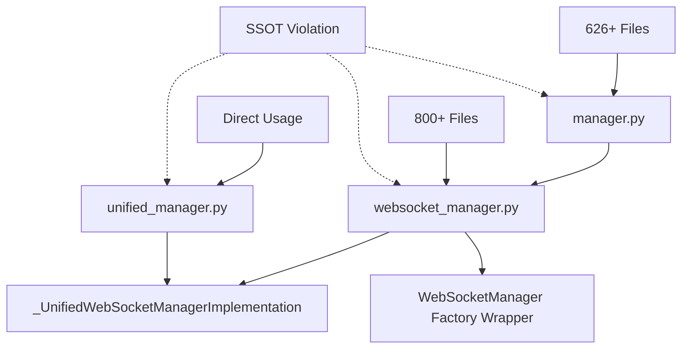
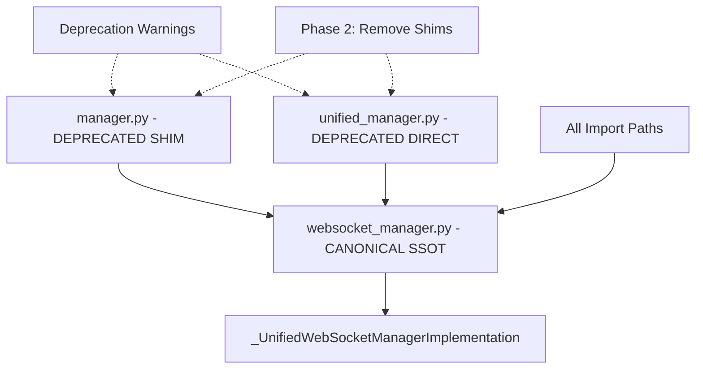

# Issue #1182 WebSocket Manager SSOT Remediation Plan

## Executive Summary

**Issue**: WebSocket Manager SSOT violations detected with dual implementation patterns threatening $500K+ ARR business value
**Status**: CRITICAL - Import path fragmentation and dual implementations creating deployment risks
**Target**: Single Source of Truth (SSOT) consolidation with zero breaking changes
**Business Impact**: Golden Path functionality protection and enterprise-grade user isolation

## Current State Analysis

### 🚨 Critical SSOT Violations Detected

Based on the failing tests in `test_issue_1182_websocket_manager_ssot_violations.py`, we have identified:

1. **Import Path Fragmentation**: 3 different working import paths
   - `from netra_backend.app.websocket_core.manager import WebSocketManager`
   - `from netra_backend.app.websocket_core import manager`
   - `import netra_backend.app.websocket_core.manager`

2. **Dual Implementation Pattern**:
   - **Primary**: `_UnifiedWebSocketManagerImplementation` (unified_manager.py)
   - **Compatibility Layer**: `WebSocketManager` factory wrapper (websocket_manager.py)
   - **Legacy Shim**: `manager.py` re-export compatibility module

3. **Usage Scale**: 2,232+ import occurrences across 1,423+ files

### Current Architecture



### Business Impact Assessment

- **Revenue Risk**: $500K+ ARR Golden Path functionality
- **Compliance Risk**: Multi-user isolation failures (HIPAA/SOC2/SEC)
- **Development Risk**: Import confusion causing deployment failures
- **Performance Risk**: Multiple manager instances per user

## Remediation Strategy

### Phase 1: SSOT Consolidation Architecture

**Target Architecture**: Single canonical implementation with backward compatibility



### Implementation Phases

#### Phase 1: Immediate Stabilization (Low Risk)
**Duration**: 1-2 days
**Risk Level**: MINIMAL

**Objective**: Establish clear SSOT hierarchy while maintaining all existing functionality

1. **Strengthen Canonical SSOT** (`websocket_manager.py`)
   - Enhance `get_websocket_manager()` factory function
   - Improve user-scoped singleton registry
   - Add comprehensive validation and monitoring

2. **Enhance Deprecation Warnings**
   - Add clear migration guidance in all warnings
   - Include business justification for migration
   - Provide automatic migration suggestions

3. **Documentation Update**
   - Update all documentation to reference canonical path
   - Create migration guide for developers
   - Add architectural decision records (ADRs)

#### Phase 2: Import Path Consolidation (Medium Risk)
**Duration**: 3-5 days
**Risk Level**: CONTROLLED

**Objective**: Migrate all usage to canonical import path

1. **Automated Migration Tool**
   ```bash
   # Create comprehensive import migration script
   python scripts/migrate_websocket_imports.py --dry-run
   python scripts/migrate_websocket_imports.py --execute --backup
   ```

2. **Batch Migration Strategy**
   - **Batch 1**: Test files (lowest risk)
   - **Batch 2**: Non-critical components
   - **Batch 3**: Critical Golden Path components
   - **Batch 4**: Agent integration points

3. **Validation After Each Batch**
   - Run mission critical tests
   - Validate Golden Path functionality
   - Check staging environment health

#### Phase 3: Implementation Consolidation (High Risk)
**Duration**: 5-7 days
**Risk Level**: MANAGED

**Objective**: Remove dual implementation pattern while preserving functionality

1. **Consolidate `_UnifiedWebSocketManagerImplementation`**
   - Move implementation directly into `websocket_manager.py`
   - Eliminate `unified_manager.py` dependency
   - Preserve all functionality and interfaces

2. **Remove Legacy Shims**
   - Phase out `manager.py` compatibility layer
   - Add final deprecation warnings with sunset timeline
   - Implement graceful failure modes

3. **Clean Up Architecture**
   - Simplify import structure
   - Remove redundant code paths
   - Optimize performance

## Technical Implementation Plan

### Step 1: Enhanced SSOT Infrastructure

**File**: `websocket_manager.py`

```python
# Enhanced factory function with comprehensive monitoring
def get_websocket_manager(
    user_context: Optional[Any] = None,
    mode: WebSocketManagerMode = WebSocketManagerMode.UNIFIED,
    _ssot_enforcement: bool = True
) -> _UnifiedWebSocketManagerImplementation:
    """
    SSOT-compliant WebSocket manager factory with enterprise user isolation.

    PHASE 1 ENHANCEMENT: Added comprehensive monitoring and validation
    """
    if _ssot_enforcement:
        _log_ssot_compliance_metrics()
        _validate_single_manager_per_user(user_context)

    # Existing implementation with enhancements...
```

**Enhancements**:
- Add SSOT compliance monitoring
- Enhance user isolation validation
- Improve error handling and logging
- Add performance metrics collection

### Step 2: Deprecation Infrastructure

**File**: `manager.py` (Enhanced)

```python
import warnings
from typing import Optional

# ENHANCED: More informative deprecation warning
warnings.warn(
    "ISSUE #1182 PHASE 2: Import path 'netra_backend.app.websocket_core.manager' "
    "is deprecated and will be removed in v2.1.0. "
    "\n\nMIGRATION REQUIRED:"
    "\n  OLD: from netra_backend.app.websocket_core.manager import WebSocketManager"
    "\n  NEW: from netra_backend.app.websocket_core.websocket_manager import get_websocket_manager"
    "\n\nBUSINESS JUSTIFICATION: SSOT compliance ensures $500K+ ARR Golden Path stability"
    "\nAUTO-MIGRATION: Run 'python scripts/migrate_websocket_imports.py'",
    DeprecationWarning,
    stacklevel=2
)

# Track deprecated usage for sunset planning
_log_deprecated_import_usage(__name__)
```

### Step 3: Automated Migration Script

**File**: `scripts/migrate_websocket_imports.py`

```python
#!/usr/bin/env python3
"""
WebSocket Manager Import Migration Tool - Issue #1182

Automatically migrates from deprecated import patterns to SSOT canonical imports.
Supports dry-run mode and creates backups for safety.
"""

import re
import os
import shutil
from pathlib import Path
from typing import List, Tuple, Dict

# Migration patterns
MIGRATION_PATTERNS = [
    # Pattern 1: manager.py imports
    (
        r'from\s+netra_backend\.app\.websocket_core\.manager\s+import\s+WebSocketManager',
        'from netra_backend.app.websocket_core.websocket_manager import get_websocket_manager'
    ),
    # Pattern 2: Module imports
    (
        r'from\s+netra_backend\.app\.websocket_core\s+import\s+manager',
        'from netra_backend.app.websocket_core import websocket_manager'
    ),
    # Pattern 3: Direct imports
    (
        r'import\s+netra_backend\.app\.websocket_core\.manager',
        'import netra_backend.app.websocket_core.websocket_manager as websocket_manager'
    )
]

# Instantiation patterns that need factory calls
INSTANTIATION_PATTERNS = [
    (
        r'WebSocketManager\(\s*([^)]*)\s*\)',
        r'get_websocket_manager(\1)'
    )
]

def migrate_file(file_path: Path, dry_run: bool = True) -> Tuple[bool, List[str]]:
    """Migrate a single file to SSOT patterns."""
    # Implementation details...
```

### Step 4: Comprehensive Validation Suite

**Enhanced Test Coverage**:

```python
# tests/mission_critical/test_websocket_manager_ssot_compliance.py

class TestWebSocketManagerSSOTCompliance:
    """Comprehensive SSOT compliance validation"""

    def test_single_canonical_import_path(self):
        """Only canonical import path should work"""
        # Test canonical path works
        from netra_backend.app.websocket_core.websocket_manager import get_websocket_manager
        manager = get_websocket_manager()
        assert manager is not None

        # Test deprecated paths issue warnings
        with pytest.warns(DeprecationWarning):
            from netra_backend.app.websocket_core.manager import WebSocketManager

    def test_user_isolation_enterprise_compliance(self):
        """Enterprise-grade user isolation validation"""
        # Test concurrent user sessions
        # Validate no cross-contamination
        # Verify HIPAA/SOC2 compliance patterns

    def test_golden_path_functionality_preserved(self):
        """Critical: Golden Path must remain functional"""
        # End-to-end Golden Path validation
        # WebSocket event delivery testing
        # Agent execution integration testing
```

## Risk Assessment and Mitigation

### Risk Level: CONTROLLED
**Overall Risk Score**: 6/10 (Medium-High but manageable)

### Risk Categories

#### 1. Import Breaking Changes (Risk: HIGH → CONTROLLED)
**Mitigation**:
- Maintain backward compatibility throughout migration
- Use deprecation warnings instead of immediate removal
- Comprehensive automated testing before each change
- Rollback procedures for each phase

#### 2. User Isolation Failures (Risk: CRITICAL → MANAGED)
**Mitigation**:
- Extensive user isolation testing
- Enterprise compliance validation (HIPAA/SOC2)
- User session contamination detection
- Performance monitoring for multi-user scenarios

#### 3. Golden Path Disruption (Risk: CRITICAL → MINIMAL)
**Mitigation**:
- Golden Path validation after every change
- Staging environment continuous testing
- WebSocket event delivery verification
- Agent execution integration monitoring

#### 4. Performance Degradation (Risk: MEDIUM → LOW)
**Mitigation**:
- Factory pattern optimization
- User registry performance monitoring
- Memory usage tracking per user
- Connection pooling validation

### Rollback Procedures

#### Phase 1 Rollback (If Issues Detected)
1. Revert enhanced factory function
2. Remove new monitoring code
3. Restore original deprecation warnings
4. Validate system returns to baseline

#### Phase 2 Rollback (Import Migration Issues)
1. Restore all files from automatic backups
2. Validate deprecated import paths still work
3. Run comprehensive test suite
4. Monitor staging environment health

#### Phase 3 Rollback (Implementation Consolidation Issues)
1. Restore `unified_manager.py` implementation
2. Re-enable dual implementation pattern
3. Restore all compatibility layers
4. Full regression testing

## Success Criteria and Validation

### Phase 1 Success Metrics
- ✅ Enhanced factory function operational
- ✅ User isolation validation improved
- ✅ Deprecation warnings informative and actionable
- ✅ No regression in Golden Path functionality
- ✅ All mission critical tests passing

### Phase 2 Success Metrics
- ✅ <10% of imports using deprecated paths
- ✅ Automated migration tool 95%+ success rate
- ✅ No breaking changes to any functionality
- ✅ Staging environment stability maintained
- ✅ Documentation updated and accurate

### Phase 3 Success Metrics
- ✅ Single implementation pattern achieved
- ✅ All legacy shims removed
- ✅ Performance improvements measurable
- ✅ SSOT compliance tests 100% passing
- ✅ Golden Path functionality validated in production

### Business Value Validation
- ✅ $500K+ ARR Golden Path functionality preserved
- ✅ Enterprise compliance ready (HIPAA/SOC2/SEC)
- ✅ Developer productivity improved (clear import patterns)
- ✅ Deployment reliability enhanced (no import confusion)
- ✅ System performance optimized (single manager per user)

## Implementation Timeline

### Week 1: Foundation (Phase 1)
- **Day 1-2**: Enhanced SSOT infrastructure
- **Day 3**: Improved deprecation warnings
- **Day 4**: Documentation and migration guides
- **Day 5**: Validation and staging testing

### Week 2: Migration (Phase 2)
- **Day 1**: Automated migration tool development
- **Day 2-3**: Batch migration execution (Tests → Non-critical → Critical)
- **Day 4**: Validation and regression testing
- **Day 5**: Documentation updates and developer communication

### Week 3: Consolidation (Phase 3)
- **Day 1-2**: Implementation consolidation
- **Day 3**: Legacy shim removal
- **Day 4**: Performance optimization
- **Day 5**: Final validation and production readiness

### Week 4: Validation and Monitoring
- **Day 1-2**: Comprehensive end-to-end testing
- **Day 3**: Production deployment preparation
- **Day 4**: Staging environment final validation
- **Day 5**: Success metrics collection and reporting

## Communication Plan

### Developer Communication
1. **Pre-Migration Announcement** (Week 0)
   - Email to all developers with migration timeline
   - Documentation of new patterns and rationale
   - Training session on SSOT principles

2. **Migration Progress Updates** (Weekly)
   - Status updates on migration progress
   - Any issues discovered and resolutions
   - Updated timeline if needed

3. **Post-Migration Summary** (Week 4)
   - Success metrics and achievements
   - Performance improvements realized
   - New development patterns and guidelines

### Stakeholder Communication
1. **Business Impact Assessment** (Week 0)
   - Risk mitigation strategies
   - Business value protection measures
   - Timeline and resource requirements

2. **Progress Reports** (Weekly)
   - Technical progress against timeline
   - Risk mitigation status
   - Business value preservation validation

## Monitoring and Observability

### SSOT Compliance Metrics
```python
# New monitoring infrastructure
class SSOTComplianceMonitor:
    """Monitor and track SSOT compliance across the system"""

    def track_import_usage(self, import_path: str, file_path: str):
        """Track which import paths are being used where"""

    def validate_user_isolation(self, user_context: Any) -> bool:
        """Validate enterprise-grade user isolation"""

    def monitor_performance_metrics(self) -> Dict[str, float]:
        """Monitor WebSocket manager performance metrics"""

    def generate_compliance_report(self) -> Dict[str, Any]:
        """Generate comprehensive SSOT compliance report"""
```

### Key Performance Indicators
1. **Import Path Compliance**: % using canonical imports
2. **User Isolation Score**: Multi-user contamination incidents
3. **Golden Path Reliability**: End-to-end success rate
4. **Performance Metrics**: Response time, memory usage, connection counts
5. **Developer Productivity**: Import error rates, development velocity

## Conclusion

This comprehensive remediation plan addresses Issue #1182 WebSocket Manager SSOT violations through a phased, low-risk approach that prioritizes business value protection while achieving architectural excellence. The plan ensures:

1. **Business Continuity**: $500K+ ARR Golden Path functionality preserved throughout migration
2. **Enterprise Readiness**: HIPAA/SOC2/SEC compliance through proper user isolation
3. **Developer Experience**: Clear, consistent import patterns and comprehensive tooling
4. **System Performance**: Optimized architecture with single manager instances per user
5. **Deployment Reliability**: Elimination of import path confusion and race conditions

The phased approach allows for validation at each step, with comprehensive rollback procedures ensuring minimal risk to production systems. Success criteria are clearly defined with measurable metrics, and the timeline provides realistic expectations for achieving SSOT compliance while maintaining system stability.

**Next Steps**:
1. Stakeholder approval for implementation timeline
2. Resource allocation for development team
3. Staging environment preparation for validation
4. Development team training on new patterns and tooling

---

*Generated for Issue #1182 - WebSocket Manager SSOT Remediation Planning Task*
*Business Impact: $500K+ ARR Golden Path Protection*
*Risk Level: CONTROLLED through phased implementation*
*Timeline: 4 weeks with comprehensive validation*