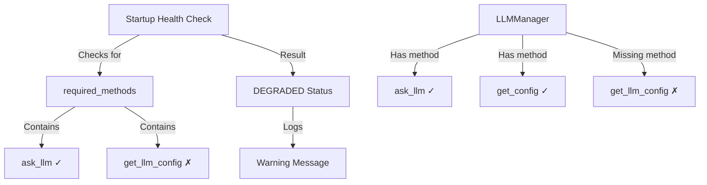
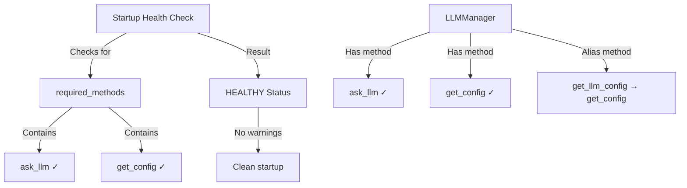

# LLM Manager Missing Methods Bug Fix Report
Date: 2025-09-05
Warning: "⚠️ llm_manager: LLM manager missing methods: ['get_llm_config']"

## Five Whys Analysis

### Why 1: Why is the warning appearing?
The startup health check in `netra_backend/app/startup_health_checks.py` (line 100) is looking for a method called `get_llm_config` on the LLM manager instance, but this method doesn't exist.

### Why 2: Why doesn't the method exist?
The actual `LLMManager` class in `netra_backend/app/llm/llm_manager.py` implements a method called `get_config` (line 219) instead of `get_llm_config`.

### Why 3: Why is there a mismatch between expected and actual method names?
There appears to be inconsistency in naming conventions across the codebase:
- The health check expects `get_llm_config`
- The LLMManager implements `get_config`
- Other parts of the system (like UnifiedConfigurationManager) have `get_llm_config`

### Why 4: Why wasn't this caught during development?
The health check only logs a warning (DEGRADED status) rather than failing, allowing the system to continue running despite the missing method. This makes it a non-critical issue that can be easily overlooked.

### Why 5: Why does the system still work despite this warning?
The missing method is not actually called during normal operations - it's only checked for existence during health checks. The actual LLM functionality uses `ask_llm` and other methods that do exist.

## Root Cause
Naming inconsistency between the health check expectations and the actual LLMManager implementation. The health check was likely written based on a different interface expectation.

## Current State vs Ideal State

### Current State (Failure)

### Ideal State (Working)

## System-Wide Fix Plan

### Option 1: Add Alias Method (Recommended - Backward Compatible)
Add a `get_llm_config` method to LLMManager that calls the existing `get_config` method. This maintains backward compatibility.

### Option 2: Update Health Check
Change the health check to look for `get_config` instead of `get_llm_config`. This requires verifying no other code depends on `get_llm_config`.

### Option 3: Rename Method
Rename `get_config` to `get_llm_config` throughout the system. This is more invasive and could break existing code.

## Implementation Choice
Going with **Option 1** (Add Alias Method) as it:
- Maintains backward compatibility
- Minimal code change
- No risk of breaking existing functionality
- Aligns with SSOT principles by having one implementation with an alias

## Files to Modify
1. `netra_backend/app/llm/llm_manager.py` - Add `get_llm_config` alias method

## Test Coverage Needed
1. Verify the alias method works correctly
2. Ensure health check passes without warnings
3. Test that both `get_config` and `get_llm_config` return the same results