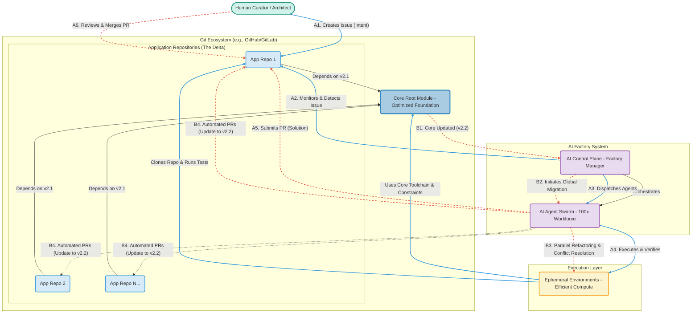

This Mermaid diagram illustrates the architecture of the AI-Native GitOps Factory and its two primary workflows: (1) Customization and Evolution via feature requests, and (2) Automated Synchronization of core updates across the organization.

### Diagram Explanation

#### Components

  * **Human Curator / Architect:** The human user who defines intent (via Issues) and oversees the results (via PRs).
  * **Git Ecosystem:** The source of truth.
      * **Core Root Module:** The optimized, opinionated foundation defining the architecture, toolchain, and constraints.
      * **Application Repositories:** Individual projects that depend on the Core and contain only the customized business logic (the "delta").
  * **AI Factory System:** The intelligence core. The **AI Control Plane** acts as the Factory Manager, monitoring the Git ecosystem and orchestrating the **AI Agent Swarm** (the 100x compute workforce).
  * **Execution Layer:** The lightweight, **Ephemeral Environments** where agents clone code, execute tasks, and verify solutions at scale.

#### Workflows

**Workflow A: Customization & Evolution (Solid Blue Arrows)**

This follows the standard development cycle for a specific feature or change.

1.  A Human creates a GitHub Issue in an App Repo (e.g., a feature request).
2.  The AI Control Plane detects the issue.
3.  It dispatches the AI Swarm.
4.  The agents execute the task in the Ephemeral Environments, utilizing the Core's toolchain to ensure compliance and efficiency.
5.  The optimal solution is submitted as a Pull Request.
6.  The Human reviews and merges the AI-generated code.

**Workflow B: Automated Synchronization & Refactoring (Dotted Red Arrows)**

This is the high-value automation capability that eliminates framework-level technical debt.

1.  The Core Root Module is updated (e.g., a security patch or architectural improvement, moving from v2.1 to v2.2).
2.  The AI Control Plane detects the change and initiates a global migration.
3.  The Swarm mobilizes in parallel across *all* dependent repositories, automatically refactoring customizations and resolving conflicts.
4.  Automated PRs are opened across the organization, bringing the entire ecosystem up to date.