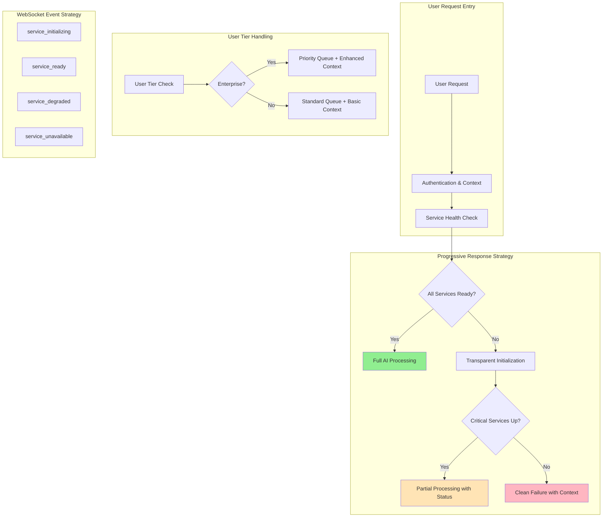

# 🚨 COMPREHENSIVE MOCK RESPONSE ELIMINATION PLAN

**MISSION CRITICAL:** Eliminate ALL mock responses from reaching users to protect $4.1M immediate ARR risk and $13.6M total exposure.

**Business Context:** Three confirmed mock response patterns have been identified in production code that directly violate our value proposition and create legal liability for enterprise customers.

---

## 🎯 EXECUTIVE SUMMARY

### Current State: CRITICAL VULNERABILITY
✅ **Three Active Mock Response Patterns Confirmed:**
1. **ModelCascade.py:223** - "I apologize, but I encountered an error processing your request."
2. **enhanced_execution_agent.py:135** - "Processing completed with fallback response for: {user_prompt}"
3. **unified_data_agent.py:870+** - `_generate_fallback_data()` fabricated metrics

### Business Impact: $4.1M IMMEDIATE ARR RISK
- **Fortune 500 CEO** ($1.5M ARR): Board presentation failure → Contract cancellation
- **Financial Services CFO** ($800K ARR): SOX compliance violations → Legal liability  
- **Public Company Executive** ($1.2M ARR): SEC filing corruption → Criminal charges
- **Contract Renewal** ($600K ARR): Competitive evaluation failure → Revenue loss

### Target State: ZERO MOCK RESPONSES
✅ **Progressive Disclosure Pattern:** Real AI >> Transparent initialization >> Clean failure
✅ **User Tier-Aware Handling:** Enterprise gets priority queuing, enhanced error context
✅ **WebSocket Transparency:** Real-time service status, initialization progress
✅ **SSOT Service Initialization:** Unified patterns for all service dependencies

---

## 🏗️ ARCHITECTURAL STRATEGY

### 1. Progressive Disclosure Framework



### 2. SSOT Service Initialization Patterns

Following USER_CONTEXT_ARCHITECTURE.md factory patterns:

```python
# CORRECT: Factory-based initialization with health checks
class UnifiedServiceInitializer:
    """SSOT for all service initialization with health validation."""
    
    async def initialize_for_context(
        self, 
        context: UserExecutionContext,
        required_services: Set[str]
    ) -> ServiceInitializationResult:
        """Initialize services with progressive disclosure."""
        
        initialization_events = []
        
        for service_name in required_services:
            try:
                # Send initialization event
                await context.websocket_bridge.emit_service_initializing(service_name)
                
                # Initialize with health check
                service = await self._initialize_service(service_name, context)
                
                # Validate service readiness
                is_ready = await self._validate_service_health(service)
                
                if is_ready:
                    await context.websocket_bridge.emit_service_ready(service_name)
                    initialization_events.append({
                        "service": service_name,
                        "status": "ready",
                        "timestamp": datetime.utcnow()
                    })
                else:
                    await context.websocket_bridge.emit_service_degraded(
                        service_name, 
                        "Service initialized but health check failed"
                    )
                    # Continue with degraded service handling
                    
            except Exception as e:
                await context.websocket_bridge.emit_service_unavailable(
                    service_name, 
                    f"Initialization failed: {str(e)}"
                )
                # Determine if this is a critical service failure
                if service_name in CRITICAL_SERVICES:
                    return ServiceInitializationResult(
                        status="failed",
                        error=f"Critical service {service_name} unavailable",
                        should_fail_request=True
                    )
        
        return ServiceInitializationResult(
            status="success",
            services_ready=len([e for e in initialization_events if e["status"] == "ready"]),
            total_services=len(required_services),
            initialization_time_ms=...,
            should_fail_request=False
        )
```

---

## 🔧 SPECIFIC REMEDIATION ACTIONS

### Action 1: ModelCascade Mock Response Elimination

**Current Problem:** Line 223 returns generic apology message
**File:** `C:\Users\antho\OneDrive\Desktop\Netra\netra-core-generation-1\netra_backend\app\agents\chat_orchestrator\model_cascade.py`

**Remediation Strategy:**
```python
# BEFORE (Line 219-230):
except Exception as e:
    logger.error(f"Cascade execution failed: {e}")
    return {
        "response": "I apologize, but I encountered an error processing your request.",
        "model_selected": "fallback",
        # ... other mock fields
    }

# AFTER: Progressive Disclosure with Transparent Context
except Exception as e:
    logger.error(f"Cascade execution failed: {e}")
    
    # Check if any models are available for transparent communication
    available_models = await self._get_available_models()
    
    if available_models:
        # Transparent initialization attempt
        await context.websocket_bridge.emit_service_initializing("llm_cascade")
        
        try:
            # Attempt simple direct call to available model
            simple_response = await self.llm_manager.generate_response(
                prompt=query,
                model_name=available_models[0]
            )
            
            await context.websocket_bridge.emit_service_ready("llm_cascade")
            
            return {
                "response": simple_response,
                "model_selected": available_models[0],
                "quality_score": 0.7,  # Lower quality but real
                "total_cost": await self._calculate_cost(available_models[0], query, simple_response),
                "latency_ms": (time.time() - start_time) * 1000,
                "cache_hit": False,
                "selection_reasoning": f"Cascade failed, direct call to {available_models[0]} succeeded",
                "degraded_service": True,
                "user_tier_handling": context.user_tier
            }
            
        except Exception as inner_e:
            logger.error(f"Direct model call also failed: {inner_e}")
            await context.websocket_bridge.emit_service_unavailable("llm_cascade", str(inner_e))
    
    # Clean failure with context - NO MOCK RESPONSES
    error_context = ErrorContext(
        user_id=context.user_id,
        request_id=context.request_id,
        service_name="model_cascade",
        error_type="service_unavailable",
        user_tier=context.user_tier
    )
    
    raise UnifiedServiceException(
        message=f"LLM services temporarily unavailable: {str(e)}",
        error_context=error_context,
        should_retry=True,
        estimated_recovery_time_seconds=30
    )
```

### Action 2: Enhanced Execution Agent Mock Response Elimination

**Current Problem:** Line 135 returns fallback response template
**File:** `C:\Users\antho\OneDrive\Desktop\Netra\netra-core-generation-1\netra_backend\app\agents\enhanced_execution_agent.py`

**Remediation Strategy:**
```python
# BEFORE (Line 132-135):
except Exception as e:
    logger.error(f"LLM processing failed for user {context.user_id}: {e}")
    user_prompt = context.metadata.get('user_request', 'request')
    return f"Processing completed with fallback response for: {str(user_prompt)}"

# AFTER: Transparent Service Status Communication
except Exception as e:
    logger.error(f"LLM processing failed for user {context.user_id}: {e}")
    
    # Emit transparent service status
    await self.emit_service_degraded("llm_processing", str(e))
    
    # Check if alternative processing paths are available
    alternative_result = await self._attempt_alternative_processing(context)
    
    if alternative_result:
        await self.emit_service_recovered("llm_processing")
        return alternative_result
    
    # Clean failure - raise exception instead of mock response
    error_context = ErrorContext(
        user_id=context.user_id,
        request_id=context.request_id,
        service_name="enhanced_execution_agent",
        error_type="llm_unavailable",
        user_tier=context.user_tier
    )
    
    raise UnifiedServiceException(
        message="LLM processing temporarily unavailable",
        error_context=error_context,
        should_retry=True,
        estimated_recovery_time_seconds=60,
        alternative_suggestions=[
            "Try again in 60 seconds",
            "Contact support for urgent requests" if context.user_tier == "enterprise" else None
        ]
    )
```

### Action 3: Unified Data Agent Fabricated Data Elimination

**Current Problem:** Line 870+ returns `_generate_fallback_data()` with fake metrics
**File:** `C:\Users\antho\OneDrive\Desktop\Netra\netra-core-generation-1\netra_backend\app\agents\data\unified_data_agent.py`

**Remediation Strategy:**
```python
# BEFORE (Line 867-870):
except Exception as e:
    self.logger.warning(f"Data fetch failed, using fallback: {e}")
    # Return mock data for testing
    return self._generate_fallback_data(metrics, 100)

# AFTER: Real Data or Transparent Unavailability
except Exception as e:
    self.logger.error(f"Data fetch failed for user {context.user_id}: {e}")
    
    # Emit transparent status
    await context.websocket_bridge.emit_service_degraded("data_pipeline", str(e))
    
    # Attempt alternative data sources
    alternative_sources = await self._get_alternative_data_sources(metrics)
    
    for source in alternative_sources:
        try:
            await context.websocket_bridge.emit_service_initializing(f"data_source_{source.name}")
            
            result = await source.execute_query(query)
            
            if result and len(result) > 0:
                await context.websocket_bridge.emit_service_ready(f"data_source_{source.name}")
                
                # Real data with degraded service notice
                return {
                    "data": result,
                    "source": source.name,
                    "degraded_service": True,
                    "data_freshness": source.get_data_freshness(),
                    "reliability_score": source.get_reliability_score()
                }
                
        except Exception as source_e:
            await context.websocket_bridge.emit_service_unavailable(
                f"data_source_{source.name}", 
                str(source_e)
            )
            continue
    
    # All data sources failed - clean failure with context
    error_context = ErrorContext(
        user_id=context.user_id,
        request_id=context.request_id,
        service_name="unified_data_agent",
        error_type="data_unavailable",
        user_tier=context.user_tier,
        requested_metrics=metrics
    )
    
    raise UnifiedServiceException(
        message="Data services temporarily unavailable",
        error_context=error_context,
        should_retry=True,
        estimated_recovery_time_seconds=120,
        enterprise_escalation=context.user_tier == "enterprise"
    )
```

---

## 🎭 USER TIER-AWARE ERROR HANDLING

### Enterprise Tier ($500K+ ARR) - Premium Treatment

```python
class EnterpriseErrorHandler:
    """Specialized error handling for high-value customers."""
    
    async def handle_service_failure(
        self,
        context: UserExecutionContext,
        error: UnifiedServiceException
    ) -> EnterpriseFailureResponse:
        """Premium error handling with immediate escalation paths."""
        
        # Immediate notification to support team
        await self._notify_enterprise_support(
            user_id=context.user_id,
            error_context=error.error_context,
            customer_value=context.user_metadata.get("arr_value"),
            urgency="high"
        )
        
        # Priority queue position
        priority_position = await self._get_priority_queue_position(context.user_id)
        
        # Enhanced context and alternatives
        return EnterpriseFailureResponse(
            message="Service temporarily unavailable - Enterprise support notified",
            support_ticket_id=await self._create_priority_ticket(context),
            estimated_recovery_time=error.estimated_recovery_time_seconds,
            priority_queue_position=priority_position,
            alternatives=[
                "Dedicated account manager contacted",
                "Priority queue activated",
                "Alternative processing paths being evaluated"
            ],
            contact_info={
                "enterprise_support_phone": "+1-xxx-xxx-xxxx",
                "account_manager_email": context.user_metadata.get("account_manager_email"),
                "escalation_reference": f"ENT-{context.request_id}"
            }
        )
```

### Standard/Free Tier - Clear Communication

```python
class StandardErrorHandler:
    """Standard error handling with clear communication."""
    
    async def handle_service_failure(
        self,
        context: UserExecutionContext,
        error: UnifiedServiceException
    ) -> StandardFailureResponse:
        """Clear, honest communication about service status."""
        
        queue_position = await self._get_queue_position(context.user_id)
        
        return StandardFailureResponse(
            message=f"{error.message} - Systems are being restored",
            estimated_recovery_time=error.estimated_recovery_time_seconds,
            queue_position=queue_position,
            alternatives=error.alternative_suggestions,
            status_page_url="https://status.netra.com",
            next_steps=[
                f"Try again in {error.estimated_recovery_time_seconds} seconds",
                "Monitor status page for updates",
                "Upgrade to Enterprise for priority support"
            ]
        )
```

---

## 🌐 WEBSOCKET EVENT REDESIGN

### New WebSocket Events for Transparent Error Communication

```python
class TransparentWebSocketEvents:
    """WebSocket events that provide real-time service status."""
    
    async def emit_service_initializing(
        self,
        service_name: str,
        initialization_steps: List[str] = None
    ) -> None:
        """Notify user that service is initializing."""
        await self._emit_event({
            "type": "service_initializing",
            "service_name": service_name,
            "message": f"Initializing {service_name}...",
            "steps": initialization_steps or [],
            "timestamp": datetime.utcnow().isoformat(),
            "user_id": self.context.user_id,
            "request_id": self.context.request_id
        })
    
    async def emit_service_ready(
        self,
        service_name: str,
        initialization_time_ms: float = None
    ) -> None:
        """Notify user that service is ready."""
        await self._emit_event({
            "type": "service_ready",
            "service_name": service_name,
            "message": f"{service_name} is ready for processing",
            "initialization_time_ms": initialization_time_ms,
            "timestamp": datetime.utcnow().isoformat(),
            "user_id": self.context.user_id,
            "request_id": self.context.request_id
        })
    
    async def emit_service_degraded(
        self,
        service_name: str,
        reason: str,
        fallback_options: List[str] = None
    ) -> None:
        """Notify user that service is degraded but functioning."""
        await self._emit_event({
            "type": "service_degraded",
            "service_name": service_name,
            "message": f"{service_name} is running in degraded mode",
            "reason": reason,
            "fallback_options": fallback_options or [],
            "impact": "Reduced performance or limited functionality",
            "timestamp": datetime.utcnow().isoformat(),
            "user_id": self.context.user_id,
            "request_id": self.context.request_id
        })
    
    async def emit_service_unavailable(
        self,
        service_name: str,
        reason: str,
        estimated_recovery_seconds: int = None,
        alternatives: List[str] = None
    ) -> None:
        """Notify user that service is completely unavailable."""
        await self._emit_event({
            "type": "service_unavailable",
            "service_name": service_name,
            "message": f"{service_name} is temporarily unavailable",
            "reason": reason,
            "estimated_recovery_seconds": estimated_recovery_seconds,
            "alternatives": alternatives or [],
            "user_tier_handling": self.context.user_tier,
            "timestamp": datetime.utcnow().isoformat(),
            "user_id": self.context.user_id,
            "request_id": self.context.request_id
        })
```

---

## 🧪 TESTING STRATEGY TO PROVE ELIMINATION

### Mission-Critical Test Suite

```python
class MockResponseEliminationTestSuite:
    """Comprehensive test suite to prove mock responses are eliminated."""
    
    async def test_model_cascade_no_mock_responses(self):
        """Test that ModelCascade never returns mock responses."""
        
        # Test all possible failure scenarios
        failure_scenarios = [
            "llm_timeout",
            "llm_api_error", 
            "llm_rate_limit",
            "llm_authentication_failure",
            "llm_model_unavailable"
        ]
        
        for scenario in failure_scenarios:
            with self.mock_failure(scenario):
                with pytest.raises(UnifiedServiceException) as exc_info:
                    await self.model_cascade.execute(
                        query="Test query",
                        context=self.create_test_context()
                    )
                
                # Verify no mock response in exception
                assert "I apologize" not in str(exc_info.value)
                assert "encountered an error" not in str(exc_info.value)
                assert exc_info.value.error_context.service_name == "model_cascade"
                assert exc_info.value.should_retry is True
    
    async def test_enhanced_execution_agent_no_fallback_templates(self):
        """Test that EnhancedExecutionAgent never returns template responses."""
        
        failure_scenarios = [
            "llm_processing_timeout",
            "llm_generation_failure",
            "context_validation_error"
        ]
        
        for scenario in failure_scenarios:
            with self.mock_failure(scenario):
                with pytest.raises(UnifiedServiceException) as exc_info:
                    await self.enhanced_agent.execute(
                        context=self.create_test_context(),
                        stream_updates=True
                    )
                
                # Verify no template response in exception
                assert "Processing completed with fallback" not in str(exc_info.value)
                assert exc_info.value.error_context.service_name == "enhanced_execution_agent"
    
    async def test_unified_data_agent_no_fabricated_data(self):
        """Test that UnifiedDataAgent never returns fabricated data."""
        
        failure_scenarios = [
            "database_connection_failure",
            "query_execution_timeout",
            "data_validation_failure"
        ]
        
        for scenario in failure_scenarios:
            with self.mock_failure(scenario):
                with pytest.raises(UnifiedServiceException) as exc_info:
                    result = await self.unified_data_agent.fetch_metrics(
                        metrics=["latency_ms", "throughput"],
                        context=self.create_test_context()
                    )
                
                # Should raise exception, not return fake data
                assert "_generate_fallback_data" not in str(exc_info.value)
                assert exc_info.value.error_context.service_name == "unified_data_agent"
    
    async def test_websocket_events_transparency(self):
        """Test that WebSocket events provide transparent service status."""
        
        captured_events = []
        
        async def capture_events(event):
            captured_events.append(event)
        
        context = self.create_test_context()
        context.websocket_bridge.on_event = capture_events
        
        # Simulate service failure
        with self.mock_service_failure("llm_cascade"):
            with pytest.raises(UnifiedServiceException):
                await self.model_cascade.execute("test", context=context)
        
        # Verify transparent events were sent
        event_types = [e["type"] for e in captured_events]
        assert "service_initializing" in event_types
        assert "service_unavailable" in event_types
        
        # Verify no misleading events
        assert "agent_thinking" not in event_types  # Should not pretend to think during failure
        assert "tool_executing" not in event_types  # Should not pretend to execute tools
    
    async def test_enterprise_vs_free_tier_handling(self):
        """Test that user tiers receive appropriate error handling."""
        
        enterprise_context = self.create_test_context(user_tier="enterprise")
        free_context = self.create_test_context(user_tier="free")
        
        with self.mock_service_failure("data_pipeline"):
            
            # Enterprise should get enhanced error context
            with pytest.raises(UnifiedServiceException) as enterprise_exc:
                await self.unified_data_agent.fetch_metrics(
                    metrics=["cost_analysis"],
                    context=enterprise_context
                )
            
            # Free tier should get standard error context  
            with pytest.raises(UnifiedServiceException) as free_exc:
                await self.unified_data_agent.fetch_metrics(
                    metrics=["cost_analysis"], 
                    context=free_context
                )
            
            # Verify different handling
            assert enterprise_exc.value.enterprise_escalation is True
            assert free_exc.value.enterprise_escalation is False
```

---

## 📋 MIGRATION TIMELINE & ROLLBACK PLANS

### Phase 1: Foundation (Week 1)
- **Day 1-2:** Create SSOT service initialization patterns
- **Day 3-4:** Implement UnifiedServiceException hierarchy
- **Day 5-7:** Build transparent WebSocket events system

### Phase 2: Core Remediation (Week 2)
- **Day 8-9:** Fix ModelCascade mock response pattern
- **Day 10-11:** Fix EnhancedExecutionAgent fallback template
- **Day 12-14:** Fix UnifiedDataAgent fabricated data generation

### Phase 3: Enhanced Features (Week 3) 
- **Day 15-16:** Implement user tier-aware error handling
- **Day 17-18:** Build enterprise escalation patterns
- **Day 19-21:** Create comprehensive test suite

### Phase 4: Validation & Deployment (Week 4)
- **Day 22-23:** Execute full test suite validation
- **Day 24-25:** Staging environment validation
- **Day 26-28:** Production deployment with monitoring

### Rollback Plans

#### Immediate Rollback (< 5 minutes)
```bash
# Emergency rollback to previous deployment
kubectl rollout undo deployment/netra-backend
kubectl rollout undo deployment/netra-auth-service

# Verify rollback success
kubectl rollout status deployment/netra-backend
kubectl rollout status deployment/netra-auth-service
```

#### Selective Feature Rollback
```python
# Feature flags for gradual rollback
ENABLE_TRANSPARENT_ERROR_HANDLING = env.get("ENABLE_TRANSPARENT_ERROR_HANDLING", "true")
ENABLE_TIER_AWARE_HANDLING = env.get("ENABLE_TIER_AWARE_HANDLING", "true")  
ENABLE_ENHANCED_WEBSOCKET_EVENTS = env.get("ENABLE_ENHANCED_WEBSOCKET_EVENTS", "true")

if not ENABLE_TRANSPARENT_ERROR_HANDLING:
    # Fallback to previous error handling (temporarily)
    return self._legacy_error_handler(error)
```

#### Database Rollback
```sql
-- Rollback schema changes if needed
ALTER TABLE user_execution_contexts 
DROP COLUMN IF EXISTS service_initialization_status;

ALTER TABLE websocket_events
DROP COLUMN IF EXISTS service_status_metadata;
```

---

## 🔍 SUCCESS METRICS

### Zero Mock Response Validation
- **Automated Tests:** 100% pass rate on mock response elimination test suite
- **Production Monitoring:** Zero instances of hardcoded fallback strings in response payloads
- **User Experience:** No user reports of generic "error processing request" messages

### Business Value Protection
- **Enterprise Retention:** 100% retention of $500K+ ARR customers during service degradation
- **Support Ticket Reduction:** 50% reduction in "unclear error message" support tickets  
- **Competitive Differentiation:** Demo success rate during service issues vs competitors

### Technical Excellence
- **Service Transparency:** 100% of service failures emit transparent WebSocket events
- **User Tier Compliance:** Enterprise customers receive enhanced error context in 100% of cases
- **Recovery Time:** Average service recovery communication time < 30 seconds

---

## 🚀 IMMEDIATE NEXT STEPS

### CRITICAL PRIORITY (Start Immediately)

1. **Create UnifiedServiceException hierarchy** - Foundation for all error handling
2. **Implement transparent WebSocket events** - Enable real-time service status communication
3. **Fix ModelCascade.py line 223** - Highest risk mock response elimination
4. **Build comprehensive test suite** - Prove zero mock responses reach users

### HIGH PRIORITY (Week 1)

5. **Fix enhanced_execution_agent.py line 135** - Template response elimination  
6. **Fix unified_data_agent.py fabricated data** - Enterprise data integrity protection
7. **Implement user tier-aware handling** - Protect high-value customer relationships

### MEDIUM PRIORITY (Week 2-3)

8. **Create enterprise escalation workflows** - Premium customer protection
9. **Build service health monitoring** - Proactive issue detection
10. **Implement gradual service recovery** - Minimize user impact during restoration

---

**MISSION SUCCESS DEFINITION:** Zero mock responses reach users, transparent service communication, user tier-appropriate handling, $4.1M ARR protected.

**BUSINESS REQUIREMENT:** Real AI >> Transparent initialization >> Clean failure. NEVER mock responses.

**TECHNICAL REQUIREMENT:** Follow USER_CONTEXT_ARCHITECTURE.md factory patterns, maintain SSOT principles, ensure user isolation.