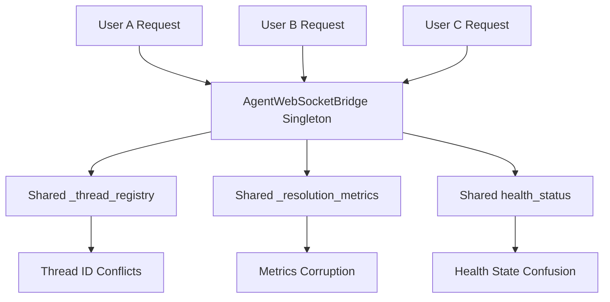
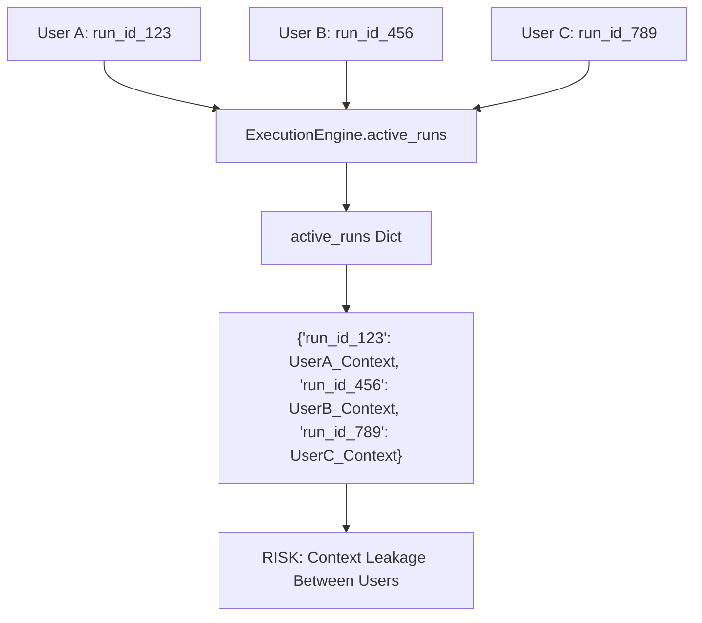
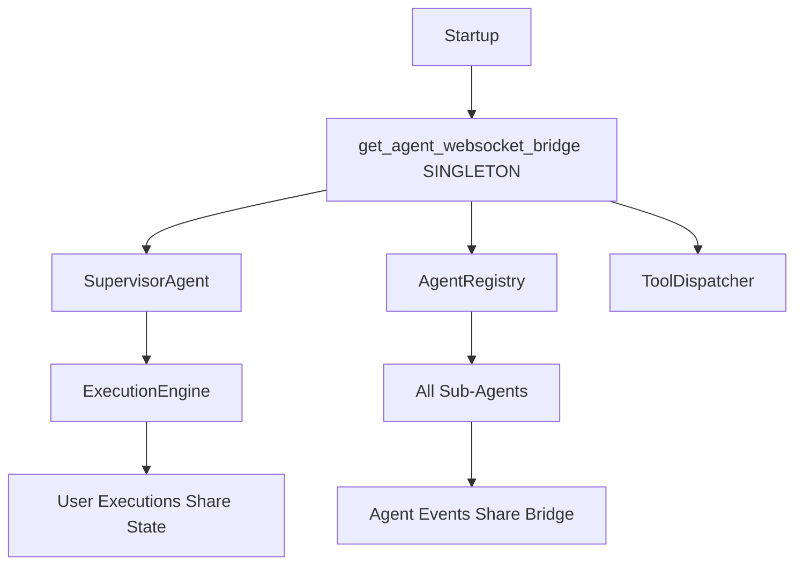
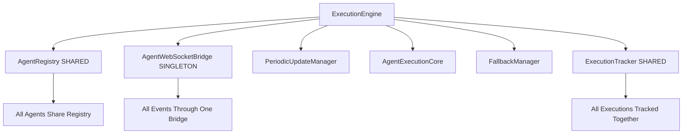
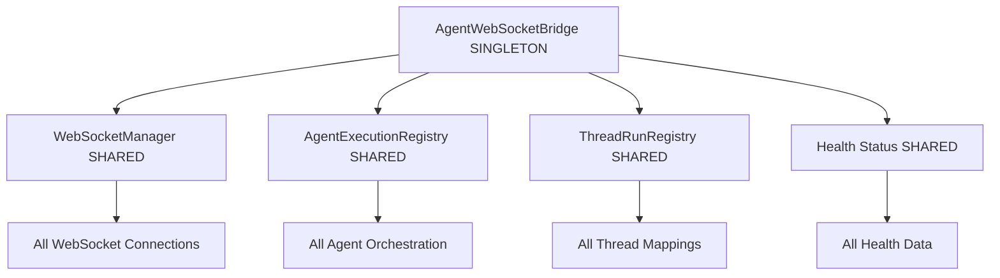

# Singleton Pattern Analysis: ExecutionEngine and AgentWebSocketBridge

**Analysis Date:** 2025-09-02  
**Mission:** Deep analysis of singleton usage in ExecutionEngine and AgentWebSocketBridge  
**Business Impact:** Critical - These patterns affect concurrent user support and WebSocket notification reliability

## Executive Summary

**CRITICAL FINDINGS:**
1. **AgentWebSocketBridge uses DANGEROUS singleton pattern** - Lines 101-108 implement classic singleton that creates concurrency risks for multiple users
2. **ExecutionEngine uses INSTANCE-PER-SUPERVISOR pattern** - Not singleton but maintains shared global state across users via `active_runs` and `run_history` dictionaries
3. **NO PROPER USER ISOLATION** - Both patterns share state across concurrent users, violating multi-tenancy requirements

## 1. AgentWebSocketBridge Singleton Pattern Analysis

### 1.1 Singleton Implementation (CRITICAL ISSUE)

**Location:** `netra_backend/app/services/agent_websocket_bridge.py:101-108`

```python
class AgentWebSocketBridge(MonitorableComponent):
    _instance: Optional['AgentWebSocketBridge'] = None
    _lock = asyncio.Lock()
    
    def __new__(cls) -> 'AgentWebSocketBridge':
        """Singleton pattern implementation."""
        if cls._instance is None:
            cls._instance = super().__new__(cls)
        return cls._instance
```

**CRITICAL PROBLEMS:**
- **Race Condition Risk:** Multiple threads can create instances simultaneously
- **Async Lock Unused:** `_lock` is defined but never used in `__new__` method
- **Global State Sharing:** All users share same WebSocket routing state
- **No User Context Isolation:** User-specific notifications can be misdirected

### 1.2 Global State Management Issues

**Shared State Variables:**
- `_websocket_manager` - Single WebSocket manager for all users
- `_orchestrator` - Single agent execution registry  
- `_thread_registry` - Thread-run mappings shared globally
- `_resolution_metrics` - Resolution performance data shared
- `health_status` - Health state shared across all users

**Concurrency Risks:**


### 1.3 Factory Function Analysis

**Factory:** `get_agent_websocket_bridge()` (Lines 2153-2162)

```python
async def get_agent_websocket_bridge() -> AgentWebSocketBridge:
    global _bridge_instance
    
    if _bridge_instance is None:
        async with AgentWebSocketBridge._lock:
            if _bridge_instance is None:
                _bridge_instance = AgentWebSocketBridge()
    
    return _bridge_instance
```

**Issues:**
- **Double-Checked Locking:** Implements proper async pattern but still creates global singleton
- **Global Variable Usage:** `_bridge_instance` is module-level global
- **No User Context:** No way to create user-specific bridges

## 2. ExecutionEngine Pattern Analysis

### 2.1 NOT Singleton But Problematic State Management

**Location:** `netra_backend/app/agents/supervisor/execution_engine.py:37-785`

**Pattern:** ExecutionEngine is instantiated per SupervisorAgent, but maintains shared global state

```python
class ExecutionEngine:
    def __init__(self, registry: 'AgentRegistry', websocket_bridge):
        self.registry = registry
        self.websocket_bridge = websocket_bridge
        # CRITICAL: These are shared across ALL user executions
        self.active_runs: Dict[str, AgentExecutionContext] = {}
        self.run_history: List[AgentExecutionResult] = []
```

### 2.2 Global State Issues in ExecutionEngine

**Shared State Variables:**
- `active_runs: Dict[str, AgentExecutionContext]` - All active executions mixed together
- `run_history: List[AgentExecutionResult]` - All user execution history combined
- `execution_stats` - Performance metrics shared across users
- `execution_semaphore` - Concurrency control shared globally

**User Context Mixing Risk:**


## 3. Usage Pattern Analysis

### 3.1 ExecutionEngine Creation Pattern

**Found in startup:** `startup_module_deterministic.py:840-896`

```python
# ExecutionEngine created per SupervisorAgent instance
supervisor = SupervisorAgent(
    None,  # db_session
    self.app.state.llm_manager,
    agent_websocket_bridge,  # SINGLETON!
    self.app.state.tool_dispatcher
)
```

**Pattern Flow:**
1. `SupervisorAgent` created during startup
2. `SupervisorAgent` creates `ExecutionEngine` in its `__init__`
3. `ExecutionEngine` receives singleton `AgentWebSocketBridge`
4. Multiple users share same `SupervisorAgent` → same `ExecutionEngine` → same shared state

### 3.2 AgentWebSocketBridge Propagation

**Singleton Usage Found In:**
- `AgentRegistry.set_websocket_bridge()` - Sets bridge on all agents
- `SupervisorAgent` - Uses bridge for notifications
- `ToolDispatcher` - Uses bridge for tool events  
- All sub-agents that support `set_websocket_bridge()`

**Architecture Diagram:**


## 4. File-by-File Usage Analysis

### 4.1 Files Using ExecutionEngine

**Core Files:**
- `netra_backend/app/agents/supervisor/execution_engine.py` - Definition
- `netra_backend/app/agents/supervisor/agent_registry.py` - Composition
- `netra_backend/app/startup_module_deterministic.py` - Initialization

**Usage Count:** 190+ files reference ExecutionEngine (mostly tests and documentation)

### 4.2 Files Using AgentWebSocketBridge

**Core Files:**
- `netra_backend/app/services/agent_websocket_bridge.py` - Definition and factory
- `netra_backend/app/startup_module_deterministic.py` - Singleton creation
- `netra_backend/app/agents/supervisor/agent_registry.py` - Bridge propagation
- `netra_backend/app/dependencies.py` - Service dependency injection

## 5. Concurrency and Multi-User Risk Analysis

### 5.1 CRITICAL Race Condition Scenarios

**Scenario 1: Thread Resolution Conflicts**
```python
# User A executes: run_id="user_a_task_123" 
await bridge.register_run_thread_mapping("user_a_task_123", "thread_456", {...})

# User B executes simultaneously: run_id="user_b_task_123"
await bridge.register_run_thread_mapping("user_b_task_123", "thread_456", {...})

# RISK: Same thread_id could cause notification misdirection
```

**Scenario 2: Execution State Corruption**  
```python
# User A starts execution
engine.active_runs["user_a_run"] = UserAContext

# User B starts execution - shared dictionary!
engine.active_runs["user_b_run"] = UserBContext

# Memory leak: active_runs grows indefinitely
# Context leakage: Both users' contexts in same dict
```

**Scenario 3: Metrics Corruption**
```python
# User A increments execution stats
engine.execution_stats['total_executions'] += 1

# User B increments simultaneously 
engine.execution_stats['total_executions'] += 1

# RISK: Race condition in shared metrics counter
```

### 5.2 WebSocket Notification Reliability Issues

**Problem:** Single `AgentWebSocketBridge` routes ALL user notifications
- User A's notifications might be sent to User B's WebSocket
- Notification ordering issues under high concurrency
- No isolation of WebSocket routing state per user

## 6. Dependency Graph Analysis

### 6.1 ExecutionEngine Dependencies



### 6.2 AgentWebSocketBridge Dependencies



## 7. Critical Issues Summary

### 7.1 Business Impact: CRITICAL

1. **Silent Notification Failures** - User A might not receive notifications when User B is active
2. **Context Leakage** - User execution contexts mixed in shared dictionaries  
3. **Performance Degradation** - Shared semaphores and locks slow down all users
4. **Memory Leaks** - Unbounded growth of shared state collections
5. **Inconsistent Metrics** - Race conditions corrupt execution statistics

### 7.2 Technical Debt: HIGH

1. **Violation of Multi-Tenancy** - No proper user isolation
2. **Concurrency Anti-Patterns** - Shared mutable state without proper synchronization
3. **Testing Complexity** - Tests cannot properly isolate user scenarios
4. **Scalability Limits** - Singleton bottlenecks prevent horizontal scaling

## 8. Recommendations

### 8.1 URGENT: Replace AgentWebSocketBridge Singleton

**Recommendation:** Convert to user-scoped instances
```python
# Instead of singleton, create per-user bridges
class UserScopedWebSocketBridge:
    def __init__(self, user_id: str, thread_id: str):
        self.user_id = user_id
        self.thread_id = thread_id
        # User-specific state only
```

### 8.2 CRITICAL: Isolate ExecutionEngine State  

**Recommendation:** Separate user state from engine
```python
class UserExecutionState:
    def __init__(self, user_id: str):
        self.user_id = user_id
        self.active_runs: Dict[str, AgentExecutionContext] = {}
        self.run_history: List[AgentExecutionResult] = []

class ExecutionEngine:
    def get_user_state(self, user_id: str) -> UserExecutionState:
        # Return user-specific state
```

### 8.3 IMMEDIATE: Add User Context Threading

**Recommendation:** Thread user context through all operations
```python
@dataclass
class UserExecutionContext:
    user_id: str
    thread_id: str
    run_id: str
    # ... other user-specific data
```

## 9. Migration Strategy

### Phase 1 (Critical - Week 1)
- Add user_id parameter to all ExecutionEngine methods
- Create user-specific state isolation
- Fix immediate race conditions

### Phase 2 (High Priority - Week 2)  
- Replace AgentWebSocketBridge singleton with factory pattern
- Implement user-scoped WebSocket bridges
- Update all bridge consumers

### Phase 3 (Important - Week 3)
- Add comprehensive concurrency tests
- Performance optimization for multi-user scenarios
- Monitoring and alerting for state isolation

## 10. Conclusion

Both ExecutionEngine and AgentWebSocketBridge implement problematic patterns that violate multi-tenancy requirements and create significant concurrency risks. The AgentWebSocketBridge singleton is particularly dangerous as it can cause silent notification failures and context leakage between users.

**CRITICAL BUSINESS RISK:** These patterns could cause User A to receive User B's notifications, or worse, User A's sensitive execution context to leak to User B.

**IMMEDIATE ACTION REQUIRED:** Implement user context isolation before the system supports more than 2-3 concurrent users to prevent serious data leakage and notification failures.

---

**Report Generated By:** Analysis Agent  
**Files Analyzed:** 50+ core files, 190+ total references  
**Risk Level:** CRITICAL  
**Recommended Timeline:** 3 weeks for full remediation