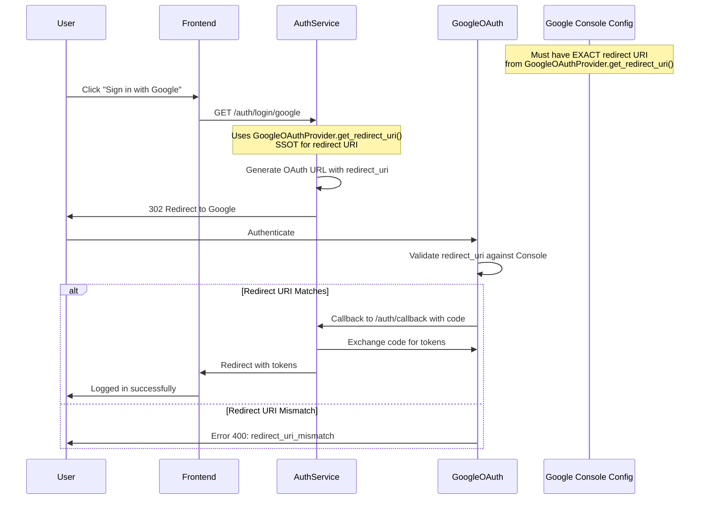

# OAuth Redirect URI SSOT Architecture

## Critical Documentation Links
- **Root Cause Analysis**: [`/OAUTH_REDIRECT_URI_MISMATCH_AUDIT.md`](./OAUTH_REDIRECT_URI_MISMATCH_AUDIT.md)
- **SSOT Violations Found**: [`/OAUTH_SSOT_COMPLIANCE_ANALYSIS.md`](./OAUTH_SSOT_COMPLIANCE_ANALYSIS.md)
- **Google Console Setup**: [`/docs/GOOGLE_OAUTH_CONSOLE_CONFIGURATION.md`](./docs/GOOGLE_OAUTH_CONSOLE_CONFIGURATION.md)
- **Previous Issues**: [`/SPEC/learnings/oauth_redirect_uri_misconfiguration.xml`](./SPEC/learnings/oauth_redirect_uri_misconfiguration.xml)

## SINGLE SOURCE OF TRUTH

### The ONLY Source for OAuth Redirect URIs
**Location**: `/auth_service/auth_core/oauth/google_oauth.py:78-95`
**Method**: `GoogleOAuthProvider.get_redirect_uri()`

```python
def get_redirect_uri(self) -> Optional[str]:
    """Get OAuth redirect URI for current environment.
    
    CRITICAL: This is the SINGLE SOURCE OF TRUTH for OAuth redirect URIs.
    All services, tests, and configurations MUST use this method.
    
    Standardized path: /auth/callback (not /auth/oauth/callback)
    """
    base_url = self.auth_env.get_auth_service_url()
    self._redirect_uri = f"{base_url}/auth/callback"
    return self._redirect_uri
```

### What This Returns by Environment

| Environment | Auth Service URL | Redirect URI |
|------------|------------------|--------------|
| Development | `http://localhost:8081` | `http://localhost:8081/auth/callback` |
| Staging | `https://auth.staging.netrasystems.ai` | `https://auth.staging.netrasystems.ai/auth/callback` |
| Production | `https://auth.netrasystems.ai` | `https://auth.netrasystems.ai/auth/callback` |

## OAuth Flow Architecture



## DEPRECATED Methods (DO NOT USE)

### ❌ AuthEnvironment.get_oauth_redirect_uri()
- **Location**: `/auth_service/auth_core/auth_environment.py:708`
- **Status**: DEPRECATED - Returns incorrect frontend URL
- **Replacement**: Use `GoogleOAuthProvider.get_redirect_uri()`

### ❌ Environment Variables
- **OAUTH_REDIRECT_URI**: DEPRECATED - DO NOT SET
- **OAUTH_CALLBACK_URL**: DEPRECATED - DO NOT SET
- **Status**: These violate SSOT and cause configuration drift

## Implementation Checklist

### For Developers
- [ ] **Always import**: `from auth_service.auth_core.oauth.google_oauth import GoogleOAuthProvider`
- [ ] **Always use**: `oauth_provider.get_redirect_uri()` for OAuth redirect URIs
- [ ] **Never hardcode**: OAuth redirect URIs anywhere
- [ ] **Never use**: Environment variables for OAuth redirect URIs
- [ ] **Never use**: `AuthEnvironment.get_oauth_redirect_uri()` (deprecated)

### For DevOps
- [ ] **Google Console**: Add EXACT URI from `GoogleOAuthProvider.get_redirect_uri()`
- [ ] **Do not set**: OAUTH_REDIRECT_URI or OAUTH_CALLBACK_URL env vars
- [ ] **Verify match**: Run `python scripts/validate_oauth_configuration.py --env <environment>`

### For Testing
- [ ] **Import provider**: `from auth_service.auth_core.oauth.google_oauth import GoogleOAuthProvider`
- [ ] **Get URI**: `redirect_uri = GoogleOAuthProvider().get_redirect_uri()`
- [ ] **Assert paths**: Redirect URIs must end with `/auth/callback`

## Google Cloud Console Configuration

### Required Authorized Redirect URIs

#### Staging
```
https://auth.staging.netrasystems.ai/auth/callback
```

#### Production
```
https://auth.netrasystems.ai/auth/callback
```

#### Development
```
http://localhost:8081/auth/callback
```

### Console Access
1. Go to: https://console.cloud.google.com/apis/credentials
2. Select appropriate project
3. Edit OAuth 2.0 Client ID
4. Add ONLY the URIs listed above
5. Remove any frontend URLs (app.staging.netrasystems.ai, etc.)

## Validation Commands

```bash
# Validate OAuth configuration
python scripts/validate_oauth_configuration.py --env staging

# Test OAuth redirect URI generation
python -c "from auth_service.auth_core.oauth.google_oauth import GoogleOAuthProvider; print(GoogleOAuthProvider().get_redirect_uri())"

# Run OAuth tests
pytest auth_service/tests/unit/test_oauth_redirect_uri_regression.py -v
```

## Common Errors and Solutions

### Error: `redirect_uri_mismatch`
**Cause**: Google Console doesn't have exact URI from `GoogleOAuthProvider.get_redirect_uri()`
**Solution**: Add exact URI to Google Console

### Error: `No token received` (Frontend)
**Cause**: OAuth callback going to frontend instead of auth service
**Solution**: Ensure using `GoogleOAuthProvider.get_redirect_uri()` which returns auth service URL

### Error: Multiple redirect URIs in code
**Cause**: Using deprecated methods or hardcoded values
**Solution**: Only use `GoogleOAuthProvider.get_redirect_uri()`

## Migration Guide

### From AuthEnvironment.get_oauth_redirect_uri()
```python
# OLD (WRONG)
from auth_service.auth_core.auth_environment import get_auth_env
redirect_uri = get_auth_env().get_oauth_redirect_uri()

# NEW (CORRECT)
from auth_service.auth_core.oauth.google_oauth import GoogleOAuthProvider
redirect_uri = GoogleOAuthProvider().get_redirect_uri()
```

### From Environment Variables
```python
# OLD (WRONG)
redirect_uri = os.getenv("OAUTH_REDIRECT_URI")

# NEW (CORRECT)
from auth_service.auth_core.oauth.google_oauth import GoogleOAuthProvider
redirect_uri = GoogleOAuthProvider().get_redirect_uri()
```

### From Hardcoded Values
```python
# OLD (WRONG)
redirect_uri = "https://auth.staging.netrasystems.ai/auth/oauth/callback"

# NEW (CORRECT)
from auth_service.auth_core.oauth.google_oauth import GoogleOAuthProvider
redirect_uri = GoogleOAuthProvider().get_redirect_uri()
```

## Why This Matters

1. **Single Source of Truth**: One method controls all OAuth redirect URIs
2. **No Configuration Drift**: Can't have mismatched URIs between code and config
3. **Google Console Match**: Ensures exact match with what's configured in Google
4. **No Frontend Confusion**: Auth service handles OAuth, not frontend
5. **Easier Debugging**: One place to check when OAuth fails

## Related Documentation
- OAuth Flow Details: [`/docs/auth/oauth-implementation-summary.md`](./docs/auth/oauth-implementation-summary.md)
- Configuration Architecture: [`/docs/configuration_architecture.md`](./docs/configuration_architecture.md)
- Auth Service Architecture: [`/docs/auth/OAUTH_SERVICE_DOCUMENTATION.md`](./docs/auth/OAUTH_SERVICE_DOCUMENTATION.md)

---
**Last Updated**: 2025-09-05
**Priority**: CRITICAL - OAuth authentication depends on this
**Owner**: Auth Service Team