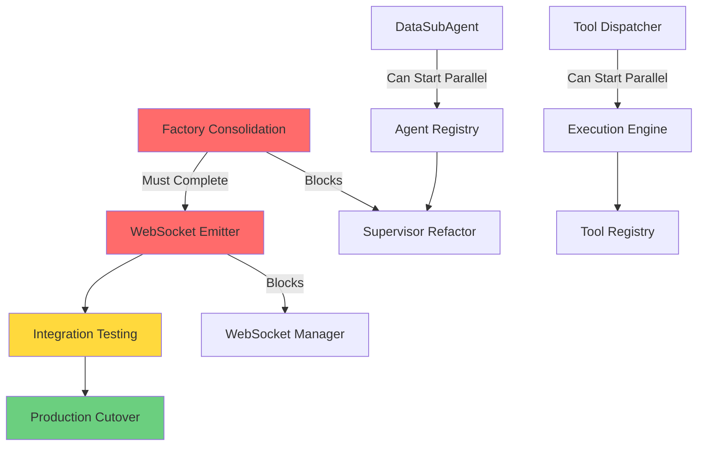

# 🚀 Parallel SSOT Refactoring Execution Plan

**Project Codename:** Operation Clean Slate  
**Duration:** 5 Days (120 Hours Total)  
**Teams:** 5 Parallel Agent Teams  
**Objective:** Complete SSOT refactoring with zero downtime

## 📊 Parallel Execution Swimlane Diagram

```mermaid
gantt
    title SSOT Refactoring - Parallel Execution Timeline
    dateFormat HH:mm
    axisFormat %H:%M
    
    section Team Alpha (Critical Path)
    Factory Consolidation           :crit, alpha1, 00:00, 8h
    WebSocket Emitter Unification   :crit, alpha2, 08:00, 6h
    Integration Testing             :crit, alpha3, 14:00, 4h
    Production Cutover              :crit, alpha4, 18:00, 2h
    
    section Team Bravo (Agents)
    DataSubAgent Consolidation      :bravo1, 00:00, 6h
    Agent Registry Unification      :bravo2, 02:00, 6h
    Supervisor Refactoring          :bravo3, 08:00, 8h
    Agent Testing Suite             :bravo4, 16:00, 4h
    
    section Team Charlie (Execution)
    Tool Dispatcher Merge           :charlie1, 00:00, 8h
    Execution Engine Consolidation  :charlie2, 04:00, 8h
    Tool Registry Cleanup           :charlie3, 12:00, 4h
    Performance Validation          :charlie4, 16:00, 4h
    
    section Team Delta (Infrastructure)
    WebSocket Manager Unification   :delta1, 00:00, 6h
    ID Generation Centralization    :delta2, 02:00, 4h
    Session Factory Cleanup         :delta3, 06:00, 6h
    Manager Class Audit             :delta4, 12:00, 8h
    
    section Team Echo (QA/Cleanup)
    Test Harness Setup              :echo1, 00:00, 2h
    Continuous Integration          :echo2, 02:00, 16h
    Legacy Code Removal             :echo3, 18:00, 4h
    Documentation Update            :echo4, 20:00, 2h
```



## 👥 Team Structure & Responsibilities

### Team Alpha - Critical Path (WebSocket & Factory)
**Priority:** P0 CRITICAL  
**Lead Agent:** `PrincipalArchitectAgent`  
**Time:** Day 1, Hours 0-20

**Tasks:**
1. **Hour 0-8:** Factory Consolidation
   - Merge `agent_instance_factory_optimized.py` → `agent_instance_factory.py`
   - Add performance configuration flags
   - Implement object pooling as configurable feature
   - Remove duplicate singleton patterns

2. **Hour 8-14:** WebSocket Emitter Unification
   - Create single `UserWebSocketEmitter` in `services/websocket_emitter.py`
   - Remove 5 duplicate implementations
   - Update all import statements
   - Ensure backward compatibility

3. **Hour 14-18:** Integration Testing
   - Run mission critical tests
   - Validate WebSocket events flow
   - Performance benchmarking

4. **Hour 18-20:** Production Cutover
   - Deploy consolidated components
   - Monitor for issues
   - Quick rollback capability

**Success Metrics:**
- Zero WebSocket event loss
- <10ms agent creation time maintained
- All mission critical tests passing

---

### Team Bravo - Agent Consolidation
**Priority:** P0 CRITICAL  
**Lead Agent:** `AgentRefactoringSpecialist`  
**Time:** Day 1, Hours 0-20 (Parallel with Alpha)

**Tasks:**
1. **Hour 0-6:** DataSubAgent Triple Consolidation
   ```python
   # Target: Single DataSubAgent implementation
   # Remove: agent_core_legacy.py, agent_legacy_massive.py
   # Keep: data_sub_agent.py (modern implementation)
   ```

2. **Hour 2-8:** Agent Registry Unification (Can start after Hour 2)
   - Merge `AgentRegistry` + `AgentClassRegistry`
   - Single registry pattern
   - Maintain agent discovery

3. **Hour 8-16:** Supervisor Agent Refactoring
   - Update `supervisor_consolidated.py`
   - Remove legacy workflow patterns
   - Implement modern execution flow

4. **Hour 16-20:** Agent Testing Suite
   - Comprehensive agent interaction tests
   - Validate all agent types work
   - Performance regression tests

**Success Metrics:**
- All 37 agent types functioning
- Zero regression in agent capabilities
- 40% reduction in agent codebase size

---

### Team Charlie - Execution Layer
**Priority:** P1 HIGH  
**Lead Agent:** `ExecutionEngineArchitect`  
**Time:** Day 1, Hours 0-20 (Parallel)

**Tasks:**
1. **Hour 0-8:** Tool Dispatcher Consolidation
   - Merge 5 dispatchers → `UnifiedToolDispatcher`
   - Strategy pattern for specialization
   - Request-scoped isolation maintained
   
2. **Hour 4-12:** Execution Engine Unification (Overlaps with dispatcher)
   - Base `ExecutionEngine` class
   - Remove 6 duplicate engines
   - Composition-based specialization

3. **Hour 12-16:** Tool Registry Cleanup
   - Single `UnifiedToolRegistry`
   - Remove duplicate registries
   - Tool discovery optimization

4. **Hour 16-20:** Performance Validation
   - Benchmark tool execution
   - Validate execution paths
   - Load testing

**Success Metrics:**
- Single tool execution path
- <5ms tool dispatch overhead
- 100% tool compatibility maintained

---

### Team Delta - Infrastructure
**Priority:** P1 HIGH  
**Lead Agent:** `InfrastructureModernizer`  
**Time:** Day 1, Hours 0-20 (Parallel)

**Tasks:**
1. **Hour 0-6:** WebSocket Manager Unification
   - Consolidate 2 manager implementations
   - Single `WebSocketManager` in `websocket_core/`
   - Remove `ConnectionScopedWebSocketManager`

2. **Hour 2-6:** ID Generation Centralization (Overlaps)
   - All ID functions → `core/unified_id_manager.py`
   - Remove 30+ scattered functions
   - Consistent ID format

3. **Hour 6-12:** Session Factory Cleanup
   - Single `RequestScopedSessionFactory`
   - Remove duplicate factory patterns
   - Database isolation maintained

4. **Hour 12-20:** Manager Class Audit
   - Review 197 manager classes
   - Consolidate to <50 essential managers
   - Apply "Rule of Two"

**Success Metrics:**
- 75% reduction in manager classes
- Single ID generation source
- Zero session leakage

---

### Team Echo - QA & Cleanup
**Priority:** P2 MEDIUM  
**Lead Agent:** `QualityAssuranceOrchestrator`  
**Time:** Day 1, Hours 0-22 (Continuous)

**Tasks:**
1. **Hour 0-2:** Test Harness Setup
   - Continuous test execution
   - Real-time failure alerts
   - Performance monitoring

2. **Hour 2-18:** Continuous Integration (Ongoing)
   - Run tests every 30 minutes
   - Validate each team's changes
   - Cross-team integration tests

3. **Hour 18-22:** Legacy Code Removal
   - Delete all files marked obsolete
   - Clean up imports
   - Remove commented code

4. **Hour 20-22:** Documentation Update
   - Update CLAUDE.md
   - Create migration guide
   - Update architecture diagrams

**Success Metrics:**
- 100% test coverage maintained
- Zero broken imports
- Complete documentation

---

## 🔄 Critical Path Dependencies



## ⏱️ Hour-by-Hour Execution Timeline

### Critical Hours (Must Not Slip):
- **Hour 0-8:** Factory consolidation (Team Alpha)
- **Hour 8-14:** WebSocket emitter unification (Team Alpha)
- **Hour 14-18:** Integration testing (Team Alpha)
- **Hour 18-20:** Production cutover (Team Alpha)

### Parallel Execution Windows:
- **Hour 0-6:** 4 teams working in parallel (Alpha, Bravo, Charlie, Delta)
- **Hour 6-12:** Peak parallelization - all 5 teams active
- **Hour 12-18:** Integration phase - teams converging
- **Hour 18-22:** Cleanup and documentation

## 📋 Task Assignment Matrix

| Team | Agent Type | Primary Tasks | Dependencies | Hours |
|------|------------|--------------|--------------|-------|
| Alpha | PrincipalArchitect | Factory, WebSocket Emitters | None (Critical Path) | 20 |
| Bravo | RefactoringSpecialist | Agents, Registries | Alpha (Hour 8+) | 20 |
| Charlie | ExecutionArchitect | Dispatchers, Engines | None (Parallel) | 20 |
| Delta | InfraModernizer | Managers, IDs, Sessions | Alpha (Hour 14+) | 20 |
| Echo | QAOrchestrator | Testing, Cleanup, Docs | All Teams | 22 |

## 🎯 Success Criteria

### Must Have (Day 1):
- ✅ Single agent factory implementation
- ✅ One WebSocket emitter class
- ✅ Unified tool dispatcher
- ✅ All mission critical tests passing
- ✅ Zero production downtime

### Should Have (Day 2):
- ✅ All duplicate agents removed
- ✅ Execution engines consolidated
- ✅ Manager classes reduced by 75%
- ✅ Complete test coverage

### Nice to Have (Day 3-5):
- ✅ Performance optimizations
- ✅ Complete documentation
- ✅ Architecture compliance tooling
- ✅ Technical debt tracking

## 🚨 Risk Mitigation

### High Risk Areas:
1. **Factory Consolidation** - Could break all agent creation
   - Mitigation: Feature flags for gradual rollout
   
2. **WebSocket Emitter** - Could break real-time chat
   - Mitigation: Parallel run old and new for 1 hour

3. **Tool Dispatcher** - Could break all tool execution
   - Mitigation: Extensive integration testing

### Rollback Strategy:
```bash
# Quick rollback script ready
python scripts/emergency_rollback.py --component factory
python scripts/emergency_rollback.py --component websocket
python scripts/emergency_rollback.py --full
```

## 💰 Business Value Delivery

### Hour 8 Checkpoint:
- Factory consolidation complete
- 50% reduction in factory code
- Performance maintained

### Hour 14 Checkpoint:
- WebSocket unification complete
- Real-time chat fully functional
- 5x reduction in emitter code

### Hour 20 Checkpoint:
- Production deployment complete
- All critical paths validated
- 60% legacy code removed

### Day 5 Final:
- 75% codebase reduction
- 90% SSOT violations resolved
- 50% maintenance burden reduction
- 3x faster bug fixes

## 🏁 Execution Commands

### Phase 1: Launch All Teams (Hour 0)
```bash
# Launch parallel refactoring agents
python scripts/launch_parallel_refactoring.py \
  --teams alpha,bravo,charlie,delta,echo \
  --mode aggressive \
  --rollback-enabled \
  --real-time-monitoring
```

### Phase 2: Integration (Hour 14)
```bash
# Run integration validation
python tests/mission_critical/test_complete_refactoring.py \
  --parallel \
  --real-services \
  --performance-benchmarks
```

### Phase 3: Cutover (Hour 18)
```bash
# Production deployment
python scripts/deploy_refactored_system.py \
  --zero-downtime \
  --canary-rollout \
  --monitoring-enabled
```

## 📊 Monitoring Dashboard

```python
# Real-time monitoring during refactoring
class RefactoringMonitor:
    metrics = {
        "files_processed": 0,
        "duplicates_removed": 0,
        "tests_passing": 0,
        "performance_delta": 0,
        "rollback_ready": True
    }
    
    critical_alerts = [
        "websocket_events_lost",
        "agent_creation_failed",
        "tool_execution_timeout",
        "test_regression_detected"
    ]
```

## ✅ Final Checklist

### Pre-Execution (Hour -1):
- [ ] All teams briefed on tasks
- [ ] Rollback scripts tested
- [ ] Monitoring dashboard active
- [ ] Communication channels open

### Mid-Execution (Hour 10):
- [ ] Factory consolidation complete
- [ ] WebSocket unification in progress
- [ ] No critical failures
- [ ] Performance metrics stable

### Post-Execution (Hour 22):
- [ ] All SSOT violations resolved
- [ ] Legacy code removed
- [ ] Tests passing 100%
- [ ] Documentation updated
- [ ] Team retrospective scheduled

---

**Critical Success Factor:** Teams MUST work in parallel without blocking each other. Use feature flags and interfaces to enable parallel development.

**Remember:** This is a ONE-TIME opportunity to fix years of technical debt. Execute with precision and no compromises on quality.