# 🚨 ULTRA CRITICAL: Complete SSOT Refactoring V3 - 10 Agent Teams
**Project Codename:** Operation Total SSOT Convergence  
**Date:** 2025-09-04  
**Duration:** 5 Days (120 Hours Total)  
**Teams:** 10 Parallel Agent Teams  
**Objective:** Achieve 100% SSOT compliance across entire codebase

## 📊 Comprehensive Violation Analysis

### 🔴 CRITICAL FINDINGS
- **197 Manager Classes** (should be <50)
- **234 Manager occurrences** across codebase
- **8 WebSocket Emitter implementations** still exist
- **24 files in admin_tool_dispatcher** folder alone
- **30+ files in data_sub_agent** folder
- **28 files in triage_sub_agent** folder
- **20 files in corpus_admin** folder
- **21 subdirectories in agents** folder
- **40+ service subdirectories** with overlapping functionality

### 🟡 Additional Violations Found (Not in V2)
1. **Admin Tool Dispatcher**: 24 files of overlapping tool handling
2. **Triage SubAgent**: 28 files with duplicate processing logic
3. **Corpus Admin**: 20 files with redundant corpus operations
4. **Domain Experts**: Multiple expert agents with similar patterns
5. **Service Layer Chaos**: 40+ service folders with overlapping concerns
6. **Database Management**: Multiple DatabaseManager implementations
7. **Session Management**: Duplicate session factories and managers
8. **Cache Strategies**: Multiple cache implementations across services
9. **Circuit Breakers**: 5+ different circuit breaker patterns
10. **Monitoring/Observability**: Duplicate monitoring solutions

## 📊 10-Team Parallel Execution Timeline

```mermaid
gantt
    title SSOT Refactoring V3 - 10 Teams Parallel Execution
    dateFormat HH:mm
    axisFormat %H:%M
    
    section Team 1 (Data)
    Data SubAgent SSOT              :crit, t1-1, 00:00, 20h
    
    section Team 2 (Admin Tools)
    Admin Tool Dispatcher            :crit, t2-1, 00:00, 18h
    Tool Permissions Unified         :t2-2, 18:00, 4h
    
    section Team 3 (Triage)
    Triage SubAgent Consolidation    :crit, t3-1, 00:00, 16h
    Error Handling SSOT              :t3-2, 16:00, 6h
    
    section Team 4 (Corpus)
    Corpus Admin Unification         :t4-1, 00:00, 14h
    Corpus Services Merge            :t4-2, 14:00, 8h
    
    section Team 5 (Registries)
    Universal Registry Pattern       :crit, t5-1, 00:00, 12h
    Migration & Cleanup              :t5-2, 12:00, 10h
    
    section Team 6 (Managers)
    Manager Consolidation            :crit, t6-1, 00:00, 20h
    197→50 Reduction                :t6-2, 20:00, 4h
    
    section Team 7 (Services)
    Service Layer SSOT               :t7-1, 00:00, 18h
    API Gateway Unified              :t7-2, 18:00, 6h
    
    section Team 8 (WebSocket)
    WebSocket Final Unification      :crit, t8-1, 00:00, 10h
    Event System SSOT                :t8-2, 10:00, 12h
    
    section Team 9 (Monitoring)
    Observability SSOT               :t9-1, 00:00, 14h
    Metrics & Telemetry Unified      :t9-2, 14:00, 8h
    
    section Team 10 (Testing/QA)
    Continuous Validation            :t10-1, 00:00, 22h
    Legacy Cleanup                   :t10-2, 18:00, 6h
```



---

## 🔴 TEAM 1: Data SubAgent Complete Consolidation
**Priority:** P0 ULTRA CRITICAL  
**Scope:** 30+ files → 1 UnifiedDataAgent  
**Time:** 20 hours

### Files to Consolidate
```
data_sub_agent/
├── agent_anomaly_processing.py
├── agent_cache.py (16KB!)
├── agent_corpus_operations.py
├── agent_data_processing.py
├── agent_execution.py (12KB!)
├── analysis_engine.py (10KB!)
├── analysis_engine_helpers.py (10KB!)
├── anomaly_detection.py
├── clickhouse_operations.py
├── clickhouse_recovery.py
├── configuration_manager.py
├── data_fetching_recovery.py
├── metrics_recovery.py
└── [15+ more files]
```

### Implementation Strategy
- Create `unified_data_agent.py` with strategy pattern
- Merge all 30+ files into 5 core strategies
- Single cache implementation
- Unified anomaly detection
- One analysis engine

---

## 🟠 TEAM 2: Admin Tool Dispatcher SSOT
**Priority:** P0 CRITICAL  
**Scope:** 24 files → 1 UnifiedAdminToolDispatcher  
**Time:** 22 hours

### Current Chaos
```
admin_tool_dispatcher/
├── admin_tool_execution.py
├── corpus_handlers_base.py
├── corpus_modern_handlers.py
├── corpus_tool_handlers.py
├── dispatcher_core.py
├── dispatcher_helpers.py
├── execution_helpers.py
├── execution_pattern_helpers.py
├── factory.py
├── migration_helper.py
├── modernized_wrapper.py
├── modern_execution_helpers.py
├── operation_helpers.py
├── tool_handlers.py
├── tool_handlers_core.py
├── tool_handler_helpers.py
├── tool_handler_operations.py
├── tool_info_helpers.py
├── validation.py
├── validation_helpers.py
└── [4 more files]
```

### Consolidation Plan
```python
class UnifiedAdminToolDispatcher:
    """SSOT for ALL admin tool operations"""
    def __init__(self):
        self.handlers = {
            'corpus': CorpusHandler(),
            'validation': ValidationHandler(),
            'execution': ExecutionHandler()
        }
        self.permissions = PermissionManager()
        self.factory = None  # Remove factory pattern
```

---

## 🟡 TEAM 3: Triage SubAgent Unification
**Priority:** P0 CRITICAL  
**Scope:** 28 files → 1 UnifiedTriageAgent  
**Time:** 22 hours

### Files to Merge
```
triage_sub_agent/
├── agent.py (15KB!)
├── cache_utils.py
├── config.py
├── core.py (9KB!)
├── entity_extraction.py
├── entity_extractor.py
├── error_core.py (14KB!)
├── error_recovery.py
├── error_reporting.py
├── error_types.py
├── execution_helpers.py
├── executor.py (16KB!)
├── fallback.py
├── intent_detection.py
├── intent_detector.py
├── llm_processor.py (19KB!)
├── processing.py (17KB!)
├── processing_monitoring.py
├── prompt_builder.py (11KB!)
├── result_processor.py (13KB!)
├── tool_recommendation.py
├── tool_recommender.py
├── validation.py
├── validator.py
└── [4 more files]
```

### Target Architecture
```python
class UnifiedTriageAgent:
    """SSOT for all triage operations"""
    def __init__(self):
        self.processor = UnifiedProcessor()  # Merge 5 processors
        self.error_handler = UnifiedErrorHandler()  # Merge 4 error files
        self.detector = UnifiedDetector()  # Merge intent + entity
        self.recommender = ToolRecommender()  # Single recommender
```

---

## 🔵 TEAM 4: Corpus Admin Consolidation
**Priority:** P1 HIGH  
**Scope:** 20 files → 1 UnifiedCorpusAdmin  
**Time:** 22 hours

### Current Structure
```
corpus_admin/
├── agent.py (18KB!)
├── corpus_creation_helpers.py
├── corpus_creation_io.py
├── corpus_creation_storage.py
├── corpus_creation_validation.py
├── corpus_error_compensation.py
├── corpus_error_types.py
├── corpus_indexing_handlers.py (15KB!)
├── corpus_upload_handlers.py (12KB!)
├── corpus_validation_handlers.py (16KB!)
├── operations_analysis.py (12KB!)
└── [9 more files]
```

---

## 🟢 TEAM 5: Registry Pattern Final Unification
**Priority:** P0 CRITICAL  
**Scope:** All registries → UniversalRegistry  
**Time:** 22 hours

### Remaining Registries to Unify
- AgentRegistry + AgentClassRegistry
- UnifiedToolRegistry (3 implementations!)
- ToolDispatcherRegistry
- ServiceRegistry patterns
- 10+ ad-hoc registries

---

## 🔴 TEAM 6: Manager Class Massacre
**Priority:** P0 ULTRA CRITICAL  
**Scope:** 197 Managers → <50  
**Time:** 24 hours

### Top Offenders to Eliminate
```python
# DUPLICATE MANAGERS TO CONSOLIDATE:
- DatabaseManager (2 implementations)
- SessionManager (4 implementations)
- WebSocketManager (2+ implementations)
- CacheManager (5+ implementations)
- CircuitBreakerManager (3 implementations)
- AlertManager (3 implementations)
- StateManager (3 implementations)
- ConfigurationManager (multiple)
- ResourceManager (multiple)
- ConnectionManager (multiple)
```

### Consolidation Strategy
```python
class UnifiedManagerRegistry:
    """SSOT for ALL manager instances"""
    ALLOWED_MANAGERS = {
        'database': DatabaseManager,
        'session': SessionManager,
        'websocket': WebSocketManager,
        'cache': CacheManager,
        'state': StateManager,
        # Maximum 50 managers total
    }
```

---

## 🟠 TEAM 7: Service Layer SSOT
**Priority:** P1 HIGH  
**Scope:** 40+ service folders → 15  
**Time:** 24 hours

### Service Consolidation Map
```
MERGE THESE:
- api_gateway/ + mesh/ + service_mesh/ → unified_gateway/
- cache/ + redis/ → unified_cache/
- monitoring/ + observability/ + metrics/ → unified_observability/
- quality/ + quality_gate/ + quality_monitoring/ → unified_quality/
- circuit_breaker/ + backpressure/ + rate_limiting/ → unified_resilience/
- database/ + transaction_manager/ → unified_database/
- messaging/ + websocket/ → unified_messaging/
```

---

## 🔵 TEAM 8: WebSocket Final Unification
**Priority:** P0 CRITICAL  
**Scope:** 8 emitter classes → 1  
**Time:** 22 hours

### Remaining WebSocket Violations
```
FOUND 8 WebSocket Emitter implementations:
1. agent_instance_factory.py → UserWebSocketEmitter
2. websocket_emitter_pool.py → WebSocketEmitterPool
3. websocket_event_emitter.py → WebSocketEventEmitter
4. isolated_event_emitter.py → IsolatedEventEmitter
5. websocket_bridge_factory.py → UserWebSocketEmitter (duplicate!)
6. user_websocket_emitter.py → UserWebSocketEmitter (duplicate!)
7. Plus 2 in test files
```

### Final SSOT
```python
# netra_backend/app/websocket/unified_emitter.py
class UnifiedWebSocketEmitter:
    """THE ONLY WebSocket emitter in the entire codebase"""
    def __init__(self, config: EmitterConfig):
        self.pool = EmitterPool() if config.pooling else None
        self.isolation = IsolationStrategy() if config.isolated else None
```

---

## 🟡 TEAM 9: Monitoring & Observability SSOT
**Priority:** P1 HIGH  
**Scope:** Multiple monitoring solutions → 1  
**Time:** 22 hours

### Current Chaos
```
MONITORING DUPLICATIONS:
- services/monitoring/
- services/observability/
- services/metrics/
- core/telemetry.py
- core/health/telemetry.py
- monitoring/alert_manager.py
- monitoring/alert_manager_core.py
- monitoring/alert_manager_compact.py
```

---

## 🟢 TEAM 10: Testing & Legacy Elimination
**Priority:** P2 MEDIUM (But CRITICAL for cleanup)  
**Scope:** Continuous validation + cleanup  
**Time:** 24 hours continuous

### Responsibilities
1. **Continuous Testing** - Run tests every 30 minutes
2. **Legacy Deletion** - Delete 100+ legacy files
3. **Import Cleanup** - Fix all broken imports
4. **Dead Code Removal** - Remove all commented code
5. **Performance Monitoring** - Track refactoring impact

---

## 📋 Agent Team Prompts

### PROMPT FOR TEAM 1: Data SubAgent Specialist
```
You are the Data Architecture Specialist. Your mission: Consolidate 30+ files in data_sub_agent/ into ONE UnifiedDataAgent.

MANDATORY READING:
1. CLAUDE.md Section 2.1 (SSOT)
2. USER_CONTEXT_ARCHITECTURE.md
3. SPEC/type_safety.xml

YOUR TASKS:
1. Generate MRO report for all 30+ classes
2. Create UnifiedDataAgent with strategy pattern
3. Merge duplicates:
   - 5 cache implementations → 1
   - 3 analysis engines → 1
   - 4 anomaly detectors → 1
4. Delete all 30+ legacy files
5. Update all imports

SUCCESS CRITERIA:
- Single file < 1500 lines
- Zero functionality loss
- All tests passing
```

### PROMPT FOR TEAM 2: Admin Tool Specialist
```
You are the Admin Tool Architect. Your mission: Consolidate 24 files in admin_tool_dispatcher/ into ONE UnifiedAdminToolDispatcher.

YOUR TASKS:
1. Analyze all 24 files for duplication
2. Create unified dispatcher with handlers
3. Merge:
   - 5 corpus handlers → 1
   - 4 execution helpers → 1
   - 3 validation files → 1
4. Remove factory pattern (unnecessary abstraction)
5. Delete all legacy files

SUCCESS CRITERIA:
- Single dispatcher class
- All admin tools working
- 80% code reduction
```

### PROMPT FOR TEAM 3: Triage Specialist
```
You are the Triage Consolidation Expert. Your mission: Merge 28 files in triage_sub_agent/ into ONE UnifiedTriageAgent.

YOUR TASKS:
1. Consolidate massive files:
   - agent.py (15KB)
   - llm_processor.py (19KB)
   - processing.py (17KB)
2. Merge error handling (4 files)
3. Unify detection (intent + entity)
4. Single recommendation engine
5. Delete all 28 files after merge

SUCCESS CRITERIA:
- One triage agent < 2000 lines
- All triage flows working
- Memory usage reduced 50%
```

### PROMPT FOR TEAM 4: Corpus Admin Specialist
```
You are the Corpus Architecture Expert. Your mission: Consolidate 20 files in corpus_admin/ into ONE UnifiedCorpusAdmin.

YOUR TASKS:
1. Merge 3 handler files (15-16KB each!)
2. Unify corpus creation helpers
3. Single error handling strategy
4. Consolidate operations
5. Delete all legacy files

SUCCESS CRITERIA:
- Single corpus admin class
- All corpus operations working
- 70% size reduction
```

### PROMPT FOR TEAM 5: Registry Architect
```
You are the Registry Pattern Expert. Create ONE UniversalRegistry for ALL registry needs.

YOUR TASKS:
1. Create generic UniversalRegistry[T]
2. Merge all registry implementations
3. Create 3-4 facades only (Agent, Tool, Service)
4. Update all registry usage
5. Delete duplicate registries

SUCCESS CRITERIA:
- One base registry class
- Type-safe operations
- 80% code reduction
```

### PROMPT FOR TEAM 6: Manager Elimination Specialist
```
You are the Manager Class Eliminator. Your mission: Reduce 197 manager classes to <50.

YOUR TASKS:
1. Audit all 197 managers
2. Identify true SSOT managers
3. Merge duplicates:
   - 4 SessionManagers → 1
   - 5 CacheManagers → 1
   - 3 AlertManagers → 1
4. Create UnifiedManagerRegistry
5. Delete 150+ manager classes

SUCCESS CRITERIA:
- <50 total managers
- All functionality preserved
- Clear manager hierarchy
```

### PROMPT FOR TEAM 7: Service Layer Architect
```
You are the Service Consolidation Expert. Your mission: Merge 40+ service folders into 15.

YOUR TASKS:
1. Merge related services:
   - api_gateway + mesh → unified_gateway
   - monitoring + observability + metrics → unified_observability
   - cache + redis → unified_cache
2. Eliminate service duplication
3. Create clear service boundaries
4. Update all service imports

SUCCESS CRITERIA:
- 15 service folders maximum
- Clear separation of concerns
- All services functional
```

### PROMPT FOR TEAM 8: WebSocket Unification Expert
```
You are the WebSocket SSOT Specialist. Your mission: Create ONE WebSocket emitter for the entire codebase.

YOUR TASKS:
1. Merge 8 emitter implementations
2. Create UnifiedWebSocketEmitter
3. Support pooling via config
4. Support isolation via config
5. Delete all duplicate emitters
6. Update ALL imports

SUCCESS CRITERIA:
- ONE emitter class only
- All WebSocket events working
- Zero event loss
```

### PROMPT FOR TEAM 9: Observability Architect
```
You are the Observability Unification Expert. Your mission: Create ONE monitoring/observability solution.

YOUR TASKS:
1. Merge monitoring + observability + metrics
2. Single telemetry implementation
3. Unified alert manager
4. One performance monitoring solution
5. Delete all duplicates

SUCCESS CRITERIA:
- Single observability service
- All metrics collected
- Alert system working
```

### PROMPT FOR TEAM 10: QA & Cleanup Specialist
```
You are the Quality & Cleanup Enforcer. Your mission: Continuous testing and legacy elimination.

YOUR TASKS:
1. Run tests every 30 minutes
2. Delete 100+ legacy files safely
3. Clean up all dead imports
4. Remove all commented code
5. Track refactoring progress
6. Alert on any regressions

SUCCESS CRITERIA:
- Zero test failures
- 100+ files deleted
- No broken imports
- Clean codebase
```

---

## 🎯 Success Metrics

### Day 1 (Hour 24)
- [ ] All 10 teams working in parallel
- [ ] 30% of duplications identified
- [ ] Core consolidations started
- [ ] Zero production impact

### Day 2 (Hour 48)
- [ ] 50% consolidation complete
- [ ] 100+ files deleted
- [ ] Manager classes < 100
- [ ] All tests still passing

### Day 3 (Hour 72)
- [ ] 75% consolidation complete
- [ ] Manager classes < 75
- [ ] Service folders < 25
- [ ] WebSocket unified

### Day 4 (Hour 96)
- [ ] 90% consolidation complete
- [ ] Manager classes < 50
- [ ] Service folders = 15
- [ ] All agents consolidated

### Day 5 (Hour 120)
- [ ] 100% SSOT compliance
- [ ] 70% codebase reduction
- [ ] Zero duplications
- [ ] All tests passing
- [ ] Production deployment ready

---

## 💰 Business Impact

### Immediate (Day 1-2)
- 50% faster bug fixes (single location)
- Eliminated duplicate bug reports
- Clearer code ownership

### Short Term (Week 1)
- 70% reduction in maintenance time
- 3x faster feature development
- 90% reduction in "wrong file" errors

### Long Term (Month 1)
- 80% reduction in technical debt
- Near-zero regression rate
- Support for 1000+ concurrent users
- 50% reduction in infrastructure costs

---

## 🚀 Execution Commands

### Launch All 10 Teams
```bash
# Create team prompts
for i in {1..10}; do
  echo "Creating prompt for Team $i..."
  cp team_prompts/team_${i}_template.md prompts/team_${i}_prompt.md
done

# Launch parallel execution
python scripts/launch_ssot_v3.py \
  --teams 10 \
  --parallel true \
  --safety-checks enabled \
  --monitoring http://localhost:9090 \
  --rollback-enabled true \
  --max-hours 120

# Monitor progress
watch -n 60 'python scripts/ssot_progress_monitor.py --dashboard'
```

### Validation Checkpoints
```bash
# Every 4 hours
python tests/mission_critical/test_ssot_compliance.py \
  --strict \
  --report progress_${HOUR}.md

# Before any merge
python scripts/validate_consolidation.py \
  --team $TEAM_NUMBER \
  --changes staged \
  --run-tests true
```

### Emergency Rollback
```bash
# If critical failure detected
python scripts/emergency_rollback_v3.py \
  --team $TEAM_NUMBER \
  --restore-point $CHECKPOINT \
  --verify true
```

---

## ✅ Definition of Done

### For Each Team
- [ ] All assigned files consolidated
- [ ] Legacy files deleted
- [ ] All imports updated
- [ ] Tests passing 100%
- [ ] Performance benchmarks met
- [ ] Documentation updated
- [ ] Code review completed
- [ ] Integration tests passing

### For Overall Project
- [ ] 100% SSOT compliance verified
- [ ] Zero duplicate implementations
- [ ] Manager classes < 50
- [ ] Service folders = 15
- [ ] All agents consolidated
- [ ] WebSocket unified to 1 emitter
- [ ] 70% codebase size reduction
- [ ] All mission critical tests passing
- [ ] Performance targets met
- [ ] Production deployment successful

---

**REMEMBER:** This is our ONE CHANCE to eliminate ALL technical debt. Each team must work with ULTRA PRECISION. No compromises on quality. THINK DEEPLY on every decision. Our platform's future depends on achieving 100% SSOT compliance.

**CRITICAL:** Teams can work 100% in parallel for first 48 hours. Sync points only needed for integration testing. Use feature flags to enable gradual rollout without blocking other teams.