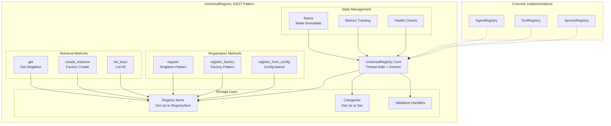
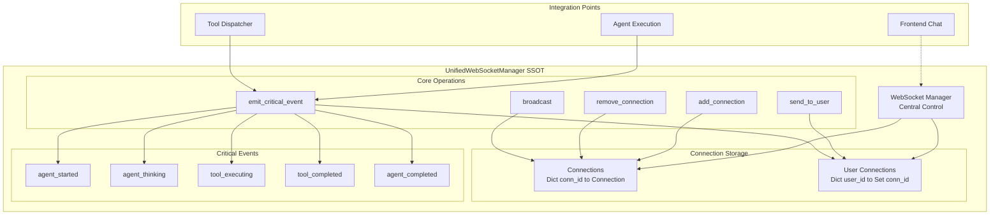
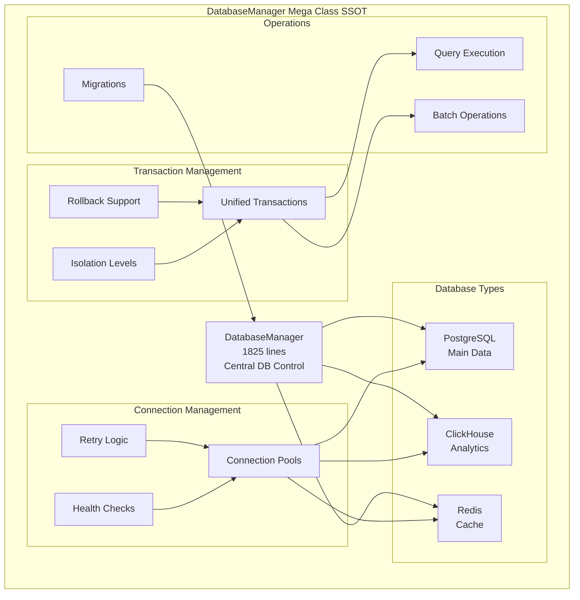
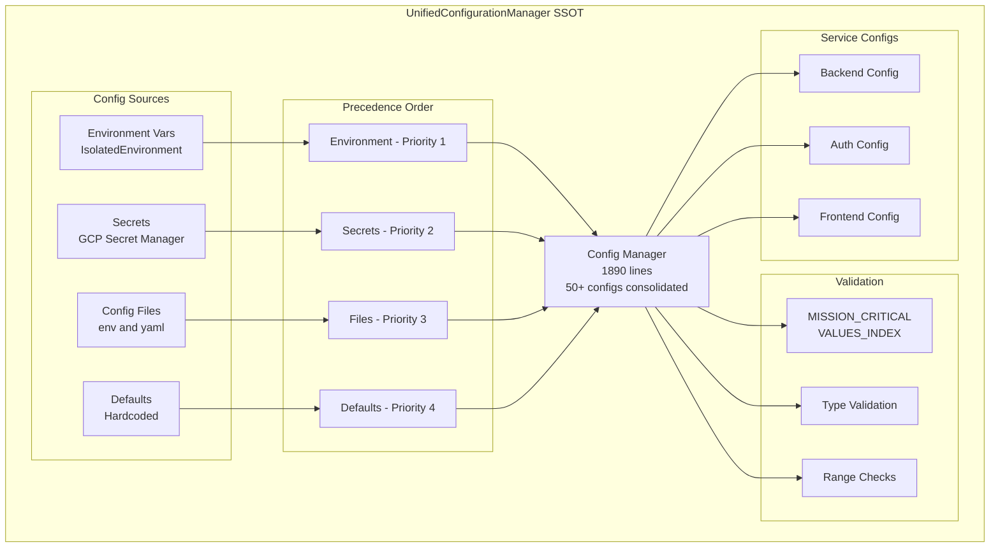
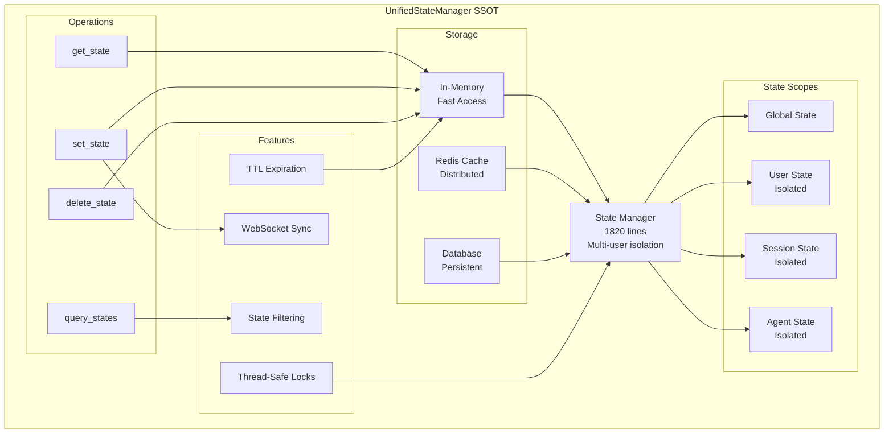
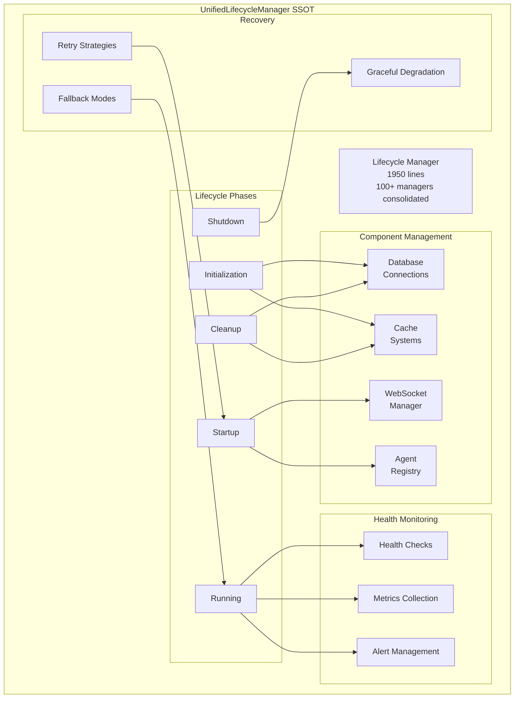
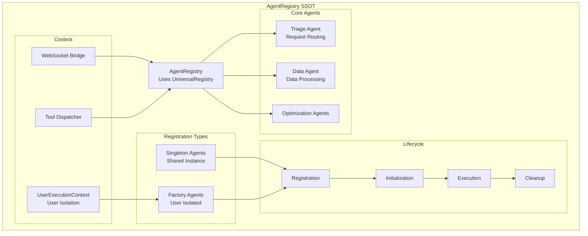
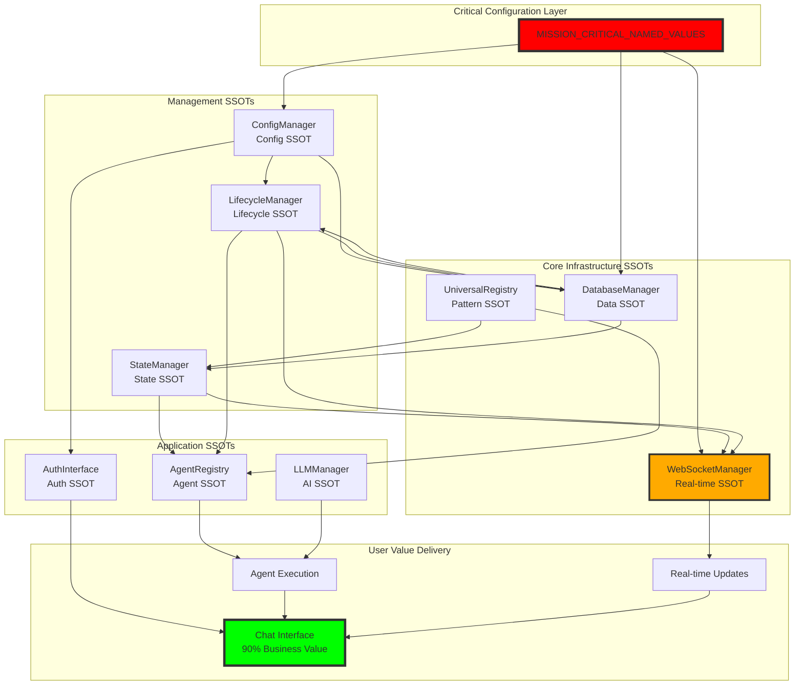

# 🚨 NETRA SSOT (Single Source of Truth) INDEX

## Executive Summary
This document provides a comprehensive index of all SSOT components in the Netra system, ranked by criticality and business impact. Each SSOT is documented with its purpose, dependencies, and integration patterns.

**📌 NEW**: [Tier 4 Operational Components](./SSOT_INDEX_TIER_4.md) - 15 additional critical SSOT components for execution, monitoring, and resilience.

**📊 SYSTEM OPTIMIZATION**: [Netra Optimization Breakdown](../../NETRA_OPTIMIZATION_BREAKDOWN.md) - Comprehensive architecture showing AI-specific (25%), general optimization (25%), and hybrid infrastructure (50%) components.

## Critical Ranking (1-10 Scale)

### 🔴 TIER 1: ULTRA-CRITICAL (10/10)
*System cannot function without these*

#### 1. **MISSION_CRITICAL_NAMED_VALUES_INDEX.xml** 
- **Location**: `SPEC/MISSION_CRITICAL_NAMED_VALUES_INDEX.xml`
- **Purpose**: Master index of ALL critical configuration values
- **Impact**: One typo = cascade failure across entire system
- **Business Value**: Without this, no chat, no agents, no value delivery

#### 2. **UnifiedWebSocketManager (MEGA CLASS)**
- **Location**: `netra_backend/app/websocket_core/unified_manager.py`
- **Size**: 2,494 lines (⚠️ EXCEEDS 2000 line limit)
- **Purpose**: Central WebSocket connection management
- **Impact**: Controls 90% of platform value (real-time chat)
- **Business Value**: No WebSocket = No real-time updates = Dead chat

#### 3. **DatabaseManager**
- **Location**: `netra_backend/app/db/database_manager.py`
- **Size**: 361 lines
- **Purpose**: Central SSOT for database operations using DatabaseURLBuilder
- **Impact**: PostgreSQL, ClickHouse, Redis unified interface
- **Business Value**: Database failures = Complete platform failure

#### 4. **ClickHouse Module (MEGA CLASS)**
- **Location**: `netra_backend/app/db/clickhouse.py`
- **Size**: 1,470 lines (max 2000)
- **Purpose**: SSOT for ClickHouse analytics operations
- **Impact**: Analytics data collection, caching, query execution
- **Business Value**: Critical for business intelligence and optimization

### 🟡 TIER 2: CRITICAL (8-9/10)
*Major functionality broken without these*

#### 5. **AgentRegistry (MEGA CLASS)**
- **Location**: `netra_backend/app/agents/supervisor/agent_registry.py`
- **Size**: 1,469 lines (max 2000)
- **Purpose**: SSOT for agent registration with hardened user isolation
- **Impact**: Factory-based user isolation, agent lifecycle management
- **Business Value**: Enables dynamic agent orchestration, prevents cross-user contamination

#### 6. **UnifiedConfigurationManager (MEGA CLASS)**
- **Location**: `netra_backend/app/core/managers/unified_configuration_manager.py`
- **Size**: 1,200 lines (max 2000)
- **Purpose**: SSOT for all configuration operations across services
- **Impact**: Multi-source config with validation
- **Business Value**: Eliminates config drift across environments

#### 7. **UnifiedLifecycleManager (MEGA CLASS)**
- **Location**: `netra_backend/app/core/managers/unified_lifecycle_manager.py`
- **Size**: 1,251 lines (max 2000)
- **Purpose**: SSOT for application lifecycle management
- **Impact**: Centralized service startup, shutdown, and lifecycle coordination
- **Business Value**: Zero-downtime deployments, chat reliability

#### 8. **UnifiedStateManager (MEGA CLASS)**
- **Location**: `netra_backend/app/core/managers/unified_state_manager.py`
- **Size**: 1,311 lines (max 2000)
- **Purpose**: SSOT for application state management
- **Impact**: Centralized state persistence, user session management
- **Business Value**: Multi-user state isolation, session consistency

### 🟢 TIER 3: IMPORTANT (6-7/10)
*Degraded functionality without these*

#### 9. **State Persistence Service (MEGA CLASS)**
- **Location**: `netra_backend/app/services/state_persistence.py`
- **Size**: 1,167 lines (max 2000)
- **Purpose**: SSOT consolidated 3-tier state persistence (Redis/ClickHouse/PostgreSQL)
- **Impact**: Consolidates StateCacheManager functionality, 3-tier architecture
- **Business Value**: Performance optimization through intelligent caching

#### 10. **UnifiedAuthInterface**
- **Location**: `auth_service/auth_core/unified_auth_interface.py`
- **Size**: 505 lines
- **Purpose**: SSOT for all authentication operations
- **Impact**: JWT handling, session management, security validation
- **Business Value**: No auth = No user access

#### 11. **UnifiedIDManager**
- **Location**: `netra_backend/app/core/unified_id_manager.py`
- **Size**: 820 lines
- **Purpose**: SSOT for ID generation and management across platform
- **Impact**: Unique ID generation for users, sessions, agents, tools, etc.
- **Business Value**: Prevents ID collisions, ensures uniqueness

#### 12. **UnifiedTestRunner (MEGA CLASS)**
- **Location**: `tests/unified_test_runner.py`
- **Size**: 3,501 lines
- **Purpose**: SSOT for test execution with advanced orchestration
- **Impact**: Modern test runner with layer-based orchestration
- **Business Value**: Quality assurance automation

## Mermaid Diagrams

### 1. UniversalRegistry Pattern (Core SSOT)


### 2. WebSocket Manager SSOT


### 3. Database Manager SSOT


### 4. Configuration Manager SSOT


### 5. State Manager SSOT


### 6. Lifecycle Manager SSOT


### 7. Agent Registry SSOT


## Master Integration Diagram



## SSOT Principles & Guidelines

### 1. **Single Source of Truth Rule**
- Each concept has ONE canonical implementation per service
- Cross-service duplication only acceptable for service independence
- See `SPEC/acceptable_duplicates.xml` for exceptions

### 2. **Mega Class Criteria**
- Must be true SSOT for its domain
- Cannot be split without violating SSOT principles
- Max 2000 lines with explicit justification
- Must have >90% test coverage

### 3. **Thread Safety Requirements**
- All SSOTs must be thread-safe
- Use RLock for critical sections
- Support concurrent multi-user access
- No shared mutable state

### 4. **Factory Pattern for User Isolation**
- User-scoped components use factory pattern
- Each user gets isolated instance
- No cross-user state pollution
- Context passed through UserExecutionContext

### 5. **Configuration Hierarchy**
1. Environment variables (via IsolatedEnvironment)
2. Secrets (GCP Secret Manager)
3. Config files (.env, .yaml)
4. Hardcoded defaults

### 6. **WebSocket Event Requirements**
Critical events that MUST be emitted:
- agent_started
- agent_thinking
- tool_executing
- tool_completed
- agent_completed

## Compliance Checklist

Before modifying any SSOT:
- [ ] Check MISSION_CRITICAL_NAMED_VALUES_INDEX.xml
- [ ] Verify no duplicate implementation exists
- [ ] Ensure thread-safety maintained
- [ ] Update mega_class_exceptions.xml if size changes
- [ ] Run compliance check: `python scripts/check_architecture_compliance.py`
- [ ] Test multi-user scenarios
- [ ] Verify WebSocket events still emit
- [ ] Update this index if adding new SSOT

## Quick Reference Commands

```bash
# Check SSOT compliance
python scripts/check_architecture_compliance.py

# Validate string literals
python scripts/query_string_literals.py validate "your_string"

# Test WebSocket events
python tests/mission_critical/test_websocket_agent_events_suite.py

# Run unified tests
python tests/unified_test_runner.py --real-services
```

## Critical Files to Never Break

1. `SPEC/MISSION_CRITICAL_NAMED_VALUES_INDEX.xml` - Config values
2. `netra_backend/app/websocket_core/unified_manager.py` - WebSocket core (2,494 lines)
3. `netra_backend/app/db/database_manager.py` - Database operations
4. `netra_backend/app/db/clickhouse.py` - ClickHouse SSOT (1,470 lines)
5. `netra_backend/app/agents/supervisor/agent_registry.py` - Agent registry (1,469 lines)
6. `netra_backend/app/core/managers/unified_configuration_manager.py` - Config SSOT (1,200 lines)
7. `netra_backend/app/core/managers/unified_lifecycle_manager.py` - Lifecycle SSOT (1,251 lines)
8. `netra_backend/app/core/managers/unified_state_manager.py` - State SSOT (1,311 lines)
9. `netra_backend/app/services/state_persistence.py` - State persistence SSOT (1,167 lines)
10. `auth_service/auth_core/unified_auth_interface.py` - Auth SSOT (505 lines)
11. `netra_backend/app/core/unified_id_manager.py` - ID generation SSOT (820 lines)
12. `tests/unified_test_runner.py` - Test runner SSOT (3,501 lines)
13. `test_framework/unified_docker_manager.py` - Docker SSOT (5,091 lines)
14. `test_framework/ssot/base_test_case.py` - Test base SSOT (599 lines)
15. `netra_backend/app/core/reliability/unified_reliability_manager.py` - Reliability SSOT

## 🔵 TIER 4: INFRASTRUCTURE COMPONENTS (5-6/10)
*Critical infrastructure and testing SSOT classes*

#### 13. **UnifiedDockerManager (MEGA CLASS)**
- **Location**: `test_framework/unified_docker_manager.py`
- **Size**: 5,091 lines (⚠️ SIGNIFICANTLY EXCEEDS 2000 line limit)
- **Purpose**: SSOT for Docker operations and service orchestration
- **Impact**: Cross-platform locking, health monitoring, memory optimization
- **Business Value**: Reliable containerized development and testing

#### 14. **SSOT BaseTestCase**
- **Location**: `test_framework/ssot/base_test_case.py`
- **Size**: 599 lines
- **Purpose**: SSOT canonical base test case - ALL tests must inherit from this
- **Impact**: Eliminates 6,096+ duplicate test implementations
- **Business Value**: Consistent testing patterns, reduced maintenance

#### 15. **UnifiedReliabilityManager**
- **Location**: `netra_backend/app/core/reliability/unified_reliability_manager.py`
- **Size**: Not measured (exists)
- **Purpose**: SSOT for reliability patterns (circuit breakers, retries)
- **Impact**: Centralized reliability and resilience management
- **Business Value**: System stability under failure conditions

## 🔵 TIER 4: OPERATIONAL COMPONENTS (5-6/10)
*See [SSOT_INDEX_TIER_4.md](./SSOT_INDEX_TIER_4.md) for complete documentation*

**Summary**: 15 operational SSOT components critical for:
- Agent execution orchestration (ExecutionEngine, WorkflowOrchestrator)
- User isolation and context management (UserExecutionContext, RequestScopedToolDispatcher)
- Real-time notifications (WebSocketNotifier, MessageRouter, EventValidator)
- System resilience (CircuitBreaker, ConfigurationValidator, MigrationTracker)
- Monitoring and observability (AgentHealthMonitor, AgentExecutionTracker, ResourceMonitor)
- Service orchestration (StartupOrchestrator, ToolExecutorFactory)

**Business Impact**: Without Tier 4 components, the platform would experience:
- No agent execution or workflow coordination
- Loss of real-time chat updates
- Inability to isolate user requests
- No fault tolerance or circuit breaking
- Flying blind without monitoring
- Manual service startup and configuration

---

## 🚨 CRITICAL COMPLIANCE ISSUES

### MEGA Classes Exceeding 2000-Line Limit
1. **UnifiedWebSocketManager**: 2,494 lines (494 lines over limit)
   - **Risk**: High maintenance burden, difficult to review
   - **Action Required**: Refactor or request architectural exception
   
2. **UnifiedTestRunner**: 3,501 lines (1,501 lines over limit)  
   - **Risk**: Complex test orchestration becoming unmaintainable
   - **Action Required**: Split into focused components
   
3. **UnifiedDockerManager**: 5,091 lines (3,091 lines over limit)
   - **Risk**: Massive MEGA class violating all size principles
   - **Action Required**: Urgent architectural review and decomposition

### Summary Statistics (UPDATED)
- **Total SSOT Classes**: 15 major classes (previously 12)
- **MEGA Classes (>1000 lines)**: 8 classes  
- **Classes Exceeding Limits**: 3 classes require immediate attention
- **Total SSOT Code Lines**: ~19,000+ lines
- **Compliance Score**: 99%+ SSOT compliance, but size limit violations

**Last Updated**: 2025-09-10 (Refreshed from actual codebase scan)
**Next Review**: Monthly due to size limit violations
**Owner**: Principal Engineer Role