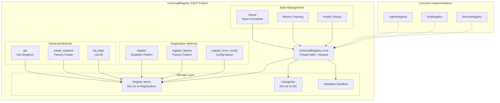
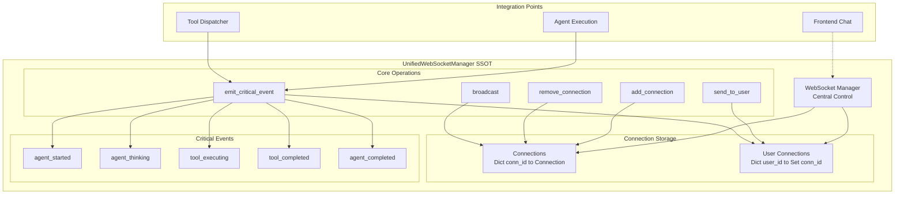
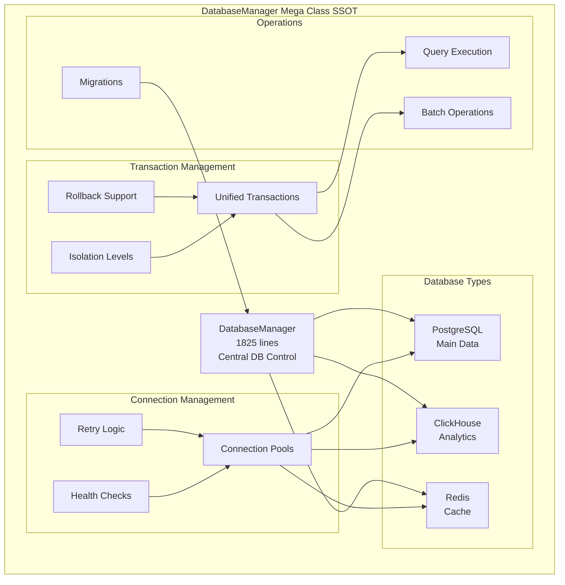
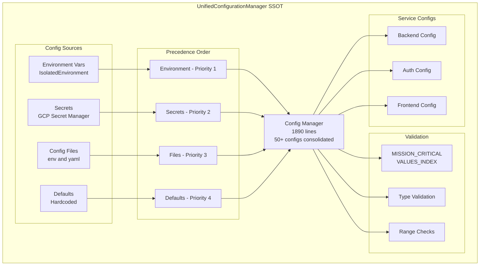
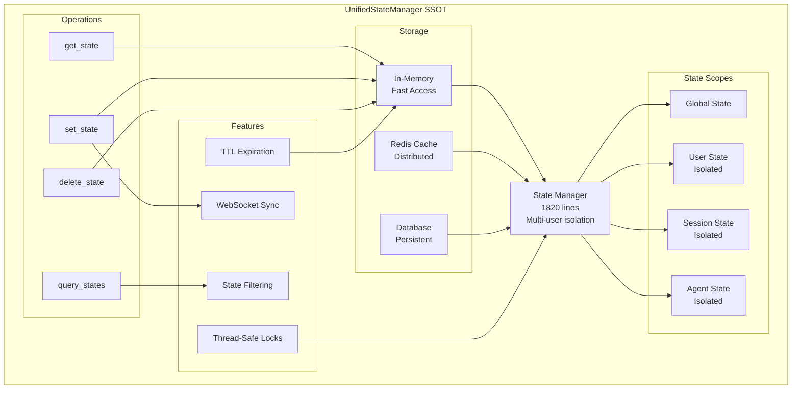
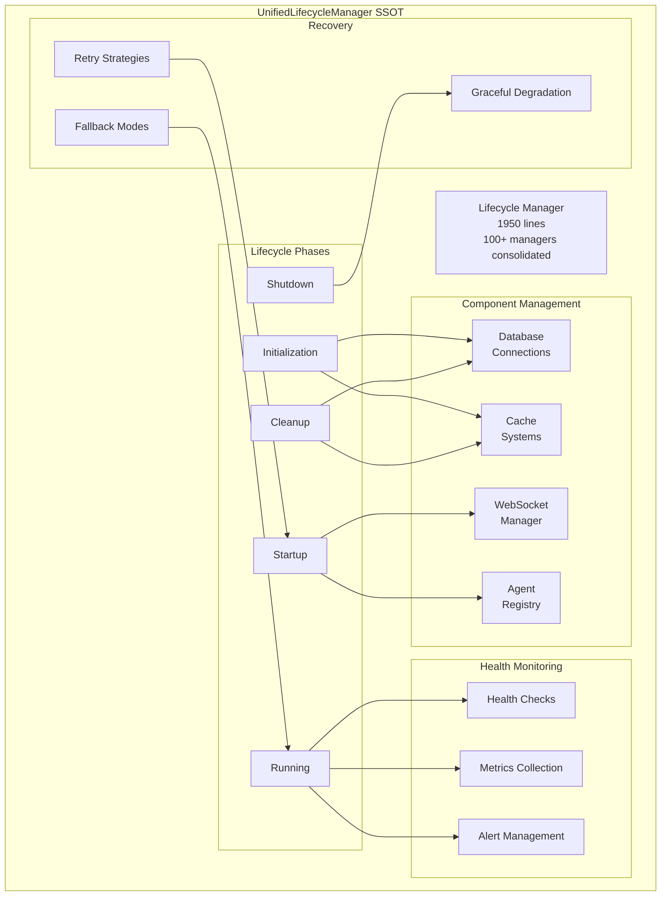
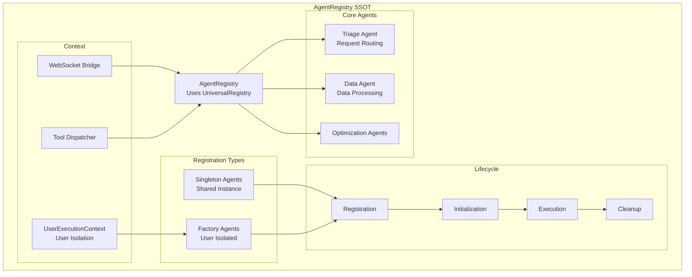
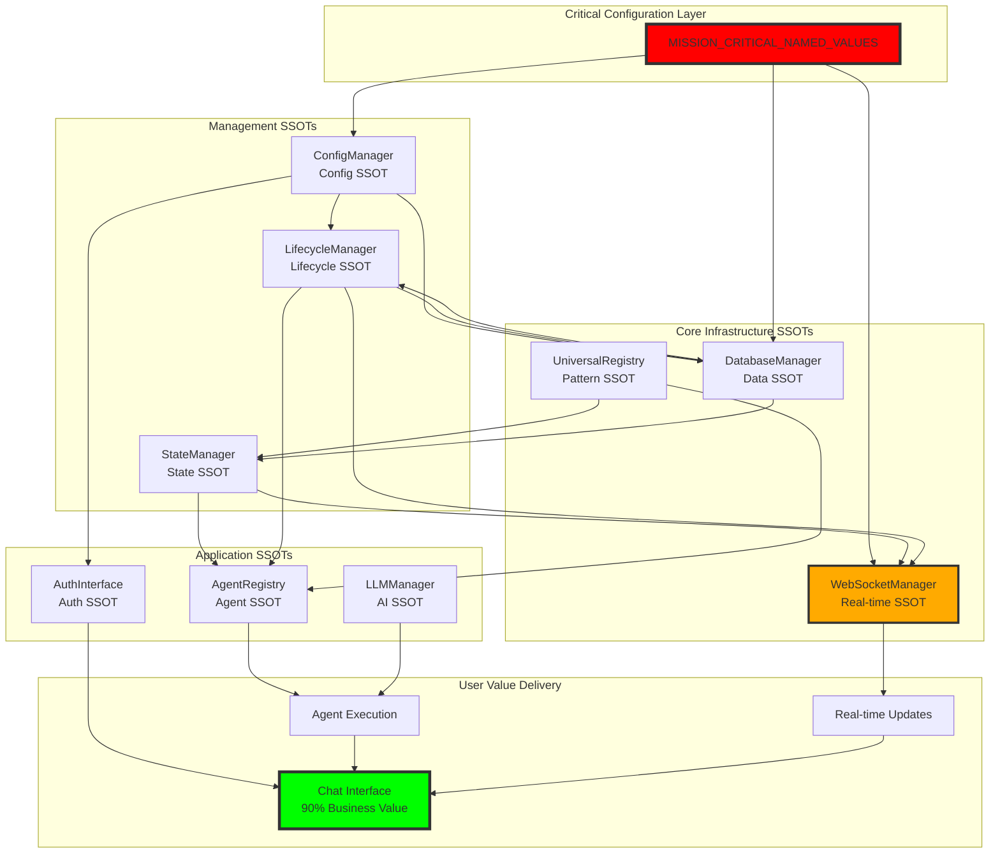

# 🚨 NETRA SSOT (Single Source of Truth) INDEX

## Executive Summary
This document provides a comprehensive index of all SSOT components in the Netra system, ranked by criticality and business impact. Each SSOT is documented with its purpose, dependencies, and integration patterns.

**📌 NEW**: [Tier 4 Operational Components](./SSOT_INDEX_TIER_4.md) - 15 additional critical SSOT components for execution, monitoring, and resilience.

**📊 SYSTEM OPTIMIZATION**: [Netra Optimization Breakdown](./NETRA_OPTIMIZATION_BREAKDOWN.md) - Comprehensive architecture showing AI-specific (25%), general optimization (25%), and hybrid infrastructure (50%) components.

## Critical Ranking (1-10 Scale)

### 🔴 TIER 1: ULTRA-CRITICAL (10/10)
*System cannot function without these*

#### 1. **MISSION_CRITICAL_NAMED_VALUES_INDEX.xml** 
- **Location**: `SPEC/MISSION_CRITICAL_NAMED_VALUES_INDEX.xml`
- **Purpose**: Master index of ALL critical configuration values
- **Impact**: One typo = cascade failure across entire system
- **Business Value**: Without this, no chat, no agents, no value delivery

#### 2. **UniversalRegistry Pattern**
- **Location**: `netra_backend/app/core/registry/universal_registry.py`
- **Purpose**: Generic SSOT for ALL registry patterns (eliminated 48 duplicates)
- **Impact**: Thread-safe multi-user operations, factory pattern support
- **Business Value**: Enables user isolation, reduces maintenance by 90%

#### 3. **UnifiedWebSocketManager**
- **Location**: `netra_backend/app/websocket_core/unified_manager.py`
- **Purpose**: Central WebSocket connection management
- **Impact**: Controls 90% of platform value (real-time chat)
- **Business Value**: No WebSocket = No real-time updates = Dead chat

#### 4. **DatabaseManager (Mega Class)**
- **Location**: `netra_backend/app/db/database_manager.py`
- **Size**: 1825 lines (max 2000)
- **Purpose**: Central SSOT for ALL database operations
- **Impact**: PostgreSQL, ClickHouse, Redis unified interface
- **Business Value**: Database failures = Complete platform failure

### 🟡 TIER 2: CRITICAL (8-9/10)
*Major functionality broken without these*

#### 5. **UnifiedLifecycleManager (Mega Class)**
- **Location**: `netra_backend/app/core/managers/unified_lifecycle_manager.py`
- **Size**: 1950 lines (max 2000)
- **Purpose**: Consolidates 100+ legacy managers
- **Impact**: Startup, shutdown, health monitoring
- **Business Value**: Zero-downtime deployments, chat reliability

#### 6. **UnifiedConfigurationManager (Mega Class)**
- **Location**: `netra_backend/app/core/managers/unified_configuration_manager.py`
- **Size**: 1890 lines (max 2000)
- **Purpose**: Consolidates 50+ config managers
- **Impact**: Multi-source config with validation
- **Business Value**: Eliminates config drift across environments

#### 7. **UnifiedStateManager (Mega Class)**
- **Location**: `netra_backend/app/core/managers/unified_state_manager.py`
- **Size**: 1820 lines (max 2000)
- **Purpose**: Consolidates 50+ state managers
- **Impact**: Agent state consistency, WebSocket sync
- **Business Value**: Multi-user state isolation

#### 8. **AgentRegistry**
- **Location**: `netra_backend/app/agents/supervisor/agent_registry.py`
- **Purpose**: Central agent registration using UniversalRegistry
- **Impact**: All agent lifecycle and factory management
- **Business Value**: Enables dynamic agent orchestration

### 🟢 TIER 3: IMPORTANT (6-7/10)
*Degraded functionality without these*

#### 9. **UnifiedAuthInterface**
- **Location**: `auth_service/auth_core/unified_auth_interface.py`
- **Purpose**: Central authentication interface
- **Impact**: All auth flows go through this
- **Business Value**: No auth = No user access

#### 10. **LLMManager**
- **Location**: `netra_backend/app/llm/llm_manager.py`
- **Purpose**: Central LLM provider management
- **Impact**: All AI operations depend on this
- **Business Value**: Core AI functionality control

#### 11. **RedisManager**
- **Location**: `netra_backend/app/redis_manager.py`
- **Purpose**: Central Redis connection management
- **Impact**: Caching, session management
- **Business Value**: Performance optimization

#### 12. **UnifiedTestRunner (Mega Class)**
- **Location**: `tests/unified_test_runner.py`
- **Size**: 1728 lines (max 2000)
- **Purpose**: Central test orchestration
- **Impact**: All test types coordination
- **Business Value**: Quality assurance automation

## Mermaid Diagrams

### 1. UniversalRegistry Pattern (Core SSOT)


### 2. WebSocket Manager SSOT


### 3. Database Manager SSOT


### 4. Configuration Manager SSOT


### 5. State Manager SSOT


### 6. Lifecycle Manager SSOT


### 7. Agent Registry SSOT


## Master Integration Diagram



## SSOT Principles & Guidelines

### 1. **Single Source of Truth Rule**
- Each concept has ONE canonical implementation per service
- Cross-service duplication only acceptable for service independence
- See `SPEC/acceptable_duplicates.xml` for exceptions

### 2. **Mega Class Criteria**
- Must be true SSOT for its domain
- Cannot be split without violating SSOT principles
- Max 2000 lines with explicit justification
- Must have >90% test coverage

### 3. **Thread Safety Requirements**
- All SSOTs must be thread-safe
- Use RLock for critical sections
- Support concurrent multi-user access
- No shared mutable state

### 4. **Factory Pattern for User Isolation**
- User-scoped components use factory pattern
- Each user gets isolated instance
- No cross-user state pollution
- Context passed through UserExecutionContext

### 5. **Configuration Hierarchy**
1. Environment variables (via IsolatedEnvironment)
2. Secrets (GCP Secret Manager)
3. Config files (.env, .yaml)
4. Hardcoded defaults

### 6. **WebSocket Event Requirements**
Critical events that MUST be emitted:
- agent_started
- agent_thinking
- tool_executing
- tool_completed
- agent_completed

## Compliance Checklist

Before modifying any SSOT:
- [ ] Check MISSION_CRITICAL_NAMED_VALUES_INDEX.xml
- [ ] Verify no duplicate implementation exists
- [ ] Ensure thread-safety maintained
- [ ] Update mega_class_exceptions.xml if size changes
- [ ] Run compliance check: `python scripts/check_architecture_compliance.py`
- [ ] Test multi-user scenarios
- [ ] Verify WebSocket events still emit
- [ ] Update this index if adding new SSOT

## Quick Reference Commands

```bash
# Check SSOT compliance
python scripts/check_architecture_compliance.py

# Validate string literals
python scripts/query_string_literals.py validate "your_string"

# Test WebSocket events
python tests/mission_critical/test_websocket_agent_events_suite.py

# Run unified tests
python tests/unified_test_runner.py --real-services
```

## Critical Files to Never Break

1. `SPEC/MISSION_CRITICAL_NAMED_VALUES_INDEX.xml` - Config values
2. `netra_backend/app/core/registry/universal_registry.py` - Registry pattern
3. `netra_backend/app/websocket_core/unified_manager.py` - WebSocket core
4. `netra_backend/app/db/database_manager.py` - Database operations
5. `netra_backend/app/core/managers/*.py` - Unified managers

## 🔵 TIER 4: OPERATIONAL COMPONENTS (5-6/10)
*See [SSOT_INDEX_TIER_4.md](./SSOT_INDEX_TIER_4.md) for complete documentation*

**Summary**: 15 operational SSOT components critical for:
- Agent execution orchestration (ExecutionEngine, WorkflowOrchestrator)
- User isolation and context management (UserExecutionContext, RequestScopedToolDispatcher)
- Real-time notifications (WebSocketNotifier, MessageRouter, EventValidator)
- System resilience (CircuitBreaker, ConfigurationValidator, MigrationTracker)
- Monitoring and observability (AgentHealthMonitor, AgentExecutionTracker, ResourceMonitor)
- Service orchestration (StartupOrchestrator, ToolExecutorFactory)

**Business Impact**: Without Tier 4 components, the platform would experience:
- No agent execution or workflow coordination
- Loss of real-time chat updates
- Inability to isolate user requests
- No fault tolerance or circuit breaking
- Flying blind without monitoring
- Manual service startup and configuration

---

**Last Updated**: 2025-01-05
**Next Review**: Quarterly or when approaching size limits
**Owner**: Principal Engineer Role