# 🚨 NETRA SSOT INDEX - TIER 4: OPERATIONAL COMPONENTS

## Executive Summary
This document extends the main SSOT index with Tier 4 operational components (5-6/10 criticality). These are essential for day-to-day platform operations, monitoring, execution flow, and system resilience. While not ultra-critical like Tiers 1-3, their failure would significantly degrade platform functionality and developer productivity.

## 🔵 TIER 4: OPERATIONAL SSOT (5-6/10)
*Platform operates with degraded performance or missing features without these*

### 1. **ExecutionEngine** 
- **Location**: `netra_backend/app/agents/supervisor/execution_engine.py`
- **Purpose**: Core agent execution orchestrator with WebSocket integration
- **Impact**: Controls agent workflow execution and real-time updates
- **Dependencies**: AgentRegistry, WebSocketManager, UserExecutionContext
- **Business Value**: Without this, agent execution becomes manual and non-interactive

### 2. **WorkflowOrchestrator**
- **Location**: `netra_backend/app/agents/supervisor/workflow_orchestrator.py`  
- **Purpose**: Multi-agent workflow coordination and sequencing
- **Impact**: Complex agent chains and data pipelines
- **Dependencies**: ExecutionEngine, AgentRegistry, StateManager
- **Business Value**: Enables sophisticated AI workflows beyond single agents

### 3. **UserExecutionContext**
- **Location**: `netra_backend/app/agents/supervisor/execution_context.py`
- **Purpose**: User-scoped execution isolation and context management
- **Impact**: Ensures complete user isolation during agent execution
- **Dependencies**: UnifiedStateManager, DatabaseManager
- **Business Value**: Critical for multi-tenancy and user data security

### 4. **RequestScopedToolDispatcher**
- **Location**: `netra_backend/app/agents/request_scoped_tool_dispatcher.py`
- **Purpose**: Request-isolated tool execution preventing cross-contamination
- **Impact**: Tool execution safety and user isolation
- **Dependencies**: ToolRegistry, UserExecutionContext
- **Business Value**: Prevents data leakage between concurrent user requests

### 5. **WebSocketNotifier**
- **Location**: `netra_backend/app/agents/supervisor/websocket_notifier.py`
- **Purpose**: Real-time notification bridge between agents and WebSocket layer
- **Impact**: Agent progress visibility and user engagement
- **Dependencies**: UnifiedWebSocketManager, EventValidator
- **Business Value**: Core to interactive chat experience

### 6. **CircuitBreakerManager**
- **Location**: `netra_backend/app/core/resilience/unified_circuit_breaker.py`
- **Purpose**: Fault isolation and cascading failure prevention
- **Impact**: System stability under load and failure conditions
- **Dependencies**: HealthMonitor, MetricsCollector
- **Business Value**: Prevents total system failure from partial component issues

### 7. **AgentHealthMonitor**
- **Location**: `netra_backend/app/core/agent_health_monitor.py`
- **Purpose**: Real-time agent health tracking and alerting
- **Impact**: Early detection of agent failures and performance issues
- **Dependencies**: MetricsCollector, AlertManager
- **Business Value**: Proactive issue resolution before user impact

### 8. **MigrationTracker**
- **Location**: `netra_backend/app/startup/migration_tracker.py`
- **Purpose**: Database migration state management and rollback support
- **Impact**: Safe schema evolution and deployment
- **Dependencies**: DatabaseManager, VersionControl
- **Business Value**: Zero-downtime deployments and safe rollbacks

### 9. **ConfigurationValidator**
- **Location**: `netra_backend/app/core/configuration_validator.py`
- **Purpose**: Runtime configuration validation and consistency checks
- **Impact**: Prevents misconfigurations from reaching production
- **Dependencies**: UnifiedConfigurationManager, MISSION_CRITICAL_VALUES
- **Business Value**: Reduces configuration-related outages

### 10. **MessageRouter**
- **Location**: `netra_backend/app/websocket_core/handlers.py`
- **Purpose**: WebSocket message routing and handler dispatch
- **Impact**: Correct message delivery to appropriate handlers
- **Dependencies**: UnifiedWebSocketManager, MessageValidator
- **Business Value**: Ensures chat messages reach correct destinations

### 11. **EventValidator**
- **Location**: `netra_backend/app/websocket_core/event_validation_framework.py`
- **Purpose**: WebSocket event schema validation and sequencing
- **Impact**: Data integrity for all real-time communications
- **Dependencies**: SchemaRegistry, EventSequenceValidator
- **Business Value**: Prevents malformed events from corrupting chat state

### 12. **AgentExecutionTracker**
- **Location**: `netra_backend/app/core/agent_execution_tracker.py`
- **Purpose**: Detailed agent execution telemetry and debugging
- **Impact**: Observability into agent performance and failures
- **Dependencies**: OpenTelemetry, MetricsCollector
- **Business Value**: Enables performance optimization and debugging

### 13. **ToolExecutorFactory**
- **Location**: `netra_backend/app/agents/tool_executor_factory.py`
- **Purpose**: Dynamic tool executor instantiation with proper isolation
- **Impact**: Tool execution flexibility and safety
- **Dependencies**: ToolRegistry, ExecutionContext
- **Business Value**: Enables custom tool integration and execution

### 14. **StartupOrchestrator**
- **Location**: `netra_backend/app/smd.py`
- **Purpose**: Service startup sequencing and dependency management
- **Impact**: Correct service initialization order
- **Dependencies**: LifecycleManager, HealthMonitor
- **Business Value**: Reliable service startup and dependency resolution

### 15. **ResourceMonitor**
- **Location**: `netra_backend/app/llm/resource_monitor.py`
- **Purpose**: LLM resource usage tracking and quota management
- **Impact**: Cost control and resource optimization
- **Dependencies**: LLMManager, MetricsCollector
- **Business Value**: Prevents runaway AI costs and ensures fair resource allocation

## Architecture Diagrams

### Tier 4 Execution Flow


### Tier 4 Component Dependencies


### Tier 4 Failure Impact Analysis

```mermaid
graph TB
    subgraph "Component Failure Impact"
        EE_FAIL[ExecutionEngine Failure<br/>❌ No agent execution]
        WO_FAIL[WorkflowOrchestrator Failure<br/>⚠️ Single agents only]
        CTX_FAIL[UserExecutionContext Failure<br/>❌ No user isolation]
        TOOL_FAIL[ToolDispatcher Failure<br/>❌ No tool execution]
        WSN_FAIL[WebSocketNotifier Failure<br/>⚠️ No real-time updates]
        CB_FAIL[CircuitBreaker Failure<br/>⚠️ No fault isolation]
        MON_FAIL[Monitor Failures<br/>⚠️ Flying blind]
        VAL_FAIL[Validator Failures<br/>⚠️ Data integrity risk]
    end
    
    subgraph "Business Impact"
        CHAT[Chat Experience<br/>Degraded]
        AGENT[Agent Functionality<br/>Limited]
        PERF[Performance<br/>Degraded]
        DEBUG[Debugging<br/>Difficult]
        COST[Costs<br/>Uncontrolled]
    end
    
    EE_FAIL --> CHAT
    EE_FAIL --> AGENT
    
    WO_FAIL --> AGENT
    CTX_FAIL --> CHAT
    
    TOOL_FAIL --> AGENT
    WSN_FAIL --> CHAT
    
    CB_FAIL --> PERF
    MON_FAIL --> DEBUG
    MON_FAIL --> COST
    
    VAL_FAIL --> CHAT
    
    style EE_FAIL fill:#FF6B6B
    style CTX_FAIL fill:#FF6B6B
    style TOOL_FAIL fill:#FF6B6B
    style WO_FAIL fill:#FFD93D
    style WSN_FAIL fill:#FFD93D
    style CB_FAIL fill:#FFD93D
    style MON_FAIL fill:#FFD93D
    style VAL_FAIL fill:#FFD93D
```


## Tier 4 SSOT Characteristics

### Common Patterns
1. **Request Scoping**: Most Tier 4 components are request/session scoped
2. **Monitoring Integration**: All have telemetry and metrics hooks
3. **Graceful Degradation**: Designed to fail gracefully without system crash
4. **Factory Patterns**: Heavy use of factories for isolation
5. **Event-Driven**: Most emit events for observability

### Testing Requirements
- **Unit Tests**: Minimum 85% coverage
- **Integration Tests**: Must test with real dependencies
- **Load Tests**: Performance under concurrent load
- **Failure Tests**: Graceful degradation scenarios
- **Isolation Tests**: No cross-contamination between users

### Performance Characteristics
| Component | Latency Budget | Throughput | Memory |
|-----------|---------------|------------|---------|
| ExecutionEngine | <100ms startup | 1000 req/s | <100MB |
| WorkflowOrchestrator | <50ms routing | 500 workflows/s | <200MB |
| UserExecutionContext | <10ms creation | 10000/s | <50MB |
| ToolDispatcher | <20ms dispatch | 5000 calls/s | <50MB |
| WebSocketNotifier | <5ms emit | 10000 events/s | <20MB |
| CircuitBreaker | <1ms check | 100000 checks/s | <10MB |
| Monitors | <10ms collect | Continuous | <100MB |
| Validators | <5ms validate | 20000/s | <20MB |

## Migration Path from Legacy

### Components Being Replaced
1. **Legacy ExecutionManager** → ExecutionEngine + WorkflowOrchestrator
2. **Old ToolDispatcher (singleton)** → RequestScopedToolDispatcher
3. **WebSocketHelper** → WebSocketNotifier + MessageRouter
4. **SimpleHealthCheck** → AgentHealthMonitor + ResourceMonitor
5. **ConfigLoader** → ConfigurationValidator

### Migration Strategy
```python
# Step 1: Run in parallel (shadow mode)
if settings.USE_NEW_EXECUTION:
    result = ExecutionEngine.execute()
else:
    result = LegacyExecutionManager.execute()
    # Shadow execution for validation
    shadow_result = ExecutionEngine.execute(shadow=True)
    compare_results(result, shadow_result)

# Step 2: Gradual rollout
if user_id % 100 < rollout_percentage:
    result = ExecutionEngine.execute()
else:
    result = LegacyExecutionManager.execute()

# Step 3: Full migration with fallback
try:
    result = ExecutionEngine.execute()
except Exception as e:
    if settings.ENABLE_FALLBACK:
        result = LegacyExecutionManager.execute()
    else:
        raise
```

## Maintenance Guidelines

### Daily Checks
1. Monitor error rates in ExecutionEngine logs
2. Check CircuitBreaker trip frequencies
3. Review AgentHealthMonitor alerts
4. Validate WebSocket event delivery rates

### Weekly Reviews
1. Analyze AgentExecutionTracker performance trends
2. Review ResourceMonitor cost reports
3. Check ConfigurationValidator warnings
4. Audit ToolDispatcher isolation metrics

### Monthly Audits
1. Full component health assessment
2. Performance baseline updates
3. Capacity planning based on growth
4. Technical debt review

## Integration with Higher Tiers

### Tier 1-3 Dependencies


## Quick Reference

### Critical Files
```bash
# Execution Core
netra_backend/app/agents/supervisor/execution_engine.py
netra_backend/app/agents/supervisor/workflow_orchestrator.py
netra_backend/app/agents/supervisor/execution_context.py

# Tool Execution
netra_backend/app/agents/request_scoped_tool_dispatcher.py
netra_backend/app/agents/tool_executor_factory.py

# Monitoring
netra_backend/app/core/agent_execution_tracker.py
netra_backend/app/core/agent_health_monitor.py
netra_backend/app/llm/resource_monitor.py

# WebSocket
netra_backend/app/agents/supervisor/websocket_notifier.py
netra_backend/app/websocket_core/handlers.py  # MessageRouter
netra_backend/app/websocket_core/event_validation_framework.py

# Resilience
netra_backend/app/core/resilience/unified_circuit_breaker.py
netra_backend/app/core/configuration_validator.py
netra_backend/app/startup/migration_tracker.py
```

### Test Commands
```bash
# Test execution components
python tests/unit/agents/test_execution_engine.py
python tests/unit/agents/test_workflow_orchestrator.py

# Test monitoring
python tests/unit/core/test_agent_health_monitor.py
python tests/unit/core/test_agent_execution_tracker.py

# Test resilience
python tests/unit/core/test_circuit_breaker.py
python tests/unit/core/test_configuration_validator.py

# Integration tests
python tests/integration/test_tier4_components.py
```

### Debugging Commands
```bash
# Check execution engine status
python -c "from netra_backend.app.agents.supervisor.execution_engine import ExecutionEngine; print(ExecutionEngine.get_status())"

# Verify tool dispatcher isolation
python scripts/verify_tool_isolation.py

# Monitor WebSocket events
python scripts/monitor_websocket_events.py --filter=tier4

# Health check all Tier 4 components
python scripts/tier4_health_check.py
```

## Tier 4 Component Owners

| Component | Owner Team | On-Call Priority |
|-----------|------------|------------------|
| ExecutionEngine | Platform Core | P1 |
| WorkflowOrchestrator | Agent Team | P2 |
| UserExecutionContext | Security Team | P1 |
| ToolDispatcher | Tools Team | P2 |
| WebSocketNotifier | Frontend Team | P2 |
| CircuitBreaker | SRE Team | P1 |
| Monitors | Observability Team | P3 |
| Validators | QA Team | P3 |

## SLA Requirements

### Availability
- **ExecutionEngine**: 99.9% (43 min downtime/month)
- **WorkflowOrchestrator**: 99.5% (3.6 hr downtime/month) 
- **UserExecutionContext**: 99.9% (43 min downtime/month)
- **ToolDispatcher**: 99.5% (3.6 hr downtime/month)
- **Others**: 99.0% (7.2 hr downtime/month)

### Recovery Time
- **RTO** (Recovery Time Objective): <15 minutes
- **RPO** (Recovery Point Objective): <5 minutes
- **Rollback Time**: <5 minutes

## Future Enhancements

### Q1 2025
- [ ] ExecutionEngine v2 with DAG support
- [ ] Enhanced CircuitBreaker with predictive tripping
- [ ] Multi-region WorkflowOrchestrator

### Q2 2025
- [ ] AI-powered ConfigurationValidator
- [ ] Real-time cost optimization in ResourceMonitor
- [ ] Distributed tracing in AgentExecutionTracker

### Q3 2025
- [ ] Self-healing capabilities in all components
- [ ] Automated performance tuning
- [ ] Zero-downtime component upgrades

---

**Document Version**: 1.0.0
**Last Updated**: 2025-01-05
**Review Schedule**: Monthly
**Next Review**: 2025-02-05

**See Also**:
- [Main SSOT Index](./SSOT_INDEX.md) - Tiers 1-3
- [MISSION_CRITICAL_NAMED_VALUES](./SPEC/MISSION_CRITICAL_NAMED_VALUES_INDEX.xml)
- [Architecture Compliance](./scripts/check_architecture_compliance.py)