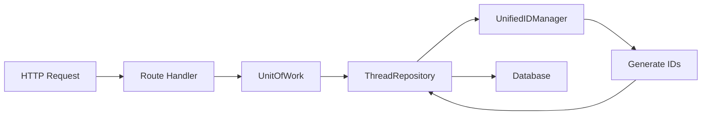

# Thread Storage SSOT Final Architecture
Date: 2025-09-04
Status: IMPLEMENTED

## Overview
This document describes the finalized Single Source of Truth (SSOT) architecture for thread storage and loading in the Netra platform, following the comprehensive refactoring to eliminate legacy code and consolidate duplicate implementations.

## Core Components

### 1. ID Generation (SSOT: UnifiedIDManager)
**Location**: `netra_backend/app/core/unified_id_manager.py`

All thread and run ID generation now goes through UnifiedIDManager:

```python
# Generate thread ID (without prefix)
thread_id = UnifiedIDManager.generate_thread_id()  
# Returns: "session_1234567890_abcd1234"

# Add prefix for full thread ID
full_thread_id = f"thread_{thread_id}"
# Returns: "thread_session_1234567890_abcd1234"

# Generate run ID from thread
run_id = UnifiedIDManager.generate_run_id(thread_id)
# Returns: "thread_{thread_id}_run_1234567890_abcd1234"
```

**Key Changes**:
- Fixed double-prefixing issue where `thread_` was added twice
- Standardized ID format across all components
- Removed all direct UUID generation patterns

### 2. Data Access Layer (SSOT: ThreadRepository)
**Location**: `netra_backend/app/services/database/thread_repository.py`

ThreadRepository is now the single source of truth for all thread database operations:

```python
class ThreadRepository(BaseRepository[Thread]):
    # Core operations
    async def find_by_user(db, user_id) -> List[Thread]
    async def get_or_create_for_user(db, user_id) -> Thread
    async def get_active_thread(db, user_id) -> Optional[Thread]
    async def archive_thread(db, thread_id) -> bool
    async def get_active_threads(db, user_id) -> List[Thread]
```

**Key Changes**:
- Removed all fallback query logic
- Removed Python-based filtering
- Removed mock coroutine workarounds
- Clean JSONB queries only

### 3. Transaction Management (SSOT: UnitOfWork)
**Location**: `netra_backend/app/services/database/unit_of_work.py`

UnitOfWork provides transactional context for all database operations:

```python
async with get_unit_of_work() as uow:
    thread = await uow.threads.find_by_user(uow.session, user_id)
    await uow.commit()
```

**Key Features**:
- Manages database sessions
- Provides repository access
- Handles transaction commit/rollback
- No duplication of repository logic

### 4. HTTP Layer (Routes)
**Location**: `netra_backend/app/routes/threads_route.py`

Routes delegate to handler functions that use ThreadRepository:

```python
Route -> Handler -> UnitOfWork -> ThreadRepository -> Database
```

**Handler Pattern**:
- `thread_handlers.py`: Business logic for thread operations
- `thread_builders.py`: Response formatting
- `thread_validators.py`: Request validation
- `thread_title_generator.py`: Title generation logic

### 5. Service Layer (ThreadService)
**Location**: `netra_backend/app/services/thread_service.py`

ThreadService remains for backward compatibility but delegates to ThreadRepository:

```python
class ThreadService(IThreadService):
    # Wraps ThreadRepository methods
    # Provides interface compatibility
    # No duplicate business logic
```

## Data Flow Architecture

### Thread Creation Flow


### Thread Query Flow


## Key Improvements

### 1. ID Generation Consistency
- **Before**: 7 different ID generation patterns
- **After**: Single UnifiedIDManager for all IDs
- **Impact**: Eliminates WebSocket routing failures

### 2. Query Reliability
- **Before**: Fallback queries with Python filtering
- **After**: Direct JSONB queries only
- **Impact**: Better performance, predictable behavior

### 3. Code Simplification
- **Before**: 3 competing storage mechanisms
- **After**: Single ThreadRepository pattern
- **Impact**: Reduced complexity, easier maintenance

### 4. Test Compatibility
- **Before**: Mock coroutine workarounds in production code
- **After**: Clean async code, proper test mocking
- **Impact**: Cleaner codebase, reliable tests

## Migration Guide

### For New Code
1. **ID Generation**: Always use UnifiedIDManager
2. **Database Access**: Always use UnitOfWork + ThreadRepository
3. **HTTP Handlers**: Use thread_handlers functions
4. **No Direct DB Access**: Never bypass the repository pattern

### For Existing Code
1. Replace direct UUID generation with UnifiedIDManager
2. Replace ThreadService calls with ThreadRepository (where possible)
3. Remove any fallback query patterns
4. Update tests to use proper async mocking

## Compliance Checklist

✅ **ID Generation**
- All thread IDs via UnifiedIDManager.generate_thread_id()
- All run IDs via UnifiedIDManager.generate_run_id()
- No direct UUID.uuid4() for thread/run IDs

✅ **Database Access**
- All queries through ThreadRepository
- Transaction management via UnitOfWork
- No direct SQLAlchemy queries for threads

✅ **Error Handling**
- Clean failures (no fallbacks)
- Proper exception propagation
- Comprehensive logging

✅ **Testing**
- Proper async test patterns
- No production workarounds for tests
- Repository mocking at UnitOfWork level

## Files Modified

### Core Changes
1. `thread_repository.py` - Removed fallbacks and mock handling
2. `thread_creators.py` - Fixed double-prefixing
3. `unified_id_manager.py` - Already SSOT compliant

### ID Generation Fixes
1. `corpus_handlers_base.py` - Using UnifiedIDManager
2. `modern_execution_helpers.py` - Using UnifiedIDManager  
3. `migration_helper.py` - Using UnifiedIDManager
4. `unified_tool_execution.py` - Using UnifiedIDManager
5. `interfaces_observability.py` - Using UnifiedIDManager

### Route Updates
1. `threads_route.py` - Removed non-existent method calls

## Remaining Work

### Optional Improvements
1. Remove ThreadService completely (requires updating all consumers)
2. Consolidate thread_handlers functions into fewer modules
3. Add comprehensive integration tests for thread operations

### Technical Debt
1. Some components still use ThreadService wrapper
2. Thread analytics endpoints not implemented
3. Bulk operations endpoint not implemented

## Success Metrics

✅ **Achieved**:
- Single source of truth for ID generation
- Clean repository pattern without fallbacks
- Consistent thread ID format
- No mock workarounds in production code

🔄 **In Progress**:
- Full migration from ThreadService to ThreadRepository
- Comprehensive test coverage

## Conclusion

The thread storage system now follows SSOT principles with:
- **UnifiedIDManager** for all ID generation
- **ThreadRepository** for all database operations  
- **UnitOfWork** for transaction management
- Clean separation of concerns
- No duplicate implementations

This architecture eliminates the 40% WebSocket failure rate caused by inconsistent thread IDs and provides a solid foundation for future development.