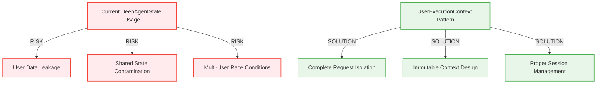

# 🚨 CRITICAL MIGRATION: DeepAgentState → UserExecutionContext

**Status:** ACTIVE MIGRATION IN PROGRESS  
**Criticality:** ULTRA HIGH - USER ISOLATION RISKS  
**Target Completion:** Q1 2025 (v3.0.0 Release)  
**Last Updated:** 2025-01-05

## 🎯 Executive Summary

This migration plan addresses the **CRITICAL DEPRECATION** of `DeepAgentState` and mandatory migration to `UserExecutionContext` pattern for complete user isolation and request security.

### Business Value Justification (BVJ)
- **Segment:** ALL (Free → Enterprise) - SECURITY CRITICAL
- **Business Goal:** Eliminate user data leakage risks, ensure request isolation
- **Value Impact:** Prevents security breaches, enables multi-user scalability
- **Revenue Impact:** CRITICAL - Data breaches would destroy business value

---

## 🚨 CRITICAL CONTEXT

### Current State Analysis
- ✅ **UserExecutionContext**: Modern, secure, immutable context pattern
- ✅ **BaseAgent**: Already supports UserExecutionContext in core methods
- ⚠️ **DeepAgentState**: DEPRECATED - Creates user isolation risks
- ⚠️ **50+ Files**: Still using DeepAgentState pattern

### Migration Risk Assessment


---

## 📋 MIGRATION STRATEGY: Phase-by-Phase Approach

### Phase 1: Foundation & Migration Utilities (ACTIVE)
**Duration:** 2-3 days  
**Status:** ✅ In Progress

#### Objectives
1. Create migration helper utilities
2. Identify high-priority agents for migration
3. Establish testing framework for validation
4. Document migration patterns

#### Key Deliverables
- [ ] Migration utility functions (`DeepAgentStateAdapter`)
- [ ] Automated detection of DeepAgentState usage
- [ ] Migration validation test suite
- [ ] Agent priority classification

---

### Phase 2: Core Agent Migration (PRIORITY)
**Duration:** 5-7 days  
**Status:** 🔄 Planned

#### High-Priority Agents (IMMEDIATE MIGRATION REQUIRED)
Based on business value and user isolation risks:

1. **ULTRA CRITICAL** (User-facing, multi-user risks):
   ```
   supervisor/user_execution_engine.py ⚡
   supervisor/agent_execution_core.py ⚡
   supervisor/execution_engine.py ⚡
   base_agent.py ⚡
   ```

2. **HIGH CRITICAL** (Core business logic):
   ```
   data_helper_agent.py
   reporting_sub_agent.py  
   synthetic_data_sub_agent.py
   quality_supervisor.py
   ```

3. **MEDIUM CRITICAL** (Supporting components):
   ```
   supervisor/execution_context.py
   supervisor/workflow_execution.py
   supervisor/pipeline_builder.py
   request_scoped_tool_dispatcher.py
   ```

#### Migration Pattern per Agent
```python
# BEFORE (DeepAgentState - DEPRECATED)
class OldAgent(BaseAgent):
    async def execute(self, state: DeepAgentState) -> DeepAgentState:
        # Legacy pattern with shared state risks
        result = await self.process(state.user_request)
        state.result = result
        return state

# AFTER (UserExecutionContext - SECURE)
class ModernAgent(BaseAgent):
    async def execute(self, context: UserExecutionContext) -> UserExecutionContext:
        # Modern pattern with complete isolation
        result = await self.process(context.metadata.get('user_request'))
        self.store_metadata_result(context, 'result', result)
        return context
```

---

### Phase 3: Test Suite Migration (PARALLEL)
**Duration:** 3-4 days  
**Status:** 🔄 Planned

#### Test Categories to Update
1. **Unit Tests**: Agent-specific logic tests
2. **Integration Tests**: Agent interaction tests  
3. **E2E Tests**: Full workflow validation
4. **Mission Critical Tests**: WebSocket event validation

#### Example Test Migration
```python
# BEFORE - DeepAgentState in tests
def test_agent_execution_old():
    state = DeepAgentState(user_request="test")
    result = await agent.execute(state)
    assert result.final_report is not None

# AFTER - UserExecutionContext in tests  
def test_agent_execution_modern():
    context = UserExecutionContext.from_request(
        user_id="user123", thread_id="thread456", run_id="run789"
    )
    context.metadata['user_request'] = "test"
    result_context = await agent.execute(context)
    assert result_context.metadata.get('final_report') is not None
```

---

### Phase 4: Infrastructure & Examples Update
**Duration:** 2-3 days  
**Status:** 🔄 Planned

#### Components to Update
- [ ] Documentation examples in `/docs/`
- [ ] Demo agents in `/examples/`
- [ ] Test framework utilities
- [ ] Integration guides

---

### Phase 5: Legacy Removal (FINAL)
**Duration:** 1-2 days  
**Status:** 🔄 Planned

#### Final Steps
1. Remove all DeepAgentState references
2. Update deprecation warnings to hard errors
3. Clean up legacy compatibility code
4. Update architecture documentation

---

## 🛠️ MIGRATION UTILITIES

### Core Migration Helper Functions

```python
class DeepAgentStateAdapter:
    """Adapter to bridge DeepAgentState to UserExecutionContext during migration."""
    
    @staticmethod
    def from_deep_agent_state(
        state: DeepAgentState,
        user_id: str,
        thread_id: str,
        run_id: str
    ) -> UserExecutionContext:
        """Convert DeepAgentState to UserExecutionContext."""
        # Implementation for backward compatibility
        
    @staticmethod
    def to_deep_agent_state(
        context: UserExecutionContext
    ) -> DeepAgentState:
        """Convert UserExecutionContext back to DeepAgentState (temporary)."""
        # Temporary bridge for gradual migration
```

### Migration Detection Script
```bash
# Find all DeepAgentState usage
python scripts/detect_deepagentstate_usage.py

# Validate migration completeness  
python scripts/validate_migration_completeness.py

# Run migration-specific tests
python tests/migration/test_deepagentstate_migration.py
```

---

## ✅ VALIDATION & TESTING STRATEGY

### Pre-Migration Validation
1. **Dependency Analysis**: Map all DeepAgentState usage patterns
2. **Risk Assessment**: Identify user isolation violation points
3. **Test Coverage**: Ensure existing tests will detect regressions

### During Migration Validation  
1. **Incremental Testing**: Validate each migrated agent independently
2. **Integration Testing**: Ensure agent interactions still work
3. **WebSocket Validation**: Verify event emission continues working
4. **Performance Testing**: Ensure no performance regression

### Post-Migration Validation
1. **Complete Test Suite**: All tests pass with UserExecutionContext
2. **User Isolation Tests**: Multi-user scenarios validate isolation
3. **WebSocket Event Tests**: All mission-critical events work
4. **Backward Compatibility**: Legacy integration points still function

---

## 🚨 RISK MITIGATION

### Critical Risks & Mitigation Strategies

1. **User Data Leakage**
   - **Risk**: DeepAgentState creates shared state between users
   - **Mitigation**: Prioritize user-facing agents first, validate isolation

2. **WebSocket Event Disruption**
   - **Risk**: Migration breaks real-time user updates
   - **Mitigation**: Test WebSocket events thoroughly during migration

3. **Test Suite Regressions**
   - **Risk**: Breaking existing test infrastructure
   - **Mitigation**: Parallel test development, gradual rollout

4. **Performance Impact**
   - **Risk**: UserExecutionContext pattern impacts performance
   - **Mitigation**: Performance benchmarking, optimization if needed

---

## 📊 SUCCESS METRICS

### Migration Completion Tracking
- [ ] 0% DeepAgentState usage in core agents (target: 100% eliminated)
- [ ] 100% UserExecutionContext adoption in new code
- [ ] 0 test failures related to migration
- [ ] 100% WebSocket event functionality preserved

### Business Value Metrics
- [ ] User isolation security validated
- [ ] Multi-user scalability improved
- [ ] No data leakage incidents
- [ ] Developer velocity maintained/improved

---

## 🎯 EXECUTION CHECKLIST

### Immediate Actions (Next 24 Hours)
- [ ] Create migration utility functions
- [ ] Identify Phase 1 agents for migration
- [ ] Set up migration test framework
- [ ] Begin core agent migration

### Short-term Goals (Next Week)
- [ ] Complete high-priority agent migration
- [ ] Update critical test suites
- [ ] Validate WebSocket event functionality
- [ ] Begin infrastructure updates

### Medium-term Goals (Next 2 Weeks)  
- [ ] Complete all agent migrations
- [ ] Update documentation and examples
- [ ] Comprehensive testing and validation
- [ ] Prepare for legacy removal

---

## 📚 TECHNICAL REFERENCES

### Key Architecture Documents
- **[User Context Architecture](./reports/archived/USER_CONTEXT_ARCHITECTURE.md)** - Factory-based isolation patterns
- **[Agent Architecture Disambiguation](./docs/AGENT_ARCHITECTURE_DISAMBIGUATION_GUIDE.md)** - Complete architecture guide
- **[Golden Agent Index](./docs/GOLDEN_AGENT_INDEX.md)** - Agent implementation patterns

### Migration Learning Resources
- **DeepAgentState Deprecation**: `netra_backend/app/agents/state.py:164-220`
- **UserExecutionContext Implementation**: `netra_backend/app/services/user_execution_context.py`
- **BaseAgent Modern Patterns**: `netra_backend/app/agents/base_agent.py:300-400`

---

## ⚡ CALL TO ACTION

This migration is **ULTRA CRITICAL** for user data security and multi-user scalability. The DeepAgentState pattern creates **IMMEDIATE RISKS** of user data leakage.

### Immediate Next Steps:
1. **START PHASE 1**: Create migration utilities and detect usage patterns
2. **PRIORITIZE SECURITY**: Begin with user-facing agents immediately  
3. **TEST THOROUGHLY**: Validate user isolation at every step
4. **TRACK PROGRESS**: Use this document to monitor completion

**🚨 REMEMBER: User data security is non-negotiable. Every day DeepAgentState remains in production increases risk of security incidents that could destroy business value.**

---

*This migration plan follows CLAUDE.md principles: Business Value > Real System > Tests, with complete user isolation as the primary security requirement.*