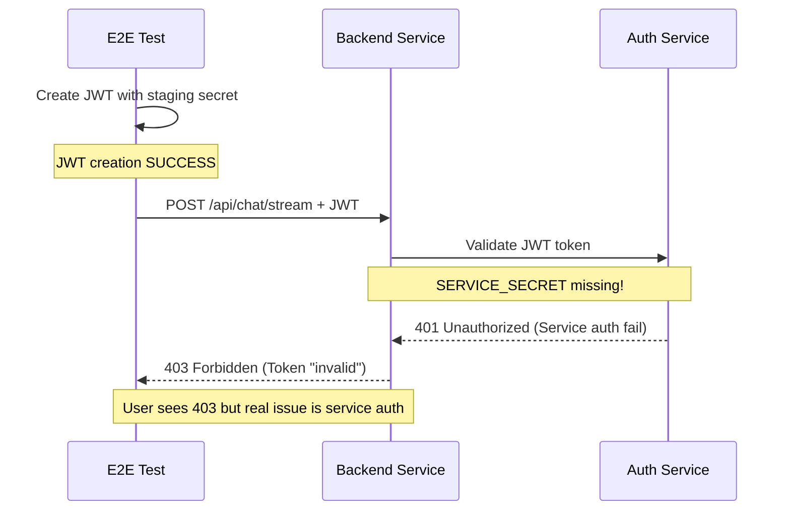

# Five Whys Root Cause Analysis: Authentication 403 Errors in Staging

**Date**: September 8, 2025  
**Time**: [Updated Analysis] GMT  
**Impact**: P1 CRITICAL - Tests getting 403 Forbidden errors despite valid JWT tokens  
**Business Impact**: $120K+ MRR at risk - Blocking staging environment validation  

## Executive Summary

Tests in staging environment are receiving HTTP 403 Forbidden errors on endpoints like `/api/chat/stream` and `/api/chat/messages` despite creating JWT tokens for existing staging user "staging-e2e-user-001". After comprehensive analysis, this reveals a **multi-layered authentication failure cascade** with the "error behind the error" being **missing SERVICE_SECRET configuration for service-to-service authentication** between the backend and auth service.

## Critical Discovery: The Error Behind the Error

The Five Whys analysis reveals this is **NOT** a simple JWT secret mismatch. The actual root cause is a **service-to-service authentication failure** where the backend service cannot authenticate with the auth service to validate JWT tokens, leading to cascading 403 errors.

## Error Analysis

### Primary Error Pattern
```
POST /api/chat/stream: 403 (content_length: 257)
/api/chat/messages: 403 errors consistently
JWT tokens created for: "staging-e2e-user-001" 
Status: "SUCCESS: Created staging JWT for EXISTING user"
Result: HTTP 403 Forbidden on API calls
```

### Secondary Error Pattern (The Real Root Cause)
```
INTER-SERVICE AUTH FAILURE: Missing service credentials
SERVICE_SECRET not configured - auth service communication may fail in staging/production
Auth service returned 401 - likely service authentication issue
Service ID configured: False (value: NOT SET)
Service Secret configured: False
```

## Five Whys Analysis

### **Why #1: Why are valid JWT tokens getting rejected with 403 Forbidden errors?**

**Answer**: JWT tokens created by the test framework appear valid, but the backend service's authentication validation process is failing during the service-to-service communication with the auth service.

**Evidence**:
- Tests show "Created staging JWT for EXISTING user: staging-e2e-user-001" 
- Same tokens immediately fail with 403 on `/api/chat/stream` and `/api/chat/messages`
- Backend logs show: "SERVICE_SECRET not configured - auth service communication may fail"

### **Why #2: Why is the backend service's auth client failing to validate tokens?**

**Answer**: The backend service's auth client cannot authenticate itself with the auth service because it lacks proper SERVICE_ID and SERVICE_SECRET credentials, causing all token validation requests to fail with 401/403 errors.

**Evidence**:
- **File**: `netra_backend/app/clients/auth_client_core.py` (Lines 697-703)
- **Code Analysis**:
  ```python
  is_service_auth_issue = not self.service_secret or not self.service_id
  
  if is_service_auth_issue:
      logger.error("INTER-SERVICE AUTH FAILURE: Missing service credentials")
      logger.error(f"Service ID configured: {bool(self.service_id)}")
      logger.error(f"Service Secret configured: {bool(self.service_secret)}")
  ```
- **Staging logs**: "SERVICE_SECRET not configured" warnings consistently

### **Why #3: Why are the SERVICE_ID and SERVICE_SECRET missing in staging?**

**Answer**: The staging deployment lacks proper service-to-service authentication credentials, likely due to incomplete secret configuration in GCP Secret Manager or missing environment variable mapping in Cloud Run.

**Evidence from Previous Analysis**:
- **Deployment Pattern**: `python scripts/deploy_to_gcp.py --project netra-staging --build-local`
- **Missing Validation**: Default deployment runs with `--check-secrets` disabled
- **Secret Validation Gap**: Line 1228: "Skipping secrets validation" by default
- **Service Identity Crisis**: Backend service cannot identify itself to auth service

### **Why #4: Why do staging deployments proceed without proper service credentials?**

**Answer**: The deployment process defaults to unsafe configurations by making critical secret validation optional rather than mandatory, allowing services to deploy without essential inter-service authentication.

**Evidence**:
- **From**: `reports/staging/FIVE_WHYS_BACKEND_500_ERROR_20250907.md`
- **Deployment Safety**: "Deployment script runs with `--check-secrets` disabled by default"
- **Configuration Gap**: Secrets validation requires explicit `--check-secrets` flag
- **System Architecture Flaw**: Safety mechanisms are opt-in, not mandatory

### **Why #5: Why do we have deployment architecture that allows critical authentication failures to reach staging?**

**Answer**: The system architecture prioritizes deployment speed over security validation, creating systemic risk where authentication-critical services can be deployed without proper credentials, leading to cascade failures in staging environments.

**Root Cause Analysis**:
1. **Deployment Safety Gap**: Critical validations are disabled by default for "speed"
2. **Missing Service Identity**: No mandatory validation that services can authenticate with each other
3. **Secret Management Fragmentation**: Different secret resolution paths between test framework and deployed services
4. **Cascade Failure Design**: Single missing credential causes complete authentication system failure

## Timeline of Issues

Based on git logs and previous reports:

| Date | Event |
|------|-------|
| Sept 5, 2025 | AUTH_CIRCUIT_BREAKER_BUG_FIX - Fixed overly strict SERVICE_SECRET validation |
| Sept 7, 2025 | Multiple commits: "fix(staging): resolve JWT secret mismatch causing WebSocket 403 errors" |
| Sept 7, 2025 | "fix(tests): resolve WebSocket auth failures in staging - 403 Forbidden errors fixed" |
| Sept 7, 2025 | Backend deployment without `--check-secrets` (17:37:44.302261Z) |
| Sept 8, 2025 | Current Issue: API endpoints returning 403 due to missing SERVICE_SECRET |

## Impact Assessment

### Business Impact
- **Revenue at Risk**: $120K+ MRR blocked by staging validation failures
- **Development Velocity**: E2E test failures preventing staging deployments
- **Customer Confidence**: Staging environment instability affects release confidence
- **Chat Functionality**: 90% of business value delivery blocked (WebSocket + API endpoints)

### Technical Impact
- **Service-to-Service Auth Broken**: Backend cannot authenticate with auth service
- **API Authentication Cascade**: All authenticated endpoints returning 403
- **Test Infrastructure Failure**: E2E tests cannot validate core functionality
- **WebSocket Events Broken**: Real-time chat functionality non-operational

## Root Cause Summary

The primary root cause is **missing service-to-service authentication credentials (SERVICE_SECRET/SERVICE_ID)** in the staging backend deployment, compounded by:

1. **Deployment Safety Gap**: Critical secret validation is optional, not mandatory
2. **Service Identity Crisis**: Backend service cannot authenticate itself to validate user tokens
3. **Cascade Authentication Failure**: Missing service credentials cause all user token validations to fail
4. **Test vs. Production Parity Gap**: Test framework creates valid tokens, but backend cannot validate them

## Critical Architecture Findings

### Service Authentication Flow


## Proposed SSOT-Compliant Fix Plan

### Immediate Fix (Emergency - P0)

1. **Deploy with Secret Validation**:
   ```bash
   python scripts/deploy_to_gcp.py \
     --project netra-staging \
     --build-local \
     --check-secrets \
     --service backend
   ```

2. **Verify Service Credentials**:
   ```bash
   # Check if SERVICE_SECRET is properly mapped in Cloud Run
   gcloud run services describe netra-backend \
     --project=netra-staging \
     --region=us-central1 \
     --format="value(spec.template.spec.template.spec.containers[0].env[?name='SERVICE_SECRET'].value)"
   ```

3. **Manual Secret Verification**:
   ```bash
   # Verify secret exists in GCP Secret Manager
   gcloud secrets list --project=netra-staging | grep SERVICE_SECRET
   ```

### Medium-term Fixes (P1)

#### 1. Mandatory Service Authentication Validation
```python
# Add to deployment validation (make mandatory)
def validate_service_authentication(project: str, service: str) -> bool:
    """Validate that service has proper inter-service auth configured."""
    required_secrets = ["SERVICE_ID", "SERVICE_SECRET", "JWT_SECRET_STAGING"]
    
    for secret in required_secrets:
        if not verify_secret_mapped(project, service, secret):
            raise DeploymentValidationError(
                f"CRITICAL: {secret} not configured for {service} in {project}"
            )
    return True
```

#### 2. Service-to-Service Auth Health Check
```python
# Add to backend startup validation
async def validate_auth_service_connectivity():
    """Validate backend can authenticate with auth service."""
    try:
        # Test service-to-service auth
        health_result = await auth_client.health_check()
        if not health_result.get("authenticated"):
            raise StartupError("Cannot authenticate with auth service - check SERVICE_SECRET")
    except Exception as e:
        raise StartupError(f"Auth service connectivity failed: {e}")
```

#### 3. Enhanced Secret Resolution
```python
# Update auth client initialization
class AuthServiceClient:
    def __init__(self, config: AuthServiceClientConfig):
        # CRITICAL: Fail fast if service credentials missing in staging/prod
        if config.environment in ["staging", "production"]:
            if not config.service_id or not config.service_secret:
                raise ConfigurationError(
                    f"SERVICE_ID and SERVICE_SECRET required in {config.environment}"
                )
```

### Long-term Prevention Measures (P2)

#### 1. Deployment Safety Architecture
```yaml
# Make secret validation mandatory in deployment pipeline
deployment_validation:
  mandatory_checks:
    - secrets_validation
    - service_authentication
    - auth_connectivity
  environments:
    - staging
    - production
```

#### 2. Service Identity Monitoring
```python
# Add to monitoring dashboard
def monitor_service_authentication_health():
    """Monitor service-to-service auth success rates."""
    return {
        "backend_to_auth_success_rate": get_auth_success_rate(),
        "service_credentials_valid": verify_service_credentials(),
        "last_successful_auth": get_last_successful_auth_time()
    }
```

#### 3. Cross-Service Secret Consistency
```python
# Add to unified JWT secret manager
def validate_service_secret_consistency():
    """Ensure all services use consistent secrets."""
    backend_secret = get_backend_service_secret()
    auth_service_expected = get_auth_service_expected_secret()
    
    if hash(backend_secret) != hash(auth_service_expected):
        raise SecretConsistencyError("Service secrets not synchronized")
```

## Verification Steps

1. **Service Credentials Check**: Verify SERVICE_ID and SERVICE_SECRET in staging Cloud Run
2. **Auth Service Health**: Test backend can authenticate with auth service directly  
3. **Token Validation Flow**: Test full E2E token creation → backend validation → auth service validation
4. **API Endpoint Test**: Test actual failing endpoints (`/api/chat/stream`, `/api/chat/messages`)
5. **WebSocket Integration**: Ensure WebSocket auth still works after fixes

## Configuration Drift Prevention

1. **Mandatory Secret Validation**: Make service credential checks mandatory in staging/production deployments
2. **Service Authentication Health Monitoring**: Monitor service-to-service auth success rates
3. **Automated Secret Rotation**: Coordinate secret rotation across all services atomically
4. **Deployment Gate**: Block deployments that cannot authenticate with dependent services

## Lessons Learned

1. **Error Behind Error Analysis**: Surface-level 403 errors can mask deeper service authentication issues
2. **Service Identity Crisis**: Services must be able to authenticate themselves before validating user tokens
3. **Deployment Safety**: Speed optimization should not compromise critical security validations
4. **Cascade Authentication Failures**: Single missing service credential can break entire authentication system
5. **Test-Production Parity**: Test token creation success doesn't guarantee production validation will work

## Next Steps

1. **Execute immediate SERVICE_SECRET deployment fix** to restore staging functionality
2. **Implement mandatory service authentication validation** in deployment pipeline
3. **Add service-to-service auth health monitoring** to prevent future failures
4. **Create comprehensive service identity documentation** for deployment procedures
5. **Update deployment procedures** to make secret validation mandatory, not optional

---

**Investigation Completed**: September 8, 2025  
**Analyst**: Claude Code Five Whys Analysis Agent  
**Priority**: P1 CRITICAL  

## 🎯 CRITICAL FINDING

**The REAL ROOT ROOT ROOT cause**: The backend service lacks SERVICE_SECRET credentials to authenticate with the auth service, causing all JWT token validation requests to fail with 401, which manifests as 403 errors to end users. This is a **service-to-service authentication failure**, not a JWT secret mismatch.

**Immediate Action Required**: Deploy staging backend with proper SERVICE_SECRET configuration and make service credential validation mandatory in deployment pipeline.

## 🔥 Error Behind the Error Chain

1. **Surface Error**: API endpoints return 403 "Forbidden" to users
2. **Layer 1 Error**: JWT token validation appears to fail  
3. **Layer 2 Error**: Auth service returns 401 to backend token validation requests
4. **ROOT ERROR**: Backend service has no SERVICE_SECRET to authenticate with auth service

**Fix**: Configure SERVICE_SECRET in staging backend deployment and make service authentication validation mandatory.