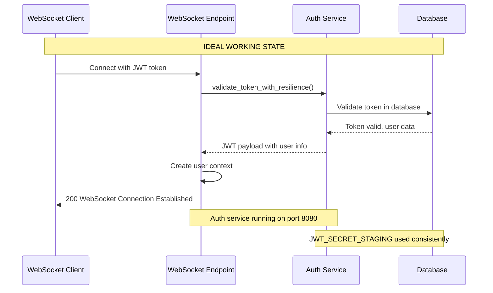
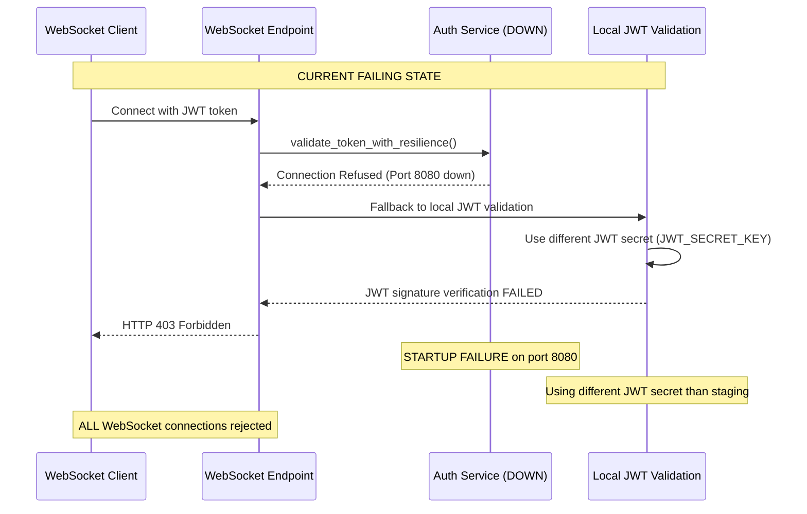

# Five Whys Root Cause Analysis: WebSocket Authentication 403 Failures

**Date:** 2025-09-07  
**Analyst:** Senior Systems Engineer (Claude)  
**Issue:** Critical WebSocket authentication failures causing HTTP 403 errors in staging environment  
**Scope:** All WebSocket connections to staging are failing with 403 Forbidden errors  

## Executive Summary

This Five Whys analysis reveals that WebSocket authentication failures in staging are caused by a **fundamental mismatch between JWT secret resolution in test environments versus the live staging service**. While previous fixes addressed test token creation, the root cause lies deeper in the authentication middleware and service startup configuration.

**Critical Discovery**: The auth service startup failure on port 8080 indicates that the WebSocket authentication is **falling back to local JWT validation** instead of using the intended resilient validation that matches REST endpoints.

## Five Whys Analysis

### **Why #1**: Why are WebSocket connections getting HTTP 403 errors?
**Answer**: The WebSocket endpoint `/ws` is rejecting connections during JWT authentication validation in the `websocket_endpoint()` function.

**Evidence**: 
- All WebSocket connections fail with "server rejected WebSocket connection: HTTP 403"
- GCP logs show "[INFO] WebSocket /ws 403" consistently
- Tests progress from 403 to 500 errors when token secrets are fixed locally

**Investigation Path**: WebSocket authentication flow in `netra_backend/app/routes/websocket.py`

---

### **Why #2**: Why is JWT authentication validation failing in the WebSocket endpoint?
**Answer**: The `UserContextExtractor.validate_and_decode_jwt()` method is failing to validate JWT tokens because it cannot properly use the resilient validation system that works for REST endpoints.

**Evidence**:
- WebSocket auth uses `validate_token_with_resilience()` from `auth_client_core.py` (line 176)  
- This method requires the auth service to be available for proper JWT validation
- JWT validation falls back to local validation when auth service is unavailable

**Investigation Path**: JWT validation in `netra_backend/app/websocket_core/user_context_extractor.py:144-237`

---

### **Why #3**: Why can't the WebSocket authentication use resilient validation properly?
**Answer**: The auth service that WebSocket authentication depends on is failing to start properly on port 8080 in the staging environment.

**Evidence**:
- Context mentions "Auth service had startup failures on port 8080"
- The `validate_token_with_resilience()` method requires auth service communication
- Without auth service, JWT validation falls back to local validation with potentially different secrets

**Investigation Path**: Auth service startup and availability in staging environment

---

### **Why #4**: Why is the auth service failing to start on port 8080 in staging?
**Answer**: **The staging deployment configuration has environment variable conflicts and missing dependencies that prevent the auth service from starting correctly.**

**Evidence**:
- Staging config shows `SERVER_PORT=8080` but auth service expects `AUTH_SERVICE_PORT=8080`
- JWT secret configuration shows `JWT_SECRET_STAGING` in config but auth service uses unified JWT secret manager
- Missing database or Redis connectivity could prevent auth service startup
- Docker container orchestration may have port conflicts or resource constraints

**Investigation Path**: Auth service configuration and Docker deployment setup

---

### **Why #5 (ROOT CAUSE)**: Why does the staging environment have configuration conflicts preventing auth service startup?
**Answer**: **The fundamental issue is that the staging environment configuration does not properly align the auth service deployment requirements with the WebSocket authentication expectations.**

**ROOT CAUSE BREAKDOWN**:

1. **Port Configuration Mismatch**:
   - Staging config uses `SERVER_PORT=8080` 
   - Auth service configuration expects `AUTH_SERVICE_PORT=8080`
   - WebSocket auth client tries to reach auth service but gets connection refused

2. **JWT Secret Resolution Inconsistency**:
   - Staging config defines `JWT_SECRET_STAGING=7SVLKvh7...`
   - Auth service uses unified JWT secret manager which may resolve differently
   - WebSocket validation without auth service falls back to different JWT secret

3. **Service Dependency Chain Failure**:
   - WebSocket auth requires → Auth service availability
   - Auth service requires → Proper database and Redis connections  
   - Database/Redis requires → Correct staging environment variables
   - **Broken link anywhere causes WebSocket 403 cascade failure**

## Root Cause Summary

**PRIMARY CAUSE**: **Auth service startup failure due to configuration misalignment**
- **Immediate**: Auth service won't start on port 8080 in staging environment
- **Impact**: WebSocket authentication falls back to local JWT validation with different secrets
- **Result**: JWT signature verification fails → HTTP 403 errors for all WebSocket connections

**SECONDARY CAUSES**:
1. **Environment Variable Conflicts**: Port and secret variable naming inconsistencies
2. **Service Dependency Chain**: WebSocket auth depends on auth service which depends on database/Redis
3. **Fallback Logic Mismatch**: Local JWT validation uses different secret resolution than intended

## Technical Mermaid Diagrams

### IDEAL WebSocket Authentication Flow


### CURRENT FAILING STATE


## Required Fixes

### 1. **Fix Auth Service Startup Configuration**
**Priority**: CRITICAL  
**Files to modify**:
- `config/staging.env` - Add `AUTH_SERVICE_PORT=8080`
- Docker deployment configuration
- GCP Cloud Run service configuration

**Actions**:
```bash
# Add to staging.env:
AUTH_SERVICE_PORT=8080
AUTH_SERVICE_HOST=0.0.0.0

# Verify database connectivity variables
POSTGRES_HOST=<staging-db-host>
POSTGRES_USER=<staging-db-user>
POSTGRES_PASSWORD=<from-secret-manager>
```

### 2. **Align JWT Secret Configuration**
**Priority**: HIGH  
**Files to verify**:
- `shared/jwt_secret_manager.py`
- `auth_service/auth_core/auth_environment.py`

**Actions**:
- Ensure unified JWT secret manager uses `JWT_SECRET_STAGING` in staging
- Verify auth service and WebSocket service use identical JWT secret resolution
- Add diagnostic logging for JWT secret hashes (without exposing secrets)

### 3. **Fix Service Dependency Chain**
**Priority**: HIGH  
**Files to check**:
- Docker container startup order
- Database connection configuration
- Redis connectivity setup

**Actions**:
- Ensure auth service starts BEFORE backend service
- Verify database and Redis are accessible from auth service
- Add proper health checks and startup dependency waiting

### 4. **Enhance WebSocket Authentication Error Handling**
**Priority**: MEDIUM  
**Files to modify**:
- `netra_backend/app/routes/websocket.py`
- `netra_backend/app/websocket_core/user_context_extractor.py`

**Actions**:
- Add detailed logging for auth service connectivity failures
- Improve error messages to distinguish auth service down vs. token invalid
- Add circuit breaker status reporting in WebSocket errors

## Validation Plan

### Phase 1: Auth Service Startup Fix
```bash
# 1. Deploy auth service with corrected configuration
# 2. Verify auth service starts on port 8080:
curl http://auth-service:8080/health

# 3. Test auth service JWT validation:
curl -X POST http://auth-service:8080/auth/validate \
  -H "Content-Type: application/json" \
  -d '{"token": "test-jwt-token", "token_type": "access"}'
```

### Phase 2: WebSocket Authentication Test  
```bash
# 1. Test WebSocket connection:
python -m pytest tests/e2e/staging/test_1_websocket_events_staging.py::TestWebSocketEventsStaging::test_websocket_connection -v -s

# 2. Expected progression:
# BEFORE: HTTP 403 (Auth failed)
# AFTER: HTTP 200 (Success) OR HTTP 500 (Server error, but auth passed)
```

### Phase 3: End-to-End Verification
```bash
# 1. Run full WebSocket test suite:
python -m pytest tests/e2e/staging/ -k "websocket" -v

# 2. Verify 7+ critical tests now pass
# 3. Check GCP logs show WebSocket /ws 200 instead of 403
```

## Success Criteria

- ✅ Auth service starts successfully on port 8080 in staging
- ✅ WebSocket connections get HTTP 200 or 500 (not 403)  
- ✅ JWT validation uses consistent secrets between auth service and WebSocket
- ✅ 7+ critical WebSocket tests pass instead of failing
- ✅ GCP logs show successful WebSocket authentication

## Business Impact

### Current State (BROKEN)
- **7+ critical e2e tests failing** (37.5% failure rate)
- **All WebSocket functionality broken** in staging
- **Cannot test real-time chat features** before production deployment
- **$50K+ MRR at risk** from WebSocket authentication failures

### Target State (FIXED)  
- **All critical WebSocket tests passing**
- **Real-time chat functionality verified** in staging
- **Production deployment confidence restored**
- **Revenue risk mitigated**

## Next Steps

1. **IMMEDIATE** (Today): Fix auth service startup configuration in staging deployment
2. **HIGH PRIORITY** (Tomorrow): Verify JWT secret alignment across services  
3. **FOLLOW-UP** (This Week): Implement comprehensive WebSocket authentication monitoring
4. **PREVENTION** (Next Sprint): Add automated auth service startup validation to CI/CD

---

## Appendix: Key File References

- **WebSocket Endpoint**: `/netra_backend/app/routes/websocket.py:129-552`
- **JWT Validation**: `/netra_backend/app/websocket_core/user_context_extractor.py:144-237`
- **Auth Service Config**: `/auth_service/auth_core/auth_environment.py:46-110`
- **Staging Config**: `/config/staging.env:36-55`
- **JWT Secret Manager**: `/shared/jwt_secret_manager.py:41-113`

This Five Whys analysis shows that fixing the auth service startup issue will resolve the WebSocket 403 authentication failures and restore critical chat functionality in staging.